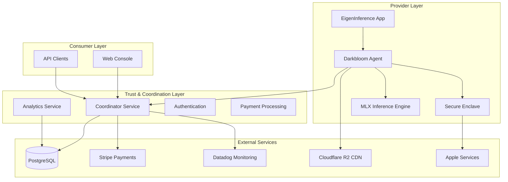
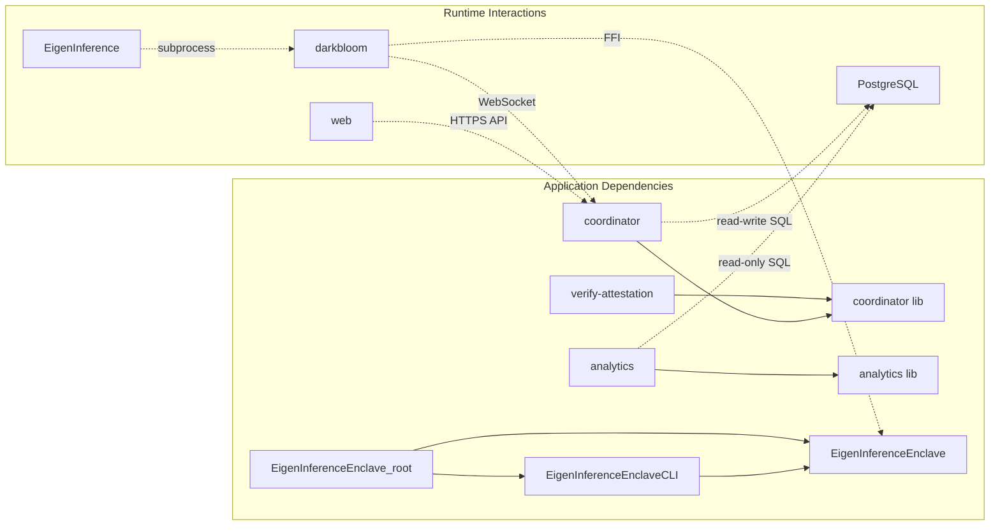
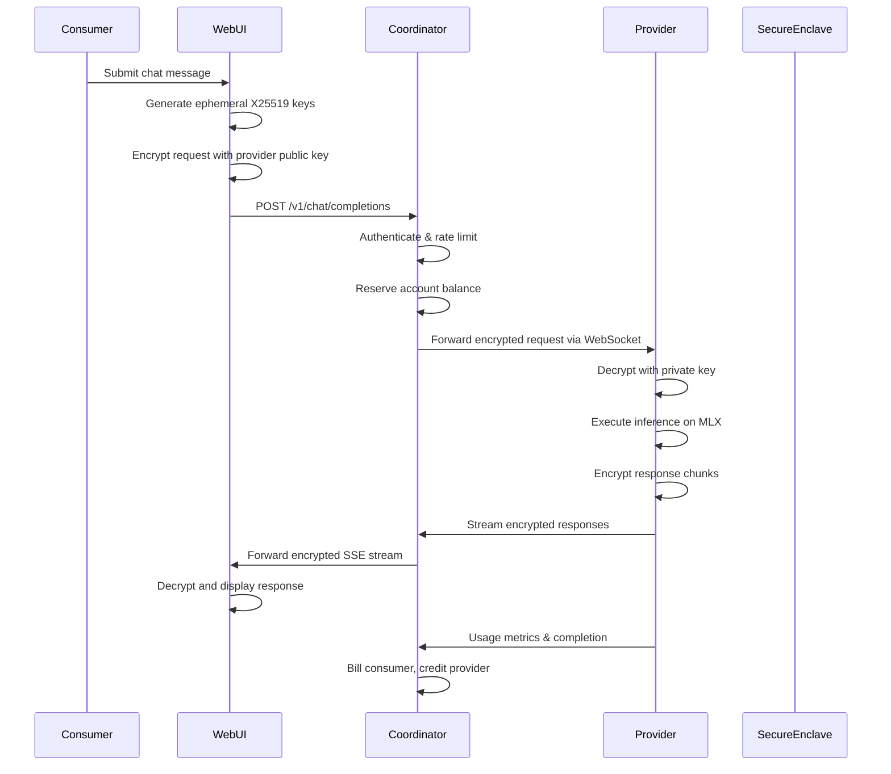
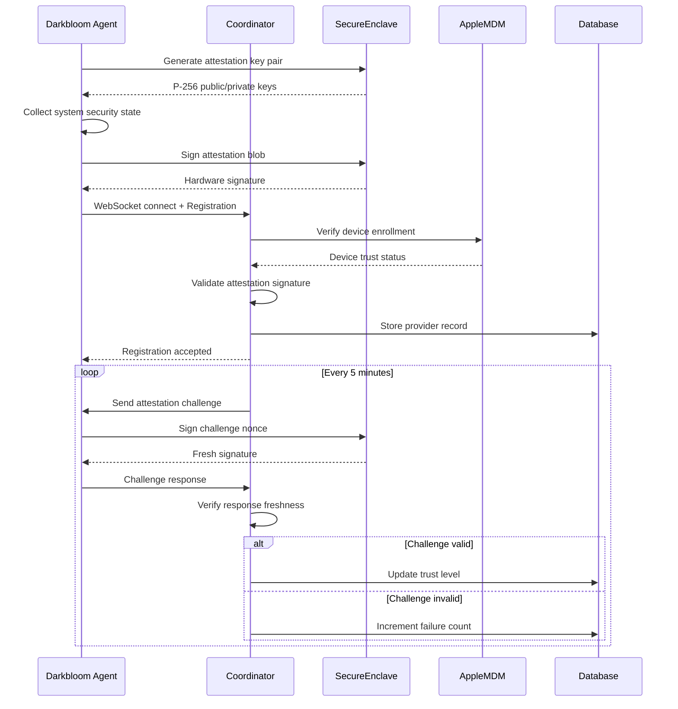
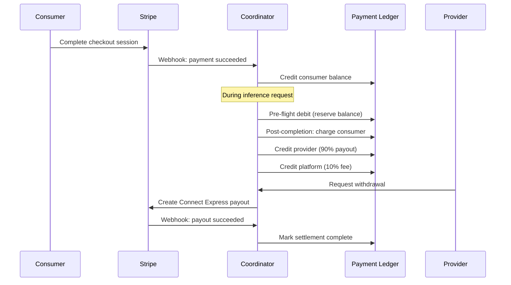
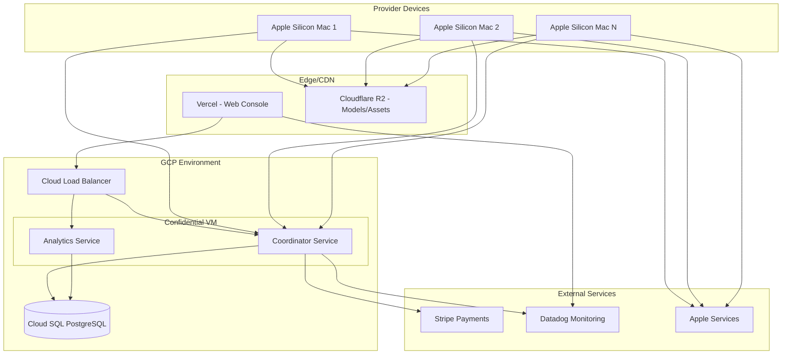

# D-Inference Architecture Documentation

## Executive Summary

D-Inference is a decentralized AI inference network that transforms Apple Silicon Macs into secure, trusted computing nodes for private AI workloads. The system creates a marketplace where AI consumers can access inference services while ensuring end-to-end encryption, hardware attestation, and zero-trust security through Apple's Secure Enclave technology.

### System Purpose

- **Decentralized AI Infrastructure**: Creates a network of trusted Apple Silicon providers for AI inference workloads
- **Privacy-First Design**: End-to-end encryption ensures provider nodes cannot see plaintext requests or responses
- **Hardware Trust**: Apple Secure Enclave attestation establishes cryptographically verifiable device identity and security posture
- **Economic Incentives**: Provider compensation and consumer billing through integrated payment processing
- **Enterprise Security**: Hardware isolation, runtime hardening, and managed device attestation for production deployments

## System Architecture Overview

D-Inference follows a **distributed trust architecture** with multiple security and coordination layers:

### Architectural Principles

1. **Zero-Trust Security**: Every component verifies authenticity through cryptographic attestation
2. **Hardware Isolation**: Critical operations leverage Apple Silicon security features (Secure Enclave, Hypervisor.framework)
3. **End-to-End Encryption**: Request/response data is encrypted from consumer to provider with coordinator unable to decrypt
4. **Distributed Coordination**: Central coordinator manages routing without storing sensitive data
5. **Economic Alignment**: Transparent pricing and automated settlement align provider and consumer incentives

## Component Overview

### Core Services (9 Components)

| Component | Type | Language | Purpose | Security Features |
|-----------|------|----------|---------|-------------------|
| **coordinator** | Service | Go | Central routing and trust layer | Confidential VM, JWT auth, rate limiting |
| **analytics** | Service | Go | Read-only network statistics | Pseudonymized data, separate DB credentials |
| **web** | Frontend | TypeScript | Consumer/provider web interface | E2E encryption, client-side cert verification |
| **darkbloom** | Service | Rust | Provider inference agent | Hardened runtime, hypervisor isolation |
| **EigenInference** | Frontend | Swift | macOS menu bar app | Process lifecycle, keychain integration |
| **EigenInferenceEnclave** | Library | Swift | Hardware attestation | Secure Enclave key management |
| **verify-attestation** | Service | Go | Attestation verification utility | Apple MDA certificate validation |
| **decrypt-test** | Service | Rust | E2E encryption testing | Cryptographic validation |

### Dependencies and Relationships

## Technology Stack

### Primary Languages & Frameworks
- **Go**: Backend services (coordinator, analytics) with high-performance networking
- **TypeScript/React**: Web frontend with Next.js full-stack framework
- **Rust**: Provider agent with system-level security and performance
- **Swift**: macOS native applications with Secure Enclave integration

### Key Infrastructure Technologies
- **PostgreSQL**: Primary data store with connection pooling and ACID transactions
- **WebSocket**: Real-time provider communication with binary protocol support
- **X25519 + NaCl**: End-to-end encryption with forward secrecy
- **Apple Secure Enclave**: Hardware-backed attestation and signing
- **Hypervisor.framework**: Memory isolation for inference workloads
- **Stripe**: Payment processing with Connect Express for provider payouts

### Security Technologies
- **Apple MDA**: Managed Device Attestation for hardware trust verification
- **PT_DENY_ATTACH**: Runtime debugging protection on macOS
- **SIP Verification**: System Integrity Protection status checking
- **TLS 1.3**: Transport encryption for all external communications

## Detailed Component Analysis

### Coordinator Service (Central Control Plane)

**Architecture Pattern**: Hexagonal architecture with clear separation of concerns

**Core Responsibilities**:
- **Provider Registry**: Manages 1,000+ concurrent provider connections with trust levels
- **Request Routing**: Intelligent job assignment based on hardware specs, trust level, and model availability
- **Payment Ledger**: Double-entry accounting system with micro-USD precision
- **Attestation Engine**: Hardware trust verification using Apple MDA
- **Rate Limiting**: Per-account token bucket limiting with separate tiers

**Key Features**:
- Runs in GCP Confidential VM (AMD SEV-SNP) for hardware-encrypted memory
- OpenAI-compatible REST endpoints for consumer integration
- WebSocket binary protocol for provider communication
- Multi-tier request queuing for capacity overflow handling
- End-to-end encryption proxy without plaintext access

**External Integrations**:
- **PostgreSQL**: Primary persistence with connection pooling
- **Stripe**: Consumer deposits via Checkout, provider withdrawals via Connect
- **Datadog**: APM tracing, metrics, and structured logging
- **Privy**: JWT-based user authentication and session management

### Darkbloom Provider Agent

**Architecture Pattern**: Multi-layered service architecture with security-first design

**Core Responsibilities**:
- **Security Hardening**: PT_DENY_ATTACH, SIP verification, memory wiping
- **Model Management**: HuggingFace cache scanning and MLX model detection
- **Inference Backend**: Manages vllm-mlx subprocesses or in-process Python engines
- **Coordinator Communication**: WebSocket client with automatic reconnection
- **Hardware Attestation**: Secure Enclave integration for identity verification

**Key Features**:
- Hypervisor.framework integration for memory isolation
- End-to-end encryption with X25519 ephemeral keys
- Comprehensive CLI with 15+ subcommands for lifecycle management
- Telemetry pipeline with async batching and disk overflow
- Auto-update mechanism with integrity verification

**Hardware Integration**:
- **Apple Secure Enclave**: Hardware-backed attestation and signing
- **Hypervisor.framework**: Stage 2 page table isolation (16MB alignment)
- **Metal GPU**: Apple Silicon Neural Engine acceleration via MLX

### Web Console Frontend

**Architecture Pattern**: Layered architecture with client-side security focus

**Core Responsibilities**:
- **Chat Interface**: Real-time streaming AI conversations with trust verification
- **Provider Dashboard**: Hardware attestation monitoring and earnings tracking  
- **Payment System**: Stripe-integrated billing and withdrawal management
- **Certificate Verification**: Client-side X.509 validation for Apple MDA certificates

**Key Features**:
- End-to-end encryption using NaCl Box with forward secrecy
- Privy authentication with automatic API key provisioning
- Real-time trust badge displaying hardware attestation status
- Responsive design with Tailwind CSS and dark mode support

**Security Features**:
- Client-side certificate chain verification against Apple Enterprise Root CA
- Zustand state management with localStorage persistence
- Privacy-conscious analytics with user consent management

### EigenInference macOS App

**Architecture Pattern**: MVVM with Coordinator Pattern for process management

**Core Responsibilities**:
- **Provider Lifecycle**: Wraps and manages darkbloom binary as subprocess
- **Hardware Detection**: System profiling for Apple Silicon capabilities
- **Configuration Management**: Shared TOML configuration with CLI tools
- **Status Monitoring**: Real-time polling of provider health and earnings

**Key Features**:
- Menu bar application with dynamic activation policy
- Zero external dependencies - pure Apple frameworks
- Crash recovery with exponential backoff restart logic
- Keychain integration for secure credential storage

### EigenInferenceEnclave Security Library

**Architecture Pattern**: Layered architecture with hardware security boundaries

**Core Responsibilities**:
- **Identity Management**: P-256 ECDSA keys stored in Secure Enclave hardware
- **Attestation Generation**: Signed blobs containing system security state
- **FFI Interface**: C-callable functions for Rust integration
- **System Verification**: SIP, Secure Boot, and RDMA status checking

**Key Features**:
- Hardware-isolated private keys that never leave Secure Enclave
- Deterministic JSON encoding for cross-language signature verification
- Comprehensive system security state collection
- Memory-safe FFI with proper ownership semantics

### Analytics Service

**Architecture Pattern**: Layered architecture with privacy-preserving design

**Core Responsibilities**:
- **Public Analytics**: Network statistics and provider leaderboards
- **Pseudonymization**: HMAC-based deterministic alias generation
- **Read-Only Access**: Separate database credentials prevent data modification
- **Dual Backend Support**: Memory backend for development, PostgreSQL for production

**Key Features**:
- OpenAPI-compatible REST endpoints with CORS support
- Configurable time windows (24h, 7d, 30d, all-time) for data aggregation
- Connection pooling with automatic reconnection handling
- Privacy-safe data exposure with no reverse lookup capabilities

## Data Flow Patterns

### Consumer Inference Request Flow

### Provider Registration & Trust Establishment

### Payment Settlement Flow

## Security Architecture

### Trust Model

D-Inference implements a **graduated trust model** with multiple verification layers:

1. **Hardware Trust (Highest)**: Apple Secure Enclave attestation + MDM enrollment
2. **Software Trust (Medium)**: SIP enabled, Secure Boot verified, runtime hardening
3. **Self-Signed Trust (Basic)**: Provider self-attestation without external verification
4. **No Trust (Default)**: Unverified providers queued at lowest priority

### Security Features by Component

| Component | Security Features | Threat Mitigation |
|-----------|-------------------|-------------------|
| **Coordinator** | Confidential VM, rate limiting, JWT validation | DDoS, credential stuffing, memory attacks |
| **Darkbloom** | PT_DENY_ATTACH, hypervisor isolation, memory wiping | Debugging, DMA attacks, key extraction |
| **Web Console** | E2E encryption, client-side cert verification | MITM, server compromise, certificate spoofing |
| **Secure Enclave** | Hardware key isolation, tamper resistance | Physical attacks, key extraction, cloning |

### Cryptographic Protocols

**End-to-End Encryption**:
- **Algorithm**: X25519 key exchange + XSalsa20-Poly1305 authenticated encryption
- **Key Management**: Ephemeral keys per session, forward secrecy guaranteed
- **Authentication**: HMAC-based message authentication prevents tampering

**Hardware Attestation**:
- **Algorithm**: P-256 ECDSA signatures with Secure Enclave private keys
- **Challenge-Response**: Fresh nonces prevent replay attacks
- **Certificate Chain**: Validation against Apple Enterprise Attestation Root CA

**Transport Security**:
- **TLS 1.3**: All external communications with perfect forward secrecy
- **WebSocket**: Secure WebSocket (WSS) for real-time provider connections
- **Certificate Pinning**: Hardcoded coordinator certificates in provider agents

## External Dependencies & Integrations

### Infrastructure Services

| Service | Category | Purpose | Integration Points |
|---------|----------|---------|-------------------|
| **PostgreSQL** | Database | Primary data persistence | Coordinator, Analytics |
| **Stripe** | Payments | Consumer billing, provider payouts | Coordinator, Web Console |
| **Datadog** | Monitoring | APM tracing, metrics, logging | Coordinator, Web Console |
| **Privy** | Authentication | User sessions, API key management | Coordinator, Web Console |
| **Cloudflare R2** | CDN | Model distribution, runtime updates | Darkbloom Agent |
| **GCP Confidential VM** | Infrastructure | Hardware-encrypted coordinator runtime | Coordinator |

### Apple Platform Services

| Service | Category | Purpose | Integration Points |
|---------|----------|---------|-------------------|
| **Secure Enclave** | Hardware Security | Attestation, signing, key storage | EigenInferenceEnclave, Darkbloom |
| **Hypervisor.framework** | Virtualization | Memory isolation for inference | Darkbloom Agent |
| **Apple Business Manager** | Device Management | Provider enrollment verification | Coordinator via MicroMDM |
| **MicroMDM** | MDM | Independent device security verification | Coordinator |
| **HuggingFace Hub** | Model Registry | Local model cache and downloads | Darkbloom, EigenInference App |

### Third-Party Libraries

**Go Ecosystem**:
- `pgx/v5`: High-performance PostgreSQL driver with connection pooling
- `websocket`: Binary WebSocket protocol for provider communication
- `jwt/v5`: Privy token validation with security best practices
- `datadog-go`: Metrics and APM integration with structured logging

**Rust Ecosystem**:
- `tokio`: Async runtime for concurrent provider operations
- `reqwest`: HTTP client for coordinator API and health checks  
- `crypto_box`: NaCl-compatible encryption for E2E security
- `clap`: Command-line interface with comprehensive subcommands

**TypeScript/React Ecosystem**:
- `next.js`: Full-stack web framework with SSR and API routes
- `privy`: Authentication provider with wallet integration
- `tweetnacl`: Pure JavaScript cryptography for browser encryption
- `zustand`: Lightweight state management with persistence

**Swift Ecosystem**:
- **Zero third-party dependencies** - Uses only Apple system frameworks
- `CryptoKit`: Secure Enclave integration and cryptographic operations
- `Foundation`: Process management, JSON handling, system integration

## Performance Characteristics

### Scalability Metrics

- **Provider Capacity**: 1,000+ concurrent provider connections per coordinator instance
- **Request Throughput**: Sub-second routing latency for inference requests
- **Database Performance**: Connection pooling handles 100+ concurrent operations
- **WebSocket Scaling**: Binary protocol minimizes bandwidth and latency

### Resource Requirements

**Coordinator Service**:
- **CPU**: 4+ cores for concurrent request processing and attestation verification
- **Memory**: 8GB+ for provider registry and request queuing
- **Database**: PostgreSQL with SSD storage for sub-millisecond query response
- **Network**: 1Gbps+ for handling provider WebSocket traffic

**Darkbloom Provider**:
- **Hardware**: Apple Silicon Mac (M1/M2/M3) with Secure Enclave
- **Memory**: 16GB+ unified memory for model loading and inference
- **Storage**: 100GB+ SSD for model cache and runtime components
- **GPU**: Apple Neural Engine for accelerated inference

## Deployment Architecture

### Production Environment

### Development Environment

**Local Development Setup**:
- **In-Memory Backend**: Coordinator and Analytics support in-memory storage for rapid iteration
- **Mock Data**: Realistic test data for provider registration and inference testing
- **Local Provider**: Darkbloom agent connects to localhost coordinator for development
- **Hot Reload**: Next.js development server with instant frontend updates

**Testing Infrastructure**:
- **Unit Tests**: Comprehensive test suites for all critical components
- **Integration Tests**: End-to-end encryption and attestation validation
- **Load Testing**: Provider capacity and coordinator scalability verification
- **Security Testing**: Cryptographic protocol validation and attack simulation

## Recommendations

### Security Enhancements

1. **Hardware Security Module (HSM)**: Consider hardware-backed coordinator keys for enhanced security
2. **Certificate Transparency**: Implement CT logging for provider certificate verification
3. **Zero-Knowledge Proofs**: Explore ZK protocols for privacy-preserving capacity reporting
4. **Homomorphic Encryption**: Investigate encrypted computation for sensitive workloads

### Scalability Improvements

1. **Horizontal Scaling**: Multi-region coordinator deployment with provider affinity
2. **Edge Computing**: Regional inference caching for latency-sensitive applications  
3. **Load Balancing**: Intelligent provider selection based on geographic proximity
4. **Caching Layer**: Redis-based caching for frequently accessed models and results

### Operational Enhancements

1. **Observability**: Enhanced metrics and distributed tracing across all components
2. **Automated Deployment**: CI/CD pipelines with security scanning and attestation verification
3. **Disaster Recovery**: Multi-region backup and failover capabilities
4. **Capacity Planning**: Predictive scaling based on demand patterns and provider availability

### Economic Model Evolution

1. **Dynamic Pricing**: Real-time pricing based on supply/demand and hardware capabilities
2. **Staking Mechanisms**: Provider reputation and stake-based trust enhancement
3. **Tokenization**: Blockchain-based settlement for global provider payments
4. **Resource Optimization**: ML-based model placement for optimal hardware utilization

---

**Document Version**: 1.0  
**Last Updated**: 2024-12-24  
**Next Review**: Q2 2025