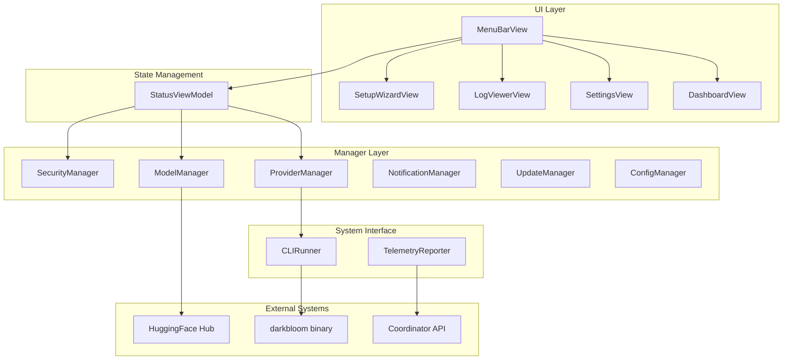
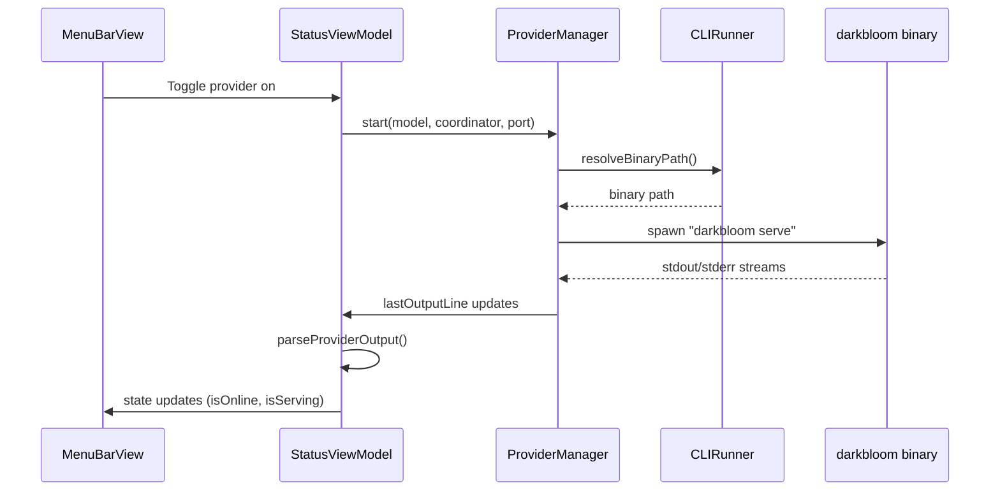
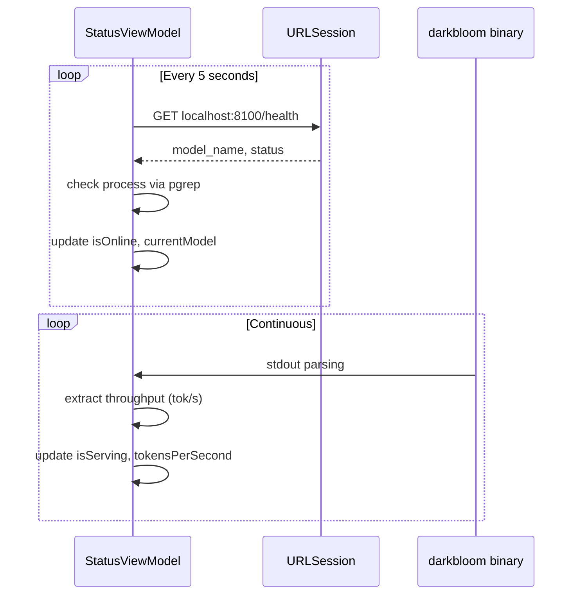
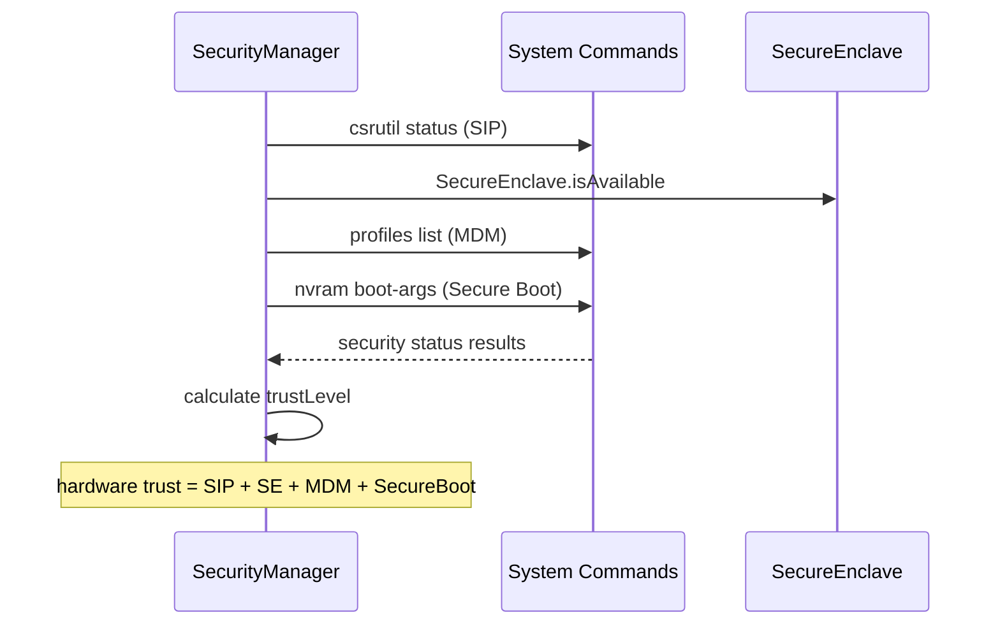

Now I have a comprehensive understanding of the EigenInference component. Let me write the complete analysis.

# EigenInference Analysis

## Overview

EigenInference is a **macOS menu bar application** that serves as a native frontend for the darkbloom distributed inference provider system. Built with SwiftUI, it provides a polished user interface for managing and monitoring a local inference provider that connects to the darkbloom coordinator network. The app wraps the Rust `darkbloom` CLI binary and presents hardware acceleration, security attestation, earnings tracking, and real-time throughput monitoring through an intuitive macOS-native interface.

## Architecture

The application follows a **layered MVVM (Model-View-ViewModel) architecture** with centralized state management:

The app manages its activation policy dynamically - running as `.accessory` (menu bar only) when no windows are open, and switching to `.regular` (full app with dock icon) when windows are visible to ensure proper focus and text selection behavior.

## Key Components

### StatusViewModel (Central State Hub)
The heart of the application, managing all provider state including online/offline status, hardware metrics, throughput data, security posture, and wallet information. It orchestrates communication between UI components and the underlying managers, providing a single source of truth for the entire application state.

### ProviderManager (Process Management)
Manages the lifecycle of the Rust `darkbloom serve` subprocess. Handles spawning, monitoring, output capture, crash recovery with exponential backoff (up to 5 restarts), and clean shutdown via SIGTERM/SIGKILL. Captures stdout/stderr for real-time status parsing and error reporting.

### CLIRunner (Binary Interface)
Centralized utility for executing `darkbloom` subcommands with proper PATH and environment setup. Supports both synchronous execution with output capture and streaming execution for real-time log monitoring. Resolves the binary path using a consistent search order: `~/.darkbloom/bin/darkbloom`, app bundle, then PATH lookup.

### MenuBarView (Primary UI)
The main dropdown interface accessible from the menu bar icon. Displays at-a-glance provider status with color-coded indicators, hardware information, throughput metrics, trust level, earnings, and quick action controls. Adapts between light/dark themes and utilizes macOS 26+ Liquid Glass effects with fallbacks.

### SecurityManager (Trust Verification)  
Performs comprehensive security posture assessment including SIP status, Secure Enclave availability, MDM enrollment, and Secure Boot verification. Only devices meeting all hardware trust requirements receive inference routing from the coordinator, making this critical for revenue generation.

### ModelManager (MLX Model Discovery)
Scans the HuggingFace cache directory (`~/.cache/huggingface/hub/`) for downloaded MLX models, reconstructs model identifiers from directory names, calculates storage usage, and can trigger new model downloads via `huggingface-cli`.

### ConfigManager (Shared Configuration)
Reads and writes the same `provider.toml` configuration file used by the Rust CLI, ensuring consistency between the app and command-line interface. Handles TOML parsing/serialization for provider settings, coordinator URLs, and model preferences.

### TelemetryReporter (Error Reporting)
Ships crash reports and error events to the coordinator's telemetry endpoint with debounced batching (3-second delay, 500-event buffer). Includes machine ID, session tracking, and structured error fields for operational monitoring.

## Data Flows

### Provider Lifecycle Flow

### Real-time Status Monitoring

### Security Attestation Flow

## External Dependencies

The EigenInference component has **zero external Swift package dependencies**, relying exclusively on Apple's system frameworks. This design choice ensures minimal attack surface, reliable updates, and optimal performance.

### System Framework Dependencies

- **SwiftUI** (Latest): Primary UI framework providing declarative interface construction, state binding, and adaptive design system. Used throughout all view components for modern macOS interface patterns.

- **Foundation** (Latest): Core system services including Process management for subprocess control, URLSession for HTTP communication, FileManager for configuration file handling, and Timer for periodic status polling.

- **Combine** (Latest): Reactive programming framework enabling @Published property observation, state change propagation between ViewModels and Views, and asynchronous data flow coordination.

- **Security** (Latest): Keychain Services integration for secure API key storage using `kSecClassGenericPassword` with service identifier "io.darkbloom.provider". Handles sensitive credential persistence across app launches.

- **CryptoKit** (Latest): Secure Enclave availability detection via `SecureEnclave.isAvailable` for hardware trust verification. Critical for coordinator routing eligibility and revenue generation.

- **UserNotifications** (Latest): System notification delivery for provider state changes, inference completion events, earnings milestones, and critical error conditions requiring user attention.

### Runtime External System Dependencies

- **darkbloom binary**: Rust-compiled inference provider that handles coordinator communication, MLX backend management, and inference request processing. Located via structured path resolution.

- **HuggingFace Hub**: Model storage and distribution service accessed via `~/.cache/huggingface/hub/` for MLX model discovery and `huggingface-cli` for downloads.

- **Coordinator API**: RESTful service providing provider registration, inference routing, earnings tracking, and telemetry ingestion at configurable endpoints (default: `api.darkbloom.dev`).

- **MLX Backend**: Local inference engine running on port 8100, providing `/health` endpoint for status monitoring and serving actual inference requests routed by the coordinator.

## API Surface

### Primary UI Entry Points
- **MenuBarExtra**: Persistent menu bar presence with adaptive icon showing connection status and real-time throughput metrics
- **Settings Window**: Standard macOS preferences interface (⌘+,) for coordinator URL, API keys, auto-start configuration, and scheduling
- **Dashboard Window**: Detailed statistics view with hardware information, session metrics, earnings tracking, and performance graphs
- **Setup Wizard**: First-run onboarding flow for security enrollment, provider registration, and initial configuration
- **Log Viewer**: Real-time streaming display of darkbloom binary output with filtering and export capabilities

### Internal Manager APIs
- **StatusViewModel**: Central observable state with properties for `isOnline`, `isServing`, `tokensPerSecond`, `trustLevel`, and coordinated start/stop/pause operations
- **ProviderManager**: Process lifecycle control with `start(model:coordinator:port:)`, `stop()`, and automatic crash recovery
- **CLIRunner**: Command execution interface supporting both `run([String])` for synchronous operations and `stream([String], onLine:)` for real-time output

## External Systems

### Coordinator Infrastructure
**Primary Integration**: HTTPS/WSS communication with the darkbloom coordinator network for provider registration, inference request routing, and earnings settlement. The app translates WebSocket coordinator URLs to HTTPS for telemetry and health check endpoints.

### Hardware Security Stack
**Security Verification**: Deep integration with macOS security subsystem including System Integrity Protection status (`csrutil`), Secure Enclave availability, MDM enrollment detection, and Secure Boot verification. Only providers meeting hardware trust requirements receive inference routing.

### Financial Settlement
**Blockchain Integration**: Wallet address management and earnings tracking through coordinator API integration. The app displays real-time earnings balance and facilitates withdrawal operations via CLI command delegation.

### Model Distribution
**HuggingFace Ecosystem**: Automatic model discovery from the standard HuggingFace cache directory with support for MLX-optimized models. Integrates with `huggingface-cli` for download management and storage monitoring.

## Component Interactions

The EigenInference component operates as a **standalone frontend** with no direct code dependencies on other d-inference components. However, it maintains critical **runtime integration** with the broader inference ecosystem:

- **darkbloom Binary**: Spawns and manages the Rust provider process as a subprocess, capturing its output for real-time status updates and coordinating start/stop operations
- **Coordinator Services**: Communicates with the remote coordinator API for provider registration, earnings queries, health checks, and telemetry reporting
- **MLX Infrastructure**: Monitors and interfaces with the local MLX backend running on port 8100, providing health status and model information to the UI

The app serves as a **bridge between the native macOS experience and the distributed inference network**, translating system-level security information into coordinator trust attestations and presenting complex inference metrics through an accessible menu bar interface.
