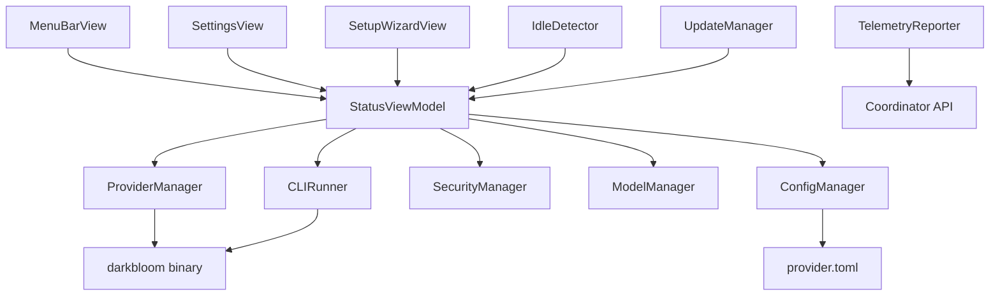

# EigenInference

EigenInference is a native macOS SwiftUI application that provides a menu bar interface for the Darkbloom distributed inference platform. The app wraps the Rust `darkbloom` binary, offering a user-friendly graphical interface for managing AI model serving on Apple Silicon hardware.

## Architecture

The application follows a **Model-View-ViewModel (MVVM)** architecture pattern built on SwiftUI's reactive framework. The architecture centers around a single `StatusViewModel` that acts as the central state manager, coordinating between multiple specialized managers and the SwiftUI views.

Key architectural patterns:
- **Centralized State Management**: `StatusViewModel` serves as the single source of truth for all application state
- **Manager Pattern**: Specialized manager classes handle distinct responsibilities (security, models, providers, etc.)
- **Process Wrapper Pattern**: The app acts as a SwiftUI wrapper around the Rust CLI binary
- **Configuration Synchronization**: Shared TOML configuration with the CLI ensures consistency

The app operates in two activation modes:
- **Accessory Mode** (.accessory): Menu bar only, no dock icon
- **Regular Mode** (.regular): Full application with dock icon and window focus when any window is open

## Key Components

### Core Application Components

**EigenInferenceApp** (`EigenInferenceApp.swift`, lines 23-230): Main application entry point that manages the SwiftUI app lifecycle, menu bar presence, and activation policy switching. Handles telemetry configuration and uncaught exception reporting.

**StatusViewModel** (`StatusViewModel.swift`, lines 18-627): Central observable state manager that coordinates all provider operations, hardware detection, wallet management, and periodic tasks. Polls provider status every 5 seconds and manages the application's reactive state.

**ProviderManager** (`ProviderManager.swift`, lines 23-283): Manages the Rust `darkbloom` binary subprocess lifecycle including spawning, monitoring, auto-restart on crash (up to 5 attempts with exponential backoff), and clean shutdown via SIGTERM/SIGKILL.

**CLIRunner** (`CLIRunner.swift`, lines 24-225): Centralized utility for executing `darkbloom` subcommands with proper PATH setup, environment variables, and output capture. Handles both synchronous and streaming command execution.

### User Interface Components

**MenuBarView** (`MenuBarView.swift`, lines 8-340): Primary user interface shown when clicking the menu bar icon. Displays real-time provider status, hardware information, earnings, and quick actions for starting/stopping the service.

**SetupWizardView** (`SetupWizardView.swift`, lines 13-664): Comprehensive onboarding wizard that guides users through hardware detection, security verification, MDM enrollment, model selection, and initial provider setup.

**DesignSystem** (`DesignSystem.swift`, lines 1-455): Comprehensive design system with light/dark mode color palettes, typography scales, and reusable UI components matching the Darkbloom brand guidelines.

### Management and Configuration

**ConfigManager** (`ConfigManager.swift`, lines 48-208): Handles reading and writing the shared `provider.toml` configuration file used by both the app and CLI. Provides TOML parsing/serialization and atomic configuration updates.

**SecurityManager** (`SecurityManager.swift`, lines 32-147): Evaluates machine security posture by checking SIP status, Secure Enclave availability, MDM enrollment, and Secure Boot. Determines trust level for coordinator routing decisions.

**ModelManager** (`ModelManager.swift`, lines 42-214): Discovers MLX models in the HuggingFace cache directory, calculates disk usage, manages model downloads via `huggingface-cli`, and validates memory requirements against available hardware.

### System Integration

**LaunchAgentManager** (`LaunchAgentManager.swift`, lines 13-131): Manages macOS LaunchAgent installation for automatic app startup on login. Creates and manages plist files in `~/Library/LaunchAgents/` with proper migration from legacy paths.

**TelemetryReporter** (`TelemetryReporter.swift`, lines 52-267): Ships crash reports and operational telemetry to the coordinator's `/v1/telemetry/events` endpoint with bounded in-memory buffering, debounced network flush, and structured event formatting.

**NotificationManager**: Handles macOS user notifications for provider state changes, earnings milestones, and system alerts with proper authorization handling.

## Data Flows

The application's data flow follows several key patterns:

### Provider Lifecycle Flow
1. **Start Request**: User clicks "Go Online" → `StatusViewModel.start()` → `CLIRunner.run(["start"])` → Rust binary spawned
2. **Status Monitoring**: Timer-based polling every 5s → HTTP health check to port 8100 → Parse JSON response → Update UI state
3. **Output Parsing**: `ProviderManager` captures stdout → Regex parsing for throughput metrics → Real-time UI updates
4. **Stop Request**: User action → SIGTERM to process → 5s grace period → SIGKILL if needed

### Configuration Synchronization Flow
1. **Settings Change**: User modifies coordinator URL → `StatusViewModel.coordinatorURL` setter → `ConfigManager.update()` → TOML file written
2. **CLI Consistency**: Both app and CLI read same `~/Library/Application Support/darkbloom/provider.toml` file
3. **Schedule Sync**: App-specific schedule settings → `syncScheduleToConfig()` → Merged into shared TOML

### Security Verification Flow
1. **Initial Check**: App launch → `SecurityManager.refresh()` → Parallel execution of security checks
2. **SIP Check**: `csrutil status` shell command → Parse "enabled" status
3. **Secure Enclave**: `SecureEnclave.isAvailable` CryptoKit API
4. **MDM Verification**: Multiple methods including profiles list and mdmclient queries
5. **Trust Level**: Combined evaluation → Hardware trust only if all checks pass

## External Dependencies

### Swift Package Manager Dependencies

The application has **zero external Swift package dependencies**, relying entirely on first-party Apple frameworks and the system-provided Rust binary.

### System Dependencies

- **darkbloom binary**: The core Rust application that performs inference serving. Located via search order: `~/.darkbloom/bin/darkbloom`, app bundle, or PATH.
- **huggingface-cli**: Used for model downloads via `huggingface-cli download` subprocess execution.
- **system_profiler**: macOS system utility for hardware detection (chip type, GPU cores, memory).
- **launchctl**: macOS service management for LaunchAgent installation/removal.
- **csrutil**: System Integrity Protection status checking.
- **pgrep**: Process detection for monitoring `darkbloom serve` instances.

### Apple Frameworks

- **SwiftUI** (iOS 14+/macOS 14+): Primary UI framework for reactive interface construction.
- **Foundation**: Core system APIs for file management, networking, process execution, and data handling.
- **Combine**: Reactive programming framework for state management and async operations.
- **Security**: Keychain Services for API key storage and Secure Enclave availability checking.
- **CryptoKit**: Secure Enclave detection and cryptographic operations.
- **UserNotifications**: macOS notification center integration for provider status alerts.

## API Surface

### Public Application Interface

The app exposes its functionality through several user-facing interfaces:

**Menu Bar Interface**: Primary interaction point with status indicator, throughput display, and dropdown menu with provider controls and navigation options.

**Window Management**: Multiple scene-based windows including Settings (`Cmd+,`), Dashboard, Setup Wizard, Diagnostics, and Log Viewer, each with proper text selection and focus handling.

**System Integration**: LaunchAgent for login startup, menu bar status updates, and macOS notification integration.

### Internal Component APIs

**CLIRunner**: Standardized interface for `darkbloom` subcommand execution with environment setup and output capture:
- `run(_:)`: Async command execution with result capture
- `stream(_:onLine:)`: Real-time output streaming for long-running commands
- `resolveBinaryPath()`: Consistent binary resolution across app and manager components

**ConfigManager**: TOML configuration management with atomic updates:
- `load()`: Read current provider configuration
- `save(_:)`: Write complete configuration
- `update(_:)`: Atomic field updates with transformation closure

**StatusViewModel**: Central coordination API for all application state:
- Provider lifecycle: `start()`, `stop()`, `pauseProvider()`, `resumeProvider()`
- Status monitoring: Real-time polling with parsed metrics
- Hardware detection: Automatic chip and memory information gathering

## External Systems

The application integrates with several external systems at runtime:

**Darkbloom Coordinator** (`coordinatorURL` configuration): WebSocket connection for provider registration, inference request routing, and earnings tracking. Uses WSS protocol for secure communication with automatic reconnection handling.

**HuggingFace Hub**: Model repository for MLX model downloads via the `huggingface-cli` tool. Models cached locally in `~/.cache/huggingface/hub/` with identifier parsing and size calculation.

**macOS System Services**: Integration with launchd for service management, Security framework for trust evaluation, and system_profiler for hardware detection.

**Telemetry Infrastructure**: HTTP-based event reporting to coordinator's `/v1/telemetry/events` endpoint with structured error reporting, crash detection, and operational metrics.

## Component Interactions

The EigenInference app operates as a standalone frontend component with no direct integration with other components in the d-inference codebase. However, it maintains several important external integrations:

**CLI Binary Dependency**: The app wraps and manages the `darkbloom` Rust binary, executing subcommands like `start`, `stop`, `wallet`, `earnings`, and `doctor`. This represents a process-based integration where the app serves as a graphical frontend to the command-line interface.

**Configuration Synchronization**: Both the app and CLI share the same `provider.toml` configuration file, ensuring consistency between graphical and command-line usage. Changes made in the app are immediately available to CLI operations.

**Coordinator Communication**: The app connects to the same coordinator infrastructure used by other components, participating in the distributed inference network through WebSocket connections and HTTP API calls.

**Shared Storage**: The app reads from and writes to the same file system locations as the CLI (`~/.darkbloom/`, `~/.cache/huggingface/`), maintaining consistency in model storage and configuration management.
