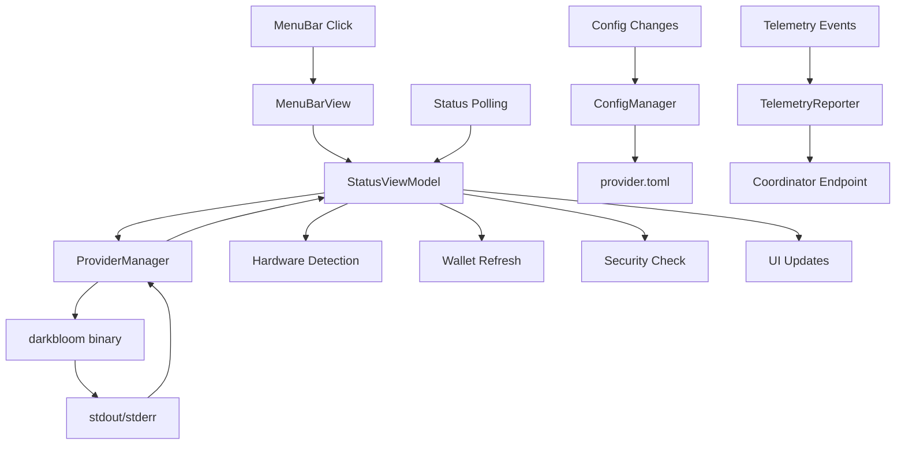
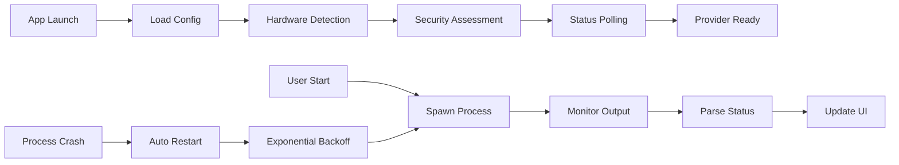

# EigenInference Frontend Component Analysis

## Architecture

EigenInference is a sophisticated macOS frontend application built with SwiftUI that serves as a menu bar wrapper for the Rust-based `darkbloom` inference provider binary. The architecture follows a Model-View-ViewModel (MVVM) pattern with a centralized state management approach using `StatusViewModel` as the primary observable object that coordinates all app functionality.

The application operates as a menu bar utility with window management that dynamically switches between `.accessory` mode (menu bar only) and `.regular` mode (full app with dock icon) based on window visibility. This provides a seamless user experience where the app stays in the menu bar until windows are opened.

## Key Components

### EigenInferenceApp (Entry Point)
Main SwiftUI app entry point that manages scene configuration with five distinct windows: MenuBarExtra (persistent menu bar), Settings, Dashboard, Setup Wizard, Doctor diagnostics, and Logs viewer. The AppDelegate handles activation policy switching and telemetry configuration.

### StatusViewModel (Central State Manager)
Observable state object that centralizes all provider functionality including online/serving status, hardware information, throughput metrics, wallet/earnings data, and security posture. Manages periodic polling of the provider binary status and coordinates with all manager classes.

### MenuBarView (Primary Interface)
SwiftUI view for the dropdown menu shown when clicking the menu bar icon. Features adaptive glass effects on macOS 26+ with fallback to material backgrounds, real-time status indicators, hardware information display, and navigation to other app windows.

### ProviderManager (Process Management)
Manages the darkbloom subprocess lifecycle including binary path resolution, process spawning with environment setup, stdout/stderr capture, auto-restart on crashes with exponential backoff, and clean shutdown with SIGTERM/SIGKILL handling.

### CLIRunner (Command Interface)
Centralized utility for executing darkbloom subcommands with consistent binary resolution, environment setup (PATH, PYTHONHOME), and both synchronous and streaming output capture modes.

### ConfigManager (Configuration)
Reads and writes the shared provider.toml file used by both the app and CLI, ensuring single source of truth for coordinator URL, backend settings, and provider configuration with TOML parsing and serialization.

### ModelManager (Model Discovery)
Scans HuggingFace cache directory for downloaded MLX models, calculates on-disk sizes, provides model download capability via huggingface-cli, and determines memory fit based on available unified memory.

### SecurityManager (Trust Assessment)
Queries machine security posture including SIP status, Secure Enclave availability, MDM enrollment, and Secure Boot state to determine trust level for inference routing eligibility.

### TelemetryReporter (Error Reporting)
Ships local errors and crash reports to coordinator's telemetry endpoint with bounded in-memory buffer, debounced network flush, and structured event payload matching coordinator protocol.

### DesignSystem (Visual Framework)
Comprehensive design token system with light/dark mode palettes, adaptive colors, warm typography scales, and reusable view modifiers matching the EigenCloud brand system.

### NotificationManager (System Integration)
Manages macOS user notifications for provider state changes, inference completion milestones, and error conditions with proper authorization handling.

### LaunchAgentManager (Auto-Start)
Manages macOS launch agent installation/removal for auto-starting the provider on system boot with plist generation and launchctl integration.

## Data Flows

## External Dependencies

### External Libraries

The Package.swift manifest shows zero external dependencies - this is a pure Swift application using only Apple's built-in frameworks:

**Foundation** (System Framework): Core utilities for file management, networking, process execution, and data structures. Used extensively across all modules for URLSession HTTP requests, Process subprocess management, FileManager file operations, and UserDefaults configuration persistence.

**SwiftUI** (System Framework): Modern declarative UI framework providing view composition, state management, and scene coordination. Forms the entire user interface layer with advanced features like MenuBarExtra, adaptive colors, and glass effects.

**Combine** (System Framework): Reactive programming framework enabling observable state management and asynchronous event handling. Powers the @Published properties in StatusViewModel and manager classes.

**CryptoKit** (System Framework): Cryptographic operations and Secure Enclave access for security posture assessment. Used specifically in SecurityManager for hardware trust verification.

**Security** (System Framework): Keychain access for secure storage of API credentials and authentication tokens. Provides the SecItem* functions for credential persistence.

**UserNotifications** (System Framework): macOS notification system integration for provider state changes and milestone notifications. Manages authorization and notification delivery.

## API Surface

The component exposes no traditional API endpoints as it's a desktop application. However, it provides several interaction points:

### Menu Bar Interface
- Real-time status display with throughput metrics
- Hardware information (chip, memory, GPU cores, bandwidth)
- Provider start/stop controls with pause/resume functionality
- Trust level indicator and setup navigation
- Statistics display (requests served, tokens generated, uptime)
- Navigation to detailed views (Dashboard, Settings, Logs)

### Window Management
- Dashboard: Comprehensive statistics and hardware visualization
- Settings: Provider configuration and scheduling options
- Setup Wizard: Initial onboarding and trust establishment
- Doctor: Diagnostic information and system health
- Logs: Real-time provider output streaming

### Process Integration
- Subprocess management of darkbloom binary
- Shared configuration via provider.toml
- Binary resolution across installation methods
- Environment setup for Python/MLX dependencies

### System Integration
- Launch agent management for auto-start capability
- Keychain integration for secure credential storage
- System security posture assessment
- Hardware capability detection

## External Systems

### Infrastructure Integration

**Darkbloom Coordinator**: Primary external system accessed via WebSocket and HTTP protocols. The app connects to configurable coordinator URLs (default wss://api.darkbloom.dev/ws/provider) for provider registration, inference routing, earnings tracking, and telemetry submission.

**HuggingFace Hub**: Model repository integration for downloading and caching MLX-compatible inference models. The app scans ~/.cache/huggingface/hub/ for available models and can trigger downloads via huggingface-cli.

**macOS System Services**: Deep integration with macOS security frameworks including System Integrity Protection (SIP), Secure Enclave verification, MDM enrollment detection, and launch agent management for system-level integration.

**Local MLX Backend**: Communicates with locally running darkbloom binary on port 8100 for health checks, model status, and inference metrics via HTTP REST API.

## Component Interactions

The EigenInference component operates as a frontend wrapper with no direct dependencies on other components in the d-inference codebase. It interacts with external systems through:

**CLI Binary Integration**: Shells out to darkbloom CLI for all provider operations including start/stop, wallet management, earnings queries, and diagnostic commands. The binary is resolved from ~/.darkbloom/bin/, app bundle, or system PATH.

**Shared Configuration**: Reads and writes the same provider.toml configuration file used by the CLI component, ensuring consistency between app and command-line interfaces.

**Telemetry Coordination**: Reports app-specific events to the same coordinator telemetry endpoint used by other system components for unified monitoring and debugging.

**Process Supervision**: Manages the darkbloom serve process as a supervised subprocess with automatic restart capabilities, health monitoring, and clean shutdown procedures.
