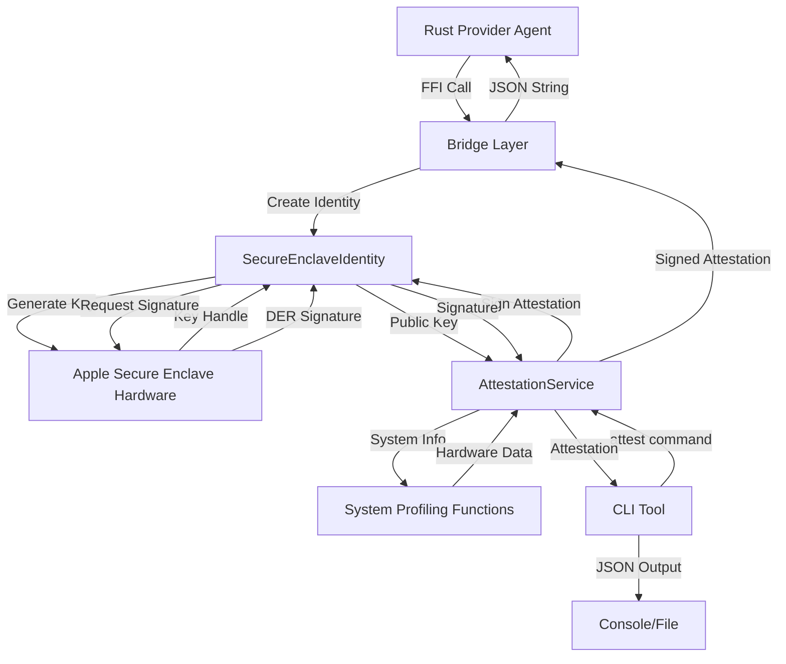

# EigenInferenceEnclave

## Architecture

The EigenInferenceEnclave component is a Swift package that provides secure hardware attestation capabilities for Apple Silicon devices using the Secure Enclave. It follows a layered architecture pattern with three primary layers:

1. **Core Identity Layer**: `SecureEnclaveIdentity` manages hardware-bound P-256 ECDSA keys stored in the Apple Secure Enclave, providing tamper-resistant signing operations that cannot be exported or cloned.

2. **Attestation Service Layer**: `AttestationService` builds signed attestation blobs containing hardware and security state information, proving device identity and security posture to external verifiers.

3. **FFI Bridge Layer**: `Bridge.swift` exposes C-callable functions that allow Rust components to interact with Secure Enclave operations through a well-defined ABI, enabling cross-language integration.

The component serves as a foundational security primitive for the EigenInference system, providing hardware-based device identity and attestation capabilities that complement the provider agent's encryption and networking layers.

## Key Components

### SecureEnclaveIdentity
- **Location**: `enclave/Sources/EigenInferenceEnclave/SecureEnclaveIdentity.swift`
- **Purpose**: Manages hardware-bound P-256 ECDSA signing keys in the Apple Secure Enclave
- **Key Features**: Key generation, signing operations, verification, and persistence via opaque data representations
- **Security**: Private keys never leave the hardware; only signing operations are exposed

### AttestationService  
- **Location**: `enclave/Sources/EigenInferenceEnclave/Attestation.swift`
- **Purpose**: Creates signed attestation blobs containing hardware and software security state
- **Key Features**: System profiling, security checks (SIP, Secure Boot, RDMA), JSON serialization with deterministic key ordering
- **Output**: Signed JSON attestations with embedded public keys and cryptographic signatures

### FFI Bridge
- **Location**: `enclave/Sources/EigenInferenceEnclave/Bridge.swift`  
- **Purpose**: Provides C-callable interface for Rust integration
- **Key Features**: Memory management conventions, opaque pointer handling, string marshalling
- **Functions**: Identity lifecycle, signing/verification, attestation creation with optional key binding

### AttestationBlob Data Structure
- **Location**: `enclave/Sources/EigenInferenceEnclave/Attestation.swift` (lines 44-59)
- **Purpose**: Structured representation of device security state
- **Fields**: Hardware model, chip name, OS version, security flags, public keys, timestamps
- **Serialization**: JSON with sorted keys for deterministic signature verification

### CLI Tool
- **Location**: `enclave/Sources/EigenInferenceEnclaveCLI/main.swift`
- **Purpose**: Command-line interface for attestation generation and diagnostics
- **Commands**: `attest` for creating attestations, `info` for Secure Enclave status
- **Usage**: Testing, debugging, and standalone attestation generation

### System Information Collectors
- **Location**: `enclave/Sources/EigenInferenceEnclave/Attestation.swift` (lines 160-344)
- **Purpose**: Gather hardware and security configuration details
- **Methods**: `system_profiler` for hardware info, `sysctl` for model data, `diskutil` for volume sealing, `csrutil` for SIP status
- **Scope**: Chip identification, security policy enforcement, volume integrity verification

## Data Flows



The primary data flow begins with the Rust provider agent calling FFI functions to create a Secure Enclave identity. The identity generates a hardware-bound P-256 key, with the private key remaining in the Secure Enclave. The AttestationService collects system information through various macOS utilities and creates a structured attestation blob. This blob is signed by the Secure Enclave key and returned as a JSON string to the caller. The CLI tool provides an alternative entry point for testing and diagnostics.

## External Dependencies

### System Libraries

- **CryptoKit** (built-in): Apple's cryptographic framework providing Secure Enclave integration, P-256 ECDSA operations, and X25519 key agreement. Used across all modules for hardware-based cryptographic operations. Core integration points include `SecureEnclave.P256.Signing.PrivateKey` for hardware key generation and `P256.Signing.PublicKey` for verification operations.

- **Foundation** (built-in): Apple's foundation framework providing core data types, JSON encoding/decoding, process execution, and system utilities. Used for `Data` types, `JSONEncoder`/`JSONDecoder` with sorted keys, `Process` for executing system commands, and `Date` for timestamps.

### System Utilities

- **/usr/sbin/system_profiler** [system-utility]: Hardware information gathering tool. Used to extract chip names (e.g., "Apple M4 Max") and serial numbers from `SPHardwareDataType` output. Critical for hardware identity attestation.

- **/usr/bin/csrutil** [system-utility]: System Integrity Protection status checker. Used to determine SIP enablement state, though noted as development placeholder pending Managed Device Attestation integration.

- **/usr/sbin/diskutil** [system-utility]: Disk utility for volume information. Used to check Authenticated Root Volume sealing status and extract system volume hashes for integrity verification.

- **sysctl** [system-call]: System control interface for kernel parameters. Used to retrieve hardware model identifiers (e.g., "Mac16,1") via `hw.model` parameter.

- **/usr/bin/rdma_ctl** [system-utility]: RDMA (Remote Direct Memory Access) control utility. Used to verify RDMA is disabled, preventing remote memory access that would bypass security protections.

## Internal Dependencies

The EigenInferenceEnclave component is designed as a foundational library with minimal internal dependencies within the d-inference codebase. Based on the component information, it has circular dependencies with itself and the CLI tool:

- **EigenInferenceEnclaveCLI**: The CLI executable depends on the main library for accessing attestation and identity functionality. The CLI provides a command-line interface that wraps the core library's capabilities for testing and standalone use.

The component is structured to be consumed by other components (particularly the Rust provider agent) through its FFI bridge, but does not depend on other d-inference components for its core functionality.

## API Surface

### FFI Bridge Functions (C ABI)

```c
// Identity lifecycle management
UnsafeMutableRawPointer? eigeninference_enclave_create()
void eigeninference_enclave_free(UnsafeMutableRawPointer ptr)
Int32 eigeninference_enclave_is_available()

// Key operations  
UnsafeMutablePointer<CChar>? eigeninference_enclave_public_key_base64(UnsafeRawPointer ptr)

// Cryptographic operations
UnsafeMutablePointer<CChar>? eigeninference_enclave_sign(UnsafeRawPointer ptr, UnsafePointer<UInt8> data, Int dataLen)
Int32 eigeninference_enclave_verify(UnsafePointer<CChar> pubKeyBase64, UnsafePointer<UInt8> data, Int dataLen, UnsafePointer<CChar> sigBase64)

// Attestation generation
UnsafeMutablePointer<CChar>? eigeninference_enclave_create_attestation(UnsafeRawPointer ptr)
UnsafeMutablePointer<CChar>? eigeninference_enclave_create_attestation_with_key(UnsafeRawPointer ptr, UnsafePointer<CChar>? encKeyBase64)
UnsafeMutablePointer<CChar>? eigeninference_enclave_create_attestation_full(UnsafeRawPointer ptr, UnsafePointer<CChar>? encKeyBase64, UnsafePointer<CChar>? binHashHex)

// Memory management
void eigeninference_enclave_free_string(UnsafeMutablePointer<CChar>? ptr)
```

### Swift Library API

```swift
// Core identity management
public final class SecureEnclaveIdentity {
    public init() throws
    public init(dataRepresentation: Data) throws
    public var dataRepresentation: Data { get }
    public var publicKeyBase64: String { get }
    public func sign(_ data: Data) throws -> Data
    public func verify(signature: Data, for data: Data) -> Bool
    public static func verify(signature: Data, for data: Data, publicKey: Data) -> Bool
    public static var isAvailable: Bool { get }
}

// Attestation service  
public final class AttestationService {
    public init(identity: SecureEnclaveIdentity)
    public func createAttestation(encryptionPublicKey: String?, binaryHash: String?) throws -> SignedAttestation
    public static func verify(_ signed: SignedAttestation) -> Bool
}

// Data structures
public struct AttestationBlob: Codable { /* 14 security and hardware fields */ }
public struct SignedAttestation: Codable {
    public let attestation: AttestationBlob
    public let signature: String
}
```

### CLI Interface

```bash
eigeninference-enclave attest [--encryption-key <base64>] [--binary-hash <hex>]
eigeninference-enclave info
```

The CLI tool generates ephemeral identities for each invocation and outputs JSON attestations to stdout, suitable for testing and integration workflows.
