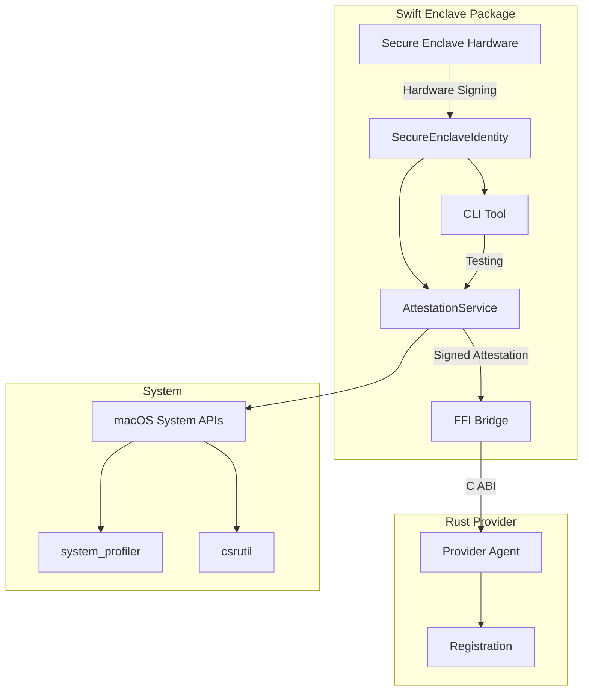

# EigenInferenceEnclave

The EigenInferenceEnclave is a Swift package providing hardware-based security primitives for the EigenInference platform through Apple's Secure Enclave. It implements cryptographic identity management, attestation generation, and FFI bridges for integration with the Rust provider agent.

## Architecture

The component follows a layered architecture with three primary concerns:

1. **Core Security Layer**: `SecureEnclaveIdentity` manages P-256 ECDSA keys in hardware-isolated storage
2. **Attestation Layer**: `AttestationService` generates signed hardware/software state attestations  
3. **FFI Bridge Layer**: C-callable functions expose Secure Enclave operations to Rust via dynamic linking

The architecture leverages Apple's CryptoKit framework and Secure Enclave coprocessor to provide tamper-resistant cryptographic operations. Private keys never leave the hardware boundary, ensuring device-bound identity that cannot be cloned or extracted.

## Key Components

### SecureEnclaveIdentity
**Location**: `enclave/Sources/EigenInferenceEnclave/SecureEnclaveIdentity.swift`

Central class managing hardware-bound P-256 ECDSA signing keys. Provides key generation, persistence via opaque data representations, and signing operations that execute entirely within the Secure Enclave coprocessor.

Key methods:
- `init()` - Generates new hardware key
- `init(dataRepresentation:)` - Loads existing key from opaque handle
- `sign(_:)` - Hardware-isolated signing operation
- `verify(signature:for:publicKey:)` - Static verification for any P-256 key

### AttestationService
**Location**: `enclave/Sources/EigenInferenceEnclave/Attestation.swift`

Builds comprehensive hardware/software security state attestations for provider registration. Collects system information including chip model, security configuration (SIP, Secure Boot, RDMA status), and cryptographically binds optional encryption keys.

Core functionality:
- `createAttestation(encryptionPublicKey:binaryHash:)` - Generates signed attestation blob
- Hardware detection via `sysctl`, `system_profiler`, and security utilities
- JSON serialization with deterministic key ordering for signature verification

### FFI Bridge Functions
**Location**: `enclave/Sources/EigenInferenceEnclave/Bridge.swift`

C-callable functions with `@_cdecl` annotations providing seamless integration with the Rust provider agent. Implements careful memory management with `Unmanaged` references and `strdup` for string returns.

Key FFI exports:
- `eigeninference_enclave_create/free` - Identity lifecycle management  
- `eigeninference_enclave_sign/verify` - Cryptographic operations
- `eigeninference_enclave_create_attestation_*` - Attestation generation variants
- Availability checking and public key extraction

### CLI Tool (EigenInferenceEnclaveCLI)
**Location**: `enclave/Sources/EigenInferenceEnclaveCLI/main.swift`

Standalone command-line utility for testing and diagnostics. Provides `attest` and `info` subcommands with ephemeral key generation (no persistent storage). Used for development validation and integration testing.

### AttestationBlob Structure
**Location**: `enclave/Sources/EigenInferenceEnclave/Attestation.swift` (lines 44-59)

Comprehensive security state structure containing:
- Hardware identity: `chipName`, `hardwareModel`, `serialNumber`
- Security posture: `sipEnabled`, `secureBootEnabled`, `authenticatedRootEnabled`, `rdmaDisabled`  
- Cryptographic binding: `publicKey` (P-256), optional `encryptionPublicKey` (X25519)
- Integrity verification: optional `binaryHash` for provider binary validation
- Freshness: ISO 8601 `timestamp`

### System Information Collection
**Location**: `enclave/Sources/EigenInferenceEnclave/Attestation.swift` (lines 163-344)

Hardware detection and security verification functions:
- `getChipName()` - Parses `system_profiler SPHardwareDataType` for chip identification
- `checkSIPEnabled()` - Queries System Integrity Protection via `csrutil status`
- `checkAuthenticatedRootEnabled()` - Verifies sealed system volume via `diskutil info`
- `checkRDMADisabled()` - Ensures Remote Direct Memory Access is disabled for security

## Data Flows



### Attestation Generation Flow

1. **Identity Creation**: `SecureEnclaveIdentity` generates or loads P-256 key in hardware
2. **System Interrogation**: `AttestationService` queries hardware model, security settings via system APIs
3. **Blob Assembly**: Constructs `AttestationBlob` with hardware state, optional encryption key binding
4. **JSON Encoding**: Serializes with sorted keys for deterministic output matching Go coordinator expectations
5. **Hardware Signing**: Signs JSON bytes using Secure Enclave private key
6. **FFI Export**: Returns signed attestation to Rust provider via C-callable bridge

### FFI Integration Flow

1. **Rust Dynamic Loading**: Provider loads Swift framework as dynamic library
2. **Symbol Resolution**: Resolves `eigeninference_enclave_*` C symbols at runtime  
3. **Memory Management**: Swift allocates with `Unmanaged.passRetained`, Rust frees with provided functions
4. **Data Marshaling**: Base64 encoding for binary data (keys, signatures) across language boundary
5. **Error Handling**: NULL return values indicate failures (hardware unavailable, signing errors)

## External Dependencies

### System Frameworks

- **CryptoKit** (Built-in): Apple's cryptographic framework providing Secure Enclave integration via `SecureEnclave.P256.Signing.PrivateKey`. Used throughout `SecureEnclaveIdentity` and `AttestationService` for hardware-backed cryptographic operations.

- **Foundation** (Built-in): Core Swift framework for data types, JSON encoding, process execution. Used in all modules for `Data`, `String`, `JSONEncoder`, and `Process` types. Critical for system API interaction and serialization.

No external third-party dependencies - the package relies exclusively on Apple's system frameworks, ensuring minimal attack surface and tight integration with macOS security infrastructure.

### Internal Dependencies

The package structure creates internal dependencies:
- **EigenInferenceEnclaveCLI** depends on **EigenInferenceEnclave** library for all cryptographic operations
- CLI tool imports and uses `SecureEnclaveIdentity`, `AttestationService` classes directly
- Test targets depend on main library for comprehensive validation

## API Surface

### Public Swift API

```swift
// Core identity management
public final class SecureEnclaveIdentity {
    public init() throws
    public init(dataRepresentation: Data) throws
    public var dataRepresentation: Data { get }
    public var publicKeyBase64: String { get }
    public func sign(_ data: Data) throws -> Data
    public static func verify(signature: Data, for: Data, publicKey: Data) -> Bool
    public static var isAvailable: Bool { get }
}

// Attestation generation
public final class AttestationService {
    public init(identity: SecureEnclaveIdentity)
    public func createAttestation(encryptionPublicKey: String?, binaryHash: String?) throws -> SignedAttestation
    public static func verify(_ signed: SignedAttestation) -> Bool
}
```

### C FFI API

```c
// Identity lifecycle
UnsafeMutableRawPointer? eigeninference_enclave_create();
void eigeninference_enclave_free(UnsafeMutableRawPointer ptr);
int32_t eigeninference_enclave_is_available();

// Cryptographic operations
char* eigeninference_enclave_public_key_base64(UnsafeRawPointer ptr);
char* eigeninference_enclave_sign(UnsafeRawPointer ptr, const uint8_t* data, int len);
int32_t eigeninference_enclave_verify(const char* pubkey, const uint8_t* data, int len, const char* sig);

// Attestation generation
char* eigeninference_enclave_create_attestation(UnsafeRawPointer ptr);
char* eigeninference_enclave_create_attestation_with_key(UnsafeRawPointer ptr, const char* enckey);
char* eigeninference_enclave_create_attestation_full(UnsafeRawPointer ptr, const char* enckey, const char* binhash);

// Memory management
void eigeninference_enclave_free_string(char* ptr);
```

### CLI Interface

```bash
# Generate ephemeral attestation
eigeninference-enclave attest [--encryption-key <base64>] [--binary-hash <hex>]

# System capability info  
eigeninference-enclave info
```
