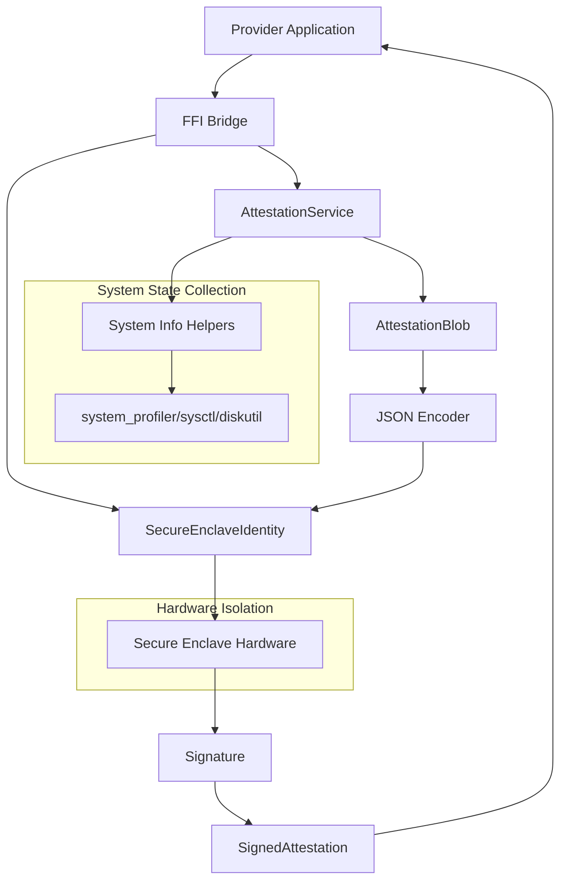

Based on my comprehensive exploration of the EigenInferenceEnclave component, I now have a complete understanding of its architecture and functionality. Let me write the analysis.

# EigenInferenceEnclave Analysis

## Architecture

The EigenInferenceEnclave component implements a hardware-backed attestation and signing system using Apple's Secure Enclave on macOS. It follows a layered architecture with three distinct levels:

1. **Core Swift Libraries** - Native Swift interfaces for Secure Enclave operations
2. **C FFI Bridge** - Foreign Function Interface layer for cross-language integration  
3. **Command-Line Interface** - Standalone tool for testing and diagnostics

The architecture prioritizes security through hardware isolation, ephemeral keys, and tamper-resistant operations. All private key material remains within the Secure Enclave hardware, with only public keys and signatures accessible to the host application.

## Key Components

### SecureEnclaveIdentity (Core Identity Management)
**Location**: `Sources/EigenInferenceEnclave/SecureEnclaveIdentity.swift`

Manages P-256 ECDSA signing keys stored in Apple's Secure Enclave. Provides hardware-bound identity with tamper-resistant signing operations. The private key never leaves the Secure Enclave hardware - only an opaque data representation can be persisted for key reloading on the same device.

### AttestationService (Hardware State Attestation) 
**Location**: `Sources/EigenInferenceEnclave/Attestation.swift`

Builds signed attestation blobs proving a provider's hardware identity and security configuration. Captures comprehensive system state including chip name, hardware model, security features (SIP, Secure Boot, RDMA status), and optional encryption key binding. The attestation is JSON-encoded with sorted keys for deterministic signing and verification.

### Bridge (FFI Interface Layer)
**Location**: `Sources/EigenInferenceEnclave/Bridge.swift`

Provides C-callable functions through `@_cdecl` declarations, enabling Rust applications to access Secure Enclave operations via FFI. Handles memory management with explicit `Unmanaged.passRetained` semantics and provides functions for identity creation, signing, attestation generation, and verification.

### CLI Tool (Command-Line Interface)
**Location**: `Sources/EigenInferenceEnclaveCLI/main.swift`

Standalone executable for Secure Enclave diagnostics and attestation generation. Supports ephemeral key operations with commands for attestation creation (`attest`) and system information (`info`). Uses fresh P-256 keys created on each invocation - no persistent key material.

### AttestationBlob (Data Structure)
**Location**: `Sources/EigenInferenceEnclave/Attestation.swift` (lines 44-59)

Codable struct containing comprehensive hardware and software security state. Fields are alphabetically ordered to match Swift's JSONEncoder with `.sortedKeys` output, ensuring deterministic JSON for signature verification. Includes hardware identity, security state, public keys, and timestamp.

### System Information Helpers
**Location**: `Sources/EigenInferenceEnclave/Attestation.swift` (lines 162-344)

Collection of functions for gathering system security state including hardware model detection via sysctl, chip identification through system_profiler, security feature checking (SIP, Secure Boot, RDMA, Authenticated Root Volume), and OS version extraction.

## Data Flows

### Attestation Generation Flow
1. **Identity Creation**: Provider creates ephemeral SecureEnclaveIdentity through FFI
2. **System State Collection**: AttestationService gathers hardware/software security state
3. **Attestation Assembly**: System state combined into AttestationBlob with optional encryption key binding
4. **JSON Serialization**: Blob encoded with sorted keys for deterministic output
5. **Secure Signing**: JSON bytes signed by Secure Enclave P-256 key
6. **Response Packaging**: Signature and attestation combined into SignedAttestation
7. **FFI Return**: JSON-serialized signed attestation returned to provider

### Challenge-Response Flow
1. **Challenge Receipt**: Coordinator sends nonce to provider
2. **FFI Signing**: Provider calls `eigeninference_enclave_sign` with nonce bytes
3. **Hardware Signing**: Secure Enclave produces DER-encoded ECDSA signature
4. **Response Delivery**: Base64-encoded signature returned to coordinator
5. **Verification**: Coordinator verifies signature against known public key

## External Dependencies

The component has minimal external dependencies, relying primarily on system frameworks:

### External Libraries

- **CryptoKit** (System Framework) [crypto]: Apple's cryptography framework providing Secure Enclave integration, P-256 key operations, and ECDSA signing primitives. Used throughout all modules for hardware-backed cryptographic operations. Primary integration points: `SecureEnclave.P256.Signing.PrivateKey`, `P256.Signing.PublicKey`, signature operations.

- **Foundation** (System Framework) [system]: Apple's core framework providing fundamental data types, JSON encoding/decoding, process execution, and system utilities. Used across all modules for data structures (`Data`, `Date`), JSON serialization (`JSONEncoder`/`JSONDecoder`), and system command execution (`Process`). Essential for attestation blob serialization and system state collection.

- **XCTest** (Development) [testing]: Apple's testing framework used exclusively in test files. Provides test case structure, assertions, and Secure Enclave availability checking. Integration points: `AttestationTests.swift`, `SecureEnclaveTests.swift`.

## Internal Dependencies

This component has self-contained internal dependencies within the Swift package:

### Internal Dependencies

- **EigenInferenceEnclaveCLI depends on EigenInferenceEnclave**: The CLI executable imports and uses the core library for attestation operations. Uses `SecureEnclaveIdentity` for key creation, `AttestationService` for attestation generation, and `SecureEnclave.isAvailable` for availability checking. Integration points: `main.swift` imports `EigenInferenceEnclave` and calls `createAttestation()`.

## API Surface

### Swift Public API
- `SecureEnclaveIdentity`: Hardware identity management with ephemeral and persistent key support
- `AttestationService`: Attestation blob creation and verification  
- `AttestationBlob`/`SignedAttestation`: Data structures for attestation payloads
- Static verification methods for signature validation

### C FFI API (for Rust Integration)
- `eigeninference_enclave_create()`: Create ephemeral Secure Enclave identity
- `eigeninference_enclave_public_key_base64()`: Extract public key
- `eigeninference_enclave_sign()`: Sign data with hardware key
- `eigeninference_enclave_create_attestation_full()`: Generate signed attestation with encryption key binding
- `eigeninference_enclave_verify()`: Verify P-256 ECDSA signatures
- Memory management functions for proper cleanup

### CLI Interface
- `eigeninference-enclave attest`: Generate signed attestation blob
- `eigeninference-enclave info`: Display Secure Enclave availability and ephemeral key info
- Optional arguments for encryption key binding and binary hash inclusion

## External Systems

The component integrates with several external systems for security state collection:

- **system_profiler**: Extracts hardware information (chip name, serial number) for attestation
- **sysctl**: Retrieves machine model identifiers via `hw.model` 
- **csrutil**: Checks System Integrity Protection status (development placeholder)
- **diskutil**: Verifies Authenticated Root Volume status and snapshot hashes
- **rdma_ctl**: Confirms RDMA is disabled for memory access security

## Component Interactions

### Rust Provider Integration
The primary integration point is with the Rust-based provider agent through FFI:

- **Provider Build Process**: Rust build script (`build.rs`) compiles Swift package and links static library
- **FFI Calls**: Provider uses C function signatures to create identities, sign data, and generate attestations
- **Memory Management**: Rust side responsible for freeing returned strings and identity handles
- **Platform Gating**: All Secure Enclave operations conditional on macOS target platform

### Coordinator Integration
The component produces attestation blobs consumed by the Go coordinator:

- **JSON Compatibility**: Attestation serialization matches Go's `encoding/json` map key ordering
- **Signature Verification**: Coordinator independently verifies P-256 ECDSA signatures
- **Public Key Format**: Raw P-256 representation (64 bytes: X||Y) compatible with Go crypto libraries
- **Timestamp Format**: ISO 8601 timestamps for freshness validation
