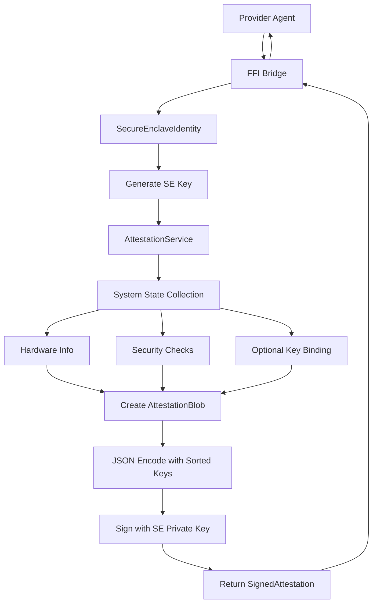
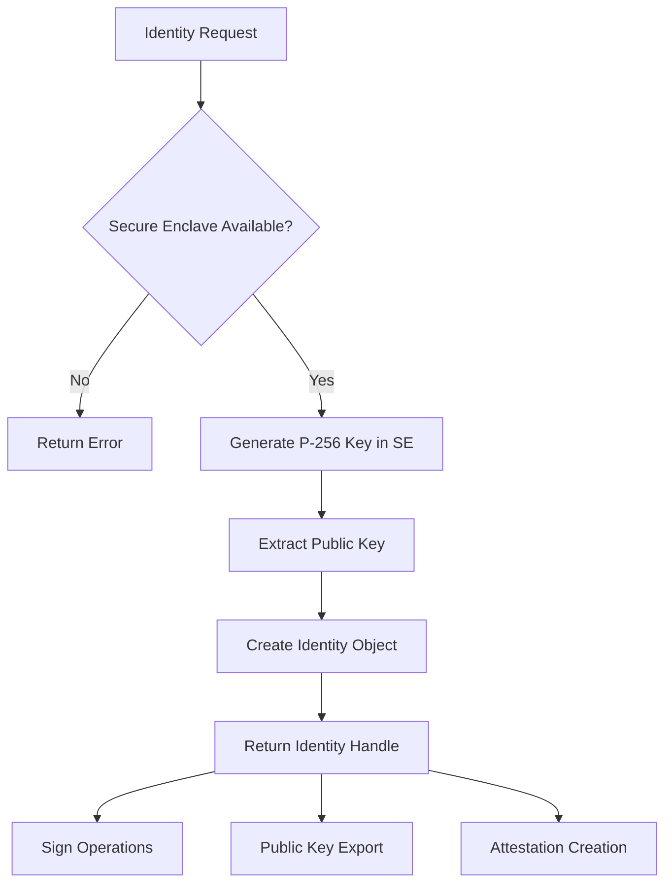

# EigenInferenceEnclave

The EigenInferenceEnclave is a Swift package library that provides hardware-based identity and attestation capabilities for the EigenInference network using Apple's Secure Enclave. It enables provider nodes to generate cryptographically provable attestations of their security posture while maintaining hardware-bound cryptographic keys that cannot be cloned or exported.

## Architecture

The component follows a **layered architecture** with three primary tiers:

1. **Core Identity Layer** (`SecureEnclaveIdentity`): Hardware-bound P-256 key management using Apple's Secure Enclave
2. **Attestation Layer** (`AttestationService`): System security state collection and cryptographic attestation creation
3. **FFI Bridge Layer** (`Bridge.swift`): C-compatible interface for integration with Rust provider agents

The architecture leverages Apple's CryptoKit framework and Secure Enclave hardware to ensure private keys never leave the hardware security module, providing tamper-resistant device identity and attestation signing capabilities.

## Key Components

### SecureEnclaveIdentity
**Location**: `Sources/EigenInferenceEnclave/SecureEnclaveIdentity.swift`

The core hardware identity management class that wraps Apple's Secure Enclave P-256 signing functionality. Each identity contains a hardware-bound private key that cannot be exported or cloned to another device. Key features:

- Ephemeral or persistent key generation in Secure Enclave hardware
- Raw P-256 public key export (64 bytes: X||Y) for coordinator verification
- DER-encoded ECDSA signature generation with hardware-isolated private key
- Support for both base64 and hex public key representations for protocol compatibility

### AttestationService
**Location**: `Sources/EigenInferenceEnclave/Attestation.swift`

Service that collects comprehensive system security state and creates signed attestation blobs. The attestation includes hardware identity (chip name, model), security configuration (SIP, Secure Boot, RDMA status), and optional key binding for encryption keys. Key capabilities:

- Hardware fingerprinting via system_profiler and sysctl
- Security posture validation (SIP enabled, RDMA disabled, Authenticated Root Volume)
- JSON-encoded attestation with deterministic key ordering for signature verification
- Timestamp-based freshness validation with ISO 8601 encoding
- Optional X25519 encryption key binding to prove same-device ownership

### FFI Bridge
**Location**: `Sources/EigenInferenceEnclave/Bridge.swift`

C-compatible foreign function interface that exposes Secure Enclave operations to Rust code via `@_cdecl` functions. Provides memory-managed access to:

- Identity creation and lifecycle management with proper retained/released semantics
- Public key extraction as null-terminated C strings
- Data signing with base64-encoded DER signature output
- Signature verification against arbitrary P-256 public keys
- Complete attestation generation with optional encryption key and binary hash binding

### CLI Tool
**Location**: `Sources/EigenInferenceEnclaveCLI/main.swift`

Command-line interface for testing and diagnostics. Supports two primary operations:

- `attest`: Generates ephemeral signed attestations with optional encryption key binding
- `info`: Reports Secure Enclave availability and creates temporary identity for testing

All CLI operations use ephemeral keys (not persisted to disk) for security testing without leaving key material on the filesystem.

## Data Flows

### Attestation Creation Flow



### Key Management Flow



## External Dependencies

### System Libraries

- **CryptoKit** (System Framework) [crypto]: Apple's cryptographic framework providing Secure Enclave access and P-256 ECDSA operations. Used throughout all cryptographic operations via `SecureEnclave.P256.Signing.PrivateKey` and standard `P256.Signing.PublicKey` types. Imported in: `SecureEnclaveIdentity.swift`, `Attestation.swift`, `Bridge.swift`, test files.

- **Foundation** (System Framework) [serialization]: Apple's foundation framework for JSON encoding/decoding, data structures, and process management. Provides `JSONEncoder` with `.sortedKeys` for deterministic attestation serialization and `Process` for system command execution. Imported in: all Swift source files.

### Development Dependencies

- **XCTest** (System Framework) [testing]: Apple's unit testing framework used for comprehensive test coverage including FFI bridge validation, attestation round-trip testing, and cryptographic operation verification. Imported in: `AttestationTests.swift`, `SecureEnclaveTests.swift`.

### Package Structure

The Swift Package Manager manifest defines:
- **Platforms**: Requires macOS 13+ for Secure Enclave API availability
- **Products**: Static library (`EigenInferenceEnclave`) and CLI executable (`eigeninference-enclave`)
- **Targets**: Library target with no external dependencies, CLI target depending on the library, and test target

## Internal Dependencies

This component has self-referential dependencies within the package:

- **EigenInferenceEnclaveCLI**: Depends on the `EigenInferenceEnclave` library target for `SecureEnclaveIdentity` and `AttestationService` access. Uses these types directly for command-line attestation generation and system diagnostics.

The component operates as a foundational library with no dependencies on other components in the d-inference codebase - it provides cryptographic primitives to higher-level components via the FFI bridge.

## API Surface

### Swift Library Interface

The library exposes three primary public classes:

- **SecureEnclaveIdentity**: Hardware key management with methods `init()`, `init(dataRepresentation:)`, `sign(_:)`, `verify(signature:for:)`, and properties for public key export
- **AttestationService**: Attestation generation with `init(identity:)` and `createAttestation(encryptionPublicKey:binaryHash:)` 
- **AttestationBlob/SignedAttestation**: Codable data structures for JSON serialization with deterministic field ordering

### C FFI Interface

C-compatible functions for Rust integration:

```c
// Identity management
void* eigeninference_enclave_create();
void eigeninference_enclave_free(void* ptr);
int32_t eigeninference_enclave_is_available();

// Cryptographic operations
char* eigeninference_enclave_public_key_base64(void* ptr);
char* eigeninference_enclave_sign(void* ptr, uint8_t* data, int len);
int32_t eigeninference_enclave_verify(char* pubkey, uint8_t* data, int len, char* sig);

// Attestation generation
char* eigeninference_enclave_create_attestation_full(void* ptr, char* enckey, char* binhash);
void eigeninference_enclave_free_string(char* str);
```

### CLI Interface

Command-line tool with two subcommands:

- `eigeninference-enclave attest [--encryption-key <base64>] [--binary-hash <hex>]`: Generates signed attestation JSON to stdout
- `eigeninference-enclave info`: Reports Secure Enclave availability and generates ephemeral test identity
