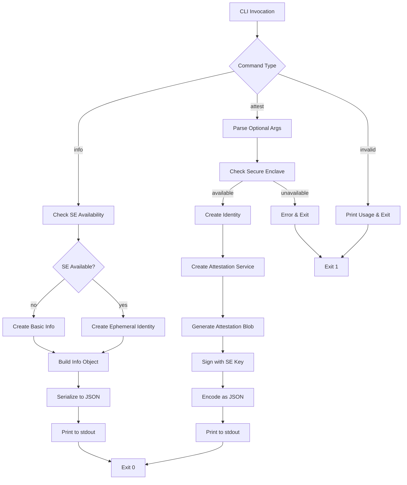

# EigenInferenceEnclaveCLI Component Analysis

## Overview

The EigenInferenceEnclaveCLI is a command-line interface tool that provides Secure Enclave attestation and diagnostics functionality for the EigenInference system. This Swift-based CLI wraps the EigenInferenceEnclave library to enable command-line access to hardware-bound cryptographic operations and system security attestation.

## Architecture

The component follows a **command pattern architecture** with a simple CLI interface that delegates to the underlying EigenInferenceEnclave library. The architecture is structured as:

1. **Main Entry Point** - Argument parsing and command dispatch
2. **Command Handlers** - Specific implementations for each CLI command
3. **Library Integration** - Direct usage of EigenInferenceEnclave APIs
4. **Output Formatting** - JSON serialization for machine-readable output

The CLI is designed to be ephemeral - it creates fresh cryptographic keys for each invocation rather than persisting state, making it suitable for one-off attestation operations.

## Key Components

### 1. Main CLI Parser (`main.swift`)
- **Location**: `main.swift:77-117`
- **Purpose**: Entry point that handles command-line argument parsing and routing
- **Key Functions**: 
  - `printUsage()` - Displays command syntax and options
  - Command routing for `attest` and `info` commands
  - Error handling with proper exit codes

### 2. Attestation Command Handler (`cmdAttest`)
- **Location**: `main.swift:31-52`
- **Purpose**: Generates signed attestation blobs with hardware security state
- **Features**:
  - Secure Enclave availability checking
  - Optional encryption key binding (`--encryption-key`)
  - Optional binary hash inclusion (`--binary-hash`)
  - JSON output with sorted keys for deterministic serialization

### 3. Info Command Handler (`cmdInfo`)
- **Location**: `main.swift:54-73`  
- **Purpose**: Displays Secure Enclave availability and generates ephemeral public key
- **Output**: JSON object containing:
  - `secure_enclave_available` boolean
  - `key_persistence` set to "ephemeral"
  - `public_key` (base64-encoded P-256 public key) when available

### 4. Argument Parser
- **Location**: `main.swift:87-104`
- **Purpose**: Manual argument parsing for `--encryption-key` and `--binary-hash` options
- **Implementation**: Simple state machine that processes argv array
- **Error Handling**: Unknown options trigger usage display and exit(1)

### 5. WebSocket Bridge Stub (`WebSocketBridge.swift`)
- **Location**: `WebSocketBridge.swift:1-3`
- **Purpose**: Placeholder file indicating removed TLS bridge functionality
- **Context**: Originally contained WebSocket bridging code, removed due to Apple keychain restrictions

## Data Flows



## External Dependencies

### Swift Platform Dependencies

- **Foundation** (built-in): Core Swift framework providing fundamental data types, collections, and operating system services. Used for `Data`, `String`, `JSONEncoder`, `CommandLine`, and process management.
  
- **CryptoKit** (built-in): Apple's cryptography framework providing Secure Enclave integration. Used for `SecureEnclave.isAvailable` checks and the `SecureEnclaveIdentity` class from the internal dependency.

### System Dependencies

The CLI relies on several system utilities for attestation data collection:

- **system_profiler** (`/usr/sbin/system_profiler`): Used to gather hardware information (chip name, serial number)
- **csrutil** (`/usr/bin/csrutil`): System Integrity Protection status checking
- **diskutil** (`/usr/sbin/diskutil`): Authenticated Root Volume and system volume integrity verification
- **rdma_ctl** (`/usr/bin/rdma_ctl`): RDMA (Remote Direct Memory Access) status checking

## Internal Dependencies

### EigenInferenceEnclave Library Usage

The CLI component directly integrates with the EigenInferenceEnclave library through the following key interfaces:

- **SecureEnclaveIdentity**: 
  - Used in `cmdAttest` (line 37) and `cmdInfo` (line 62) for creating ephemeral P-256 signing keys
  - Provides `publicKeyBase64` property for key export
  - Handles Secure Enclave availability checking

- **AttestationService**:
  - Instantiated in `cmdAttest` (line 38) with the ephemeral identity
  - `createAttestation()` method generates signed attestation blobs
  - Supports optional encryption key binding and binary hash inclusion

- **SecureEnclave.isAvailable**:
  - Global availability check used before any Secure Enclave operations
  - Prevents runtime failures on unsupported hardware (Intel Macs)

The CLI acts as a thin wrapper around the library, providing command-line access to the core attestation functionality without adding significant business logic.

## API Surface

### Command Line Interface

The CLI exposes two primary commands:

#### 1. `eigeninference-enclave attest [options]`
- **Purpose**: Generate signed hardware attestation blob
- **Options**:
  - `--encryption-key <base64>`: Bind X25519 encryption public key to attestation
  - `--binary-hash <hex>`: Include SHA-256 hash of provider binary
- **Output**: JSON object containing `SignedAttestation` with hardware/software security state
- **Exit Codes**: 0 on success, 1 on error (SE unavailable, invalid args, etc.)

#### 2. `eigeninference-enclave info`
- **Purpose**: Display Secure Enclave availability and ephemeral key info
- **Output**: JSON object with availability status and public key
- **Use Case**: System diagnostics and integration testing

### Output Format

Both commands output structured JSON to stdout:

**Attest Command Output**:
```json
{
  "attestation": {
    "authenticatedRootEnabled": true,
    "binaryHash": "optional-hex-hash",
    "chipName": "Apple M4 Max", 
    "encryptionPublicKey": "optional-base64-x25519-key",
    "hardwareModel": "Mac16,1",
    "osVersion": "15.3.0",
    "publicKey": "base64-p256-public-key",
    "rdmaDisabled": true,
    "secureBootEnabled": true,
    "secureEnclaveAvailable": true,
    "serialNumber": "hardware-serial",
    "sipEnabled": true,
    "systemVolumeHash": "apfs-snapshot-hash",
    "timestamp": "2024-04-30T12:00:00Z"
  },
  "signature": "base64-der-encoded-ecdsa-signature"
}
```

**Info Command Output**:
```json
{
  "key_persistence": "ephemeral",
  "public_key": "base64-p256-public-key",
  "secure_enclave_available": true
}
```

### Integration Patterns

The CLI is designed for integration with the broader EigenInference ecosystem:

- **Provider Registration**: The `attest` command output is included in provider registration messages to the coordinator
- **Key Binding**: Encryption keys from the provider's X25519 identity can be bound to the attestation
- **Binary Integrity**: Provider binary hashes can be included for coordinator verification
- **Ephemeral Keys**: All keys are generated fresh per invocation - no persistent state
