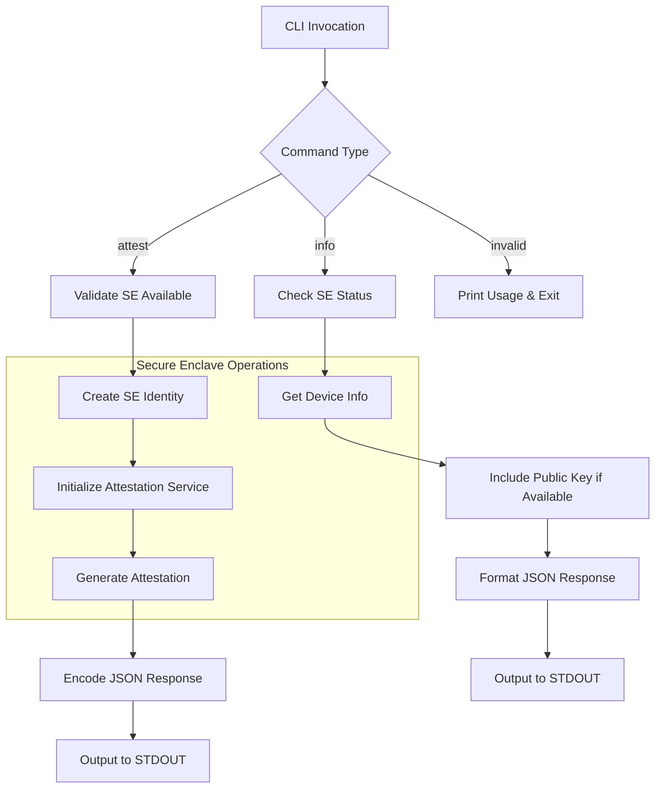

# EigenInferenceEnclaveCLI Component Analysis

## Overview

The EigenInferenceEnclaveCLI is a Swift command-line interface that provides secure attestation capabilities using Apple's Secure Enclave hardware security module. This CLI tool serves as a bridge between the Secure Enclave and external systems, enabling attestation generation and device capability verification for the d-inference project's trusted execution environment.

## Architecture

The component follows a **simple command-based architecture** with direct CLI argument parsing and immediate command execution. It implements a minimalist design pattern where each command is handled by a dedicated function, maintaining separation of concerns while keeping the codebase lightweight and focused.

The architecture emphasizes **ephemeral security** - all cryptographic keys are generated fresh in the Secure Enclave for each invocation, with no persistent state maintained on disk. This design choice maximizes security by ensuring that no long-lived key material exists outside the hardware security module.

## Key Components

### 1. Main Entry Point (`main.swift`)
- **Purpose**: CLI argument parsing and command dispatch
- **Location**: Lines 77-117
- **Functionality**: Handles command-line arguments and routes execution to appropriate command handlers

### 2. Attestation Command Handler (`cmdAttest`)
- **Purpose**: Generates signed attestation blobs using Secure Enclave
- **Location**: Lines 31-52
- **Key Features**: 
  - Validates Secure Enclave availability
  - Creates ephemeral identity and attestation service
  - Supports optional encryption key binding and binary hash verification
  - Outputs JSON-formatted attestation

### 3. Info Command Handler (`cmdInfo`)
- **Purpose**: Reports Secure Enclave availability and device capabilities
- **Location**: Lines 54-73
- **Output**: JSON with device security status and ephemeral public key

### 4. Usage Documentation (`printUsage`)
- **Purpose**: Provides user-facing help and command documentation
- **Location**: Lines 16-29
- **Features**: Comprehensive usage instructions for both commands

### 5. WebSocket Bridge (Deprecated)
- **Purpose**: Originally intended for TLS bridging (now removed)
- **Location**: `WebSocketBridge.swift`
- **Status**: Contains only a comment explaining removal due to Apple keychain restrictions

## Data Flows

The primary data flow centers around **ephemeral attestation generation**:

1. **Command Processing**: CLI arguments are parsed to determine operation type
2. **Security Validation**: Secure Enclave availability is checked before proceeding
3. **Identity Generation**: Fresh cryptographic identity is created in the Secure Enclave
4. **Attestation Creation**: Signed attestation blob is generated with optional metadata binding
5. **JSON Serialization**: Results are formatted as structured JSON for interoperability
6. **Standard Output**: Final attestation or device info is written to STDOUT

## External Dependencies

### System Libraries

- **CryptoKit** (Apple System Framework) [cryptography]: Provides cryptographic primitives and Secure Enclave integration. Used for hardware-backed key generation and attestation signing. Imported in: `main.swift`.

- **Foundation** (Apple System Framework) [runtime]: Core Swift runtime and data handling capabilities. Provides JSON encoding/decoding, string manipulation, and process management. Used for CLI argument handling and data serialization. Imported in: `main.swift`.

### Build Dependencies

- **swift-tools-version: 5.9** [build-tool]: Swift Package Manager version constraint requiring Swift 5.9 or later for compilation.

- **macOS(.v13)** [platform]: Platform constraint requiring macOS 13.0 or later, ensuring Secure Enclave APIs are available.

## Internal Dependencies

### EigenInferenceEnclave Library

The CLI component has a single direct dependency on the `EigenInferenceEnclave` library, using several key types and services:

- **SecureEnclaveIdentity**: Used for creating ephemeral cryptographic identities backed by the Secure Enclave hardware. Instantiated in both `cmdAttest()` and `cmdInfo()` functions (lines 37, 62).

- **AttestationService**: Core service for generating signed attestation blobs. Initialized with a SecureEnclaveIdentity and provides the `createAttestation()` method with support for encryption key binding and binary hash verification (line 38-39).

- **SecureEnclave.isAvailable**: Static property used to verify hardware capability before attempting Secure Enclave operations. Checked in both command handlers (lines 32, 55).

The integration pattern shows a clean separation where the CLI acts as a thin wrapper around the core enclave functionality, handling only user interface concerns while delegating all cryptographic operations to the underlying library.

## API Surface

### Command Line Interface

The CLI exposes two primary commands:

**`attest` Command**
- **Purpose**: Generate signed attestation with optional metadata binding
- **Options**:
  - `--encryption-key <base64>`: Bind X25519 public key to attestation
  - `--binary-hash <hex>`: Include SHA-256 hash for binary integrity verification
- **Output**: JSON attestation blob to STDOUT
- **Error Handling**: Exits with code 1 on failure, errors to STDERR

**`info` Command**
- **Purpose**: Report device security capabilities
- **Output**: JSON with secure enclave availability and ephemeral public key
- **Fields**:
  - `secure_enclave_available`: Boolean indicating hardware availability
  - `key_persistence`: Always "ephemeral"
  - `public_key`: Base64-encoded ephemeral public key (if available)

### Exit Codes

- **0**: Successful execution
- **1**: Error conditions (missing Secure Enclave, invalid arguments, processing failures)

### Output Format

All successful operations output structured JSON to STDOUT with consistent formatting:
- ISO 8601 date encoding for timestamps
- Sorted keys for deterministic output
- UTF-8 encoding

## External Systems

The component integrates with **Apple's Secure Enclave hardware security module** at runtime. This is a hardware-based trusted execution environment that:

- Provides tamper-resistant key storage and cryptographic operations
- Ensures attestation keys cannot be extracted from the device
- Enables hardware-backed attestation that proves code execution authenticity

The CLI requires **macOS 13.0 or later** and compatible Apple Silicon hardware to access Secure Enclave functionality.

## Component Interactions

The EigenInferenceEnclaveCLI serves as a **command-line interface bridge** between external systems and the d-inference enclave infrastructure. Based on the code structure and attestation capabilities, it likely integrates with:

1. **Provider Binaries**: The `--binary-hash` option suggests integration with ML inference providers that need their binary integrity verified as part of attestation.

2. **Encryption Key Exchange**: The `--encryption-key` option indicates integration with systems requiring encrypted communication channels, where the attestation binds the communication keys to the hardware identity.

3. **Attestation Verification Systems**: The JSON output format is designed for consumption by remote verification services that need to validate the authenticity of the enclave environment.
