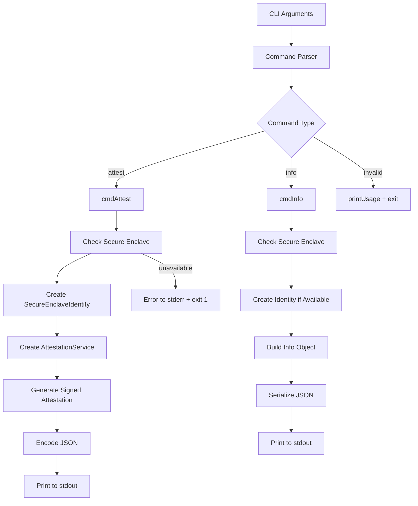

Now I have enough information to write the analysis. Let me create comprehensive documentation of this CLI component.

# EigenInferenceEnclaveCLI Component Analysis

## Overview

The EigenInferenceEnclaveCLI is a Swift-based command-line interface that provides secure hardware attestation capabilities using Apple's Secure Enclave. This CLI tool serves as the entry point for generating cryptographically signed attestation blobs that prove the hardware identity and security posture of macOS devices in the EigenInference network.

## Architecture

The component follows a **simple command-dispatch pattern** with a clean separation between command parsing, core business logic delegation, and output formatting. The architecture leverages Apple's security infrastructure through the Secure Enclave hardware module, creating ephemeral cryptographic identities for each attestation operation.

The CLI acts as a thin wrapper around the EigenInferenceEnclave library, handling user interaction and output formatting while delegating all cryptographic operations to hardware-backed services.

## Key Components

### Main Entry Point (`main.swift`)
The primary executable file containing command parsing, argument handling, and command dispatch logic. It implements a simple CLI interface with two main commands: `attest` and `info`.

### Command Handlers
- **`cmdAttest()`**: Generates hardware-signed attestation blobs with optional encryption key binding and binary hash verification
- **`cmdInfo()`**: Displays Secure Enclave availability and ephemeral public key information
- **`printUsage()`**: Provides user-facing help documentation

### Argument Parser
Manual command-line argument parsing logic that handles optional flags for the `attest` command, specifically `--encryption-key` and `--binary-hash` parameters.

### Error Handling System
Comprehensive error handling that catches Swift exceptions and formats them for stderr output with appropriate exit codes.

### JSON Output Formatter
Structured JSON output generation using Swift's JSONEncoder with consistent formatting (sorted keys, ISO8601 dates) for machine-readable results.

### WebSocket Bridge (Deprecated)
A placeholder file indicating that TLS bridge functionality was removed due to Apple's keychain security restrictions on ACME-managed certificates.

## Data Flows



## External Dependencies

### System Libraries

- **Foundation** (system): Core Swift framework providing fundamental data types, JSON serialization, and string handling. Used extensively for `CommandLine.arguments`, `JSONEncoder`, `String`, and `Data` types throughout the main execution flow.

- **CryptoKit** (system): Apple's cryptographic framework providing Secure Enclave integration and P-256 ECDSA operations. Not directly used in the CLI code but imported as a transitive dependency through EigenInferenceEnclave.

## Internal Dependencies

### EigenInferenceEnclave

The CLI heavily depends on the EigenInferenceEnclave library for all cryptographic operations:

- **SecureEnclaveIdentity**: Used to create ephemeral P-256 signing keys in hardware. Instantiated via `try SecureEnclaveIdentity()` in both command handlers for key generation.

- **AttestationService**: Handles the creation of signed attestation blobs. Initialized with a SecureEnclaveIdentity and called via `service.createAttestation()` to generate hardware-backed proofs.

- **SecureEnclave.isAvailable**: Static property check to verify Secure Enclave hardware availability before attempting cryptographic operations.

The integration follows a dependency injection pattern where the CLI creates identity objects and passes them to service objects, maintaining clear separation of concerns.

## API Surface

### Command Line Interface

**Primary Commands:**
- `eigeninference-enclave attest [--encryption-key <base64>] [--binary-hash <hex>]`: Generates a signed attestation blob with optional parameter binding
- `eigeninference-enclave info`: Shows Secure Enclave availability and current ephemeral public key

**Output Format:**
- All commands output structured JSON to stdout
- Error messages are written to stderr
- Exit codes follow Unix conventions (0 = success, 1 = error)

**Attestation Output Structure:**
```json
{
  "attestation": {
    "authenticatedRootEnabled": true,
    "binaryHash": "sha256_hex_optional",
    "chipName": "Apple M4 Max",
    "encryptionPublicKey": "base64_x25519_optional",
    "hardwareModel": "Mac15,8",
    "osVersion": "15.3.0",
    "publicKey": "base64_p256_public_key",
    "timestamp": "2024-01-01T00:00:00Z"
  },
  "signature": "base64_der_ecdsa_signature"
}
```

**Info Output Structure:**
```json
{
  "key_persistence": "ephemeral",
  "public_key": "base64_p256_public_key",
  "secure_enclave_available": true
}
```

### Security Model

The CLI implements an **ephemeral key model** where each invocation creates a fresh P-256 signing key in the Secure Enclave. No cryptographic material is persisted to disk, ensuring that attestations cannot be replayed and that each execution represents a fresh proof of hardware presence.

The tool requires macOS 13+ and Apple Silicon hardware with Secure Enclave support, failing gracefully on unsupported platforms with clear error messages.
