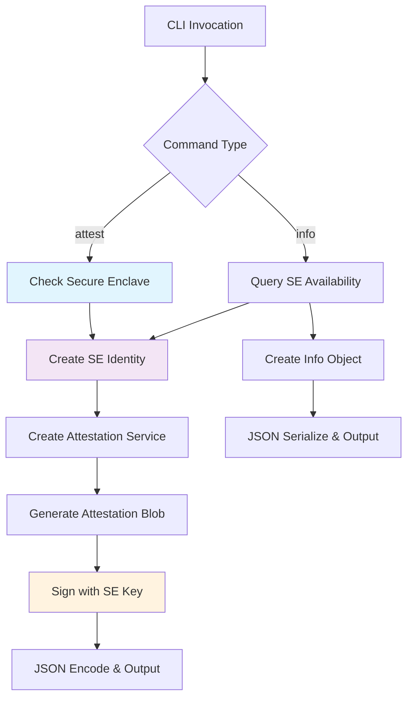

# EigenInferenceEnclaveCLI

A command-line interface for Apple Secure Enclave attestation and diagnostics, providing hardware-bound identity verification for the EigenInference provider system.

## Architecture

The EigenInferenceEnclaveCLI follows a simple command-dispatch architecture with two primary commands (`attest` and `info`). The CLI acts as a thin wrapper around the EigenInferenceEnclave library, providing a user-friendly command-line interface for generating cryptographic attestations and querying Secure Enclave availability. The architecture emphasizes security through ephemeral key generation—no cryptographic material is persisted across invocations.

## Key Components

### 1. **Main Entry Point** (`main.swift`)
The primary executable module containing argument parsing, command dispatch, and error handling. Implements a simple switch-based command router with manual argument parsing for the `attest` and `info` commands.

### 2. **Command Handlers**
- **`cmdAttest()`**: Generates signed attestation blobs using ephemeral Secure Enclave keys, optionally binding X25519 encryption keys and binary hashes
- **`cmdInfo()`**: Queries and reports Secure Enclave availability and generates ephemeral public keys for diagnostics

### 3. **Argument Parser**
Manual command-line argument parsing supporting:
- `--encryption-key <base64>`: Binds X25519 public key to attestation
- `--binary-hash <hex>`: Includes SHA-256 hash for binary integrity verification

### 4. **Error Handling System**
Comprehensive error handling with stderr output and appropriate exit codes (1 for errors, 0 for success).

### 5. **JSON Output Formatter**
Standardized JSON encoding with sorted keys and ISO 8601 date formatting for deterministic output compatible with Go coordinator systems.

### 6. **WebSocket Bridge Stub** (`WebSocketBridge.swift`)
Empty stub file indicating removed TLS bridge functionality due to Apple keychain restrictions on ACME-managed certificates.

## Data Flows



### Attestation Flow
1. **Command Parsing**: Parse `attest` command with optional `--encryption-key` and `--binary-hash` parameters
2. **Secure Enclave Check**: Verify hardware availability using `SecureEnclave.isAvailable`
3. **Identity Creation**: Generate ephemeral P-256 signing key in Secure Enclave via `SecureEnclaveIdentity()`
4. **Service Initialization**: Create `AttestationService` with the ephemeral identity
5. **Blob Generation**: Call `createAttestation()` to build signed attestation containing hardware state, public keys, and timestamps
6. **JSON Output**: Encode with sorted keys and ISO 8601 dates for coordinator compatibility

### Info Flow
1. **Availability Check**: Query `SecureEnclave.isAvailable` status
2. **Identity Generation**: Create ephemeral identity if Secure Enclave is available
3. **Info Assembly**: Build dictionary with availability status, key persistence model, and ephemeral public key
4. **JSON Output**: Pretty-print formatted JSON response

## External Dependencies

### System Libraries

- **Foundation** (Apple) [core]: Provides fundamental Swift data types (`String`, `Data`, `Date`), JSON serialization (`JSONSerialization`, `JSONEncoder`), and command-line argument access (`CommandLine.arguments`). Used throughout for basic Swift functionality.

- **CryptoKit** (Apple) [crypto]: Apple's cryptography framework providing Secure Enclave integration via `SecureEnclave.P256.Signing.PrivateKey` and hardware availability checks through `SecureEnclave.isAvailable`. Essential for all cryptographic operations including key generation, signing, and attestation.

### Internal Dependencies

- **EigenInferenceEnclave**: Uses `SecureEnclaveIdentity` class for hardware-bound P-256 key management and `AttestationService` for generating signed attestation blobs. The CLI imports these types directly and instantiates them for each command execution. Provides the core cryptographic functionality that the CLI exposes through its command interface.

## API Surface

### Command-Line Interface

**Executable Name**: `eigeninference-enclave`

**Commands**:
- `attest [--encryption-key <base64>] [--binary-hash <hex>]`: Generates signed attestation blob with optional key binding and binary integrity verification
- `info`: Reports Secure Enclave availability and ephemeral public key information

**Exit Codes**:
- `0`: Success
- `1`: Error (Secure Enclave unavailable, argument parsing failure, cryptographic error)

**Output Format**: JSON to stdout with error messages to stderr

### JSON Output Schemas

**Attestation Output** (`attest` command):
```json
{
  "attestation": {
    "authenticatedRootEnabled": boolean,
    "binaryHash": string,
    "chipName": string,
    "encryptionPublicKey": string,
    "hardwareModel": string,
    "osVersion": string,
    "publicKey": string,
    "rdmaDisabled": boolean,
    "secureBootEnabled": boolean,
    "secureEnclaveAvailable": boolean,
    "serialNumber": string,
    "sipEnabled": boolean,
    "systemVolumeHash": string,
    "timestamp": string
  },
  "signature": string
}
```

**Info Output** (`info` command):
```json
{
  "key_persistence": "ephemeral",
  "public_key": string,
  "secure_enclave_available": boolean
}
```
