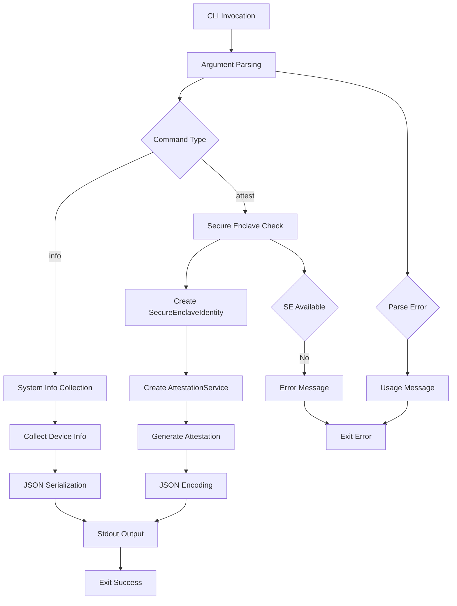

# EigenInferenceEnclaveCLI

## Architecture

The EigenInferenceEnclaveCLI is a command-line interface written in Swift that provides secure attestation and diagnostic functionality for Apple Silicon devices with Secure Enclave hardware. The component follows a simple command-dispatch architecture with two main execution paths: attestation generation and system information reporting.

The CLI serves as a thin wrapper around the EigenInferenceEnclave library, translating command-line arguments into appropriate API calls and formatting the output as JSON. The architecture is designed around ephemeral key usage - each invocation creates a fresh P-256 key in the Secure Enclave rather than persisting key material.

## Key Components

### Command Router (`main.swift`)
The main entry point provides command-line argument parsing and dispatches to appropriate handlers. It implements a simple switch-based command router that supports two primary commands: `attest` and `info`.

### Attestation Command Handler (`cmdAttest`)
Generates signed attestation blobs containing hardware and software security state. This handler validates Secure Enclave availability, creates a new ephemeral identity, and produces JSON-encoded attestation data with optional encryption key binding and binary hash verification.

### Information Command Handler (`cmdInfo`)
Provides system diagnostic information including Secure Enclave availability and public key information. This handler outputs structured JSON data about the device's security capabilities.

### Argument Parser
Manual command-line argument parsing logic that handles option flags `--encryption-key` and `--binary-hash` for the attest command. The parser follows a simple state machine pattern iterating through arguments.

### Error Handling
Centralized error handling that catches all exceptions and formats them for stderr output with appropriate exit codes. The error handling follows Unix conventions with descriptive error messages.

### JSON Output Formatting
Standardized JSON output formatting using Swift's JSONEncoder with sorted keys for deterministic output. This ensures compatibility with Go-based coordinators that expect consistent JSON structure.

## Data Flows

The primary data flow starts with command-line argument parsing, then branches based on the command type. For attestation, the flow involves Secure Enclave hardware interaction to generate cryptographic attestations. For info commands, the flow is simpler, collecting system information without cryptographic operations.

## Dependencies

### External Libraries

- **Foundation** (system) [core-swift]: Provides core Swift Foundation classes including JSON encoding/decoding, string handling, and command-line argument access. Used throughout for basic data structures and I/O operations. Imported in `main.swift`.

- **CryptoKit** (system) [crypto]: Apple's cryptographic framework providing Secure Enclave integration and P-256 ECDSA operations. Used indirectly through the EigenInferenceEnclave dependency for hardware-backed cryptographic operations. Imported in `main.swift`.

### Internal Dependencies

- **EigenInferenceEnclave**: Core library providing SecureEnclaveIdentity and AttestationService classes. The CLI creates SecureEnclaveIdentity instances for hardware-backed key generation and AttestationService instances for creating signed attestation blobs. Used in both `cmdAttest()` and `cmdInfo()` functions for all cryptographic operations.

## API Surface

### Command Line Interface

**attest** - Generates a signed attestation blob with hardware and software security state:
- `--encryption-key <base64>`: Optional X25519 public key to bind to the attestation
- `--binary-hash <hex>`: Optional SHA-256 hash of provider binary for integrity verification
- Output: JSON-encoded SignedAttestation to stdout
- Exit codes: 0 on success, 1 on error

**info** - Shows Secure Enclave availability and system information:
- No additional arguments
- Output: JSON object with secure_enclave_available, key_persistence, and optional public_key fields
- Exit codes: 0 on success, 1 on error

### Error Handling

All errors are written to stderr in the format `error: <description>` followed by exit code 1. Usage information is displayed for invalid command invocations. The CLI validates Secure Enclave availability before attempting attestation operations.
