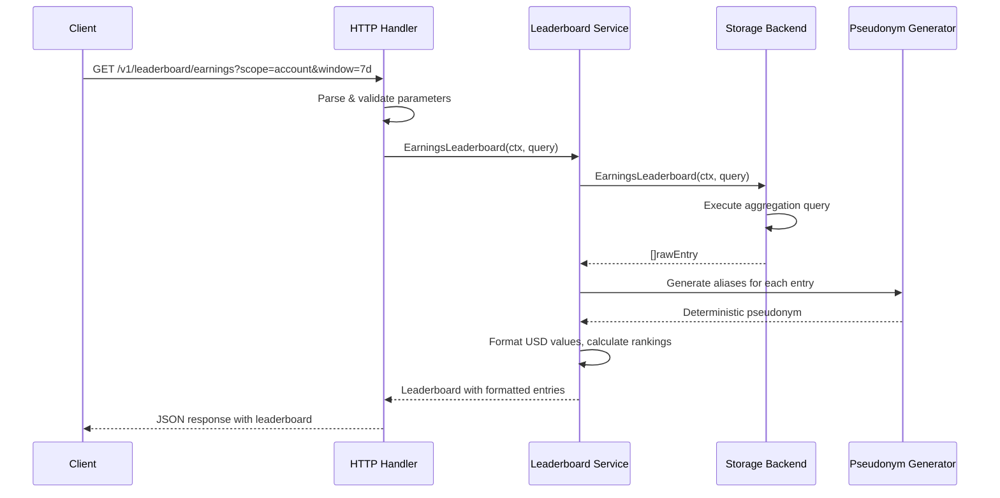
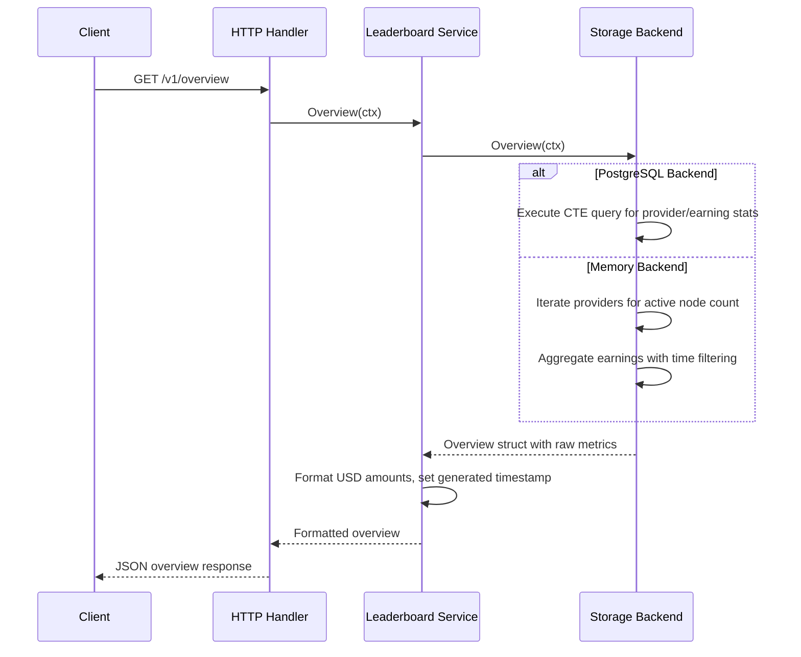
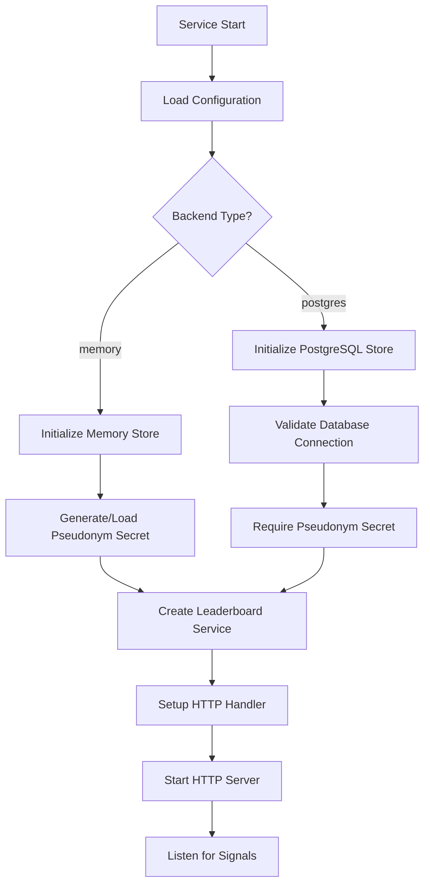

# Analytics Service Analysis

## Overview

The analytics service is a standalone, read-only HTTP service that provides public analytics data for the d-inference network. It serves as a dedicated analytics backend, separate from the main coordinator, offering leaderboards and network overview statistics with pseudonymous privacy protection.

## Architecture

The analytics service follows a **layered architecture** pattern with clear separation of concerns:

- **HTTP API Layer**: REST endpoints with CORS support and input validation
- **Service Layer**: Business logic for data aggregation and transformation
- **Storage Layer**: Abstracted storage interface supporting memory and PostgreSQL backends
- **Pseudonym Layer**: Privacy-preserving alias generation using HMAC-based deterministic pseudonyms

The service is designed to be deployment-flexible, supporting both development (in-memory) and production (PostgreSQL) modes.

## Key Components

### 1. Main Application (`cmd/analytics/main.go`)
- **Purpose**: Entry point with service initialization and graceful shutdown
- **Key Features**: 
  - Configurable backend selection (memory/postgres)
  - Signal-based graceful shutdown with 10-second timeout
  - HTTP server with comprehensive timeouts and security headers
- **Integration**: Coordinates all internal modules and manages application lifecycle

### 2. Configuration Management (`internal/config/config.go`)
- **Purpose**: Environment-based configuration with validation and defaults
- **Key Features**:
  - Environment variable parsing with sensible defaults
  - Backend-specific validation (PostgreSQL requires database URL and secret)
  - Automatic random secret generation for memory mode
  - Active node window configuration for determining "online" status
- **Configuration Options**: Address, backend type, database URL, CORS origin, pseudonym secret, active node window

### 3. HTTP API Server (`internal/httpapi/server.go`)
- **Purpose**: RESTful API with JSON responses and comprehensive error handling
- **Endpoints**:
  - `GET /healthz`: Health check with backend status
  - `GET /v1/overview`: Network statistics and earnings overview
  - `GET /v1/leaderboard/earnings`: Configurable earnings leaderboard
- **Features**: CORS middleware, query parameter validation, context timeouts, structured error responses

### 4. Leaderboard Service (`internal/leaderboard/store.go`)
- **Purpose**: Core analytics business logic with dual storage backends
- **Key Features**:
  - Account vs node-level aggregation scopes
  - Time window filtering (24h, 7d, 30d, all-time)
  - Earnings ranking with tie-breaking logic
  - USD formatting and human-readable time displays
  - Mock data generation for development mode
- **Data Models**: Overview stats, leaderboard entries with earnings/token metrics

### 5. Memory Store Implementation
- **Purpose**: Development backend with realistic mock data
- **Key Features**:
  - Pre-populated provider snapshots and earnings events
  - Active node calculation based on configurable time windows
  - In-memory aggregation with proper sorting and ranking
  - Clock injection for deterministic testing

### 6. PostgreSQL Store Implementation
- **Purpose**: Production backend with efficient SQL queries
- **Key Features**:
  - Connection pooling with pgx/v5
  - Dynamic SQL generation based on query parameters
  - Optimized aggregation queries with CTEs
  - Proper error handling and connection management

### 7. Pseudonym Generator (`internal/pseudonym/alias.go`)
- **Purpose**: Privacy-preserving deterministic alias generation
- **Key Features**:
  - HMAC-SHA256 based deterministic pseudonyms
  - Kind-prefixed hashing (account vs node separation)
  - Human-readable format: "Adjective Animal Number" (e.g., "Golden Fox 423")
  - Secret-backed to prevent reverse mapping without key
- **Privacy**: Same stable ID always produces same alias, but no reverse lookup possible

### 8. Test Coverage
- **HTTP API Tests**: Endpoint behavior, error handling, CORS validation
- **Pseudonym Tests**: Deterministic behavior, kind separation
- **Service Integration**: Mock-based testing with clock injection

## Data Flows

### 1. Leaderboard Request Flow

### 2. Overview Statistics Flow

### 3. Backend Selection and Initialization Flow

## External Dependencies

### External Libraries

- **github.com/jackc/pgx/v5** (v5.8.0) [database]: High-performance PostgreSQL driver and connection pooling. Used exclusively for PostgreSQL backend operations including connection management, query execution, and result scanning. Integrated in `internal/leaderboard/store.go` PostgresStore implementation.

- **github.com/jackc/pgpassfile** (v1.0.0) [database]: PostgreSQL password file parsing support, indirect dependency of pgx/v5. Used for connection authentication when reading from `.pgpass` files.

- **github.com/jackc/pgservicefile** (v0.0.0-20240606120523-5a60cdf6a761) [database]: PostgreSQL service file parsing support, indirect dependency of pgx/v5. Used for connection parameter resolution from service files.

- **github.com/jackc/puddle/v2** (v2.2.2) [database]: Connection pool implementation used internally by pgx/v5. Provides resource pooling and lifecycle management for database connections.

- **golang.org/x/sync** (v0.20.0) [concurrency]: Extended synchronization primitives, indirect dependency. Provides advanced concurrency patterns used by the PostgreSQL driver.

- **golang.org/x/text** (v0.35.0) [internationalization]: Text processing and Unicode support, indirect dependency of pgx/v5. Used for character encoding and text normalization in database operations.

Development/Testing Dependencies:
- **github.com/stretchr/testify** (v1.11.1) [testing]: Testing framework with assertions and test utilities. Used throughout test files for HTTP endpoint testing and mock verification.

## Internal Dependencies

The analytics service is designed as a standalone component with no internal dependencies from the d-inference codebase. This isolation is intentional to allow the analytics service to:
- Evolve independently without affecting coordinator functionality
- Scale separately from the main inference infrastructure
- Maintain its own release cycle and deployment strategy
- Connect to the same PostgreSQL database as the coordinator but through read-only access

## API Surface

### Public HTTP Endpoints

**Health Check**
- `GET /healthz`: Returns service health status with backend connectivity check
- Response: JSON with status, backend type, and timestamp

**Network Overview**
- `GET /v1/overview`: Comprehensive network statistics
- Response: Registered nodes, active nodes, linked accounts, trust levels, total/24h earnings, job counts

**Earnings Leaderboard**
- `GET /v1/leaderboard/earnings`: Configurable earnings rankings
- Query Parameters:
  - `scope`: `account` (default) or `node` - aggregation level
  - `window`: `24h`, `7d` (default), `30d`, or `all` - time period
  - `limit`: 1-100 (default 25) - maximum entries returned
- Response: Ranked entries with earnings, tokens, models served, pseudonymous aliases

### CORS Configuration
- Configurable `Access-Control-Allow-Origin` header
- Supports `GET` and `OPTIONS` methods
- Allows `Content-Type` header

## External Systems

### Database Integration
- **PostgreSQL**: Production data store accessing `providers` and `provider_earnings` tables
- **Connection Details**: Uses read-only database user with `SELECT`-only privileges
- **Query Patterns**: Complex CTEs for efficient aggregation, parameterized queries for security
- **Connection Management**: pgxpool for connection pooling with automatic reconnection

### Configuration Sources
- **Environment Variables**: All configuration through standard environment variables
- **Secrets Management**: External pseudonym secret required for production PostgreSQL mode
- **Runtime Detection**: Backend selection determines data source and operational mode

## Component Interactions

The analytics service operates as an isolated read-only component with the following interaction patterns:

### Database Sharing Pattern
- Shares PostgreSQL database with coordinator but through separate read-only credentials
- Accesses same `providers` and `provider_earnings` tables but cannot modify data
- Designed to avoid impacting coordinator performance through read-only queries

### Deployment Isolation
- Runs as independent HTTP service on configurable port (default :8090)
- Can be deployed separately from coordinator with different scaling characteristics
- Memory backend allows development/testing without database dependencies

### Future Integration Points
- Designed to serve public-facing dashboards and UIs
- JSON API suitable for frontend consumption with CORS support
- Pseudonymous data safe for public exposure without privacy concerns
