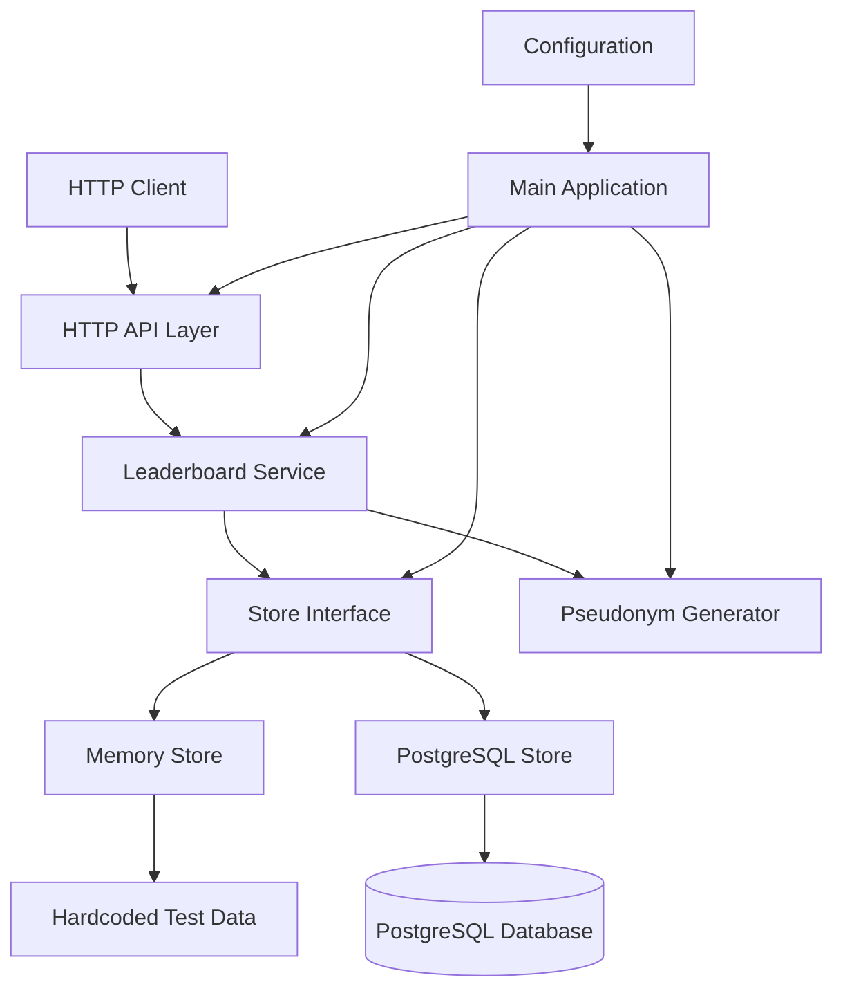

# Analytics Service Component

## Overview

The analytics service is a Go-based HTTP service that provides earnings leaderboards and node statistics for a distributed inference network. It tracks provider nodes, earnings data, and account linking to generate both overview statistics and detailed leaderboards for accounts and individual nodes. The service supports both memory-based and PostgreSQL-backed storage, with built-in pseudonym generation for privacy protection.

## Architecture

The component follows a clean layered architecture with clear separation between HTTP handling, business logic, and data storage:

- **HTTP Layer**: REST API endpoints with CORS support
- **Service Layer**: Business logic for data aggregation and formatting  
- **Store Layer**: Pluggable storage backends (memory/PostgreSQL)
- **Pseudonym Layer**: Privacy-preserving alias generation

The architecture implements the interface segregation principle with well-defined interfaces between layers, enabling easy testing and backend switching.

## Key Components

### Main Application (`main.go`)
The entry point orchestrates service initialization, dependency injection, and graceful shutdown handling. It configures logging, loads configuration from environment variables, initializes the pseudonym generator, builds the appropriate store backend, and sets up the HTTP server with proper timeouts.

### Configuration Management (`config/config.go`)
Handles environment-based configuration with validation for different deployment scenarios. Supports both memory and PostgreSQL backends with appropriate secret management - generating random secrets for memory backend while requiring explicit secrets for PostgreSQL to maintain consistency across restarts.

### HTTP API Server (`httpapi/server.go`)
Implements a REST API with three main endpoints: health checks (`/healthz`), overview statistics (`/v1/overview`), and earnings leaderboards (`/v1/leaderboard/earnings`). Includes comprehensive request validation, error handling, and CORS support with configurable origins.

### Leaderboard Service (`leaderboard/store.go`)
Contains the core business logic with a Service struct that coordinates between storage and pseudonym generation. Handles data aggregation, ranking calculations, and formatting of monetary values and relative timestamps for the API responses.

### Storage Layer (`leaderboard/store.go`)
Implements both in-memory and PostgreSQL storage backends behind a common Store interface. The memory store includes hardcoded test data for development, while PostgreSQL implementation uses connection pooling and complex aggregation queries.

### Pseudonym Generator (`pseudonym/alias.go`)
Creates privacy-preserving aliases using HMAC-SHA256 with a secret key. Generates deterministic but unpredictable aliases in the format "Adjective Animal Number" (e.g., "Golden Eagle 542") for consistent identification without exposing real identifiers.

## Data Flows

### Request Processing Flow
1. HTTP request received by API handler
2. Request parameters validated and parsed
3. Service layer called with structured query
4. Store backend queried for raw data
5. Results processed and aliased for privacy
6. Formatted response returned as JSON

### Data Aggregation Flow
1. Raw earning events stored by scope (account/node)
2. Time window filtering applied based on query
3. Metrics aggregated: earnings, jobs, tokens, models
4. Results sorted by earnings, then activity, then ID
5. Pagination applied with configurable limits

## External Dependencies

### Runtime Dependencies

- **github.com/jackc/pgx/v5** (v5.8.0) [database]: PostgreSQL driver providing connection pooling and prepared statements. Used in `PostgresStore` for all database operations including health checks, overview queries, and leaderboard aggregation. Imports: `internal/leaderboard/store.go`.

### Transitive Dependencies

- **github.com/jackc/pgpassfile** (v1.0.0) [database]: PostgreSQL password file support for pgx driver authentication.

- **github.com/jackc/pgservicefile** (v0.0.0-20240606120523-5a60cdf6a761) [database]: PostgreSQL service file support for pgx connection configuration.

- **github.com/jackc/puddle/v2** (v2.2.2) [database]: Connection pool implementation used by pgx for managing PostgreSQL connections.

- **golang.org/x/sync** (v0.20.0) [concurrency]: Extended synchronization primitives used by connection pooling and concurrent operations.

- **golang.org/x/text** (v0.35.0) [text-processing]: Unicode and text processing utilities used for database text handling and encoding.

## Internal Dependencies

The analytics component is self-contained with no internal dependencies from other components in the codebase. It operates as a standalone service that exposes HTTP endpoints for external consumption.

## API Surface

### REST Endpoints

**GET /healthz**
- Returns service health status with backend type
- Includes database connectivity check for PostgreSQL
- Response: `{"status": "ok|degraded", "backend": "memory|postgres", "checked_at": "2026-04-15T12:00:00Z"}`

**GET /v1/overview** 
- Provides network-wide statistics summary
- Metrics include registered/active nodes, earnings, jobs
- Response includes node counts by trust level and verification status

**GET /v1/leaderboard/earnings**
- Returns paginated earnings leaderboard
- Query parameters: `scope` (account|node), `window` (24h|7d|30d|all), `limit` (1-100)
- Entries include rankings, pseudonymized aliases, earnings, token counts

### Configuration Interface

Environment variables for service configuration:
- `ANALYTICS_ADDR`: Server bind address (default ":8090")
- `ANALYTICS_BACKEND`: Storage backend "memory|postgres" 
- `ANALYTICS_DATABASE_URL`: PostgreSQL connection string (required for postgres)
- `ANALYTICS_PSEUDONYM_SECRET`: Secret for alias generation
- `ANALYTICS_ALLOW_ORIGIN`: CORS origin header (default "*")
- `ANALYTICS_ACTIVE_NODE_WINDOW`: Time window for active node detection

## External Systems

### PostgreSQL Database
The service connects to PostgreSQL when configured with `ANALYTICS_BACKEND=postgres`. Expected schema includes `providers` table for node metadata and `provider_earnings` table for earnings events. Uses connection pooling for performance and includes health monitoring.

### CORS Integration  
Configurable CORS headers enable browser-based frontend integration. Supports pre-flight OPTIONS requests and configurable allowed origins for cross-domain API access.

## Component Interactions

The analytics service operates independently without direct integration with other components in the d-inference system. It serves as a data aggregation and reporting service that other components or external systems can query via HTTP API. The service expects data to be populated in its storage backend by external ETL processes or direct database writes.
