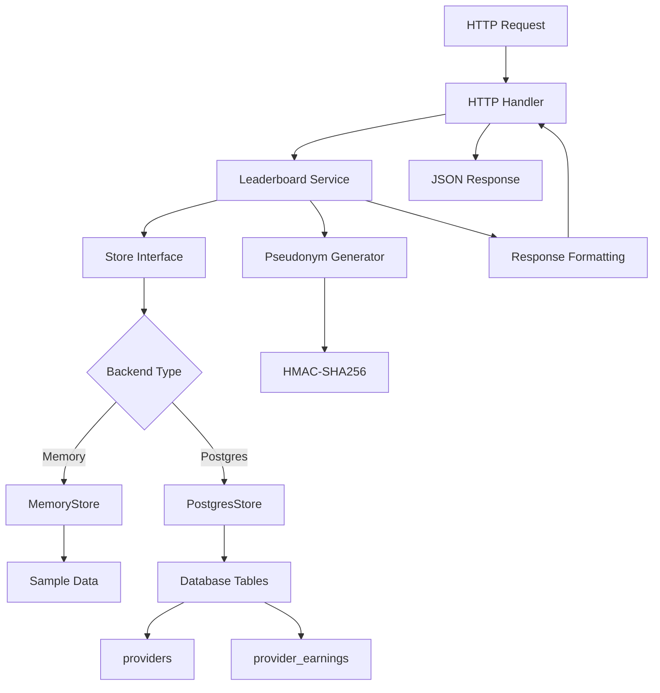

Now I have enough information to write a comprehensive analysis. Let me create the analysis document:

# Analytics Service Analysis

## Architecture

The analytics service implements a **layered architecture** with clean separation between HTTP API, business logic, and data storage layers. It follows a **hexagonal architecture** pattern where the core business logic (leaderboard service) is decoupled from external concerns through well-defined interfaces (Store, Aliaser).

The service is designed as a **read-only analytics API** that aggregates data from provider earnings and node statistics to generate public-facing leaderboards and overview metrics. It supports dual backend modes: an in-memory store for development and a PostgreSQL store for production use.

## Key Components

### Main Application (`cmd/analytics/main.go`)
The entry point orchestrates service initialization with graceful shutdown handling. It builds the appropriate storage backend based on configuration, initializes the pseudonym generator, and sets up HTTP server with proper timeouts.

### Configuration Management (`internal/config/config.go`)
Handles environment-based configuration with validation. Supports two backend modes (memory/postgres) with different validation requirements. Generates random secrets for development mode.

### HTTP API Server (`internal/httpapi/server.go`)
Implements a minimal REST API with three endpoints: health check (`/healthz`), network overview (`/v1/overview`), and earnings leaderboard (`/v1/leaderboard/earnings`). Includes CORS support and structured error handling.

### Leaderboard Service (`internal/leaderboard/store.go`)
Core business logic that aggregates earnings data by account or node scope across different time windows. Implements ranking algorithms with tie-breaking rules and currency formatting.

### Data Storage Layer (`internal/leaderboard/store.go`)
Dual implementation strategy with `MemoryStore` for development (contains hardcoded sample data) and `PostgresStore` for production. Both implement the same `Store` interface.

### Pseudonym Generator (`internal/pseudonym/alias.go`)
Cryptographically secure alias generation using HMAC-SHA256. Creates deterministic but privacy-preserving aliases in the format "Adjective Animal Number" (e.g., "Golden Fox 423").

## Data Flows



### Request Processing Flow
1. **HTTP Request** arrives at one of three endpoints
2. **Handler** validates query parameters and sets request timeout
3. **Service Layer** normalizes query and calls appropriate store method
4. **Store** aggregates data from memory or database
5. **Pseudonym Generator** creates privacy-preserving aliases
6. **Response Formatter** converts micro-USD to readable format
7. **JSON Response** returned with CORS headers

### Data Aggregation Flow
1. **Raw Events** from provider_earnings table or memory
2. **Time Filtering** based on window parameter (24h, 7d, 30d, all)
3. **Scope Grouping** by account ID or node ID
4. **Metric Calculation** (earnings, jobs, tokens, models)
5. **Ranking** by earnings with tie-breaking
6. **Alias Generation** for privacy protection

## External Dependencies

### External Libraries

- **github.com/jackc/pgx/v5** (v5.8.0) [database]: PostgreSQL driver and connection pooling. Provides high-performance database access with context support. Used in `PostgresStore` implementation at `internal/leaderboard/store.go:477-657`. Includes connection pooling via `pgxpool.Pool`.

- **github.com/jackc/pgpassfile** (v1.0.0) [database]: PostgreSQL password file support, transitively required by pgx. Handles `.pgpass` file parsing for authentication.

- **github.com/jackc/pgservicefile** (v0.0.0-20240606120523-5a60cdf6a761) [database]: PostgreSQL service file support, transitively required by pgx. Handles connection service definitions.

- **github.com/jackc/puddle/v2** (v2.2.2) [database]: Generic resource pool used by pgx for connection pooling. Provides concurrent-safe resource management.

- **golang.org/x/sync** (v0.20.0) [async-runtime]: Extended synchronization primitives beyond the standard library. Used by pgx for advanced concurrency patterns.

- **golang.org/x/text** (v0.35.0) [encoding]: Unicode and text processing support. Required by pgx for proper text encoding/decoding with PostgreSQL.

All external dependencies are database-related, supporting the PostgreSQL backend implementation. The service uses only Go standard library packages for HTTP, JSON, cryptography, and logging functionality.

### Internal Dependencies

The analytics service is self-contained with no direct dependencies on other components in the d-inference system. It operates as a standalone read-only service that reads from shared database tables but does not make HTTP calls to other services.

## API Surface

### HTTP Endpoints

- **GET /healthz**: Health check endpoint returning service status and backend type
- **GET /v1/overview**: Network statistics including node counts, total earnings, and 24h metrics
- **GET /v1/leaderboard/earnings**: Paginated earnings leaderboard with query parameters:
  - `scope`: `account` (default) or `node` 
  - `window`: `24h`, `7d` (default), `30d`, or `all`
  - `limit`: 1-100 entries (default 25)

### Response Formats

All responses are JSON with consistent error format:
```json
{
  "error": {
    "code": "bad_request",
    "message": "detailed error message"
  }
}
```

Leaderboard entries include privacy-preserving aliases, earnings in both micro-USD and formatted USD, job counts, token statistics, and relative timestamps.

## External Systems

### Database Integration
- **PostgreSQL**: Primary data store for production deployment
  - Reads from `providers` table for node registration and activity data
  - Reads from `provider_earnings` table for financial metrics
  - Uses read-only database user with SELECT-only permissions
  - Connection pooling via pgx/v5 with proper context handling

### Development Mode
- **In-Memory Store**: Contains hardcoded sample data for development
  - 5 sample providers with varying trust levels and activity
  - 8 sample earnings events across different time periods
  - No external dependencies in memory mode

## Component Interactions

The analytics service operates independently without direct communication to other d-inference components. It functions as a **data consumer** that reads from shared database tables populated by other services (likely the coordinator). This loose coupling design allows the analytics service to evolve independently and provides fault isolation.

The service is designed to be deployed "beside the coordinator, not inside it" as noted in the README, indicating it runs as a separate process/container in the system architecture.
