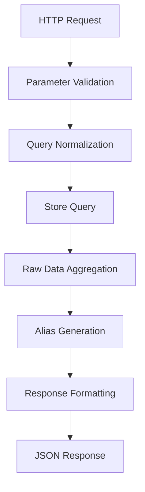
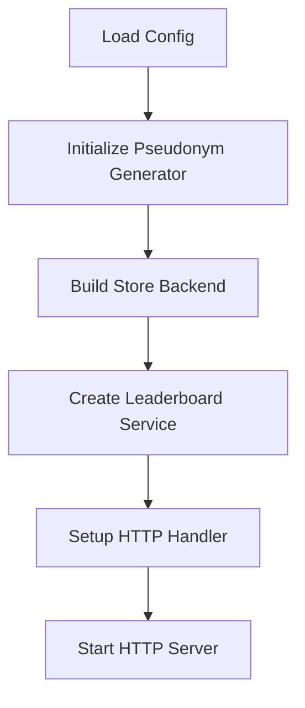

# Analytics Service Analysis

## Architecture

The analytics service implements a **layered architecture** with clear separation of concerns between HTTP API layer, business logic service layer, and data persistence layer. The service follows a dependency injection pattern where the main function orchestrates component construction and wiring. It supports two backend storage modes: in-memory for development and PostgreSQL for production, abstracted through a common Store interface.

The service employs a **read-only analytics pattern**, designed to sit alongside the coordinator rather than within it, providing public dashboards and leaderboards without impacting core system performance. Privacy is handled through a cryptographic pseudonym system that generates deterministic but anonymous aliases for accounts and nodes.

## Key Components

### HTTP API Handler (`internal/httpapi/server.go`)
The HTTP layer provides a RESTful API with three main endpoints: health checks, network overview, and earnings leaderboards. It implements comprehensive CORS support, structured error handling, and request timeouts. Query parameters are validated and normalized with sensible defaults.

### Leaderboard Service (`internal/leaderboard/store.go`)
The core business logic layer that orchestrates data retrieval and transformation. It aggregates raw earnings data by account or node scope, applies time window filtering, formats monetary values, and generates human-readable relative timestamps. The service layer abstracts away storage backend differences.

### Dual Storage Backends (`internal/leaderboard/store.go`)
**MemoryStore**: Provides in-memory mock data for development with realistic sample earnings and provider information. Implements full query logic including aggregation, sorting, and windowing.
**PostgresStore**: Production backend that executes optimized SQL queries against `providers` and `provider_earnings` tables using connection pooling via pgx/v5.

### Pseudonym Generator (`internal/pseudonym/alias.go`)
Implements HMAC-SHA256 based deterministic alias generation. Maps account/node IDs to human-friendly names like "Swift Wolf 456" using predefined adjective and animal word lists. Ensures privacy while maintaining consistency across requests.

### Configuration System (`internal/config/config.go`)
Environment-based configuration with validation and backend-specific requirements. Supports development and production modes with appropriate defaults. Generates secure random pseudonym secrets for development mode.

## Data Flows

### Leaderboard Request Flow

### Service Initialization Flow

## External Dependencies

### Core Libraries

- **github.com/jackc/pgx/v5** (v5.8.0) [database]: PostgreSQL driver and connection pooling library. Provides the primary database connectivity for production mode. Used in `internal/leaderboard/store.go` for executing SQL queries and managing connection pools via `pgxpool.Pool`.

- **github.com/jackc/pgpassfile** (v1.0.0) [database]: PostgreSQL password file support, indirect dependency of pgx for authentication. Enables secure credential management without embedding passwords in connection strings.

- **github.com/jackc/pgservicefile** (v0.0.0-20240606120523-5a60cdf6a761) [database]: PostgreSQL service file support, indirect dependency for service-based connection configuration.

- **github.com/jackc/puddle/v2** (v2.2.2) [database]: Generic resource pool implementation used by pgx for connection pooling. Provides efficient connection lifecycle management.

- **golang.org/x/sync** (v0.20.0) [async-runtime]: Extended synchronization primitives beyond the standard library. Used indirectly by pgx for concurrent connection management.

- **golang.org/x/text** (v0.35.0) [text-processing]: Unicode and text processing utilities. Used indirectly by pgx for character encoding support in database operations.

### Development and Testing

- **github.com/stretchr/testify** (v1.11.1) [testing]: Assertion library for unit tests. Provides structured test helpers used in `internal/httpapi/server_test.go` and `internal/leaderboard/store_test.go`.

- **github.com/davecgh/go-spew** (v1.1.1) [testing]: Deep pretty-printing for Go data structures, indirect dependency of testify for detailed test failure reporting.

- **github.com/pmezard/go-difflib** (v1.0.0) [testing]: Diff algorithms for testify assertion failures, provides clear difference visualization in test output.

All dependencies use Go's standard `net/http` package for HTTP server functionality and `encoding/json` for response serialization. The service leverages Go 1.25 structured logging via `log/slog` for observability.

## Internal Dependencies

The analytics service operates as a standalone module with no internal dependencies on other components in the d-inference codebase. It reads from shared database tables (`providers`, `provider_earnings`) but does not import or call other internal services or libraries. This isolation allows the analytics service to evolve independently and reduces coupling with the coordinator system.

## API Surface

### REST Endpoints

- **GET /healthz**: Health check endpoint that verifies backend connectivity and returns service status with timestamp. Returns HTTP 503 if backend ping fails.

- **GET /v1/overview**: Network statistics overview including node counts by trust level, total earnings, 24-hour activity metrics, and MDA verification status. No query parameters required.

- **GET /v1/leaderboard/earnings**: Paginated earnings leaderboard with filtering support.
  - `scope`: `account` (default) or `node` - aggregation level
  - `window`: `24h`, `7d` (default), `30d`, `all` - time window
  - `limit`: 1-100 entries (default 25)

### Response Formats

All endpoints return JSON with consistent error structures. Monetary values are provided in both micro-USD integers and formatted USD strings. Timestamps use RFC 3339 format. The leaderboard includes ranking, pseudonymous aliases, earnings, job counts, token statistics, and relative activity timestamps.

### CORS Support

Configurable CORS headers with `Access-Control-Allow-Origin`, supporting both development (`*`) and production (specific domains) modes. Handles OPTIONS preflight requests appropriately.

## External Systems

### PostgreSQL Database
Production backend connects to PostgreSQL database for persistent analytics data. Queries two main tables:
- `providers`: Node registration and trust level information
- `provider_earnings`: Historical earning events with token counts and model information

Uses read-only database user with restricted permissions for security. Connection pooling and prepared statements optimize performance.

### Development Mock Data
Memory backend includes realistic sample data for development and testing, eliminating external database dependencies during development cycles.

## Component Interactions

The analytics service operates independently without making HTTP calls or RPC connections to other services in the d-inference system. It functions as a read-only consumer of database state populated by other system components (primarily the coordinator). This design ensures analytics queries do not impact core inference system performance.
