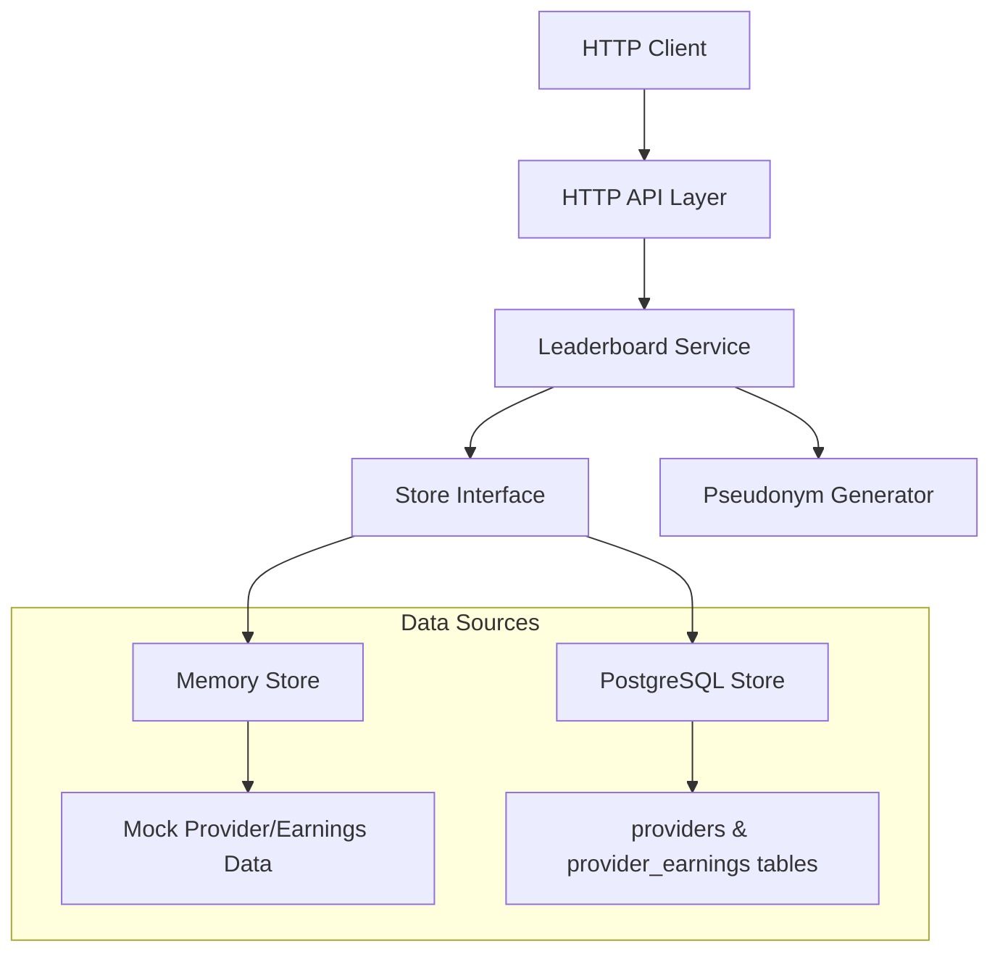
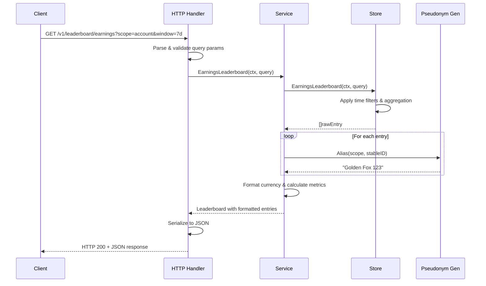
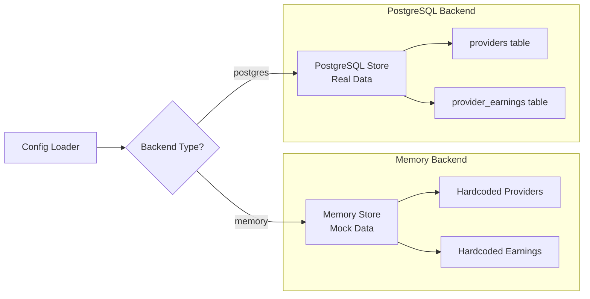

# Analytics Service Component Analysis

The analytics service is a standalone read-only HTTP API service that provides public analytics data for the EigenInference distributed AI inference network. It serves network overview statistics and earnings leaderboards with pseudonymized user/node identities.

## Architecture

The analytics service follows a **layered architecture pattern** with clean separation between HTTP handling, business logic, and data persistence. The architecture consists of:

- **HTTP API Layer**: Handles HTTP requests and responses with CORS support
- **Service Layer**: Contains business logic for data aggregation and formatting
- **Store Layer**: Provides data access abstraction with pluggable backends
- **Pseudonym Layer**: Generates deterministic aliases for anonymization

## Key Components

### 1. Main Application (`cmd/analytics/main.go`)
The application entry point that orchestrates service initialization, configuration loading, and graceful shutdown. Sets up HTTP server with timeouts and signal handling for clean shutdown.

### 2. HTTP API Handler (`internal/httpapi/server.go`)
Implements the REST API with three endpoints:
- `GET /healthz` - Health check with backend status
- `GET /v1/overview` - Network statistics overview
- `GET /v1/leaderboard/earnings` - Earnings leaderboard with filtering

### 3. Leaderboard Service (`internal/leaderboard/store.go`)
Core business logic service that:
- Aggregates earnings data by account or node
- Applies time window filtering (24h, 7d, 30d, all)
- Formats currency values and generates rankings
- Integrates with pseudonym generator for privacy

### 4. Data Store Interface (`internal/leaderboard/store.go`)
Dual-backend storage abstraction supporting:
- **Memory Store**: In-memory mock data for development/testing
- **PostgreSQL Store**: Production database backend with connection pooling

### 5. Pseudonym Generator (`internal/pseudonym/alias.go`)
Cryptographic alias generator using HMAC-SHA256 to create deterministic pseudonyms in the format "Adjective Animal Number" (e.g., "Golden Fox 123").

### 6. Configuration Manager (`internal/config/config.go`)
Environment-based configuration with validation for different deployment modes (memory vs PostgreSQL).

## Data Flows

### Request Processing Flow

### Dual Backend Architecture

## External Dependencies

### External Libraries

- **github.com/jackc/pgx/v5** (v5.8.0) [database]: PostgreSQL driver and connection pool library. Primary database client for production mode. Used in `PostgresStore` for connecting to and querying PostgreSQL databases. Imported in: `internal/leaderboard/store.go`.

- **github.com/jackc/pgpassfile** (v1.0.0) [database]: PostgreSQL password file parsing support. Transitive dependency of pgx for credential management. Automatically used by pgx driver.

- **github.com/jackc/pgservicefile** (v0.0.0-20240606120523-5a60cdf6a761) [database]: PostgreSQL service file support. Transitive dependency for connection configuration. Automatically used by pgx driver.

- **github.com/jackc/puddle/v2** (v2.2.2) [database]: Generic connection pool implementation. Used internally by pgx for PostgreSQL connection pooling. Provides concurrent-safe connection management.

- **golang.org/x/sync** (v0.20.0) [concurrency]: Extended Go synchronization primitives. Transitive dependency used by connection pooling and concurrent operations in pgx.

- **golang.org/x/text** (v0.35.0) [text-processing]: Unicode and text processing utilities. Transitive dependency for text handling in database operations and Go standard library extensions.

The service primarily uses Go's standard library for HTTP handling (`net/http`), logging (`log/slog`), JSON serialization (`encoding/json`), and cryptographic operations (`crypto/hmac`, `crypto/sha256`). The only direct external dependency is the PostgreSQL driver for production database connectivity.

## Internal Dependencies

This component has a direct dependency on the `analytics` module itself, which appears to be a self-reference in the go.mod file. The component is structured as a standalone service without dependencies on other components in the codebase, making it completely autonomous.

## API Surface

The analytics service exposes three HTTP endpoints:

### Health Check Endpoint
- **Path**: `GET /healthz`
- **Purpose**: Service health monitoring with backend connectivity status
- **Response**: JSON with status, backend type, and timestamp

### Network Overview Endpoint
- **Path**: `GET /v1/overview`
- **Purpose**: Aggregate network statistics
- **Response**: JSON with registered/active nodes, linked accounts, total earnings, and 24h metrics

### Earnings Leaderboard Endpoint
- **Path**: `GET /v1/leaderboard/earnings`
- **Parameters**:
  - `scope`: `account` (default) or `node` - aggregation level
  - `window`: `24h`, `7d` (default), `30d`, or `all` - time filter
  - `limit`: 1-100 (default 25) - result count limit
- **Purpose**: Ranked earnings data with pseudonymized identities
- **Response**: JSON with leaderboard entries including earnings, job counts, token usage, and activity timestamps

All endpoints support CORS headers configurable via `ANALYTICS_ALLOW_ORIGIN` environment variable.

## External Systems

### PostgreSQL Database
The service connects to PostgreSQL in production mode, reading from two tables:
- **providers**: Node registration and status information
- **provider_earnings**: Individual earning events with token usage and timestamps

The service uses a dedicated read-only database user with `SELECT` privileges only, ensuring data security and preventing accidental writes.

### Configuration Sources
The service reads configuration from environment variables:
- Database connection strings
- Server binding address and CORS settings  
- Backend selection (memory vs PostgreSQL)
- Pseudonym secret for deterministic alias generation
- Active node time window threshold

## Component Interactions

The analytics service operates as a completely standalone component with no direct interactions with other services in the codebase. It functions as a read-only analytics API that:

- **Reads from**: PostgreSQL database (in production) or uses mock data (in development)
- **Serves to**: External clients via HTTP API (web frontends, monitoring tools, public API consumers)
- **Isolation**: Deliberately isolated from the main coordinator service to prevent analytics queries from impacting inference performance

This isolation allows the analytics service to be deployed, scaled, and maintained independently of the core inference infrastructure.
