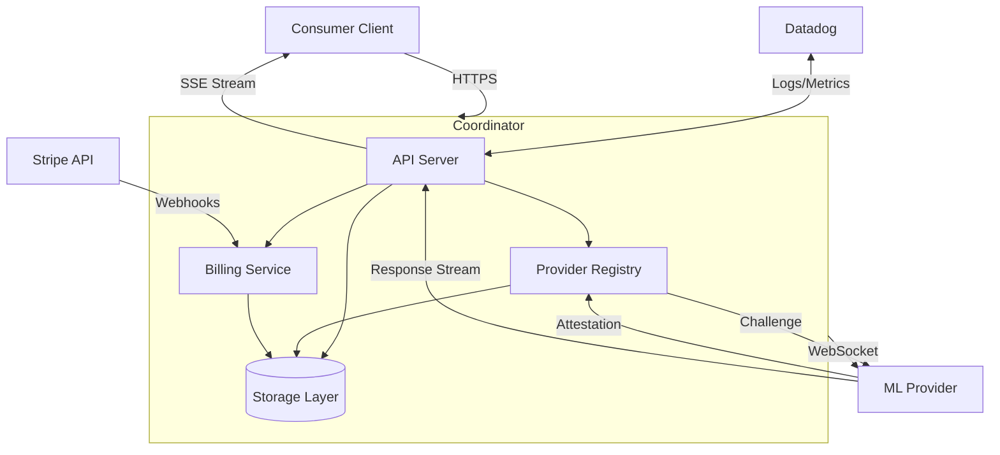

Based on my comprehensive exploration of the coordinator component, I can now provide a detailed analysis.

# Coordinator Component Analysis

## Architecture

The coordinator is the central control plane of the Darkbloom distributed inference network, implementing a hub-and-spoke architecture where it acts as a trusted intermediary between consumers and providers. It runs in a GCP Confidential VM (AMD SEV-SNP) with hardware-encrypted memory to maintain trust while routing inference requests. The architecture follows a layered pattern with clear separation between API routing, business logic, and data persistence.

## Key Components

### 1. **HTTP Server (`internal/api/server.go`)**
The main server orchestrates all HTTP endpoints and WebSocket connections. It provides OpenAI-compatible inference APIs, billing endpoints, admin interfaces, and provider WebSocket management. The server implements comprehensive middleware for authentication, rate limiting, CORS, and request logging.

### 2. **Provider Registry (`internal/registry/registry.go`)**
Manages the fleet of connected ML inference providers with their capabilities, trust levels, and operational state. It handles provider discovery, attestation verification, and intelligent request routing using round-robin among idle providers. Trust levels range from "none" (no attestation) to "hardware" (Apple-verified Secure Enclave).

### 3. **Consumer API Handlers (`internal/api/consumer.go`)**
Implements OpenAI-compatible endpoints (`/v1/chat/completions`, `/v1/completions`) with streaming support. Handles request routing to appropriate providers, real-time response streaming via Server-Sent Events, and provider failover with retry logic (up to 3 attempts).

### 4. **Billing Service (`internal/billing/billing.go`)**
Unified payment processing supporting Stripe Checkout for deposits and Stripe Connect Express for provider payouts. Implements a referral system where referrers earn 20% of platform fees. All amounts are tracked in micro-USD (1 USD = 1,000,000 micro-USD).

### 5. **Storage Layer (`internal/store/interface.go`)**
Defines comprehensive storage interface supporting both PostgreSQL (production) and in-memory (development) backends. Manages API keys, usage tracking, balance ledgers, provider records, billing sessions, and telemetry events. PostgreSQL provides ACID guarantees for financial operations.

### 6. **Attestation System (`internal/attestation/`)**
Verifies provider security through Apple Secure Enclave challenge-response protocols. Validates MDA (Mobile Device Attestation) certificate chains and implements periodic challenges every 5 minutes to ensure provider liveness and security posture.

### 7. **Protocol Layer (`internal/protocol/messages.go`)**
Defines wire protocol for WebSocket communication between coordinator and providers. Messages include registration, heartbeat, inference requests/responses, and attestation challenges. Supports end-to-end encryption using X25519/NaCl-box.

### 8. **Payment Ledger (`internal/payments/payments.go`)**
Maintains double-entry bookkeeping for consumer balances and provider payouts. Tracks per-request charges, platform fees (10%), and referral rewards. Provides atomic balance operations to prevent race conditions.

### 9. **Telemetry System (`internal/api/telemetry_handlers.go`)**
Ingests operational events from providers and forwards to Datadog for monitoring. Implements field allowlisting to prevent sensitive data leakage and per-source rate limiting (200 burst, 100 events/min).

### 10. **Rate Limiting (`internal/ratelimit/`)**
Implements token-bucket rate limiting with separate tiers for consumer inference (configurable RPS/burst) and financial operations (0.2 RPS, 3 burst). Prevents abuse while maintaining service availability.

### 11. **Authentication (`internal/auth/privy.go`)**
Integrates with Privy for consumer authentication supporting JWT validation and device authorization flows. Manages API key creation/revocation and provider device linking.

### 12. **Device Authorization (`internal/api/device_auth.go`)**
Implements RFC 8628-style device authorization flow allowing providers to link to user accounts through short codes displayed in terminal and approved via web interface.

## Data Flows

### Request Flow
1. **Consumer Authentication**: API key or Privy JWT validation
2. **Rate Limiting**: Per-account token bucket enforcement  
3. **Provider Selection**: Round-robin among idle, trusted providers serving requested model
4. **E2E Encryption**: Optional sender→coordinator→provider encryption using X25519 keys
5. **Inference Routing**: WebSocket message dispatch with failover retry logic
6. **Response Streaming**: Real-time chunk relay via Server-Sent Events
7. **Billing**: Atomic balance debit based on token consumption

### Provider Registration Flow
1. **WebSocket Connection**: Provider connects to `/ws/provider`
2. **Attestation Verification**: Secure Enclave signature validation
3. **Trust Assignment**: Hardware, self-signed, or no attestation
4. **Capability Registration**: Hardware specs, available models, benchmarks
5. **Challenge Loop**: Periodic liveness and security verification
6. **Account Linking**: Optional device authorization for earnings tracking

## External Dependencies

### Runtime Dependencies

- **nhooyr.io/websocket** (1.8.17) [networking]: High-performance WebSocket implementation for provider connections. Used extensively in `internal/api/provider.go` for bi-directional communication with ML providers.

- **github.com/jackc/pgx/v5** (5.8.0) [database]: PostgreSQL driver providing connection pooling and prepared statements. Core dependency in `internal/store/postgres.go` for production data persistence.

- **golang.org/x/crypto** (0.49.0) [crypto]: Cryptographic primitives for X25519 key exchange and NaCl-box encryption in end-to-end request sealing. Used in `internal/e2e/` for sender→coordinator→provider encryption.

- **github.com/golang-jwt/jwt/v5** (5.3.1) [crypto]: JWT validation for Privy authentication tokens. Imported in `internal/auth/privy.go` for consumer session management.

- **github.com/google/uuid** (1.6.0) [utility]: UUID generation for provider IDs, request correlation, and session tracking. Used across multiple modules for unique identifier generation.

- **golang.org/x/time** (0.15.0) [utility]: Rate limiting implementation using token bucket algorithm. Core to `internal/ratelimit/ratelimit.go` for preventing abuse.

- **github.com/DataDog/datadog-go/v5** (5.8.3) [monitoring]: DogStatsD client for metrics emission. Used in `internal/datadog/datadog.go` for operational visibility.

- **gopkg.in/DataDog/dd-trace-go.v1** (1.74.8) [monitoring]: Distributed tracing integration with Datadog APM. Provides request correlation across service boundaries.

### Development Dependencies
All testing and development tools are implicit through Go's standard library and build system.

## Internal Dependencies

The coordinator component has one direct dependency listed as "coordinator", which appears to be a self-reference to its own internal modules. The component is architecturally self-contained with all functionality implemented through its internal packages:

- Uses `internal/api` for HTTP/WebSocket routing and handler implementation
- Uses `internal/registry` for provider fleet management and request routing
- Uses `internal/store` for data persistence with PostgreSQL/memory backends  
- Uses `internal/billing` for Stripe payment processing and referral tracking
- Uses `internal/attestation` for Secure Enclave verification
- Uses `internal/protocol` for WebSocket message definitions
- Uses `internal/payments` for ledger management and pricing
- Uses `internal/auth` for Privy authentication integration

## API Surface

### Consumer Endpoints
- `POST /v1/chat/completions` - OpenAI-compatible chat completions with streaming
- `POST /v1/completions` - Text completion endpoint  
- `POST /v1/responses` - Alternative responses API with auto-detection
- `GET /v1/models` - List available models from provider fleet
- `GET /v1/encryption-key` - Coordinator's X25519 public key for E2E encryption

### Provider Endpoints  
- `GET /ws/provider` - WebSocket endpoint for provider registration and communication
- `GET /api/version` - Version check endpoint for provider updates
- `GET /v1/releases/latest` - Latest provider binary release information

### Billing Endpoints
- `POST /v1/billing/stripe/create-session` - Create Stripe Checkout session
- `POST /v1/billing/stripe/webhook` - Stripe payment confirmation webhooks
- `GET /v1/billing/wallet/balance` - Account balance inquiry
- `POST /v1/billing/withdraw/stripe` - Bank/card payout via Stripe Connect

### Authentication Endpoints
- `POST /v1/auth/keys` - API key creation (Privy auth required)
- `DELETE /v1/auth/keys` - API key revocation
- `POST /v1/device/code` - Device authorization flow initiation
- `POST /v1/device/approve` - Device authorization approval

### Admin Endpoints
- `GET /v1/admin/metrics` - Internal metrics snapshot
- `POST /v1/admin/models` - Model catalog management
- `POST /v1/releases` - Release registration (GitHub Actions)

## External Systems

The coordinator integrates with several external services at runtime:

- **PostgreSQL Database**: Primary data store for production deployments, handling balance ledgers, usage tracking, provider records, and billing sessions
- **Stripe Payments**: Payment processing for consumer deposits via Checkout API and provider payouts via Connect Express
- **Datadog**: Observability platform receiving metrics via DogStatsD and logs via Logs API for monitoring and alerting
- **Privy Authentication**: Identity service for consumer JWT validation and device authorization flows
- **GCP Confidential VM**: Runtime environment providing hardware-encrypted memory (AMD SEV-SNP) for trust guarantees
- **Apple Root CA**: Certificate authority for MDA attestation chain verification in provider trust establishment

## Component Interactions

The coordinator serves as the central hub with no outbound calls to other components in the codebase. Instead, it receives connections from:

- **Consumer Clients**: HTTP requests for inference, billing, and account management
- **Provider Agents**: WebSocket connections for registration, attestation, and inference serving  
- **GitHub Actions**: Release registration via scoped API keys
- **Stripe Webhooks**: Payment confirmation and Connect account events
- **Frontend Console**: Device authorization approval and admin interfaces

The coordinator maintains an in-memory registry of connected providers and routes consumer requests to appropriate providers based on model availability, trust level, and capacity. All interactions use the coordinator as the trusted intermediary, with no direct consumer-to-provider communication.
