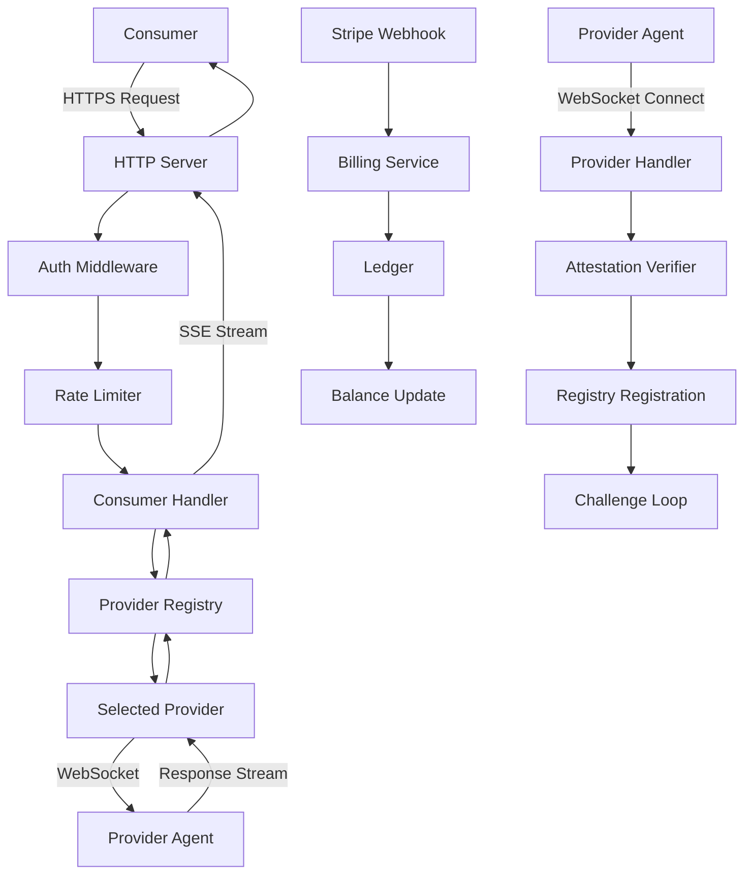

# Coordinator Service Analysis

## Architecture

The coordinator component is the central control plane of the Darkbloom (EigenInference) distributed AI inference network. It implements a **hub-and-spoke architecture** where:

- **Hub**: The coordinator runs in a GCP Confidential VM with hardware-encrypted memory
- **Spokes**: Provider agents connect via WebSocket and consumers via HTTP/HTTPS
- **Trust Layer**: Secure Enclave attestation verifies provider authenticity
- **Routing Engine**: Intelligent request routing based on model availability and trust level

The architecture follows a **layered service pattern** with clear separation between API handling, business logic, and persistence.

## Key Components

1. **HTTP/WebSocket Server** (`internal/api/server.go`): Core networking layer handling both consumer HTTP requests and provider WebSocket connections. Implements middleware chains for logging, CORS, rate limiting, and panic recovery.

2. **Provider Registry** (`internal/registry/registry.go`): In-memory fleet management tracking ~1,000 connected providers with their hardware specs, trust levels, and operational status. Includes request queue and round-robin routing.

3. **Consumer API Handler** (`internal/api/consumer.go`): OpenAI-compatible inference endpoints (`/v1/chat/completions`, `/v1/completions`) with request routing, cost estimation, and streaming response handling.

4. **Provider WebSocket Handler** (`internal/api/provider.go`): Manages provider lifecycle including registration, attestation verification, periodic challenges, and inference request/response relay.

5. **Attestation Verifier** (`internal/attestation/`): Cryptographic verification of Secure Enclave P-256 signatures and Apple MDA certificate chains to establish provider trust levels.

6. **Billing Engine** (`internal/billing/billing.go`): Multi-rail payment processing supporting Stripe deposits and Connect Express payouts, with integrated referral system.

7. **E2E Encryption** (`internal/e2e/e2e.go`): NaCl Box encryption for request/response confidentiality using X25519 keys from provider attestations.

8. **Storage Layer** (`internal/store/`): Dual-backend storage with PostgreSQL for production and MemoryStore for development, managing API keys, usage tracking, balances, and provider fleet persistence.

9. **Rate Limiting** (`internal/ratelimit/`): Per-account token bucket limiting with separate tiers for inference endpoints (default: 5 RPS) and financial endpoints (0.2 RPS).

10. **Protocol Definitions** (`internal/protocol/`): Wire protocol message types for WebSocket communication including registration, heartbeats, attestation challenges, and inference requests/responses.

11. **Telemetry System** (`internal/telemetry/`): Event collection and forwarding to Datadog with coordinator self-monitoring for errors, panics, and operational metrics.

12. **Payments Ledger** (`internal/payments/`): Double-entry accounting system tracking micro-USD balances with atomic operations for deposits, charges, and payouts.

## Data Flows

### Inference Request Flow
1. **Consumer Request**: HTTP POST to `/v1/chat/completions` with API key authentication
2. **Pre-flight**: Balance check, cost estimation, and rate limiting
3. **Provider Selection**: Registry finds available providers matching model and trust requirements
4. **E2E Encryption**: Request encrypted with provider's X25519 public key
5. **WebSocket Dispatch**: Encrypted request sent to selected provider
6. **Response Streaming**: Provider streams SSE chunks back through WebSocket
7. **Post-processing**: Token usage metering, billing calculation, and response forwarding

### Provider Registration Flow
1. **WebSocket Connection**: Provider connects to `/ws/provider` endpoint
2. **Registration Message**: Hardware specs, available models, and attestation blob
3. **Attestation Verification**: Secure Enclave P-256 signature validation
4. **Trust Level Assignment**: Hardware/self-signed/none based on verification result
5. **Fleet Integration**: Provider added to registry with operational status tracking
6. **Challenge Loop**: Periodic attestation challenges to verify continued liveness

## External Dependencies

### External Libraries

- **nhooyr.io/websocket** (v1.8.17) [networking]: High-performance WebSocket library for provider connections. Used in provider handler and integration tests. Core to the real-time bidirectional communication architecture.

- **github.com/jackc/pgx/v5** (v5.8.0) [database]: PostgreSQL driver for production data persistence. Powers the PostgresStore implementation with connection pooling and prepared statements. Imported in: `internal/store/postgres.go`.

- **github.com/DataDog/datadog-go/v5** (v5.8.3) [monitoring]: DogStatsD client for metrics collection. Enables real-time operational visibility with counters, histograms, and gauges. Used in: `internal/datadog/datadog.go`.

- **gopkg.in/DataDog/dd-trace-go.v1** (v1.74.8) [monitoring]: Datadog APM tracer for distributed tracing. Provides request correlation across the inference pipeline. Integrated in main.go startup and middleware.

- **github.com/golang-jwt/jwt/v5** (v5.3.1) [crypto]: JWT token parsing and validation for Privy authentication. Handles user session verification in auth middleware. Used in: `internal/auth/privy.go`.

- **golang.org/x/crypto** (v0.49.0) [crypto]: NaCl Box implementation for end-to-end encryption. Provides X25519 key exchange and XSalsa20-Poly1305 authenticated encryption. Critical for request confidentiality in E2E module.

- **golang.org/x/time** (v0.15.0) [networking]: Rate limiting primitives including token bucket algorithm. Implements per-account throttling for API endpoints. Used in: `internal/ratelimit/ratelimit.go`.

- **github.com/google/uuid** (v1.6.0) [utilities]: UUID generation for request IDs, provider IDs, and session tracking. Provides correlation identifiers across distributed components.

### Internal Dependencies

The coordinator component is self-contained and does not depend on other components within the d-inference codebase. All dependencies are internal packages within the coordinator module itself.

## API Surface

### Consumer Endpoints (Authenticated)
- **POST /v1/chat/completions**: OpenAI-compatible chat completion with streaming support
- **POST /v1/responses**: Responses API format (auto-detected from request body)
- **POST /v1/completions**: Legacy completion endpoint
- **POST /v1/messages**: Anthropic Messages API compatibility
- **GET /v1/models**: List available models with hardware requirements

### Provider WebSocket
- **GET /ws/provider**: WebSocket upgrade for provider agent connections

### Billing & Payments
- **POST /v1/billing/stripe/create-session**: Stripe Checkout session creation
- **POST /v1/billing/stripe/webhook**: Stripe payment confirmation webhook
- **GET /v1/payments/balance**: Account balance inquiry
- **GET /v1/payments/usage**: Usage history and cost breakdown

### Admin & Management
- **GET /v1/admin/models**: Model catalog management
- **POST /v1/admin/models**: Add/update supported models
- **GET /v1/admin/metrics**: Operational metrics snapshot
- **POST /v1/releases**: Provider binary version registration (GitHub Actions)

### Public Endpoints
- **GET /install.sh**: Provider installation script with environment-specific URLs
- **GET /v1/stats**: Network statistics and usage totals
- **GET /v1/leaderboard**: Provider earnings leaderboard (pseudonymized)
- **GET /health**: Health check endpoint

## External Systems

### Infrastructure Dependencies
- **PostgreSQL Database**: Primary data persistence for production deployments with atomic balance operations and fleet state
- **GCP Confidential VM**: AMD SEV-SNP hardware-encrypted memory for coordinator hosting
- **Stripe Payments**: Credit card processing and Connect Express bank payouts
- **Datadog**: APM tracing, metrics collection (DogStatsD), and log aggregation
- **Cloudflare R2**: CDN for provider binary distribution and model weights
- **Apple Business Manager**: MDA certificate verification for hardware trust (future)
- **MicroMDM**: Device management integration for provider security verification

### Runtime Integrations
- **ACME/step-ca**: TLS client certificate verification for Apple-attested Secure Enclave key binding
- **Privy**: JWT-based user authentication and embedded wallet management
- **Nginx**: TLS termination and client certificate extraction via headers

## Component Interactions

The coordinator acts as a **centralized orchestrator** with no direct calls to other components in the d-inference codebase. Instead, it:

- **Receives Connections**: Provider agents connect via WebSocket from distributed hardware
- **Serves Consumers**: HTTP clients make inference requests through OpenAI-compatible APIs  
- **Integrates External Services**: Billing, monitoring, and certificate authorities via HTTP APIs
- **Manages State**: Provider fleet, usage tracking, and financial ledger in PostgreSQL

The design is **hub-centric** rather than peer-to-peer, with all communication flowing through the coordinator for trust verification, routing decisions, and billing coordination.
