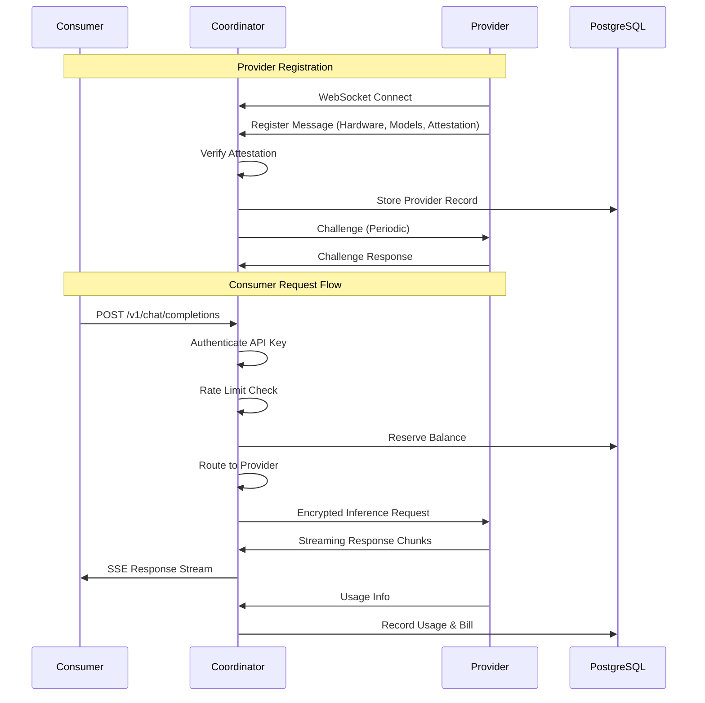
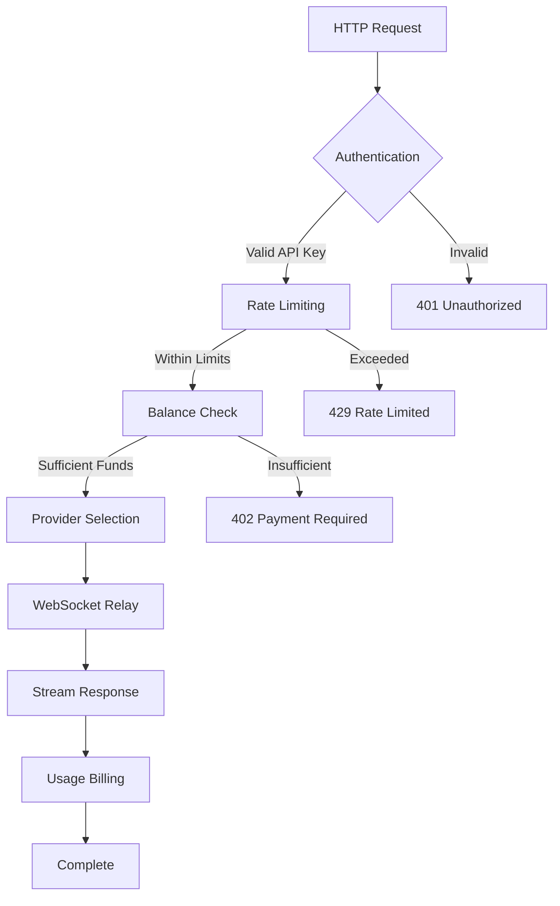

# Coordinator Service Analysis

## Architecture

The coordinator is a central routing and trust layer service for the Darkbloom (EigenInference) decentralized AI inference network. It implements a **trust-brokered hub architecture** where providers connect via WebSocket and consumers access them through OpenAI-compatible HTTP APIs. The coordinator runs in a GCP Confidential VM (AMD SEV-SNP) with hardware-encrypted memory to provide secure routing without exposing prompt content.

The service follows a **layered architecture** with clear separation between:
- Network layer (HTTP/WebSocket handlers)  
- Business logic layer (registry, billing, attestation)
- Data layer (PostgreSQL or in-memory storage)

## Key Components

1. **API Server** (`internal/api/server.go`): Central HTTP/WebSocket server that handles all consumer and provider interactions. Manages request routing, authentication, rate limiting, and CORS.

2. **Provider Registry** (`internal/registry/registry.go`): In-memory registry of connected providers with their capabilities, trust levels, and operational state. Implements round-robin routing among idle providers.

3. **Attestation System** (`internal/attestation/`): Verifies provider security through Secure Enclave attestation, MDA certificates, and periodic challenge-response loops.

4. **Billing Service** (`internal/billing/billing.go`): Unified payment processing supporting Stripe deposits and Connect Express payouts. Manages balance ledgers and referral rewards.

5. **Storage Layer** (`internal/store/interface.go`): Abstract storage interface with PostgreSQL and in-memory implementations for API keys, usage tracking, and financial records.

6. **End-to-End Encryption** (`internal/e2e/`): X25519 keypair management for sender→coordinator and coordinator→provider encryption channels.

7. **Rate Limiting** (`internal/ratelimit/`): Token-bucket rate limiters with separate tiers for inference endpoints (default) and financial endpoints (stricter).

8. **Telemetry System** (`internal/telemetry/`): Event collection and Datadog integration for observability and debugging.

9. **MDM Integration** (`internal/mdm/`): MicroMDM client for independent provider security verification via macOS device management.

10. **Protocol Messages** (`internal/protocol/`): WebSocket message definitions for provider communication including registration, heartbeats, and inference relay.

## Data Flows

## External Dependencies

### External Libraries

- **github.com/jackc/pgx/v5** (v5.8.0) [database]: PostgreSQL driver providing connection pooling and prepared statements. Used in `internal/store/postgres.go` for all database operations including balance ledgers, API keys, and usage tracking.

- **nhooyr.io/websocket** (v1.8.17) [networking]: WebSocket implementation for provider connections. Handles bidirectional communication for registration, heartbeats, and inference relay in `internal/api/provider.go`.

- **github.com/DataDog/datadog-go/v5** (v5.8.3) [monitoring]: DogStatsD client for metrics collection. Used in `internal/datadog/datadog.go` for performance monitoring and alerting.

- **gopkg.in/DataDog/dd-trace-go.v1** (v1.74.8) [monitoring]: Datadog APM tracer for distributed request tracing. Integrated in `cmd/coordinator/main.go` and `internal/datadog/slog.go` for correlation between logs and traces.

- **github.com/golang-jwt/jwt/v5** (v5.3.1) [crypto]: JWT token parsing and validation for Privy authentication. Used in `internal/auth/privy.go` for user session verification.

- **golang.org/x/crypto** (v0.49.0) [crypto]: Cryptographic primitives including X25519 key exchange and HKDF key derivation. Used in `internal/e2e/` for end-to-end encryption between consumers, coordinator, and providers.

- **golang.org/x/time** (v0.15.0) [utility]: Rate limiting utilities including token bucket implementation. Used in `internal/ratelimit/ratelimit.go` for per-account request throttling.

- **github.com/google/uuid** (v1.6.0) [utility]: UUID generation for request IDs and session tracking. Used throughout the codebase for unique identifier generation.

## Internal Dependencies

The coordinator command is a thin main function that bootstraps the core coordinator service from the `coordinator` module. It imports and orchestrates multiple internal packages:

- **internal/api**: Provides the main Server struct and HTTP/WebSocket handling
- **internal/registry**: Manages provider fleet and request routing 
- **internal/store**: Abstracts storage operations (PostgreSQL/memory)
- **internal/billing**: Handles Stripe payments and balance management
- **internal/attestation**: Verifies provider security attestations
- **internal/auth**: Manages Privy JWT authentication
- **internal/e2e**: Implements end-to-end encryption
- **internal/telemetry**: Collects coordinator-side events

## API Surface

### Consumer Endpoints (OpenAI-Compatible)
- `POST /v1/chat/completions` - Chat completion inference
- `POST /v1/responses` - Responses API (auto-detects format) 
- `POST /v1/completions` - Text completion
- `POST /v1/messages` - Anthropic Messages API
- `GET /v1/models` - List available models

### Provider Management  
- `GET /ws/provider` - WebSocket connection for providers
- `GET /v1/providers/attestation` - Public attestation verification
- `GET /v1/provider/earnings` - Provider earnings dashboard

### Authentication & Account Management
- `POST /v1/auth/keys` - Create API keys (Privy auth required)
- `DELETE /v1/auth/keys` - Revoke API keys
- `POST /v1/device/code` - Device auth flow initiation
- `POST /v1/device/token` - Device auth token exchange

### Billing & Payments
- `POST /v1/billing/stripe/create-session` - Stripe Checkout
- `POST /v1/billing/stripe/webhook` - Stripe event processing
- `GET /v1/payments/balance` - Account balance
- `GET /v1/payments/usage` - Usage history

### Admin Interface
- `GET /v1/admin/metrics` - Internal metrics
- `POST /v1/admin/models` - Manage model catalog
- `POST /v1/releases` - Register binary releases

## External Systems

The coordinator integrates with several external services at runtime:

- **PostgreSQL Database**: Primary data store for API keys, usage records, balance ledgers, and provider state. Handles ACID transactions for billing operations.

- **Stripe API**: Payment processing for consumer deposits via Stripe Checkout. Webhook integration for real-time payment confirmation.

- **Stripe Connect**: Express account management for provider payouts to bank accounts and debit cards.

- **Datadog**: APM tracing, DogStatsD metrics collection, and structured log ingestion for observability.

- **MicroMDM**: macOS device management integration for independent provider security verification.

- **step-ca ACME**: Certificate authority integration for ACME device-attest-01 client certificate verification.

- **Cloudflare R2**: CDN storage for provider binaries, model weights, and Python packages referenced in install scripts.

## Component Interactions

The coordinator acts as a central hub with no direct calls to other d-inference components. Instead, it serves as the **network boundary** that other components connect to:

- **Providers** connect via WebSocket (`/ws/provider`) for registration and inference serving
- **Consumers** access the network via HTTP REST APIs (`/v1/chat/completions`, etc.)
- **Frontend Console** uses REST APIs for account management and provider dashboards
- **GitHub Actions** register releases via scoped API keys (`/v1/releases`)

The coordinator maintains **soft state** about the provider fleet in memory, with critical data (balances, usage, keys) persisted to PostgreSQL for durability across restarts.
