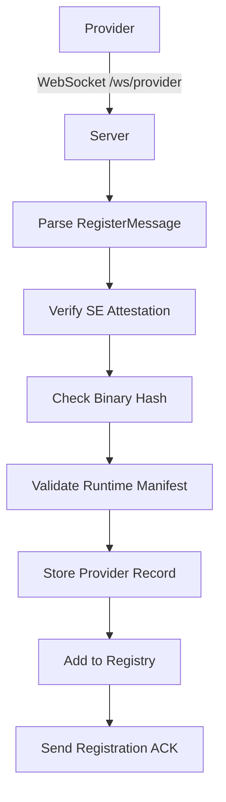
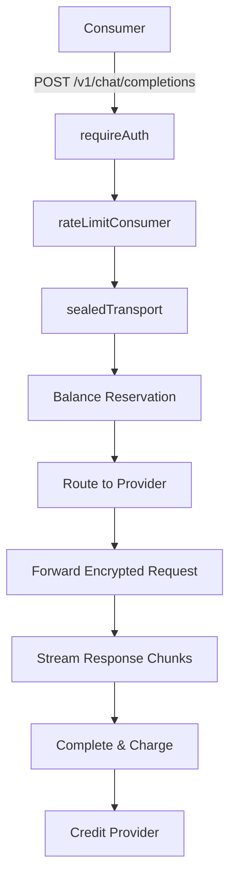
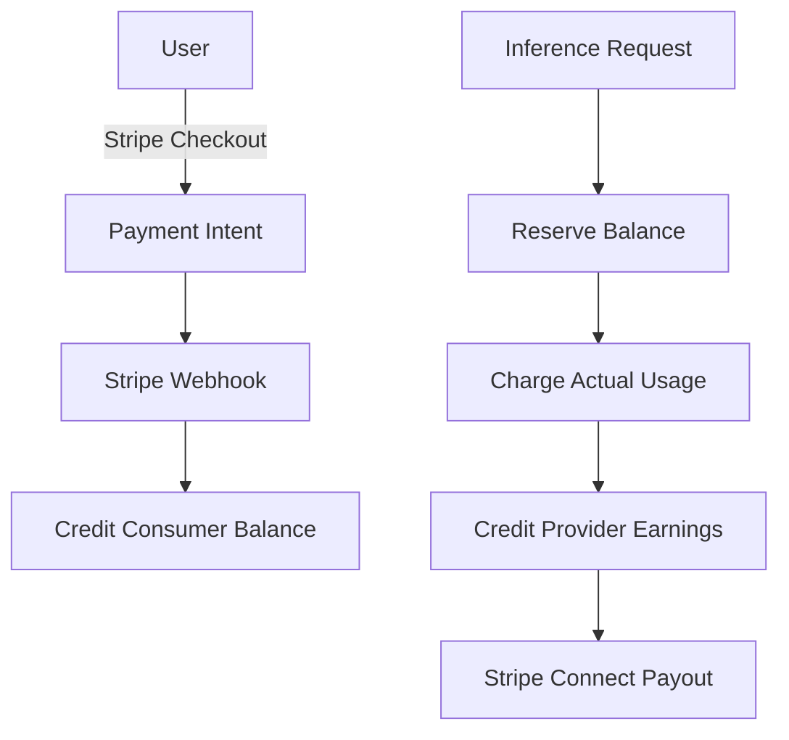

Now I have sufficient understanding to write a comprehensive analysis. Let me structure the analysis:

# Coordinator Service Analysis

## Architecture

The coordinator service implements a **centralized routing and trust architecture** that serves as the control plane for the Darkbloom (EigenInference) decentralized inference network. It follows a **layered service architecture** with clear separation between HTTP/WebSocket handling, business logic, attestation verification, and data persistence.

The coordinator operates as a trusted intermediary that:
- Accepts WebSocket connections from providers and verifies their hardware attestations
- Routes OpenAI-compatible HTTP requests from consumers to appropriate verified providers
- Manages billing, payments, and provider payouts through an internal ledger system
- Maintains end-to-end encryption between consumers and providers while enabling routing

## Key Components

1. **Server** (`internal/api/server.go`): Core HTTP/WebSocket server with middleware for authentication, rate limiting, CORS, and request logging. Manages all API endpoints and coordinates between internal services.

2. **Registry** (`internal/registry/registry.go`): In-memory provider fleet management tracking hardware capabilities, attestation status, trust levels, and operational state. Implements intelligent routing algorithms with reputation tracking.

3. **Store Interface** (`internal/store/interface.go`): Abstraction layer for data persistence supporting both PostgreSQL (production) and in-memory (development) backends. Handles API keys, usage tracking, balance ledgers, and billing sessions.

4. **Attestation Verifier** (`internal/attestation/attestation.go`): Cryptographic verification of Apple Secure Enclave attestations using P-256 ECDSA signatures. Validates hardware identity, security state (SIP, Secure Boot), and provider public keys.

5. **Billing Service** (`internal/billing/billing.go`): Unified payment processing supporting Stripe Checkout for deposits and Stripe Connect Express for provider payouts. Includes referral system and custom pricing overrides.

6. **Protocol Messages** (`internal/protocol/messages.go`): WebSocket message definitions for provider-coordinator communication including registration, heartbeats, inference requests/responses, and attestation challenges.

7. **Consumer Handlers** (`internal/api/consumer.go`): OpenAI-compatible API implementation with automatic retry logic, balance reservation, and streaming response handling. Supports chat completions, responses API, and legacy completions.

8. **Payment Ledger** (`internal/payments/payments.go`): Double-entry accounting system tracking consumer balances, provider earnings, and transaction history. All amounts in micro-USD (1 USD = 1,000,000 micro-USD).

9. **Rate Limiter** (`internal/ratelimit/ratelimit.go`): Per-account token bucket rate limiting with separate limits for inference endpoints (default: 5 RPS) and financial endpoints (default: 0.2 RPS).

10. **End-to-End Encryption** (`internal/e2e/e2e.go`): X25519/NaCl-box encryption for sender→coordinator→provider request forwarding with coordinator key derivation from BIP39 mnemonic.

11. **MDM Integration** (`internal/mdm/mdm.go`): MicroMDM client for independent provider security verification, overriding self-reported attestation with coordinator-verified values.

12. **Telemetry Emitter** (`internal/telemetry/emitter.go`): Event collection and forwarding to Datadog for coordinator-side observability (panics, handler failures, attestation failures).

## Data Flows

### Provider Registration Flow

### Inference Request Flow

### Billing Flow

## External Dependencies

### External Libraries

- **github.com/jackc/pgx/v5** (v5.8.0) [database]: PostgreSQL driver and connection pooling for production data persistence. Used in `internal/store/postgres.go` for all database operations including balance ledgers and usage tracking.

- **nhooyr.io/websocket** (v1.8.17) [networking]: WebSocket library for provider connections. Used throughout `internal/api/provider.go` and `internal/registry/registry.go` for real-time bidirectional communication with provider nodes.

- **github.com/DataDog/datadog-go/v5** (v5.8.3) [monitoring]: DogStatsD client for metrics emission. Used in `internal/datadog/datadog.go` and `internal/api/server.go` for request counters, latency histograms, and system gauges.

- **gopkg.in/DataDog/dd-trace-go.v1** (v1.74.8) [monitoring]: Datadog APM tracer for distributed tracing. Initialized in `cmd/coordinator/main.go` and integrated with structured logging via `internal/datadog/slog.go`.

- **github.com/golang-jwt/jwt/v5** (v5.3.1) [crypto]: JWT parsing and validation for Privy authentication tokens. Used in `internal/auth/privy.go` for user session verification and admin email validation.

- **golang.org/x/crypto** (v0.49.0) [crypto]: X25519 elliptic curve cryptography for end-to-end encryption keys, NaCl secretbox for request sealing, and HKDF for coordinator key derivation. Used across `internal/e2e/` package.

- **golang.org/x/time** (v0.15.0) [async-runtime]: Token bucket rate limiting implementation. Used in `internal/ratelimit/ratelimit.go` for per-account request throttling with separate consumer and financial endpoint limits.

- **github.com/google/uuid** (v1.6.0) [other]: UUID generation for request IDs, billing session IDs, and provider identifiers. Used in `internal/api/server.go` and billing-related handlers.

### Internal Dependencies

The coordinator component is self-contained and does not depend on other components in the d-inference codebase. It serves as the central orchestration service that other components (providers, frontend) connect to.

## API Surface

### Consumer Endpoints (OpenAI-Compatible)
- `POST /v1/chat/completions` - Chat completions with streaming support
- `POST /v1/responses` - Responses API (auto-detects input vs messages)  
- `POST /v1/completions` - Legacy text completions
- `POST /v1/messages` - Anthropic-style messages API
- `GET /v1/models` - List available models from catalog

### Authentication & Key Management
- `POST /v1/auth/keys` - Create API key (Privy auth required)
- `DELETE /v1/auth/keys` - Revoke API key (Privy auth required)
- `GET /v1/encryption-key` - Get coordinator's X25519 public key

### Billing & Payments
- `GET /v1/payments/balance` - Check account balance
- `GET /v1/payments/usage` - Get usage history
- `POST /v1/billing/stripe/create-session` - Create Stripe checkout
- `POST /v1/billing/stripe/webhook` - Stripe payment webhook
- `POST /v1/billing/withdraw/stripe` - Initiate Stripe Connect payout

### Provider Operations  
- `GET /ws/provider` - Provider WebSocket endpoint
- `GET /v1/provider/earnings` - Public provider earnings by wallet
- `POST /v1/device/code` - Device authorization flow initiation
- `POST /v1/device/approve` - Approve device linking (Privy auth)

### Platform Stats & Discovery
- `GET /v1/stats` - Platform statistics (no auth)
- `GET /v1/leaderboard` - Provider leaderboard (pseudonymized)
- `GET /v1/models/catalog` - Model catalog for providers
- `GET /install.sh` - Provider installation script

### Admin Operations
- `GET /v1/admin/metrics` - Metrics snapshot (admin key)
- `POST /v1/admin/models` - Manage model catalog (admin key)
- `POST /v1/admin/credit` - Credit user balance (admin key)
- `POST /v1/releases` - Register new provider release (scoped key)

## External Systems

- **PostgreSQL**: Primary data store for production deployments handling API keys, usage records, balance ledgers, billing sessions, user accounts, and provider records. Requires `EIGENINFERENCE_DATABASE_URL` environment variable.

- **Stripe**: Payment processing platform for consumer deposits via Checkout sessions and provider payouts via Connect Express accounts. Webhooks handle payment confirmations and account status updates.

- **Datadog**: Observability platform receiving structured logs, APM traces, and DogStatsD metrics. Enables monitoring of request performance, provider fleet health, and business metrics.

- **MicroMDM**: Mobile device management server for independent provider security verification. Validates SIP/SecureBoot status and provides Apple Device Attestation certificates.

- **GCP Confidential VM**: Deployment target providing hardware-encrypted memory (AMD SEV-SNP) for trusted execution environment. Consumer traffic arrives over HTTPS/TLS.

## Component Interactions  

The coordinator operates as a centralized hub with no direct dependencies on other components in the d-inference codebase. Instead, other components connect to it:

- **Providers**: Connect via WebSocket (`/ws/provider`) for registration, heartbeats, and inference request dispatch
- **Frontend/Console**: Consumes HTTP APIs for user management, billing, and platform statistics  
- **CLI Tools**: Use admin APIs for model catalog management and system administration
- **Install Script**: Served at `/install.sh` with environment-specific URLs for provider onboarding

The coordinator maintains state independence, allowing provider restarts and horizontal scaling while preserving trust relationships and billing continuity through persistent storage.
