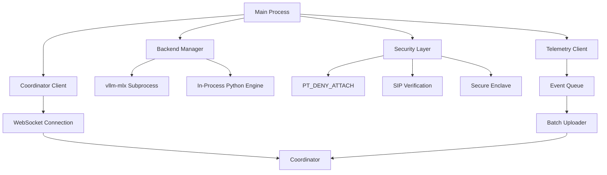
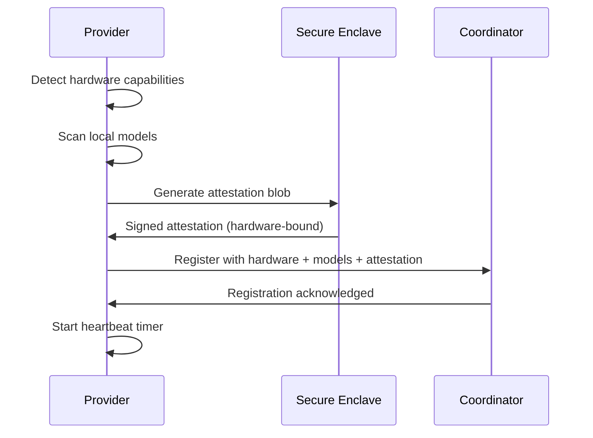
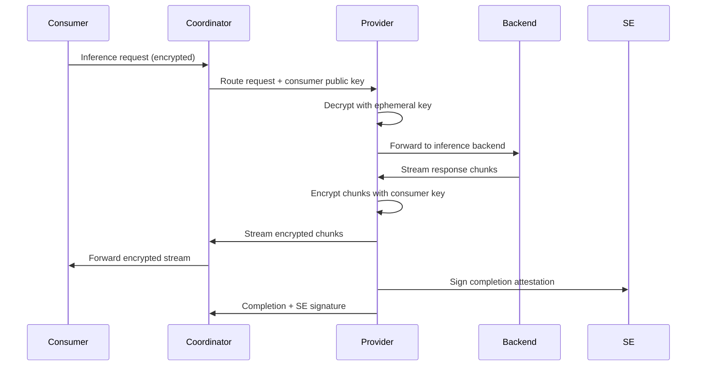
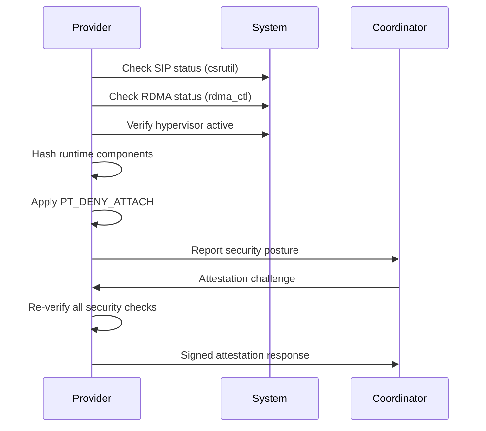

Now I have a comprehensive understanding of the darkbloom component. Let me write the analysis:

# Darkbloom Component Analysis

## Architecture

The darkbloom component is a sophisticated inference provider agent designed for Apple Silicon Macs, implementing a **hardened service architecture** with multi-layer security protections. The system follows a **security-first approach** where privacy and attestation capabilities are fundamental to its design rather than afterthoughts.

The core architecture consists of:
- **Main Provider Process**: Rust binary with embedded Python interpreter for secure inference
- **Coordinator Client**: WebSocket-based connection manager with automatic reconnection
- **Backend Management**: Subprocess or in-process inference engines (vllm-mlx, mlx-lm) 
- **Security Layer**: PT_DENY_ATTACH, SIP verification, Secure Enclave attestation
- **Telemetry Pipeline**: Structured event collection with disk-backed queuing
- **Service Management**: launchd integration for lifecycle management

## Key Components

### 1. Main Event Loop (`src/main.rs`)
- **Purpose**: Central orchestration of all provider functionality
- **Key Features**: Hardware detection, model scanning, backend lifecycle management
- **Architecture**: Tokio-based async runtime with multiple concurrent tasks
- **Security**: Early security posture verification before accepting inference work

### 2. Coordinator Client (`src/coordinator.rs`)
- **Purpose**: WebSocket communication with the EigenInference coordinator
- **Key Features**: Registration, heartbeats, inference request handling, attestation challenges
- **Resilience**: Exponential backoff reconnection with automatic recovery
- **E2E Encryption**: X25519 key pair generation and NaCl Box encryption

### 3. Backend Management (`src/backend/`)
- **Purpose**: Lifecycle management of inference engines (vllm-mlx, mlx-lm)
- **Health Monitoring**: Periodic health checks with automatic restart on failure
- **Multi-Backend Support**: Sequential port allocation for multiple models
- **Capacity Polling**: Real-time GPU memory and request queue monitoring

### 4. Security Module (`src/security.rs`)
- **Purpose**: Runtime protections against memory inspection and code injection
- **Core Protections**: PT_DENY_ATTACH, core dump disabling, environment variable scrubbing
- **Verification**: SIP status, RDMA status, hypervisor memory isolation checks
- **Runtime Integrity**: SHA-256 hashing of Python interpreter and package files

### 5. Hardware Detection (`src/hardware.rs`)
- **Purpose**: Apple Silicon chip identification and capability detection
- **Methods**: sysctl queries, system_profiler parsing for GPU core counts
- **Memory Bandwidth**: Lookup tables based on chip family/tier/GPU core combinations
- **System Metrics**: Real-time memory pressure, CPU usage, thermal state monitoring

### 6. Model Management (`src/models.rs`)
- **Purpose**: HuggingFace cache scanning and MLX model discovery
- **Detection Heuristics**: MLX indicators in names, safetensors files, quantization hints
- **Weight Fingerprinting**: SHA-256 hashing of model weight files for attestation
- **Memory Filtering**: Only advertises models that fit in available memory

### 7. Cryptographic Layer (`src/crypto.rs`)
- **Purpose**: Ephemeral X25519 key pair management for E2E encryption
- **Implementation**: NaCl-compatible crypto_box with XSalsa20-Poly1305
- **Key Lifecycle**: Generated fresh on each provider launch, never persisted
- **Secure Enclave Integration**: Binding public keys to hardware attestation

### 8. In-Process Inference (`src/inference.rs`)
- **Purpose**: Embedded Python interpreter for private text inference
- **Security**: Python path locking, dangerous module blocking, import restrictions
- **Engine Management**: Cached PyO3-based vllm-mlx engines with per-model isolation
- **Runtime Protection**: Prevents provider from accessing sys.path or subprocess modules

### 9. Configuration System (`src/config.rs`)
- **Purpose**: TOML-based configuration management
- **Hardware Adaptation**: Default settings based on detected chip capabilities
- **Override Support**: CLI flags can override config values at runtime
- **Scheduling**: Configurable time-based serving windows

### 10. Telemetry Pipeline (`src/telemetry/`)
- **Purpose**: Structured event collection and transmission
- **Components**: tracing layer, panic hook, stderr scraper, async batcher
- **Persistence**: Disk-backed queue with automatic failover
- **Privacy**: No user content, only technical events and error conditions

### 11. Service Integration (`src/service.rs`)
- **Purpose**: macOS launchd user agent management
- **Lifecycle**: Install, start, stop, uninstall operations
- **User Control**: Manual start/stop only, no auto-start on boot
- **Process Management**: RunAtLoad=false, KeepAlive=false for user control

## Data Flows

### Registration Flow

### Inference Flow

### Security Verification Flow

## External Dependencies

### Runtime Dependencies

- **tokio** (1) [async-runtime]: Primary async runtime for WebSocket connections, task spawning, and I/O operations. Used throughout main.rs, coordinator.rs, and backend management.

- **reqwest** (0.12) [networking]: HTTP client for health checks, model downloads, and coordinator API calls. Features: json, stream for file downloads with progress bars.

- **tokio-tungstenite** (0.26) [networking]: WebSocket client implementation for coordinator communication. Features: native-tls for secure connections.

- **serde** (1) [serialization]: Core serialization framework with derive macros. Used across all protocol messages, config files, and telemetry events.

- **serde_json** (1) [serialization]: JSON serialization for WebSocket protocol messages and API responses. Critical for coordinator communication.

- **toml** (0.8) [serialization]: Configuration file format for provider.toml. Provides human-readable config with comments.

- **anyhow** (1) [error-handling]: Error context and chaining throughout the codebase. Provides ergonomic error propagation with context.

- **tracing** (0.1) [logging]: Structured logging framework with span support. Used for debugging, telemetry collection, and operational visibility.

- **tracing-subscriber** (0.3) [logging]: Log formatting and filtering. Features: env-filter for runtime log level control, json for structured output.

- **axum** (0.8) [web-framework]: HTTP server for local-mode debugging proxy. Only used when --local flag is specified, disabled in production.

- **crypto_box** (0.9) [crypto]: NaCl-compatible X25519 + XSalsa20-Poly1305 for E2E encryption. Provides ephemeral key generation and message encryption.

- **base64** (0.22) [crypto]: Base64 encoding for public keys, signatures, and encrypted payloads in WebSocket protocol.

- **sha2** (0.10) [crypto]: SHA-256 hashing for model weight fingerprinting, binary integrity checks, and runtime verification.

- **zeroize** (1) [crypto]: Secure memory wiping to prevent decrypted plaintext from lingering in freed memory after use.

- **uuid** (1) [misc]: UUID generation for request IDs and session tracking. Features: v4 for random UUIDs.

- **chrono** (0.4) [misc]: Date/time handling for timestamps in protocol messages and telemetry events.

- **futures-util** (0.3) [async-runtime]: Async combinators and stream utilities for WebSocket message processing and file downloads.

- **async-trait** (0.1) [async-runtime]: Trait async methods for Backend trait implementation across different inference engines.

- **once_cell** (1) [misc]: Static initialization for global telemetry client and session IDs without runtime locks.

- **dirs** (6) [misc]: Cross-platform directory path resolution for home, config, and cache directories.

- **libc** (0.2) [system]: Unix system calls for PT_DENY_ATTACH, signal handling, and resource limits (RLIMIT_CORE).

- **crossterm** (0.28) [cli]: Raw terminal input for interactive model picker in CLI commands.

- **clap** (4) [cli]: Command-line argument parsing with derive macros for all darkbloom subcommands.

- **tokio-util** (0.7) [async-runtime]: Additional async utilities including sync primitives and stream adapters.

### Platform-Specific Dependencies (macOS)

- **security-framework** (3) [system]: macOS Keychain and Security.framework bindings for Secure Enclave integration.

- **security-framework-sys** (2) [system]: Low-level FFI bindings to Security.framework for direct API access.

- **core-foundation** (0.10) [system]: Core Foundation framework bindings for macOS system integration.

### Optional Dependencies

- **pyo3** (0.24) [python]: Python interpreter embedding for in-process inference engines. Features: auto-initialize. Behind "python" feature flag (default enabled).

### Development Dependencies

- **tempfile** (3) [testing]: Temporary file creation for configuration and model cache testing.

- **tower** (0.5) [testing]: HTTP service abstractions for testing server components. Features: util for test helpers.

## External Systems

### Infrastructure Integrations

- **Darkbloom Coordinator**: Primary WebSocket connection for job routing, attestation challenges, and telemetry collection. HTTPS API for model catalogs and runtime manifests.

- **Cloudflare R2 CDN**: Model weight downloads, Python runtime packages, and chat templates. Two bucket endpoints: main CDN and site-packages CDN.

- **HuggingFace Hub**: Local cache scanning at `~/.cache/huggingface/hub/` for model discovery and weight file access.

- **macOS System APIs**: 
  - `sysctl` for hardware detection (memory, CPU cores, machine model)
  - `system_profiler` for GPU information and core counts  
  - `csrutil` for System Integrity Protection verification
  - `pmset` for thermal state monitoring
  - `vm_stat` for memory pressure calculation

### Runtime Dependencies

- **Apple Secure Enclave**: Hardware attestation via Security.framework FFI calls. Generates signed challenges binding X25519 public keys to hardware identity.

- **Metal GPU Framework**: Accessed via MLX Python library for model inference acceleration on Apple Silicon GPU cores.

- **macOS launchd**: Service lifecycle management as user agent with plist-based configuration for start/stop operations.

- **Python 3.12 Runtime**: Embedded interpreter via PyO3 for vllm-mlx execution. Uses either bundled standalone Python or verified ~/.darkbloom/python installation.

## Component Interactions

This component has **no direct interactions** with other components in the d-inference codebase, as confirmed by the analysis that it has no internal dependencies. However, it communicates with external systems:

### External Service Communications

- **Coordinator WebSocket Protocol**: Registers capabilities, receives inference requests, streams responses, handles attestation challenges
- **HTTP API Calls**: Downloads models, fetches catalogs, reports telemetry, checks for updates
- **System Integration**: Queries hardware capabilities, manages service lifecycle via launchd
