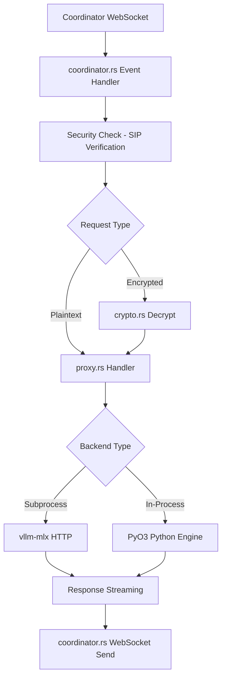
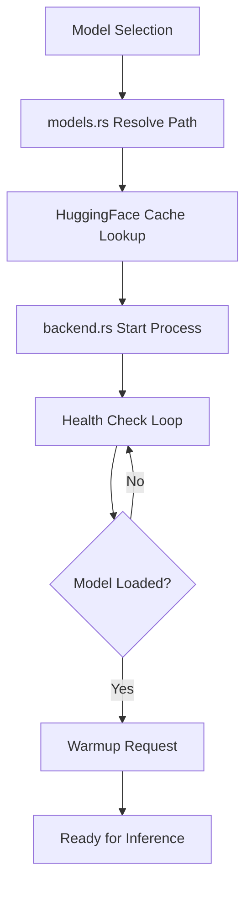
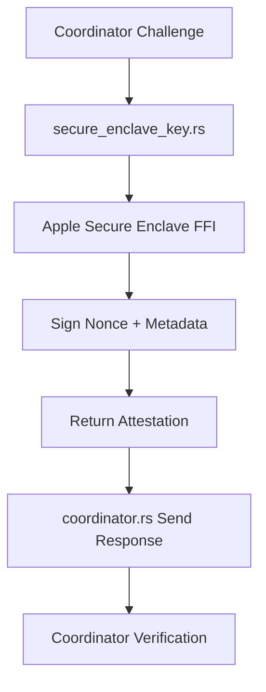

# Darkbloom Component Analysis

## Overview

The darkbloom component is a sophisticated provider agent written in Rust that serves as the local inference runtime for Apple Silicon Macs in the EigenInference distributed inference network. It acts as a bridge between the global coordinator and local hardware, managing ML model execution with enterprise-grade security features.

## Architecture

The component follows a **multi-layered service architecture** with several key design patterns:

1. **Hardened Runtime Security**: Implements multiple layers of protection including PT_DENY_ATTACH, SIP verification, and Secure Enclave integration
2. **Hypervisor Isolation**: Uses Apple's Hypervisor.framework for memory isolation of inference workloads  
3. **Multi-Backend Support**: Supports both subprocess (vllm-mlx) and in-process (PyO3) inference engines
4. **Distributed Coordination**: WebSocket-based communication with coordinator for job routing and attestation

## Key Components

### 1. Main Entry Point (`main.rs`)
- **Purpose**: CLI command handler and application bootstrapping
- **Key Features**: Command parsing, hardware detection, security initialization
- **Integration**: Coordinates all subsystems and manages application lifecycle
- **Lines**: 7,244 lines covering installation, serving, model management

### 2. Hardware Detection (`hardware.rs`) 
- **Purpose**: Apple Silicon capability detection and system metrics collection
- **Key Features**: Memory/GPU detection, thermal monitoring, performance metrics
- **Integration**: Provides capabilities to coordinator for job routing decisions
- **API**: Exposes `HardwareInfo` and `SystemMetrics` structs

### 3. Security Module (`security.rs`)
- **Purpose**: Runtime hardening and threat protection  
- **Key Features**: PT_DENY_ATTACH, SIP verification, memory wiping, core dump disable
- **Integration**: Called at startup and before each inference request
- **Lines**: 1,443 lines of security implementations

### 4. Coordinator Client (`coordinator.rs`)
- **Purpose**: WebSocket connection to distributed coordinator
- **Key Features**: Registration, heartbeats, attestation challenges, job routing
- **Integration**: Receives inference jobs and reports capacity/health status
- **Lines**: 1,527 lines managing distributed communication

### 5. Backend Management (`backend/mod.rs`)
- **Purpose**: Inference engine lifecycle and health monitoring
- **Key Features**: Process management, automatic restart, health checks
- **Integration**: Manages vllm-mlx subprocesses or in-process Python engines
- **API**: `Backend` trait with `start()`, `stop()`, `health()` methods

### 6. Cryptographic Layer (`crypto.rs`)
- **Purpose**: End-to-end encryption for inference requests
- **Key Features**: X25519 key generation, NaCl encryption/decryption
- **Integration**: Encrypts responses back to coordinator using ephemeral keys
- **Lines**: 462 lines implementing E2E crypto protocols

### 7. Model Management (`models.rs`)
- **Purpose**: HuggingFace cache scanning and model discovery
- **Key Features**: MLX model detection, memory filtering, weight hashing
- **Integration**: Reports available models to coordinator based on hardware capacity
- **Lines**: 1,082 lines of model management logic

### 8. Hypervisor Integration (`hypervisor.rs`) 
- **Purpose**: Memory isolation using Apple's Hypervisor.framework
- **Key Features**: VM creation, memory mapping, Stage 2 page table isolation
- **Integration**: Protects inference memory from DMA attacks
- **Lines**: 346 lines of low-level hypervisor management

### 9. Inference Proxy (`proxy.rs`)
- **Purpose**: Request forwarding and response streaming
- **Key Features**: HTTP proxying, SSE streaming, encryption handling  
- **Integration**: Bridges coordinator requests to local backends
- **Lines**: 1,710 lines handling request/response flows

### 10. Service Management (`service.rs`)
- **Purpose**: macOS launchd integration for background operation
- **Key Features**: Plist generation, daemon lifecycle management
- **Integration**: Enables provider to run as system service
- **Lines**: 210 lines of launchd configuration

### 11. Telemetry System (`telemetry/mod.rs`)
- **Purpose**: Observability and error reporting pipeline  
- **Key Features**: Structured logging, panic capture, backend scraping
- **Integration**: Reports operational metrics to coordinator
- **Architecture**: Multi-source event collection with async batching

### 12. Secure Enclave Integration (`secure_enclave_key.rs`)
- **Purpose**: Hardware-backed attestation using Apple Secure Enclave
- **Key Features**: Ephemeral signing keys, attestation generation, challenge-response
- **Integration**: Proves provider authenticity to coordinator for trust establishment

## Data Flows

### Inference Request Flow


### Model Loading Flow  


### Attestation Flow


## External Dependencies

### Runtime Dependencies

- **tokio** (1.x) [async-runtime]: Core async runtime powering all concurrent operations. Used throughout for task spawning, timers, and async I/O. Primary integration in coordinator WebSocket handling and backend health monitoring.

- **reqwest** (0.12) [networking]: HTTP client for coordinator API calls and backend health checks. Used in coordinator registration, model downloads, and backend status polling. Integrated in `coordinator.rs`, `proxy.rs`, and `backend/mod.rs`.

- **tokio-tungstenite** (0.26) [networking]: WebSocket client for real-time coordinator communication. Handles bidirectional message passing for job routing and heartbeats. Core integration in `coordinator.rs` connection management.

- **axum** (0.8) [web-framework]: HTTP server for local debugging mode and health endpoints. Used when `--local` flag enables legacy HTTP proxy mode. Integration in `server.rs` for local development.

- **serde** (1.0) [serialization]: JSON serialization for all protocol messages and configuration. Used across `protocol.rs`, `config.rs`, and coordinator communication. Essential for API compatibility.

- **serde_json** (1.0) [serialization]: JSON processing for inference requests/responses and coordinator protocols. Heavy usage in `proxy.rs` for request forwarding and response parsing.

- **anyhow** (1.0) [error-handling]: Unified error handling across all modules. Provides context-aware error propagation from system calls, network operations, and business logic failures.

- **tracing** (0.1) [logging]: Structured logging framework with hierarchical spans. Integrated with custom telemetry layer for operational observability. Used throughout for debugging and monitoring.

- **tracing-subscriber** (0.3) [logging]: Log processing and filtering with JSON output support. Configured in `main.rs` with environment-based filtering for production deployments.

- **clap** (4.x) [cli]: Command-line interface with derive macros for subcommands. Handles complex CLI including `serve`, `install`, `models`, `doctor` workflows. Integration in `main.rs` command parsing.

- **crypto_box** (0.9) [crypto]: NaCl-compatible X25519 + XSalsa20-Poly1305 encryption for end-to-end security. Implements ephemeral key pairs and request/response encryption. Core usage in `crypto.rs`.

- **base64** (0.22) [serialization]: Base64 encoding for cryptographic keys and binary data in JSON protocols. Used for public key exchange and attestation blob encoding.

- **sha2** (0.10) [crypto]: SHA-256 hashing for integrity verification of Python runtime, model weights, and templates. Critical for attestation and tamper detection. Used in `security.rs`.

- **uuid** (1.x) [misc]: RFC 4122 UUID generation for request tracking and session identification. Used in coordinator protocol for request correlation.

- **chrono** (0.4) [misc]: Date/time handling for timestamps in telemetry events and coordinator heartbeats. Integration in protocol message timestamps.

- **dirs** (6.x) [misc]: Cross-platform directory discovery for config files, cache, and data storage. Provides `~/.darkbloom` and HuggingFace cache paths.

- **once_cell** (1.x) [concurrency]: Thread-safe lazy initialization for global state like telemetry client and HTTP clients. Used for singleton pattern implementations.

- **futures-util** (0.3) [async-runtime]: Stream utilities for WebSocket message processing and async combinators. Used in `coordinator.rs` for stream handling.

- **http-body-util** (0.1) [web-framework]: HTTP body utilities for Axum server integration in local development mode.

- **tokio-util** (0.7) [async-runtime]: Additional async utilities including cancellation tokens for graceful shutdown and timeout handling.

- **libc** (0.2) [system]: Low-level system call bindings for security hardening (PT_DENY_ATTACH, RLIMIT_CORE). Critical for macOS security features.

- **crossterm** (0.28) [terminal]: Terminal control for interactive model picker in CLI workflows. Used for raw key input in model selection.

- **zeroize** (1.x) [security]: Secure memory wiping to prevent plaintext from lingering in freed memory. Used for cryptographic key cleanup.

- **async-trait** (0.1) [async]: Enables async functions in trait definitions for Backend trait abstraction.

- **thiserror** (2.x) [error-handling]: Derive macros for custom error types with automatic Display/Error implementations.

- **backtrace** (0.3) [debugging]: Stack trace capture for panic handling and telemetry error reporting.

### Target-Specific Dependencies (macOS)

- **security-framework** (3.x) [system]: macOS Keychain Services and Security.framework bindings for certificate and key management.

- **security-framework-sys** (2.x) [system]: Low-level FFI bindings for Security.framework system calls.

- **core-foundation** (0.10) [system]: Core Foundation framework bindings for macOS system integration and memory management.

### Optional Features

- **pyo3** (0.24) [python]: Python interpreter embedding for in-process inference engine (Phase 3). Links CPython directly into provider process for zero-IPC inference. Behind `python` feature flag (enabled by default).

### Development Dependencies

- **tempfile** (3.x) [testing]: Temporary file creation for unit tests and integration tests.

- **assert_cmd** (2.x) [testing]: CLI testing utilities for command-line interface validation.

- **predicates** (3.x) [testing]: Predicate functions for advanced test assertions and output validation.

- **tower** (0.5) [testing]: Service abstraction utilities for testing HTTP service layers.

## API Surface

### Public CLI Interface

The component exposes a comprehensive command-line interface:

**Core Commands:**
- `darkbloom init` - Hardware detection and configuration initialization
- `darkbloom serve` - Start inference service with coordinator connection
- `darkbloom install` - One-command setup with MDM enrollment and model download
- `darkbloom start/stop` - Background service lifecycle management

**Model Management:**
- `darkbloom models list` - Display available local models
- `darkbloom models download --model <id>` - Download specific models
- `darkbloom models remove <id>` - Remove cached models

**Maintenance:**
- `darkbloom status` - Hardware and connection status
- `darkbloom doctor` - Comprehensive system diagnostics
- `darkbloom update` - Self-update to latest version
- `darkbloom logs` - View service logs with real-time streaming

**Security:**
- `darkbloom enroll` - MDM device enrollment for attestation
- `darkbloom login/logout` - Account linking for earnings

### Configuration Interface

Configuration via TOML files at `~/.darkbloom/provider.toml`:

```toml
[provider]
auto_update = true

[backend]  
port = 8100
model = "mlx-community/Qwen2.5-3B-Instruct-4bit"
idle_timeout_mins = 30

[coordinator]
url = "wss://api.darkbloom.dev/ws/provider"
heartbeat_interval_secs = 30

[schedule]
enabled = false
active_hours = "09:00-17:00"
active_days = ["monday", "tuesday", "wednesday", "thursday", "friday"]
```

### Protocol Interface

WebSocket-based communication with coordinator using JSON messages:

**Provider → Coordinator:**
- `Register` - Initial registration with hardware info and attestation
- `Heartbeat` - Periodic status updates with capacity metrics  
- `InferenceAccepted/ResponseChunk/Complete/Error` - Inference lifecycle events
- `AttestationResponse` - Response to security challenges

**Coordinator → Provider:**
- `InferenceRequest` - Job assignment with encrypted payloads
- `Cancel` - Request cancellation
- `AttestationChallenge` - Security verification requests

## External Systems

### Cloud Infrastructure

**Coordinator API (api.darkbloom.dev)**
- Category: Distributed coordination service
- Purpose: Job routing, provider discovery, and network orchestration
- Integration: WebSocket connection for real-time communication, REST API for registration and updates
- Protocol: JSON over WebSocket with TLS, periodic heartbeats every 30 seconds

**R2 CDN (Cloudflare)**  
- Category: Content delivery network
- Purpose: Model weight distribution, runtime updates, and template storage
- Integration: HTTPS downloads with resume support and integrity verification
- URLs: `pub-7cbee059c80c46ec9c071dbee2726f8a.r2.dev` (models), `pub-3d1cb668259340eeb2276e1d375c846d.r2.dev` (runtime)

**Telemetry Pipeline**
- Category: Observability and monitoring
- Purpose: Error reporting, performance metrics, and operational insights  
- Integration: Batched HTTPS POST with structured JSON events, disk overflow for reliability

### Hardware Integration

**Apple Secure Enclave**
- Category: Hardware security module  
- Purpose: Cryptographic attestation and identity verification
- Integration: FFI calls to Security.framework for signing and key generation
- Protocol: Challenge-response authentication with ephemeral key pairs

**Apple Hypervisor.framework**
- Category: Virtualization and memory isolation
- Purpose: Stage 2 page table isolation for inference memory protection
- Integration: Direct FFI for VM creation and memory mapping (16MB alignment requirement)
- Security: Protects against DMA attacks and memory inspection

**Metal GPU Framework**
- Category: GPU compute acceleration
- Purpose: Model inference execution on Apple Silicon Neural Engine and GPU
- Integration: Via MLX framework through Python backends (vllm-mlx, mlx-lm)
- Memory: Shared GPU memory pool managed through hypervisor isolation

### System Integration

**macOS Launch Services**
- Category: System service management
- Purpose: Background daemon execution and automatic restart
- Integration: Plist generation for launchd, KeepAlive configuration
- File: `~/Library/LaunchAgents/io.darkbloom.provider.plist`

**HuggingFace Model Hub**
- Category: ML model repository
- Purpose: Model discovery and local caching
- Integration: Scans `~/.cache/huggingface/hub` for MLX-compatible models
- Protocol: Local filesystem operations with model validation

**macOS MDM (Mobile Device Management)**
- Category: Enterprise device management
- Purpose: Security policy enforcement and device attestation
- Integration: Profile-based enrollment for security verification
- Requirement: SIP (System Integrity Protection) enabled for trust model

## Component Interactions

Since darkbloom has no internal dependencies within the d-inference codebase, all interactions are with external systems and hardware:

**→ Coordinator Service**
- Type: WebSocket client 
- Protocol: JSON message passing with TLS encryption
- Description: Real-time job routing, capacity reporting, and security attestation
- Frequency: Continuous connection with 30-second heartbeats

**→ Python Runtime (vllm-mlx)**  
- Type: Subprocess management
- Protocol: HTTP API (OpenAI-compatible) and process lifecycle
- Description: Manages inference backend processes with health monitoring and auto-restart
- Integration: Local HTTP proxy on ports 8100+ with streaming response handling

**→ MLX Framework**
- Type: In-process Python embedding (optional)
- Protocol: PyO3 FFI for direct Python interpreter control  
- Description: Zero-IPC inference execution with embedded Python runtime
- Security: Hardened process isolation with PT_DENY_ATTACH protection

**→ Apple System Services**
- Type: System FFI and framework integration
- Protocol: Objective-C/Swift FFI through Security.framework and Hypervisor.framework
- Description: Hardware attestation, memory isolation, and security policy enforcement
- Critical Path: Required for trust establishment and secure inference execution
