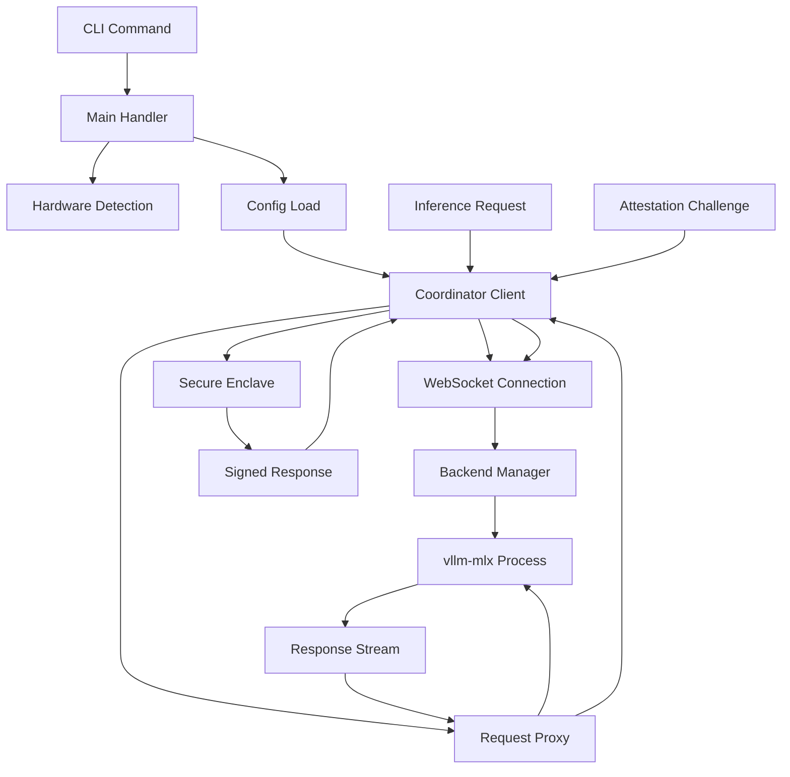

Based on my comprehensive analysis of the darkbloom component, I'll now provide a detailed analysis.

# Darkbloom Provider Agent Analysis

## Architecture

The darkbloom component follows a **modular service architecture** centered around a provider agent pattern. It serves as an EigenInference provider agent that runs on Apple Silicon Macs, managing local inference requests from a coordinator service while maintaining security and privacy guarantees through hardware-based attestation.

The architecture follows these key patterns:
- **Command-line interface** with multiple subcommands for different operations
- **WebSocket-based coordination** with automatic reconnection and exponential backoff
- **Backend process management** with health monitoring and automatic restart
- **Cryptographic security layers** including Secure Enclave attestation and E2E encryption
- **Telemetry and monitoring** with structured event collection

## Key Components

1. **Main CLI Handler** (`src/main.rs`): Entry point providing comprehensive command-line interface with 15+ subcommands including install, serve, models, status, and diagnostics. Handles coordinator URL defaults, model catalog management, and runtime verification.

2. **Coordinator Client** (`src/coordinator.rs`): WebSocket client managing persistent connection to EigenInference coordinator with automatic reconnection, registration, heartbeats, and attestation challenges. Uses exponential backoff for reliability.

3. **Backend Manager** (`src/backend/mod.rs`): Manages vllm-mlx inference backend processes with health monitoring, automatic restart, and capacity reporting. Includes exponential backoff recovery and model warmup capabilities.

4. **HTTP Server** (`src/server.rs`): Legacy local-only HTTP proxy server for debugging. Provides OpenAI-compatible endpoints but is quarantined behind feature flags and environment variables for security.

5. **Request Proxy** (`src/proxy.rs`): Handles inference request routing between coordinator and local backend, supporting both streaming and non-streaming requests with secure memory wiping.

6. **Cryptographic Layer** (`src/crypto.rs`): Implements ephemeral X25519 key pairs for E2E encryption using NaCl Box (XSalsa20-Poly1305). Keys are generated fresh on each launch for forward secrecy.

7. **Security Module** (`src/security.rs`): Enforces security invariants including SIP checks, Secure Enclave attestation, runtime integrity verification, and anti-debugging measures.

8. **Configuration System** (`src/config.rs`): TOML-based configuration management with hardware-adaptive defaults and CLI override capabilities.

9. **Hardware Detection** (`src/hardware.rs`): Detects Apple Silicon chip specifications including memory, GPU cores, and performance tiers for capacity planning.

10. **Service Manager** (`src/service.rs`): macOS launchd integration for background service management with controlled start/stop without auto-restart.

11. **Telemetry System** (`src/telemetry/`): Structured event collection with async batching, HTTPS upload, and disk overflow protection for operational monitoring.

12. **Model Management** (`src/models.rs`): Scans, downloads, and manages ML models from HuggingFace cache with memory-based filtering and integrity verification.

## Data Flows

The system implements several critical data flow patterns:

**Registration Flow**: Hardware detection → config generation → coordinate connection → Secure Enclave attestation → model advertising

**Inference Flow**: Encrypted request → coordinator decryption → backend forwarding → streaming response → usage tracking → completion signature

**Security Flow**: SIP verification → SE challenge-response → runtime hash verification → capability attestation

## External Dependencies

### Runtime Dependencies

- **tokio** (1.0) [async-runtime]: Provides the main async runtime for all concurrent operations. Used throughout for WebSocket handling, HTTP clients, and task spawning. Core to the coordinator connection and request processing pipelines.

- **reqwest** (0.12) [networking]: HTTP client library for backend health checks, coordinator API calls, and model downloads. Supports streaming responses and timeout configuration. Used in `coordinator.rs`, `proxy.rs`, and download functions.

- **tokio-tungstenite** (0.26) [networking]: WebSocket client implementation for coordinator connection. Handles the persistent WebSocket connection with automatic reconnection and message framing.

- **axum** (0.8) [web-framework]: HTTP server framework for the local debug proxy server. Provides routing, middleware, and request/response handling for OpenAI-compatible endpoints.

- **serde** (1.0) [serialization]: Core serialization framework with derive macros. Used for JSON message serialization/deserialization for coordinator protocol, configuration files, and API responses.

- **serde_json** (1.0) [serialization]: JSON serialization support for protocol messages, configuration, and API responses. Critical for coordinator communication protocol.

- **toml** (0.8) [serialization]: TOML configuration file parsing for provider settings. Used in `config.rs` for persistent configuration management.

- **clap** (4.0) [cli]: Command-line argument parsing with derive macros. Provides the comprehensive CLI interface with 15+ subcommands and option handling.

- **anyhow** (1.0) [error-handling]: Error handling and context chaining throughout the application. Provides ergonomic error propagation and debugging information.

- **tracing** (0.1) [logging]: Structured logging framework integrated with telemetry system. Used for operational monitoring and debugging.

- **tracing-subscriber** (0.3) [logging]: Log formatting and filtering for tracing events. Configures console output and telemetry integration.

- **crypto_box** (0.9) [crypto]: NaCl-compatible X25519 + XSalsa20-Poly1305 encryption for E2E request/response encryption. Implements the ephemeral key pair system in `crypto.rs`.

- **base64** (0.22) [crypto]: Base64 encoding/decoding for cryptographic keys and encrypted payloads in the coordinator protocol.

- **sha2** (0.10) [crypto]: SHA-256 hashing for runtime integrity verification, model fingerprinting, and attestation. Used extensively in security module.

- **uuid** (1.0) [misc]: UUID generation for request tracking and identification in coordinator protocol.

- **dirs** (6.0) [misc]: Platform-appropriate directory discovery for configuration, cache, and data storage locations.

- **chrono** (0.4) [misc]: Date/time handling for timestamps in telemetry and protocol messages.

- **futures-util** (0.3) [async]: Async utility functions for WebSocket stream handling and response processing.

- **libc** (0.2) [system]: Unix system call bindings for process management, signal handling, and security checks.

### Development Dependencies

- **tempfile** (3.0) [testing]: Temporary file/directory creation for configuration and model tests.
- **assert_cmd** (2.0) [testing]: CLI testing framework for command-line interface validation.
- **predicates** (3.0) [testing]: Assertion predicates for test validation.

### Platform-Specific Dependencies (macOS)

- **security-framework** (3.0) [crypto]: macOS Security.framework bindings for Secure Enclave operations and keychain access.
- **core-foundation** (0.10) [system]: Core Foundation bindings for macOS system integration.

### Optional Dependencies

- **pyo3** (0.24) [python]: Python interpreter embedding for in-process inference (Phase 3 feature). Currently behind "python" feature flag.

## API Surface

The component exposes multiple API interfaces:

**CLI Interface**: 15+ subcommands including `serve`, `install`, `models`, `status`, `doctor`, `login`, `update`, etc.

**WebSocket Protocol**: Bidirectional message protocol with coordinator including:
- Registration with hardware specs and attestation
- Heartbeat status updates with capacity reporting  
- Inference request/response streaming
- Attestation challenges and signed responses

**Local HTTP API** (Debug Only): OpenAI-compatible endpoints:
- `GET /health` - Backend health check
- `GET /v1/models` - Available models  
- `POST /v1/chat/completions` - Text generation (streaming/non-streaming)

**Configuration API**: TOML-based configuration with hardware-adaptive defaults and CLI overrides.

## External Systems

The component integrates with several external systems at runtime:

**EigenInference Coordinator**: Primary WebSocket connection for job distribution, attestation challenges, and capacity reporting. Handles secure routing of inference requests.

**HuggingFace Hub**: Model download and caching system. Downloads quantized models to local cache with integrity verification.

**Apple Secure Enclave**: Hardware security module for attestation and challenge-response authentication. Provides cryptographic proof of device identity.

**macOS Security Framework**: System integration for SIP status, Secure Boot verification, and security policy enforcement.

**vllm-mlx Backend**: Local inference engine spawned as subprocess. Provides OpenAI-compatible HTTP API for text generation.

**Tempo Blockchain**: Cryptocurrency payout system using pathUSD tokens. Wallet integration for provider earnings.

**Cloudflare R2 CDN**: Model and runtime distribution system. Downloads verified Python runtimes and model archives.

## Component Interactions

The darkbloom component operates as a standalone provider agent with **no internal dependencies** on other d-inference components. It connects externally to:

- **Coordinator Service**: WebSocket-based communication for job distribution and attestation
- **Model CDN**: HTTPS downloads of ML models and Python runtimes  
- **Blockchain Network**: Wallet integration for earnings distribution
- **Local Backend**: HTTP proxy to vllm-mlx inference engine

The component is designed to be self-contained and can operate in local-only mode without coordinator connectivity for development and testing scenarios.
