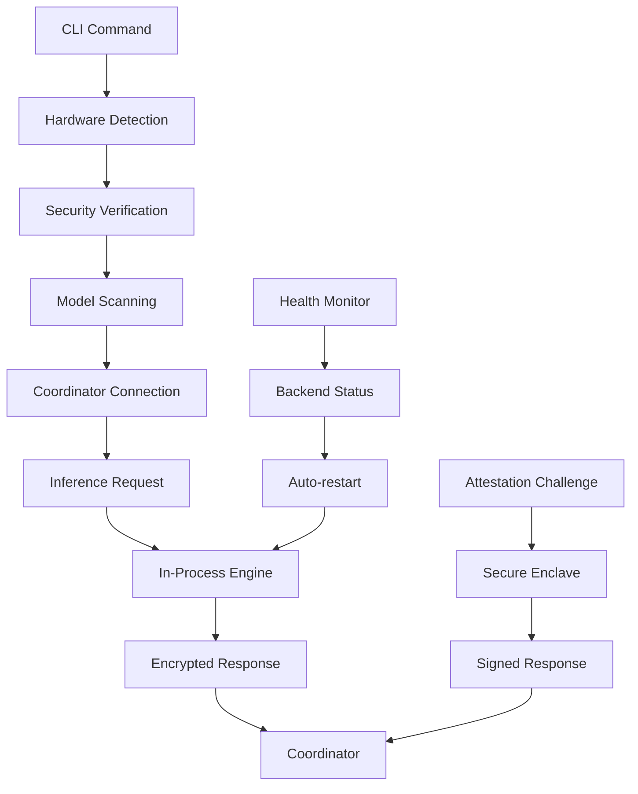

Now I have enough information to write a comprehensive analysis. Based on my exploration of the codebase, I can see this is the "darkbloom" provider component - a sophisticated macOS service that runs on Apple Silicon Macs to provide secure AI inference capabilities.

# Darkbloom Provider Component Analysis

## Architecture

The darkbloom component implements a **layered security architecture** with multiple protection mechanisms for privacy-preserving AI inference on Apple Silicon Macs. The architecture follows a **hardened agent pattern** where the provider runs as a macOS user service that connects to a central coordinator over WebSocket while implementing extensive security measures to protect inference data.

## Key Components

### 1. Main Service (`main.rs`)
- **Command dispatcher** handling 18+ CLI commands (install, serve, status, doctor, etc.)
- **Service orchestration** managing the full provider lifecycle from initialization to serving
- **Model management** with automatic downloading, selection, and memory optimization
- **Hardware detection** for Apple Silicon capabilities and memory constraints
- **Security initialization** including SIP verification, core dump disabling, and PT_DENY_ATTACH

### 2. Coordinator Client (`coordinator.rs`)
- **WebSocket client** with exponential backoff reconnection and automatic retry logic
- **Registration protocol** including hardware attestation, model advertising, and capability reporting
- **Real-time messaging** for inference request routing and response streaming
- **Heartbeat system** with provider statistics, capacity reporting, and health monitoring
- **Challenge-response authentication** using Secure Enclave cryptographic attestation

### 3. Security Hardening (`security.rs`)
- **PT_DENY_ATTACH protection** preventing debugger attachment and memory inspection
- **SIP verification** ensuring System Integrity Protection is enabled before serving
- **Environment sanitization** scrubbing dangerous environment variables
- **Python isolation** with locked import paths and blocked dangerous modules
- **Core dump prevention** to avoid leaking sensitive data in crash artifacts
- **RDMA detection** with hypervisor-based memory isolation for Thunderbolt 5 protection

### 4. In-Process Inference Engine (`inference.rs`)
- **Embedded Python runtime** using PyO3 for direct vllm-mlx integration
- **No IPC channels** - all inference happens within the hardened Rust process
- **Locked Python paths** preventing code injection from provider-controlled site-packages
- **Module blocking** for escape-hatch modules (socket, subprocess, ctypes, etc.)
- **Direct Metal integration** for GPU acceleration without external communication

### 5. Cryptographic System (`crypto.rs`)
- **Ephemeral X25519 key pairs** generated fresh on each provider launch
- **NaCl Box encryption** (XSalsa20-Poly1305) for end-to-end request/response protection
- **No persistent keys** - all cryptographic material exists only in protected memory
- **Base64 encoding** for wire protocol compatibility

### 6. Hardware Detection (`hardware.rs`)
- **Apple Silicon identification** parsing chip family (M1/M2/M3/M4) and tier (Base/Pro/Max/Ultra)
- **Memory bandwidth lookup** using chip-specific tables for accurate performance modeling
- **Live system metrics** including memory pressure, CPU usage, and thermal state
- **GPU core detection** via system_profiler for capacity planning

### 7. Model Management (`models.rs`)
- **HuggingFace cache scanning** for locally available MLX models
- **Memory filtering** ensuring only models that fit in available memory are advertised
- **Weight fingerprinting** using SHA-256 hashes for integrity verification
- **Automatic model resolution** from catalog IDs to local filesystem paths

### 8. Service Management (`service.rs`)
- **launchd integration** for macOS user agent lifecycle management
- **Non-persistent operation** (KeepAlive=false, RunAtLoad=false) requiring explicit user control
- **Process supervision** with controlled startup and graceful shutdown
- **Log file management** with structured output to ~/.darkbloom/provider.log

### 9. Telemetry System (`telemetry/`)
- **Structured event pipeline** with async batching and HTTPS delivery
- **Panic hook integration** for crash reporting without sensitive data leakage
- **Disk overflow queue** for offline event storage during network outages
- **Field filtering** ensuring no free-form user content enters telemetry streams

### 10. Hypervisor Memory Isolation (`hypervisor.rs`)
- **Stage 2 page table protection** using Apple's Hypervisor.framework
- **16MB-aligned memory pools** for macOS 26+ compatibility
- **RDMA-proof isolation** making inference memory invisible to Thunderbolt 5 DMA
- **Metal buffer integration** via bytesNoCopy for zero-copy GPU operations

### 11. Backend Management (`backend/`)
- **Health monitoring** with automatic crash detection and restart
- **Capacity polling** from vllm-mlx /v1/status endpoints for load balancing
- **Multi-model support** with per-model process isolation
- **Idle timeout management** to free GPU memory during inactivity

### 12. Protocol Implementation (`protocol.rs`)
- **WebSocket message types** for bidirectional provider-coordinator communication
- **End-to-end encryption payloads** with ephemeral key metadata
- **Attestation challenge/response** for continuous trust verification
- **Runtime integrity reporting** with hash mismatch detection and self-healing

## Data Flows

The component implements several critical data flows:

### Primary Inference Flow
1. **Request Reception**: Coordinator sends encrypted inference request over WebSocket
2. **Decryption**: Provider decrypts using ephemeral X25519 key pair
3. **In-Process Execution**: Embedded Python engine processes request without IPC
4. **Response Encryption**: Results encrypted back to coordinator's session key
5. **Streaming Delivery**: SSE chunks sent progressively via WebSocket

### Security Attestation Flow  
1. **Registration**: Provider sends hardware info, model list, and SE attestation
2. **Challenge**: Coordinator sends random nonce for freshness verification
3. **Response**: Secure Enclave signs nonce + current system state
4. **Verification**: Coordinator validates signature against Apple's root CA

### Health Monitoring Flow
1. **Periodic Checks**: 15-second health polls to backend HTTP endpoints
2. **Crash Detection**: 5 consecutive failures trigger automatic restart
3. **Process Management**: PID tracking for targeted SIGTERM/SIGKILL
4. **State Reporting**: Tri-state flags (running/idle_shutdown/crashed) for capacity reporting

## External Dependencies

### Runtime Libraries

- **tokio** (1.0) [async-runtime]: Full async runtime with all features for WebSocket, HTTP client, and concurrent task management. Used throughout main event loop, coordinator client, and telemetry pipeline. Imported in: `src/main.rs`, `src/coordinator.rs`, `src/telemetry/client.rs`.

- **reqwest** (0.12) [networking]: HTTP client with JSON and streaming support for coordinator API calls, model downloads, and telemetry delivery. Used in: `src/main.rs` (catalog fetching, downloads), `src/telemetry/client.rs` (event posting).

- **tokio-tungstenite** (0.26) [networking]: WebSocket client with TLS support for real-time coordinator connection. Core dependency for provider-coordinator protocol. Used in: `src/coordinator.rs`.

- **axum** (0.8) [web-framework]: HTTP server framework for local debugging mode (disabled in production). Used in: `src/server.rs`.

### Cryptography

- **crypto_box** (0.9) [crypto]: NaCl-compatible X25519 + XSalsa20-Poly1305 implementation for end-to-end encryption. Provides ephemeral key generation and message encryption/decryption. Used in: `src/crypto.rs`.

- **sha2** (0.10) [crypto]: SHA-256 hashing for binary integrity checking, model weight fingerprinting, and runtime verification. Used in: `src/security.rs`, `src/models.rs`.

- **base64** (0.22) [crypto]: Base64 encoding/decoding for wire protocol compatibility and key serialization. Used in: `src/crypto.rs`, `src/protocol.rs`.

- **zeroize** (1.0) [crypto]: Secure memory wiping to prevent plaintext from lingering in freed memory after decryption. Used in: `src/security.rs`.

### Serialization

- **serde** (1.0) [serialization]: Core serialization framework with derive macros. Used across all message types, configuration, and protocol definitions. Imported in: `src/protocol.rs`, `src/config.rs`, `src/models.rs`, `src/hardware.rs`.

- **serde_json** (1.0) [serialization]: JSON serialization for WebSocket messages, configuration files, and API responses. Used in: `src/coordinator.rs`, `src/main.rs`, `src/inference.rs`.

- **toml** (0.8) [serialization]: Configuration file parsing for provider settings. Used in: `src/config.rs`.

### Python Integration

- **pyo3** (0.24) [other]: Python FFI bindings for embedded interpreter. Optional feature enabling in-process inference engine. When enabled, links Python interpreter directly into Rust binary. Used in: `src/inference.rs`.

### System Integration

- **libc** (0.2) [other]: Unix system calls for security hardening (PT_DENY_ATTACH, signal handling, process management). Critical for memory protection and process control. Used in: `src/security.rs`, `src/main.rs`.

- **dirs** (6.0) [other]: Cross-platform directory discovery for home directory, cache paths, and config locations. Used throughout for file path resolution. Imported in: `src/main.rs`, `src/config.rs`, `src/models.rs`.

### macOS Framework Integration

- **security-framework** (3.0) [other]: macOS Security.framework bindings for Secure Enclave integration. Used for hardware attestation and cryptographic identity. Platform-specific to macOS. Used in: `src/secure_enclave_key.rs`.

- **core-foundation** (0.10) [other]: CoreFoundation bindings for macOS system integration. Required for Security.framework interop. Used in: `src/secure_enclave_key.rs`.

### Utilities

- **clap** (4.0) [cli]: Command-line argument parsing with derive macros. Handles all 18+ CLI commands with validation and help generation. Used in: `src/main.rs`.

- **anyhow** (1.0) [other]: Error handling with context chaining for detailed error messages. Used throughout for error propagation. Imported in most source files.

- **thiserror** (2.0) [other]: Custom error type derivation for structured error handling. Used in: `src/backend/mod.rs`, custom error types.

- **uuid** (1.0) [other]: UUID generation for request tracking and telemetry correlation. Used in: `src/telemetry/event.rs`.

- **chrono** (0.4) [other]: Date/time handling for timestamps and scheduling. Used in: `src/scheduling.rs`, `src/telemetry/event.rs`.

- **once_cell** (1.0) [other]: Thread-safe lazy static initialization for global state. Used in: `src/telemetry/mod.rs`.

- **backtrace** (0.3) [other]: Stack trace capture for panic reporting in telemetry. Used in: `src/telemetry/panic_hook.rs`.

### Terminal Interface

- **crossterm** (0.28) [cli]: Cross-platform terminal manipulation for interactive model picker UI. Used in: `src/main.rs` (model selection interface).

### Development Dependencies

- **tempfile** (3.0) [testing]: Temporary file creation for tests. Used in test modules.
- **assert_cmd** (2.0) [testing]: Command-line application testing framework. Used for integration tests.
- **predicates** (3.0) [testing]: Assertion predicates for test validation. Used with assert_cmd.
- **tower** (0.5) [testing]: Service abstraction utilities for HTTP testing. Used in test configurations.

## API Surface

### Command-Line Interface
- `darkbloom init` - Hardware detection and config initialization
- `darkbloom serve` - Start inference service with coordinator connection
- `darkbloom install` - One-command setup with MDM enrollment and model download
- `darkbloom status` - Show hardware, connection, and model status
- `darkbloom models` - List, download, or remove models with interactive picker
- `darkbloom doctor` - Comprehensive diagnostics for security and connectivity
- `darkbloom start/stop` - launchd service management
- `darkbloom login/logout` - Account linking for earnings
- `darkbloom update` - Self-updating mechanism with signature verification

### WebSocket Protocol Messages
- **Provider→Coordinator**: Register, Heartbeat, InferenceResponseChunk, InferenceComplete, AttestationResponse
- **Coordinator→Provider**: InferenceRequest, Cancel, AttestationChallenge, RuntimeStatus

### Configuration API
- Hardware-specific defaults based on Apple Silicon chip detection
- Coordinator URL configuration with environment-specific defaults
- Schedule-based operation windows for provider availability
- Backend configuration (ports, models, idle timeouts)

## External Systems

### Apple System Services
- **Secure Enclave**: Hardware attestation and cryptographic signing via Security.framework
- **Hypervisor.framework**: Memory isolation for RDMA protection
- **launchd**: User agent lifecycle management and process supervision
- **System Integrity Protection**: Foundation security service verification

### macOS System Integration  
- **Hardware detection**: via sysctl, system_profiler, ioreg for chip identification
- **Security verification**: csrutil for SIP status, pmset for thermal monitoring
- **MDM integration**: Configuration profiles for device attestation enrollment

### Network Services
- **Darkbloom Coordinator**: WebSocket connection for request routing and provider management
- **Cloudflare R2 CDN**: Model downloads, runtime updates, and template distribution
- **HuggingFace Hub**: Model metadata and fallback downloads via public API

### File System Dependencies
- **~/.cache/huggingface/hub/**: Local model cache for MLX models
- **~/.darkbloom/**: Provider configuration, logs, auth tokens, and runtime cache
- **~/Library/LaunchAgents/**: macOS service registration

## Component Interactions

The darkbloom provider operates as a **standalone agent** with no direct dependencies on other d-inference components. All interactions occur through the central coordinator service:

### External API Calls
- **GET /v1/models/catalog** - Fetch available models from coordinator
- **POST /v1/enroll** - Device attestation enrollment 
- **GET /v1/releases/latest** - Check for updates
- **WebSocket /ws/provider** - Real-time inference request/response channel

### Service Dependencies
- **Coordinator Service**: Primary dependency for all inference routing, model distribution, and earnings tracking
- **CDN Services**: R2 bucket access for model downloads and runtime updates
- **Apple Services**: Secure Enclave attestation and system security verification

The component is designed for **autonomous operation** - it can function independently once configured, with automatic reconnection, self-healing capabilities, and graceful degradation when external services are unavailable.
