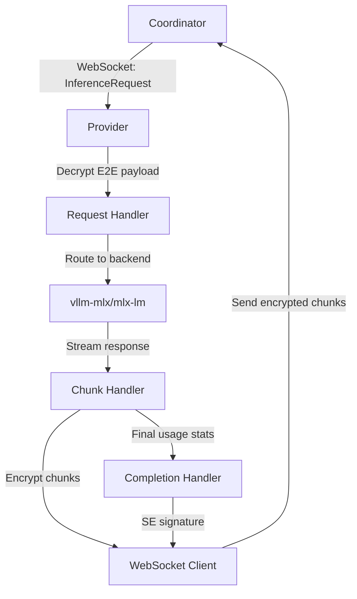
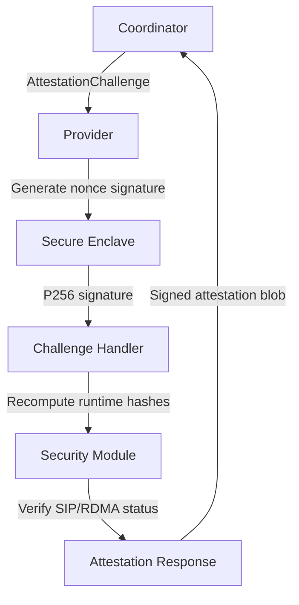
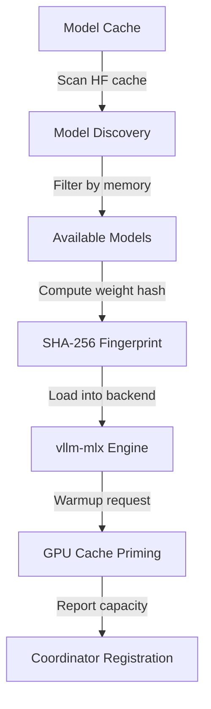

Perfect! Now I have a comprehensive understanding of the darkbloom component. Let me write the analysis.

# Darkbloom Provider Agent Analysis

## Architecture

Darkbloom is an **EigenInference provider agent** designed specifically for Apple Silicon Macs that implements a **hardened inference runtime** with **end-to-end encryption** and **hardware attestation** capabilities. The architecture follows a **security-first design** with multiple layers of protection to ensure inference privacy while connecting to the EigenInference coordinator network.

The system implements a **hybrid architecture** combining:
- **Local HTTP proxy mode** (legacy, debug-only)
- **Coordinator-mediated inference** (production)  
- **In-process Python embedding** (Phase 3 security)
- **Hardware attestation** via Apple Secure Enclave

## Key Components

### 1. **Main Orchestrator** (`src/main.rs`)
**Purpose**: Central command dispatcher and application entry point  
**Functionality**: Implements comprehensive CLI interface with 19 subcommands, handles model catalog management, automated installation flow, and runtime verification. Manages download progress with resume capability, fallback catalog for offline operation, and security posture verification.

### 2. **Coordinator Client** (`src/coordinator.rs`)  
**Purpose**: WebSocket connection manager for coordinator communication  
**Functionality**: Implements automatic reconnection with exponential backoff, handles provider registration with hardware attestation, processes inference request routing, and manages periodic heartbeats with runtime statistics.

### 3. **Backend Manager** (`src/backend/mod.rs`, `src/backend/vllm_mlx.rs`)
**Purpose**: Inference engine lifecycle management  
**Functionality**: Manages vllm-mlx and mlx-lm backends with health monitoring, automatic restart on failures, and capacity reporting. Supports both subprocess and in-process execution modes.

### 4. **In-Process Engine** (`src/inference.rs`) 
**Purpose**: Phase 3 security implementation using embedded Python  
**Functionality**: Runs inference entirely within the hardened Rust process via PyO3, implements locked Python import paths, blocks dangerous modules, and provides single-process privacy guarantees.

### 5. **Security Hardening** (`src/security.rs`)
**Purpose**: Runtime protection implementation  
**Functionality**: Implements PT_DENY_ATTACH debugger blocking, SIP verification, RDMA safety checks, core dump prevention, and environment variable scrubbing.

### 6. **Hardware Detection** (`src/hardware.rs`)
**Purpose**: Apple Silicon capability discovery  
**Functionality**: Detects chip family/tier, memory configuration, GPU cores, system metrics (thermal state, memory pressure), and determines memory bandwidth from lookup tables.

### 7. **Model Discovery** (`src/models.rs`)
**Purpose**: Local model cache management  
**Functionality**: Scans HuggingFace cache for MLX models, computes SHA-256 weight fingerprints, estimates memory requirements, and filters by hardware constraints.

### 8. **Cryptographic Engine** (`src/crypto.rs`)
**Purpose**: End-to-end encryption implementation  
**Functionality**: Generates ephemeral X25519 keypairs, implements NaCl Box encryption/decryption, and manages secure key lifecycle with memory wiping.

### 9. **Secure Enclave Interface** (`src/secure_enclave_key.rs`)
**Purpose**: Hardware attestation via Apple Secure Enclave  
**Functionality**: Creates ephemeral SE signing keys, implements challenge-response attestation, and provides hardware identity binding.

### 10. **Telemetry System** (`src/telemetry/`)
**Purpose**: Structured event collection and reporting  
**Functionality**: Implements async batching, disk overflow handling, stderr scraping, and panic hook integration with coordinator reporting.

### 11. **Service Management** (`src/service.rs`)
**Purpose**: macOS launchd integration  
**Functionality**: Creates user agents with explicit control (no auto-start), manages process lifecycle, and provides background operation capability.

### 12. **HTTP Proxy Server** (`src/server.rs`)
**Purpose**: Legacy local-only inference proxy  
**Functionality**: OpenAI-compatible API proxy (debug-only), quarantined behind environment flags, transparent streaming support.

## Data Flows

### Inference Request Flow (Coordinator Mode)

### Hardware Attestation Flow

### Model Loading and Verification Flow  

## External Dependencies

### Runtime Dependencies

- **tokio** (1.0) [async-runtime]: Core async runtime powering all I/O operations. Used throughout for WebSocket connections, HTTP clients, and concurrent task management. Imported in: all async modules.

- **reqwest** (0.12) [networking]: HTTP client for coordinator API calls, health checks, and model downloads. Features include JSON parsing and streaming support. Imported in: `src/main.rs`, `src/coordinator.rs`, `src/backend/mod.rs`.

- **tokio-tungstenite** (0.26) [networking]: WebSocket client implementation for coordinator communication with TLS support. Handles connection lifecycle and message framing. Imported in: `src/coordinator.rs`.

- **axum** (0.8) [web-framework]: HTTP server framework for local API proxy mode. Provides routing, middleware, and streaming response handling. Imported in: `src/server.rs`.

- **serde** (1.0) [serialization]: JSON serialization/deserialization for protocol messages, configuration, and API responses. Used via derive macros across all data structures. Imported in: `src/protocol.rs`, `src/config.rs`, `src/models.rs`, `src/hardware.rs`.

- **serde_json** (1.0) [serialization]: JSON processing companion to serde for dynamic value handling and raw value preservation. Imported in: `src/main.rs`, `src/protocol.rs`, `src/coordinator.rs`.

- **toml** (0.8) [serialization]: Configuration file format parsing for provider settings stored in `~/.config/eigeninference/provider.toml`. Imported in: `src/config.rs`.

- **tracing** (0.1) [logging]: Structured logging framework with span support for debugging and telemetry. Provides hierarchical event tracking. Imported in: all modules.

- **tracing-subscriber** (0.3) [logging]: Log formatting and filtering implementation with environment-based configuration and JSON output support. Imported in: `src/main.rs`.

- **clap** (4.0) [cli]: Command-line argument parsing with derive macros for the comprehensive CLI interface supporting 19 subcommands. Imported in: `src/main.rs`.

- **anyhow** (1.0) [error-handling]: Error handling with context chains and source preservation for debugging complex failure paths. Imported in: all modules for `Result<()>` returns.

- **async-trait** (0.1) [async-trait]: Enables async methods in traits, specifically used for the `Backend` trait abstraction. Imported in: `src/backend/mod.rs`.

- **futures-util** (0.3) [async-runtime]: Stream processing utilities for WebSocket message handling and download progress tracking. Imported in: `src/main.rs`, `src/coordinator.rs`.

- **uuid** (1.0) [other]: UUID generation for request tracking and unique identification in distributed inference requests. Imported in: `src/coordinator.rs`.

- **chrono** (0.4) [other]: Date/time handling for timestamps in attestation challenges and log entries. Imported in: `src/main.rs`.

- **once_cell** (1.0) [other]: Thread-safe lazy static initialization for global telemetry client and configuration. Imported in: `src/telemetry/mod.rs`.

- **dirs** (6.0) [other]: Cross-platform directory path resolution for config, cache, and home directories. Imported in: `src/main.rs`, `src/config.rs`, `src/models.rs`.

- **tokio-util** (0.7) [async-runtime]: Additional async utilities for codec implementations and stream processing helpers. Imported in: `src/main.rs`.

### Cryptography Dependencies

- **crypto_box** (0.9) [crypto]: NaCl Box implementation providing X25519 key exchange with XSalsa20-Poly1305 AEAD for end-to-end encryption. Imported in: `src/crypto.rs`.

- **base64** (0.22) [crypto]: Base64 encoding for key serialization and encrypted payload transport in JSON messages. Imported in: `src/crypto.rs`, `src/security.rs`.

- **sha2** (0.10) [crypto]: SHA-256 hashing for model weight fingerprinting, binary integrity verification, and runtime hash computation. Imported in: `src/main.rs`, `src/security.rs`, `src/inference.rs`.

- **zeroize** (1.0) [crypto]: Secure memory wiping to prevent decrypted plaintext from lingering in freed memory after use. Imported in: `src/crypto.rs`.

### Platform-Specific Dependencies (macOS)

- **security-framework** (3.0) [crypto]: macOS Security.framework bindings for Keychain access and certificate management. Imported in: `src/secure_enclave_key.rs`.

- **security-framework-sys** (2.0) [crypto]: Low-level Security.framework system bindings for direct API access. Imported in: `src/secure_enclave_key.rs`.

- **core-foundation** (0.10) [other]: Core Foundation framework bindings for macOS system integration. Imported in: `src/secure_enclave_key.rs`.

- **libc** (0.2) [other]: C standard library bindings for system calls including PT_DENY_ATTACH, setrlimit, and process management. Imported in: `src/main.rs`, `src/security.rs`.

### Optional Dependencies

- **pyo3** (0.24) [other]: Python interpreter embedding for in-process inference execution. Optional behind `python` feature flag for Phase 3 security. Imported in: `src/inference.rs`.

- **crossterm** (0.28) [cli]: Terminal UI library for raw key input in interactive model picker interface. Imported in: `src/main.rs`.

### Development Dependencies

- **tempfile** (3.0) [testing]: Temporary file management for configuration and cache testing scenarios. Used in: `src/config.rs` tests.

- **tower** (0.5) [testing]: Service abstraction utilities for HTTP server testing with request/response mocking. Used in: `src/server.rs` tests.

## API Surface

### CLI Commands (19 subcommands)
- `darkbloom init` - Initialize provider configuration and hardware detection
- `darkbloom serve` - Start serving inference requests (local or coordinator mode)  
- `darkbloom install` - One-command setup: MDM enrollment, model download, service start
- `darkbloom models {list|download|remove}` - Model lifecycle management
- `darkbloom status` - Hardware and connection status reporting
- `darkbloom doctor` - Comprehensive diagnostic tool
- `darkbloom start/stop/logs` - Service lifecycle management
- `darkbloom login/logout` - Account linking for earnings
- `darkbloom update` - Automatic binary and runtime updates

### WebSocket Protocol (Coordinator Communication)
- **ProviderMessage::Register** - Initial registration with hardware info and attestation
- **ProviderMessage::Heartbeat** - Periodic status updates with system metrics
- **ProviderMessage::InferenceResponseChunk** - Streaming inference output
- **ProviderMessage::AttestationResponse** - Challenge-response authentication
- **CoordinatorMessage::InferenceRequest** - Encrypted inference routing
- **CoordinatorMessage::AttestationChallenge** - Security verification

### HTTP API (Local Mode)
- `GET /health` - Backend health status
- `GET /v1/models` - Available model listing  
- `POST /v1/chat/completions` - OpenAI-compatible inference endpoint

## External Systems

### Infrastructure Dependencies

- **EigenInference Coordinator** (api.darkbloom.dev): Central orchestration service for provider registration, inference routing, and payment processing
- **Cloudflare R2 CDN** (pub-*.r2.dev): Model distribution, runtime packages, and template delivery with global edge caching  
- **Apple MDM Infrastructure**: Device attestation enrollment and security policy enforcement
- **Tempo Blockchain**: pathUSD payment settlement for inference earnings

### Cloud Services Integration

- **Apple Secure Enclave**: Hardware attestation and challenge-response authentication
- **macOS Security Framework**: Keychain integration and certificate validation
- **HuggingFace Model Hub**: Model discovery and metadata retrieval (fallback only)

## Component Interactions

### Internal Component Communication

- **Main ↔ Coordinator Client**: Event-driven communication via mpsc channels for inference requests, attestation challenges, and connection state changes
- **Main ↔ Backend Manager**: Direct async calls for health checks, capacity queries, and lifecycle management  
- **Main ↔ Telemetry System**: Fire-and-forget event emission with async batching and overflow handling
- **Backend Manager ↔ HTTP Backends**: REST API communication for health checks, model queries, and inference requests
- **Coordinator Client ↔ Crypto Engine**: Key exchange for E2E encryption of inference payloads and responses

### External Component Dependencies

**None** - Darkbloom is designed as a standalone provider agent with no internal dependencies on other d-inference components. All external communication occurs through:
- WebSocket connections to the coordinator
- HTTP calls to CDN endpoints  
- Local file system operations for model cache and configuration management

This isolation enables independent deployment, testing, and updates without coupling to other system components.
