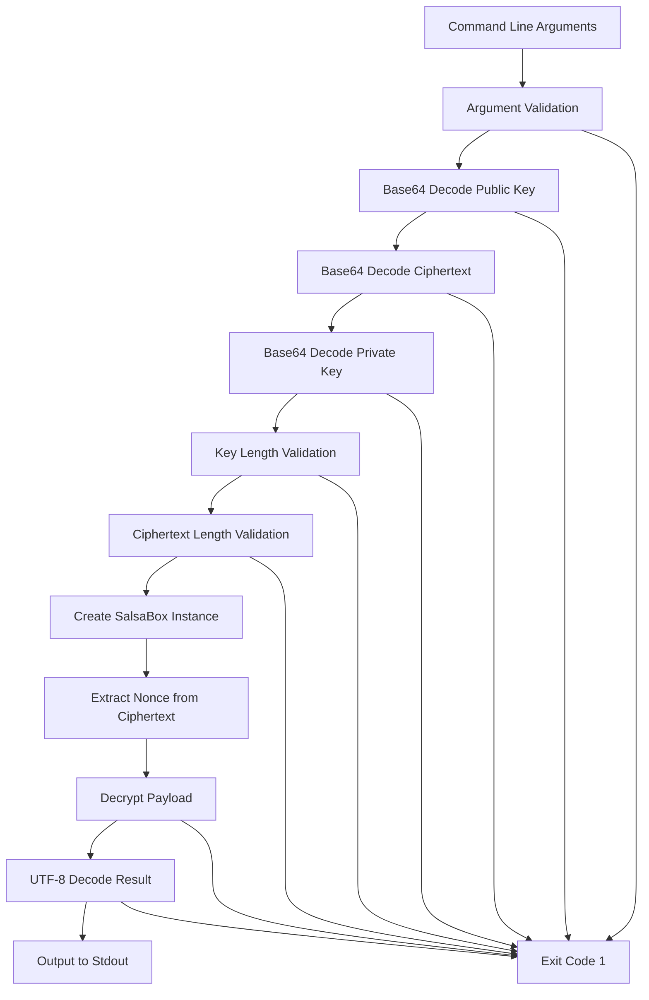

# decrypt-test CLI Analysis

## Overview

The `decrypt-test` component is a minimal NaCl Box decryptor CLI tool designed specifically for cross-language compatibility testing in the d-inference system. It serves as a test utility to verify that encrypted data produced by one part of the system can be successfully decrypted by different language implementations, ensuring cryptographic interoperability across the distributed inference platform.

## Architecture

The component follows a straightforward **procedural architecture** pattern typical of simple CLI utilities. The entire functionality is contained within a single `main.rs` file that handles argument parsing, Base64 decoding, cryptographic operations, and output formatting in a linear flow. This simple design is appropriate for its focused testing purpose.

### Data Flow

## Key Components

### Main Function
The single entry point handles the complete decryption workflow from command-line argument parsing through encrypted data processing to plaintext output.

### Argument Processing
Validates exactly three command-line arguments: ephemeral public key, ciphertext, and provider private key, all expected as Base64-encoded strings.

### Base64 Decoding Pipeline
Uses the standard Base64 decoder to convert string arguments into byte arrays, with comprehensive error handling for malformed input.

### Cryptographic Key Validation
Ensures both public and private keys are exactly 32 bytes in length, conforming to X25519 key specifications.

### NaCl Box Decryption Engine
Creates a SalsaBox instance using the provided keys and performs authenticated decryption of the ciphertext payload.

### Nonce Extraction
Separates the 24-byte nonce prefix from the ciphertext, validating minimum ciphertext length requirements.

### Output Processing
Converts decrypted bytes to UTF-8 string format and outputs directly to stdout for integration with testing frameworks.

## External Dependencies

### External Libraries

- **crypto_box** (0.9) [crypto]: Provides NaCl-compatible authenticated encryption using X25519 key exchange and XSalsa20Poly1305 AEAD. This is the core cryptographic library enabling interoperability with NaCl implementations in other languages. Used throughout the main function for PublicKey, SecretKey, SalsaBox, and Aead trait implementations.

- **base64** (0.22) [serialization]: Provides Base64 encoding/decoding functionality using the standard alphabet. Used to decode all three command-line arguments from Base64 strings to byte arrays. Imported via the STANDARD engine constant and Engine trait.

## API Surface

### Command Line Interface

**Usage**: `decrypt-test <ephemeral_public_key_b64> <ciphertext_b64> <provider_private_key_b64>`

**Arguments**:
- `ephemeral_public_key_b64`: Base64-encoded 32-byte X25519 public key from the coordinator
- `ciphertext_b64`: Base64-encoded payload (24-byte nonce concatenated with encrypted data)  
- `provider_private_key_b64`: Base64-encoded 32-byte X25519 private key for decryption

**Output**: Decrypted plaintext printed to stdout as UTF-8 string
**Exit Codes**: 
- `0`: Successful decryption and output
- `1`: Any error condition (invalid arguments, decoding failure, decryption failure, invalid UTF-8)

### Error Handling

The CLI provides specific error messages for different failure modes:
- Invalid argument count
- Base64 decoding failures for each input type
- Incorrect key lengths (must be exactly 32 bytes)
- Insufficient ciphertext length (minimum 24 bytes for nonce)
- Cryptographic decryption failures
- Non-UTF-8 plaintext content

## External Systems

This component operates as a standalone CLI utility with no runtime connections to external systems. It processes input arguments and produces output without network communication, file I/O, or database interactions.

## Component Interactions

The decrypt-test utility is designed for integration with the e2e testing framework but operates independently. It serves as a verification tool for encrypted data produced by other components in the d-inference system, particularly testing cross-language compatibility of the cryptographic protocols used for secure communication between coordinators and inference providers.
