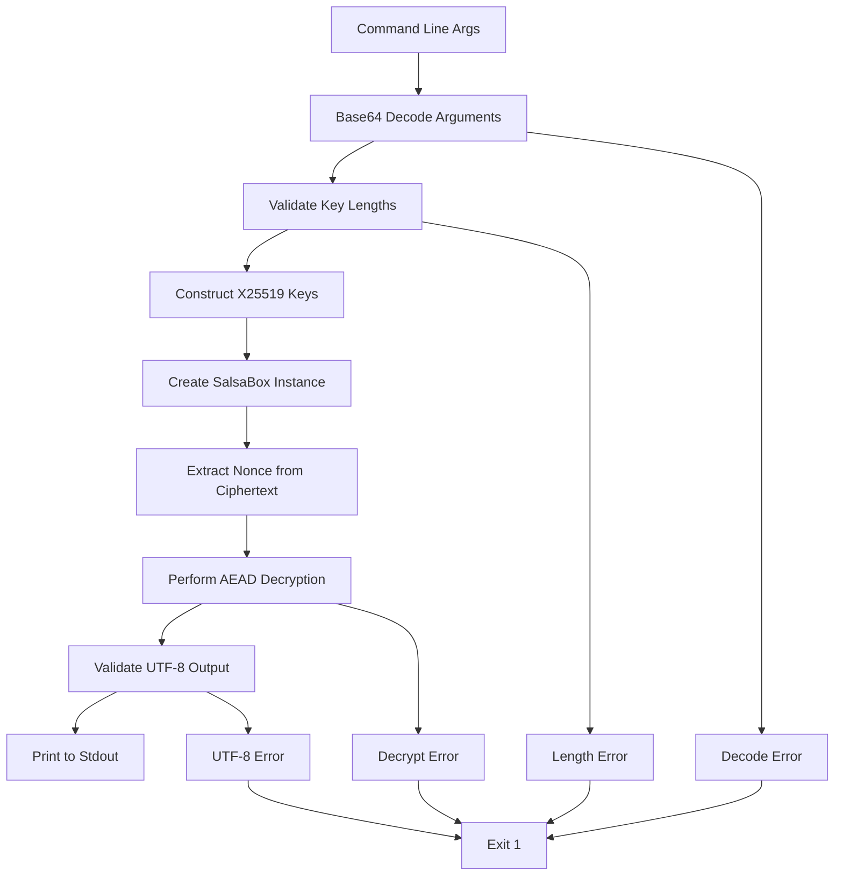

# decrypt-test Component Analysis

## Overview

The `decrypt-test` component is a minimal command-line utility written in Rust for NaCl Box decryption, specifically designed for cross-language compatibility testing in the d-inference system's end-to-end test suite. This tool implements X25519 elliptic curve Diffie-Hellman key exchange with XSalsa20-Poly1305 authenticated encryption, following the NaCl (Networking and Cryptography Library) Box construction.

## Architecture

The component follows a simple linear architecture with no abstraction layers or modular design patterns. It implements a straightforward procedural approach:

1. **Command-line Argument Parsing**: Direct access to `std::env::args()` with manual validation
2. **Base64 Decoding**: Sequential decoding of all input parameters
3. **Cryptographic Key Construction**: Assembly of X25519 keys from decoded bytes
4. **Decryption Operation**: Single-shot decryption using the NaCl Box construction
5. **Output Generation**: Direct stdout output with UTF-8 validation

The architecture prioritizes simplicity and reliability over extensibility, making it suitable for its role as a testing utility.

## Key Components

### Main Function Entry Point
The entire application logic resides in the `main()` function, which handles argument parsing, validation, and the complete decryption workflow. This monolithic approach ensures predictable behavior and minimal attack surface for the test utility.

### Argument Processing Module
Implements command-line argument validation with explicit error handling for three required parameters:
- Ephemeral public key (base64-encoded 32-byte X25519 key)
- Ciphertext (base64-encoded nonce + encrypted data)
- Provider private key (base64-encoded 32-byte X25519 key)

### Base64 Decoder Integration
Uses the `base64` crate's standard engine for consistent encoding/decoding behavior across different platforms and Rust versions. All decoding operations include comprehensive error handling with descriptive messages.

### Cryptographic Core
Leverages the `crypto_box` crate for NaCl Box operations, specifically:
- X25519 key pair construction from raw bytes
- SalsaBox creation for the key exchange
- XSalsa20-Poly1305 AEAD decryption with nonce extraction

### Error Management System
Implements a fail-fast error handling strategy where any validation failure or cryptographic error results in immediate program termination with exit code 1 and descriptive error messages to stderr.

## Data Flows

The component implements a single linear data flow from command-line input to decrypted output:



### Input Processing Flow
1. **Argument Collection**: Retrieves command-line arguments via `std::env::args()`
2. **Base64 Decoding**: Sequentially decodes all three base64 parameters
3. **Length Validation**: Ensures keys are exactly 32 bytes and ciphertext contains at least 24 bytes for nonce
4. **Array Conversion**: Converts validated byte vectors to fixed-size arrays for cryptographic operations

### Cryptographic Processing Flow
1. **Key Construction**: Creates `PublicKey` and `SecretKey` instances from validated byte arrays
2. **Box Creation**: Establishes shared secret via `SalsaBox::new()` using ECDH
3. **Nonce Extraction**: Splits first 24 bytes of ciphertext as XSalsa20 nonce
4. **Decryption**: Performs authenticated decryption on remaining ciphertext bytes
5. **Output Validation**: Ensures decrypted plaintext is valid UTF-8 before output

## External Dependencies

### External Libraries

- **crypto_box** (0.9) [crypto]: Provides NaCl-compatible authenticated encryption using X25519 key exchange and XSalsa20-Poly1305 AEAD. This is the core cryptographic engine used for all decryption operations via the `SalsaBox`, `PublicKey`, and `SecretKey` types. Imported in: `src/main.rs`.

- **base64** (0.22) [serialization]: Provides base64 encoding/decoding functionality through the `STANDARD` engine. Used to decode all command-line arguments from base64 format into raw bytes for cryptographic processing. Imported in: `src/main.rs`.

The component has no development dependencies and relies only on these two runtime dependencies plus the Rust standard library.

## API Surface

### Command-Line Interface

The component exposes a single command-line interface with three positional arguments:

```
decrypt-test <ephemeral_public_key_b64> <ciphertext_b64> <provider_private_key_b64>
```

**Parameters:**
- `ephemeral_public_key_b64`: Base64-encoded 32-byte X25519 public key from the coordinator
- `ciphertext_b64`: Base64-encoded payload containing 24-byte nonce followed by NaCl Box encrypted data
- `provider_private_key_b64`: Base64-encoded 32-byte X25519 private key for decryption

**Output Behavior:**
- **Success (Exit 0)**: Decrypted plaintext printed to stdout as UTF-8 text
- **Failure (Exit 1)**: Error message printed to stderr, covering argument count, base64 decoding errors, key length validation, ciphertext format validation, decryption failures, and UTF-8 validation

**Error Handling:**
The CLI provides specific error messages for different failure modes:
- Incorrect argument count with usage information
- Base64 decoding failures with parameter identification
- Key length validation with expected vs actual byte counts
- Ciphertext length validation for minimum nonce requirements
- Cryptographic decryption failures
- UTF-8 validation failures for output text

This simple interface makes the tool suitable for integration into shell scripts and automated testing frameworks within the d-inference end-to-end test suite.
