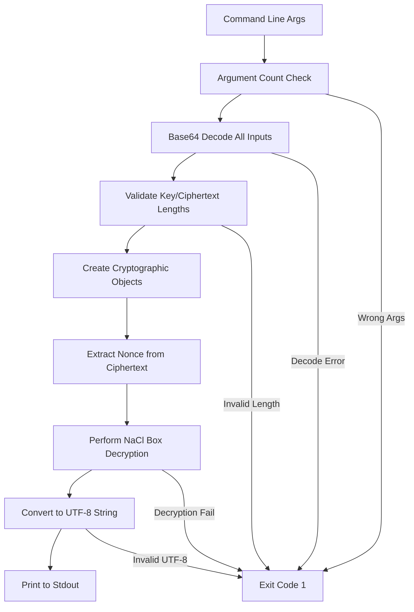

# decrypt-test CLI Component Analysis

## Architecture

The decrypt-test component is a minimal command-line utility built with Rust that implements NaCl Box (XSalsa20-Poly1305) decryption for cross-language compatibility testing. It follows a simple linear architecture pattern with direct command-line argument processing, input validation, cryptographic operations, and output to stdout.

The component is designed as a test utility specifically for the d-inference coordinator's end-to-end testing infrastructure, providing a reference implementation for validating encrypted message exchange between different language implementations.

## Key Components

### Main Entry Point
- **Location**: `src/main.rs` (lines 15-81)
- **Purpose**: Single-file CLI application handling argument parsing, validation, and decryption workflow
- **Key Functions**: Processes three base64-encoded arguments (ephemeral public key, ciphertext, provider private key)

### Argument Processing
- **Location**: `src/main.rs` (lines 16-23)
- **Purpose**: Validates command-line arguments count and displays usage information
- **Behavior**: Exits with code 1 if incorrect number of arguments provided

### Base64 Decoding Layer
- **Location**: `src/main.rs` (lines 25-36)
- **Purpose**: Decodes all three base64-encoded input parameters
- **Error Handling**: Exits with descriptive error messages on decode failures

### Input Validation
- **Location**: `src/main.rs` (lines 38-58)  
- **Purpose**: Validates cryptographic parameter lengths and constraints
- **Checks**: Ensures 32-byte keys and minimum 24-byte ciphertext (for nonce)

### Cryptographic Operations
- **Location**: `src/main.rs` (lines 60-75)
- **Purpose**: Performs NaCl Box decryption using X25519 key exchange and XSalsa20-Poly1305 AEAD
- **Process**: Creates SalsaBox from keys, extracts nonce, decrypts payload

### Output Handler  
- **Location**: `src/main.rs` (lines 77-81)
- **Purpose**: Converts decrypted bytes to UTF-8 string and prints to stdout
- **Error Handling**: Validates UTF-8 encoding before output

## Data Flows

The component implements a strict linear data flow with fail-fast error handling. Each stage validates its inputs and exits immediately on any error condition, ensuring reliable operation for automated testing scenarios.

## External Dependencies

### External Libraries

- **crypto_box** (0.9) [crypto]: Provides NaCl-compatible cryptographic primitives including X25519 key exchange and XSalsa20-Poly1305 AEAD encryption. Used for creating PublicKey, SecretKey, and SalsaBox objects and performing decryption operations. Imported in: `src/main.rs`.

- **base64** (0.22) [serialization]: Provides base64 encoding/decoding functionality using the standard character set. Used to decode all three command-line arguments from base64 format. The STANDARD engine is imported and used throughout. Imported in: `src/main.rs`.

## API Surface

### Command Line Interface
- **Usage**: `decrypt-test <ephemeral_public_key_b64> <ciphertext_b64> <provider_private_key_b64>`
- **Parameters**:
  - `ephemeral_public_key_b64`: Base64-encoded 32-byte X25519 public key from coordinator
  - `ciphertext_b64`: Base64-encoded data with 24-byte nonce prefix + encrypted payload
  - `provider_private_key_b64`: Base64-encoded 32-byte X25519 private key
- **Output**: Decrypted plaintext written to stdout
- **Exit Codes**: 0 for success, 1 for any error condition

### Error Handling
- **Input Validation**: Comprehensive validation of argument count, base64 encoding, and cryptographic parameter lengths
- **Cryptographic Failures**: Clear error messages for decryption failures and invalid UTF-8 output
- **User Feedback**: All errors written to stderr with descriptive messages before exit
