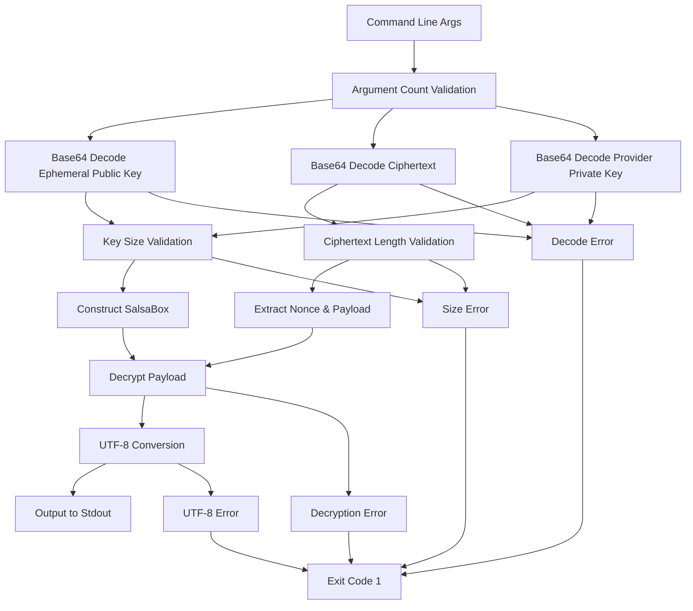

# decrypt-test Component Analysis

## Architecture

The decrypt-test component follows a simple command-line utility architecture with a linear execution pattern. The tool is designed as a minimal standalone binary that performs a single cryptographic operation: decrypting NaCl Box encrypted data using X25519 elliptic curve cryptography. The architecture is straightforward with input validation, key construction, and decryption operations in sequence.

The component serves as a cross-language compatibility testing tool, allowing Go-based encryption in the coordinator to be verified against Rust's crypto_box implementation, ensuring cryptographic interoperability between different language implementations of the same protocol.

## Key Components

### Main Function
The entry point handles command-line argument parsing and orchestrates the entire decryption process. It validates exactly 3 arguments are provided and coordinates the base64 decoding, key validation, and decryption operations.

### Base64 Decoding Layer
Utilizes the standard base64 engine to decode all three input parameters: ephemeral public key, ciphertext, and provider private key. Each decoding operation includes comprehensive error handling with descriptive error messages.

### Key Size Validation
Implements strict validation ensuring the ephemeral public key and provider private key are exactly 32 bytes each, conforming to X25519 key specifications. The ciphertext must be at least 24 bytes to accommodate the required nonce.

### Cryptographic Operations
Constructs a SalsaBox instance from the ephemeral public key and provider private key, then performs authenticated decryption using the first 24 bytes of ciphertext as nonce and remaining bytes as encrypted payload.

### Error Handling System
Provides comprehensive error handling with descriptive messages for each failure mode, including base64 decoding errors, key size validation failures, ciphertext length issues, decryption failures, and UTF-8 conversion errors.

### Output Processing
Converts the decrypted bytes to UTF-8 string and outputs directly to stdout, enabling easy consumption by calling processes in testing scenarios.

## Data Flows



The data flow shows a linear pipeline with multiple validation checkpoints. Input validation occurs early to catch malformed data before expensive cryptographic operations. All error paths lead to process exit with code 1 and descriptive error messages to stderr.

## External Dependencies

### External Libraries

- **crypto_box** (0.9) [crypto]: Provides NaCl-compatible cryptographic primitives including X25519 elliptic curve Diffie-Hellman, XSalsa20 stream cipher, and Poly1305 message authentication. Used for constructing PublicKey, SecretKey, and SalsaBox instances, and performing authenticated encryption/decryption. Imported in: `src/main.rs` lines 12-13.

- **base64** (0.22) [serialization]: Provides base64 encoding and decoding functionality using the standard base64 alphabet. Used to decode all three command-line arguments from base64 format into raw bytes for cryptographic operations. Imported in: `src/main.rs` lines 10-11, specifically using the STANDARD engine.

## API Surface

### Command-Line Interface

The component exposes a single command-line interface:
```
decrypt-test <ephemeral_public_key_b64> <ciphertext_b64> <provider_private_key_b64>
```

**Parameters:**
- `ephemeral_public_key_b64`: Base64-encoded 32-byte X25519 public key from the coordinator's ephemeral session
- `ciphertext_b64`: Base64-encoded data containing 24-byte nonce concatenated with NaCl Box encrypted payload
- `provider_private_key_b64`: Base64-encoded 32-byte X25519 private key for decryption

**Output:**
- Success: Decrypted plaintext written to stdout
- Failure: Error message to stderr and exit code 1

### Integration Points

The component is specifically designed for integration with Go-based end-to-end tests in the coordinator. The cross-language compatibility test builds this binary and shells out to it, passing encrypted payloads created by Go's `golang.org/x/crypto/nacl/box` package to verify cryptographic compatibility between language implementations.
