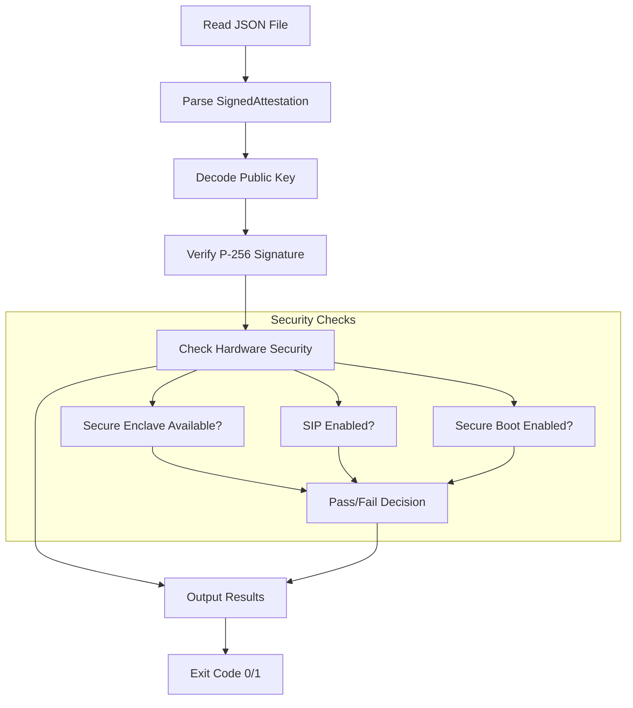

# verify-attestation

The verify-attestation component is a **standalone command-line utility** for verifying Apple Secure Enclave attestation blobs from Darkbloom provider nodes. It serves as a cross-language verification tool that validates P-256 ECDSA signatures generated by Swift Secure Enclave modules using Go's cryptographic libraries, ensuring compatibility between the Swift provider implementation and Go coordinator verification logic.

## Architecture

The component follows a **simple command-line tool architecture** with a single entry point that performs file-based attestation verification. The design emphasizes cross-language compatibility and cryptographic verification accuracy:

- **Single-purpose executable**: Reads attestation JSON from a fixed path and outputs verification results
- **Cross-language verification**: Validates Swift-generated P-256 signatures using Go crypto libraries
- **Hardware security validation**: Checks Apple hardware security features (Secure Enclave, SIP, Secure Boot)
- **Standardized output**: Provides clear pass/fail results with detailed security information

## Key Components

### Main Executable (`main.go`)
**Lines 1-34**: The core CLI logic that orchestrates attestation verification:
- Reads attestation JSON from `/tmp/eigeninference_attestation.json`
- Calls `attestation.VerifyJSON()` from the coordinator package
- Outputs hardware information and security status
- Provides clear success/failure indication with exit codes

### Attestation Verification (coordinator/internal/attestation)
**Lines 234-240**: The `VerifyJSON` function provides the core verification logic:
- Parses JSON-encoded `SignedAttestation` structures
- Verifies P-256 ECDSA signatures against embedded public keys
- Validates hardware security requirements (Secure Enclave, SIP, Secure Boot)
- Returns detailed `VerificationResult` with security properties

### Cross-Language Compatibility
**Lines 40-62**: The `AttestationBlob` struct ensures JSON compatibility:
- Field ordering matches Swift's alphabetical JSON key sorting
- Handles differences between Go's struct-order marshaling and Swift's sorted-key encoding
- Preserves original JSON bytes via `AttestationRaw` for signature verification

### Security Verification Process
**Lines 127-231**: Multi-layered verification including:
- **Signature verification**: P-256 ECDSA over SHA-256 hash of canonical JSON
- **Hardware requirements**: Secure Enclave availability, SIP enabled, Secure Boot enabled
- **Timestamp validation**: RFC3339 format with fractional seconds support
- **Public key validation**: Ensures points lie on P-256 curve

## Data Flows



The verification follows a strict validation pipeline where any failure in signature verification or security requirements results in a non-zero exit code.

## External Dependencies

### Standard Library Dependencies
- **os** (stdlib): File system operations for reading attestation JSON from `/tmp/eigeninference_attestation.json`. Used in `main.go` lines 11-15.
- **fmt** (stdlib): Formatted output for results and error messages. Used throughout `main.go` for `Printf` and `Fprintf` operations.

### No Third-Party Dependencies
The verify-attestation component itself has no external third-party dependencies, relying only on the Go standard library and the coordinator's internal attestation package.

## Internal Dependencies

### coordinator
The component has a single internal dependency on the coordinator module's attestation package:

- **github.com/eigeninference/coordinator/internal/attestation**: Provides the core `VerifyJSON()` function and associated cryptographic verification logic. Imported in `main.go` line 7.
- **attestation.VerifyJSON()**: Called in `main.go` line 17 to perform the actual signature verification and security validation.
- **VerificationResult**: Received from the attestation package containing parsed hardware information, security properties, and validation status.

The component uses the coordinator's comprehensive attestation verification infrastructure including P-256 ECDSA signature validation, Apple hardware security checks, and cross-language JSON compatibility handling.

## API Surface

### Command-Line Interface
**Input**: 
- Fixed file path: `/tmp/eigeninference_attestation.json`
- Expected format: JSON-encoded `SignedAttestation` with P-256 signature

**Output**:
- Hardware information (chip name, hardware model)
- Security status (Secure Enclave, SIP, Secure Boot)
- Verification result with clear pass/fail indication
- Exit codes: 0 for success, 1 for failure

**Example Output**:
```
Attestation from: Apple M3 Max (Mac15,8)
Secure Enclave: true | SIP: true | Secure Boot: true

✓ CROSS-LANGUAGE VERIFICATION PASSED
  Swift Secure Enclave P-256 signature verified by Go coordinator
```

### Integration Points
The component serves as a **verification bridge** between Swift provider implementations and Go coordinator validation:
- **Swift → Go compatibility**: Validates that Swift Secure Enclave signatures can be verified by Go crypto libraries
- **Testing infrastructure**: Used to verify attestation generation and verification compatibility
- **Debug tool**: Provides standalone verification capability for troubleshooting provider attestation issues
