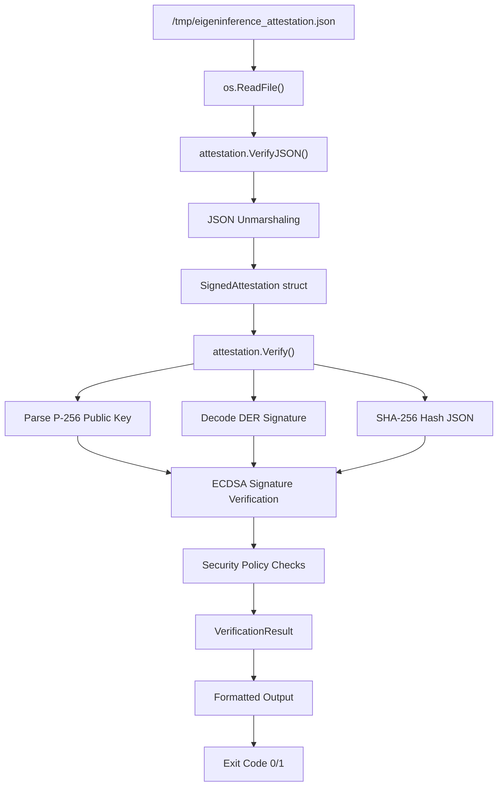

Based on my comprehensive exploration of the codebase, I can now provide the analysis:

# verify-attestation Component Analysis

## Architecture

The verify-attestation component implements a **standalone CLI utility** that performs cryptographic verification of attestation blobs generated by Darkbloom provider nodes. It follows a **simple single-purpose CLI pattern** where it reads a fixed JSON file, verifies the attestation using the coordinator's attestation library, and outputs human-readable results.

The component serves as a **cross-language verification tool** that demonstrates Swift-to-Go cryptographic interoperability by verifying P-256 ECDSA signatures generated by Apple Secure Enclave hardware on macOS provider nodes.

## Key Components

### Main Entry Point
- **Location**: `coordinator/cmd/verify-attestation/main.go`
- **Purpose**: Simple CLI that reads `/tmp/eigeninference_attestation.json`, verifies it, and displays results
- **Error Handling**: Explicit error reporting with distinct exit codes for read vs parse failures

### Attestation Processing
- **JSON Parsing**: Unmarshals attestation JSON using `attestation.VerifyJSON()`
- **Verification Logic**: Delegates to `coordinator/internal/attestation` package
- **Output Format**: Structured display of hardware info, security status, and verification result

### Security Verification
- **P-256 ECDSA Signature**: Verifies DER-encoded signatures against embedded public keys
- **Hardware Requirements**: Enforces Secure Enclave availability, SIP enabled, Secure Boot enabled
- **Cross-platform JSON**: Handles Swift's sorted-key JSON encoding vs Go's struct-order encoding

## Data Flows



## External Dependencies

### External Libraries

- **golang.org/x/crypto** (v0.49.0) [crypto]: Provides additional cryptographic primitives beyond Go's standard library. Used for extended ECDSA and elliptic curve operations. Imported in: `coordinator/internal/attestation/attestation.go`.

The component relies heavily on Go's standard library for core functionality:
- **crypto/ecdsa**: P-256 elliptic curve signature verification
- **crypto/sha256**: Hash computation for signature verification
- **encoding/json**: JSON parsing and marshaling
- **encoding/base64**: Decoding of base64-encoded keys and signatures
- **encoding/asn1**: DER signature format parsing
- **os**: File system operations and program exit
- **fmt**: Formatted output and error reporting

## Internal Dependencies

### coordinator
Uses the `coordinator/internal/attestation` package extensively:

- **attestation.VerifyJSON()**: Primary entry point for attestation verification from raw JSON bytes
- **AttestationBlob struct**: Represents the structured attestation data with hardware/security fields
- **SignedAttestation struct**: Container for attestation blob plus DER-encoded signature
- **VerificationResult struct**: Output containing verification status, parsed fields, and error details
- **Cross-language JSON handling**: Uses `marshalSortedJSON()` fallback for Swift compatibility

The component leverages the coordinator's sophisticated attestation verification logic including:
- P-256 public key parsing (both 64-byte and 65-byte uncompressed formats)
- DER signature decoding and ECDSA verification
- Security policy enforcement (Secure Enclave, SIP, Secure Boot requirements)
- Timestamp validation support

## API Surface

### Command Line Interface
- **Input**: Fixed file path `/tmp/eigeninference_attestation.json`
- **Output**: Human-readable attestation details to stdout
- **Exit Codes**: 
  - `0`: Verification successful
  - `1`: File read error, JSON parse error, or verification failure
- **Error Output**: Descriptive error messages to stderr

### Output Format
```
Attestation from: Apple M3 Max (Mac15,8)
Secure Enclave: true | SIP: true | Secure Boot: true

✓ CROSS-LANGUAGE VERIFICATION PASSED
  Swift Secure Enclave P-256 signature verified by Go coordinator
```

## External Systems

The component operates as a **standalone offline verification tool** with minimal external dependencies:

### File System
- **Input File**: Reads attestation JSON from `/tmp/eigeninference_attestation.json`
- **No Network**: Pure cryptographic verification without external service calls
- **No Database**: Stateless operation with no persistence requirements

### Apple Hardware Integration
- **Secure Enclave**: Verifies signatures generated by Apple Silicon Secure Enclave
- **Hardware Attestation**: Processes chip names, model identifiers, and security states
- **Cross-platform Compatibility**: Designed to verify macOS-generated attestations on any Go platform

## Component Interactions

The verify-attestation component operates **independently** of other system components:

### Coordinator Integration
- **Shared Library**: Uses `coordinator/internal/attestation` for verification logic
- **No Runtime Calls**: Does not communicate with the coordinator service at runtime
- **Code Reuse**: Leverages the same cryptographic verification used by the coordinator API

### Provider Ecosystem
- **Attestation Format**: Expects JSON attestations generated by Swift enclave code
- **Signature Compatibility**: Verifies P-256 signatures from Apple Secure Enclave hardware
- **Development Tool**: Serves as a debugging/testing utility for provider attestation functionality

This component demonstrates the **separation of concerns** in the Darkbloom architecture, where attestation verification logic is centralized in the coordinator library but can be used by multiple tools without requiring a running coordinator service.
