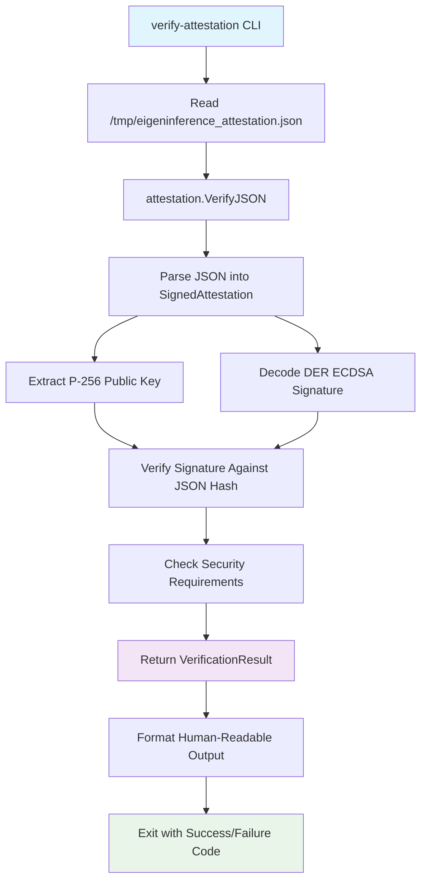

Now I have a good understanding of the verify-attestation component. Let me write the comprehensive analysis.

# verify-attestation Component Analysis

## Architecture

The verify-attestation component is a simple CLI utility that demonstrates cross-language cryptographic verification of Apple Secure Enclave attestations. It follows a straightforward command-line tool pattern with minimal dependencies, focusing on reading a fixed file path and verifying its contents using the coordinator's attestation library.

The architecture is minimal by design - a single main.go file that:
1. Reads attestation JSON from a hardcoded path (`/tmp/eigeninference_attestation.json`)
2. Delegates verification to the coordinator's internal attestation package
3. Outputs human-readable verification results with clear success/failure indication

## Key Components

### Main Entry Point
- **File**: `main.go`
- **Description**: Single-function CLI that reads attestation JSON and verifies it using `attestation.VerifyJSON()`
- **Error Handling**: Exits with code 1 on read failures or verification failures, 0 on success

### Attestation Verification Engine  
- **Package**: `github.com/eigeninference/coordinator/internal/attestation`
- **Function**: `VerifyJSON(data []byte) (VerificationResult, error)`
- **Description**: Core verification logic that parses JSON attestation blobs and validates P-256 ECDSA signatures against embedded Secure Enclave public keys

### Output Formatting
- **Hardware Info**: Displays chip name and hardware model from attestation
- **Security Status**: Shows Secure Enclave availability, SIP enabled status, and Secure Boot status
- **Verification Result**: Clear ✓/✗ indicators with descriptive success/failure messages

## Data Flows



The data flow demonstrates the tool's purpose as a verification utility for attestation blobs that would be generated by Swift code running in Apple's Secure Enclave environment. The attestation contains hardware identity information and security posture data, cryptographically signed to prevent tampering.

## External Dependencies

### External Libraries

- **golang.org/x/crypto** (v0.49.0) [crypto]: Provides additional cryptographic primitives beyond the standard library. Used for elliptic curve operations and secure random number generation in the attestation verification process. Imported indirectly through the attestation package.

- **github.com/golang-jwt/jwt/v5** (v5.3.1) [crypto]: JWT token handling library for JSON Web Token operations. While not directly used by this CLI tool, it's available through the coordinator module dependencies for authentication purposes.

- **github.com/google/uuid** (v1.6.0) [utility]: UUID generation and parsing library. Available through coordinator dependencies but not directly used by the verify-attestation tool.

- **github.com/jackc/pgx/v5** (v5.8.0) [database]: PostgreSQL driver and toolkit. Not used by this CLI tool but available through the coordinator module for database operations.

- **golang.org/x/time** (v0.15.0) [utility]: Time-related utilities including rate limiting. Available through coordinator dependencies.

The CLI tool itself has minimal external dependencies, relying primarily on Go's standard library (`os`, `fmt`, `crypto/ecdsa`, `crypto/sha256`, `encoding/json`, etc.) through the attestation package.

## Internal Dependencies

### coordinator Package Usage

- **attestation Package**: The CLI uses `attestation.VerifyJSON()` as its core verification engine. This function handles the complete attestation verification workflow including:
  - JSON parsing into `SignedAttestation` structs
  - P-256 public key extraction and validation
  - DER-encoded ECDSA signature verification  
  - Security requirement validation (Secure Enclave, SIP, Secure Boot)
  - Cross-language JSON compatibility between Swift and Go encoders

The tool specifically leverages the attestation package's capability to verify signatures created by Apple's Secure Enclave using P-256 ECDSA keys, ensuring the attestation hasn't been tampered with and meets security requirements.

## API Surface

### Command Line Interface

The tool provides a simple CLI interface with no arguments or flags:

```bash
./verify-attestation
```

**Input**: Reads from hardcoded path `/tmp/eigeninference_attestation.json`
**Output**: Human-readable verification results to stdout/stderr
**Exit Codes**: 
- `0`: Verification successful
- `1`: File read error or verification failure

### Output Format

**Success Output**:
```
Attestation from: Apple M3 Max (Mac15,8)
Secure Enclave: true | SIP: true | Secure Boot: true

✓ CROSS-LANGUAGE VERIFICATION PASSED
  Swift Secure Enclave P-256 signature verified by Go coordinator
```

**Failure Output**:
```
✗ VERIFICATION FAILED: [specific error message]
```

## External Systems

The verify-attestation tool operates as a standalone verification utility and does not directly integrate with external systems. However, it's designed to work within the broader Darkbloom ecosystem:

- **Apple Secure Enclave**: The tool verifies attestations generated by Swift code running in Apple's hardware Secure Enclave environment
- **File System**: Reads attestation data from a fixed file path (`/tmp/eigeninference_attestation.json`)
- **No Network**: The tool operates entirely offline, performing only local cryptographic verification

## Component Interactions

The verify-attestation tool is designed as a demonstration/debugging utility and does not interact with other components at runtime. Its primary purpose is to validate the cross-language compatibility of attestation verification between Swift (provider-side) and Go (coordinator-side) implementations.

**Design Purpose**: 
- Demonstrates that Go code can successfully verify P-256 ECDSA signatures created by Swift Secure Enclave code
- Provides a standalone testing tool for attestation blob verification
- Validates the JSON serialization compatibility between Swift's `JSONEncoder` with `.sortedKeys` and Go's `encoding/json`

The tool serves as a bridge component ensuring cryptographic compatibility between the Swift-based provider attestation generation and the Go-based coordinator verification systems in the Darkbloom network.
