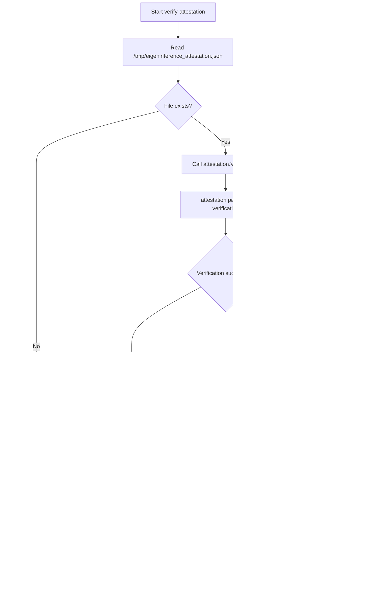
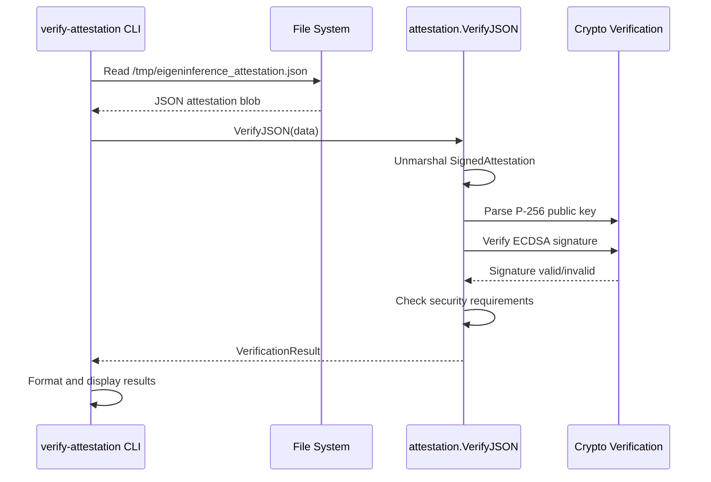

# verify-attestation Component Analysis

## Architecture

The verify-attestation component is a **simple command-line utility service** that provides cryptographic attestation verification for the d-inference system. It follows a **single-purpose executable pattern** where the entire application logic is contained in a single main.go file that orchestrates calls to the coordinator's internal attestation library.

The architecture is designed around the principle of **cross-language cryptographic verification** - it verifies P-256 ECDSA signatures created by Swift Secure Enclave modules running on provider nodes, ensuring that attestation blobs haven't been tampered with and that the provider hardware meets security requirements.

## Key Components

### 1. Main Execution Flow (`main.go`)
**Location**: `coordinator/cmd/verify-attestation/main.go` (lines 10-34)  
The primary orchestrator that reads attestation data from a fixed file path and coordinates verification through the attestation package.

### 2. File Input Handler
**Location**: `coordinator/cmd/verify-attestation/main.go` (lines 11-15)  
Reads attestation JSON from `/tmp/eigeninference_attestation.json` with error handling for file access issues.

### 3. JSON Parsing and Verification
**Location**: Lines 17-21  
Delegates attestation verification to `attestation.VerifyJSON()` which handles JSON unmarshaling and cryptographic verification.

### 4. Results Display Handler
**Location**: `coordinator/cmd/verify-attestation/main.go` (lines 23-33)  
Formats and displays verification results including hardware identity, security status, and verification outcome.

### 5. Exit Code Management
**Location**: Lines 14, 20, 32  
Implements proper exit codes (0 for success, 1 for failure) for integration with automation systems.

## Data Flows



### Attestation Verification Flow



## External Dependencies

### Runtime Libraries

- **fmt** (stdlib) [output]: Standard library package for formatted I/O operations. Used for printing verification results and error messages. Imported in: `main.go`.

- **os** (stdlib) [filesystem]: Standard library package for operating system interface. Used for file reading (`os.ReadFile`) and program termination (`os.Exit`). Imported in: `main.go`.

### Internal Library Dependencies

- **github.com/eigeninference/coordinator/internal/attestation** (local) [crypto]: Internal attestation verification library providing the `VerifyJSON` function for P-256 ECDSA signature verification and security policy enforcement.

## Internal Dependencies

### Internal Dependencies

- **coordinator/internal/attestation**: Uses the `attestation.VerifyJSON()` function to perform the core cryptographic verification of signed attestation blobs. This library handles P-256 ECDSA signature verification, JSON parsing with cross-language compatibility, and security policy enforcement (Secure Enclave required, SIP enabled, Secure Boot enabled). The verify-attestation service acts as a thin CLI wrapper around this verification logic.

## API Surface

### Command Line Interface

**Executable**: `verify-attestation`
- **Input**: Fixed file path `/tmp/eigeninference_attestation.json`
- **Output**: Human-readable verification results to stdout
- **Error Output**: Error messages to stderr  
- **Exit Codes**: 0 for success, 1 for failure

### Input Format
```json
{
  "attestation": {
    "chipName": "Apple M3 Max",
    "hardwareModel": "Mac15,8",
    "publicKey": "base64-encoded-p256-public-key",
    "secureEnclaveAvailable": true,
    "sipEnabled": true,
    "secureBootEnabled": true,
    "timestamp": "2026-01-01T00:00:00Z",
    // ... other security fields
  },
  "signature": "base64-encoded-der-ecdsa-signature"
}
```

### Output Format
```
Attestation from: Apple M3 Max (Mac15,8)
Secure Enclave: true | SIP: true | Secure Boot: true

✓ CROSS-LANGUAGE VERIFICATION PASSED
  Swift Secure Enclave P-256 signature verified by Go coordinator
```

## External Systems

### File System Integration
- **Path**: `/tmp/eigeninference_attestation.json`
- **Purpose**: Reads attestation blob from fixed temporary file location
- **Requirements**: Read access to /tmp directory
- **Error Handling**: Explicit error reporting for file access failures

### Exit Code Integration
- **Purpose**: Integration with shell scripts and automation systems
- **Codes**: Standard Unix convention (0=success, 1=failure)
- **Usage**: Enables automated attestation verification in deployment pipelines

## Component Interactions

### Upstream Data Flow
The verify-attestation service operates as a **verification endpoint** in the attestation pipeline:

1. **Provider Nodes** (Swift/Rust) generate signed attestation blobs using Secure Enclave
2. **File System Intermediary** stores attestation as `/tmp/eigeninference_attestation.json`
3. **verify-attestation CLI** reads and verifies the attestation
4. **Automation Systems** consume exit codes for deployment decisions

### Cross-Language Verification
The service implements **cross-language cryptographic verification** where:
- Swift Secure Enclave modules sign attestation blobs with P-256 ECDSA
- Go verify-attestation service verifies these signatures using identical JSON serialization
- Ensures provider hardware attestations are cryptographically sound across language boundaries
