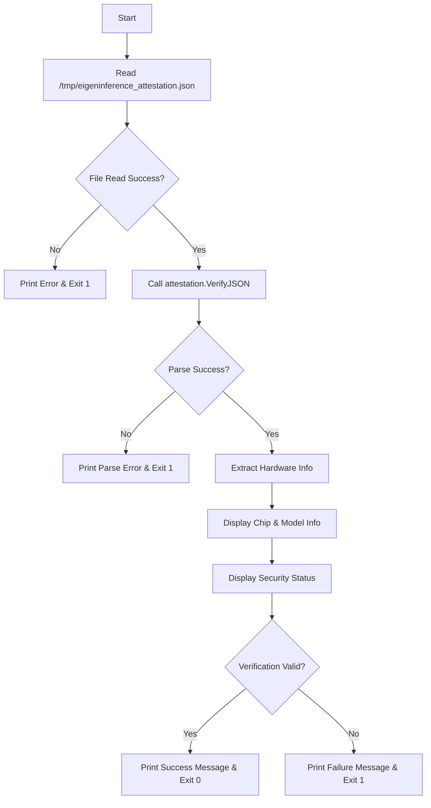

Now I have enough information to provide a comprehensive analysis of the verify-attestation component.

# verify-attestation Component Analysis

## Overview

The verify-attestation component is a standalone CLI utility within the coordinator module that verifies signed attestation blobs from EigenInference provider nodes. It serves as a cross-language verification tool, demonstrating that Go can successfully verify P-256 ECDSA signatures created by Swift's Secure Enclave implementation on Apple Silicon Macs.

## Architecture

The component follows a simple CLI architecture with a single entry point that:
1. Reads a fixed attestation file from `/tmp/eigeninference_attestation.json`
2. Delegates verification to the coordinator's attestation package
3. Outputs verification results in human-readable format
4. Returns appropriate exit codes for scripting integration

## Key Components

### Main Entry Point
- **File**: `coordinator/cmd/verify-attestation/main.go`
- **Function**: Single `main()` function that orchestrates the verification process
- **Dependencies**: Uses `github.com/eigeninference/coordinator/internal/attestation.VerifyJSON()`

### Core Functionality
The component leverages the attestation package's comprehensive verification system:
- **Signature Verification**: P-256 ECDSA signature validation using embedded public keys
- **Security Checks**: Validates Secure Enclave availability, SIP enabled, and Secure Boot enabled
- **Cross-Language Compatibility**: Handles JSON encoding differences between Swift and Go

### Error Handling
- File read errors exit with code 1
- JSON parsing errors exit with code 1  
- Failed verification exits with code 1
- Success exits with code 0

## Data Flows



## External Dependencies

### Standard Library
- **fmt** (standard): Formatted I/O for console output
- **os** (standard): File system operations and program exit control

### Coordinator Internal
- **github.com/eigeninference/coordinator/internal/attestation**: Core attestation verification logic, P-256 cryptography, and security requirement validation

## Internal Dependencies

### coordinator
The component depends entirely on the coordinator's attestation package for its core functionality:
- **VerifyJSON()**: Primary verification function that parses JSON attestation data and validates signatures
- **VerificationResult**: Structured result type containing hardware info, security status, and validation outcome
- **Security Requirements**: Leverages the attestation package's enforcement of Secure Enclave, SIP, and Secure Boot requirements

## API Surface

### Command Line Interface
- **Input**: Reads from fixed path `/tmp/eigeninference_attestation.json`
- **Output**: Human-readable verification results to stdout/stderr
- **Exit Codes**: 0 for success, 1 for any failure condition

### Output Format
```
Attestation from: [ChipName] ([HardwareModel])
Secure Enclave: [bool] | SIP: [bool] | Secure Boot: [bool]

✓ CROSS-LANGUAGE VERIFICATION PASSED
  Swift Secure Enclave P-256 signature verified by Go coordinator
```

## External Systems

### File System
- **Input File**: `/tmp/eigeninference_attestation.json` - Expected to contain signed attestation blob from provider nodes
- **No Network**: Component operates entirely offline once attestation file is available

## Component Interactions

### Provider Integration
The component verifies attestation files generated by EigenInference provider nodes running on Apple Silicon Macs. These providers:
- Generate attestation blobs containing hardware identity and security state
- Sign blobs using P-256 ECDSA keys held in the Apple Secure Enclave
- Export signed attestations to the expected JSON file format

### Coordinator Integration  
While standalone, this component demonstrates the same verification logic used by the main coordinator service for runtime provider attestation validation during the registration and challenge-response protocols.
