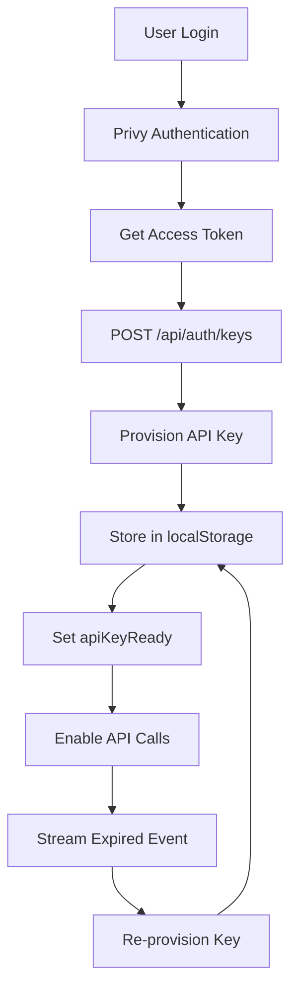
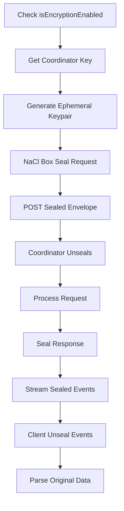

# Web Component Analysis

## Architecture

The web component is a modern Next.js 16 frontend application built with React 19 that serves as the user interface for the Darkbloom private AI inference platform. It follows a **client-server-proxy** architecture pattern where the Next.js frontend acts as both the UI and API proxy layer, forwarding requests to the upstream Darkbloom coordinator while handling authentication, encryption, and telemetry on the client side.

The application implements a sophisticated **encrypted chat interface** with real-time streaming capabilities, provider dashboard functionality, billing management, and comprehensive telemetry tracking. The architecture emphasizes privacy through optional end-to-end encryption using NaCl Box cryptography and hardware attestation verification for AI inference providers.

## Key Components

1. **AppShell** (`src/components/AppShell.tsx`): Main application layout wrapper that provides the sidebar navigation and handles authentication state. Conditionally renders the sidebar based on authentication status and current route.

2. **Chat System** (`src/app/page.tsx`, `src/lib/store.ts`, `src/lib/api.ts`): Core chat interface with streaming message handling, think-block detection for reasoning models, and comprehensive metrics tracking (tokens per second, time to first token). Uses Zustand for state management with persistence.

3. **Authentication Layer** (`src/hooks/useAuth.ts`, `src/components/providers/PrivyClientProvider.tsx`): Integrates Privy for email-based authentication with automatic API key provisioning and session management. Handles key expiration and re-provisioning transparently.

4. **Encryption System** (`src/lib/encryption.ts`): Optional sender-to-coordinator encryption using X25519 NaCl Box. Fetches coordinator public keys, seals requests with ephemeral keypairs, and unseals streaming responses. Includes comprehensive error handling for key rotation and mismatch scenarios.

5. **API Proxy Layer** (`src/app/api/*/route.ts`): Next.js API routes that proxy requests to the upstream coordinator, handling authentication headers, content-type preservation for encrypted payloads, and streaming response forwarding without buffering.

6. **Provider Dashboard** (`src/app/providers/ProviderDashboardContent.tsx`): Interface for users running AI inference providers, showing machine status, earnings, health warnings, and attestation details with real-time updates every 15 seconds.

7. **Telemetry System** (`src/lib/telemetry.ts`, `src/components/TelemetryInitializer.tsx`): Client-side event tracking with batched submission, unhandled error capture, and integration with Google Analytics and Datadog RUM for comprehensive monitoring.

8. **Billing Integration** (`src/app/billing/BillingContent.tsx`, `src/lib/api.ts`): Stripe-powered payment processing for credits, provider payouts via Stripe Connect, and usage tracking with micro-USD precision accounting.

9. **Theme System** (`src/components/providers/ThemeProvider.tsx`): Dark/light theme support with localStorage persistence and system preference detection.

10. **Trust & Verification** (`src/components/TrustBadge.tsx`, `src/components/VerificationPanel.tsx`): Hardware attestation display showing Secure Enclave verification, MDM status, and provider hardware details for transparency.

11. **Google Analytics Integration** (`src/lib/google-analytics.ts`): GDPR-compliant analytics with consent management, UTM parameter tracking, and cookie domain handling for darkbloom.dev.

12. **Certificate Verification** (`src/lib/cert-verify.ts`): Client-side X.509 certificate validation using ASN1.js and PKI.js for verifying provider attestation chains and hardware certificates.

## Data Flows

### Chat Message Flow
```mermaid
graph TD
    A[User Input] --> B[handleSend]
    B --> C[Create User Message]
    C --> D[Add to Store]
    D --> E[Create Assistant Message]
    E --> F[streamChat API Call]
    F --> G[/api/chat Next.js Route]
    G --> H[Optional Encryption]
    H --> I[Proxy to Coordinator]
    I --> J[SSE Stream Response]
    J --> K[Decrypt if Sealed]
    K --> L[Think Block Detection]
    L --> M[Token Streaming]
    M --> N[Update Store State]
    N --> O[UI Re-render]
```

### Authentication Flow


### Encryption Flow


## External Dependencies

### Runtime Dependencies

- **@datadog/browser-rum** (^6.32.0) [monitoring]: Real User Monitoring SDK for performance tracking and error reporting. Used in `src/components/DatadogRUM.tsx` for initializing session tracking with privacy-focused configuration.

- **@privy-io/react-auth** (^3.18.0) [authentication]: Web3-native authentication provider supporting email login. Core authentication system used in `src/components/providers/PrivyClientProvider.tsx` and `src/hooks/useAuth.ts` for session management.

- **asn1js** (^3.0.7) [crypto]: ASN.1 data structure parsing library. Used in `src/lib/cert-verify.ts` for parsing X.509 certificates in provider hardware attestation verification.

- **lucide-react** (^1.0.1) [ui]: Icon library providing consistent SVG icons. Used throughout the UI components for visual elements like `MessageSquare`, `Settings`, `Cpu`, etc.

- **next** (^16.2.2) [web-framework]: React-based full-stack framework providing SSR, API routes, and routing. Core framework powering the entire application with streaming support for chat responses.

- **pkijs** (^3.4.0) [crypto]: Public Key Infrastructure library for X.509 certificate operations. Used in `src/lib/cert-verify.ts` alongside asn1js for cryptographic verification of provider attestation chains.

- **react** (^19.2.4) [web-framework]: Core UI library. Used throughout for component architecture, hooks, and state management.

- **react-dom** (^19.2.4) [web-framework]: React DOM renderer. Required for Next.js browser rendering and SSR functionality.

- **react-markdown** (^10.1.0) [ui]: Markdown parsing and rendering component. Used in `src/components/ChatMessage.tsx` for rendering formatted AI responses with code blocks and formatting.

- **remark-gfm** (^4.0.1) [ui]: GitHub Flavored Markdown plugin for react-markdown. Enables tables, strikethrough, task lists in chat messages.

- **tweetnacl** (^1.0.3) [crypto]: High-security cryptographic library implementing NaCl (Networking and Cryptography Library). Used in `src/lib/encryption.ts` for X25519 key exchange and Box encryption for sender-to-coordinator privacy.

- **zustand** (^5.0.12) [state-management]: Lightweight state management library. Used in `src/lib/store.ts` for chat state, messages, and application state with localStorage persistence.

### Development Dependencies

- **@tailwindcss/postcss** (^4) [build-tool]: PostCSS plugin for Tailwind CSS processing. Handles CSS utility generation for consistent styling system.

- **@testing-library/dom** (^10.4.1) [testing]: DOM testing utilities for component testing. Base library for React Testing Library integration.

- **@testing-library/jest-dom** (^6.9.1) [testing]: Custom Jest matchers for DOM assertions. Provides `toBeInTheDocument()`, `toHaveClass()` matchers for comprehensive UI testing.

- **@testing-library/react** (^16.3.2) [testing]: React component testing utilities. Used in test files for component rendering, user interaction simulation, and assertion helpers.

- **@types/node** (^20) [build-tool]: TypeScript type definitions for Node.js APIs. Required for server-side Next.js API routes and build tooling.

- **@types/react** (^19) [build-tool]: TypeScript definitions for React. Enables type-safe component development with React 19 features.

- **eslint** (^9) [build-tool]: JavaScript/TypeScript linter for code quality enforcement. Configured with Next.js and security-focused rules.

- **eslint-config-next** (^16.2.2) [build-tool]: Next.js-specific ESLint configuration with React, accessibility, and performance rules.

- **eslint-plugin-promise** (^7.2.1) [build-tool]: ESLint rules for Promise best practices, preventing common async/await anti-patterns.

- **eslint-plugin-security** (^4.0.0) [build-tool]: Security-focused ESLint rules detecting potential vulnerabilities like unsafe regex, eval usage.

- **eslint-plugin-sonarjs** (^4.0.2) [build-tool]: Code quality rules detecting code smells, complexity issues, and maintainability problems.

- **jsdom** (^29.0.1) [testing]: Pure JavaScript DOM implementation for testing environments. Required by Vitest for component testing.

- **typescript** (^5) [build-tool]: TypeScript compiler for type-safe development. Configured with strict mode for enhanced type checking.

- **vitest** (^4.1.2) [testing]: Fast unit test runner with ES module support. Used for component and utility function testing with better DX than Jest.

## API Surface

The web component exposes several categories of interfaces:

### Next.js API Routes (/api/*)
- **POST /api/chat**: Streaming chat completions proxy with optional encryption support
- **GET /api/models**: Model listing proxy with metadata flattening
- **GET /api/health**: Coordinator health check proxy
- **POST /api/auth/keys**: API key provisioning using Privy authentication
- **GET /api/encryption-key**: Coordinator public key fetching for encryption
- **POST /api/telemetry**: Event batching proxy for observability data
- **GET /api/payments/balance**: Account balance retrieval
- **POST /api/payments/stripe/checkout**: Stripe payment session creation
- **GET /api/payments/usage**: Usage history and billing data

### Public Pages
- **/**: Main chat interface (authenticated)
- **/login**: Authentication flow entry point
- **/providers**: Provider dashboard for machine operators
- **/billing**: Payment and usage management
- **/settings**: User preferences and configuration
- **/models**: Available model listing
- **/api-console**: API documentation and testing

### External Integrations

- **Darkbloom Coordinator**: Primary backend service for AI inference, authentication, and provider management via HTTP API at `/v1/*` endpoints
- **Privy Authentication**: Web3-native auth service for email-based user sessions and JWT token management
- **Stripe**: Payment processing for credit purchases and provider payouts via Stripe Connect Express accounts
- **Google Analytics**: Privacy-compliant usage analytics with consent management and UTM tracking
- **Datadog RUM**: Real user monitoring for performance tracking and error reporting with session replay

### Component Interactions

The web component acts as the primary user interface and API gateway, making HTTP calls to:

- **Darkbloom Coordinator**: All AI inference requests, model listings, provider status, billing operations
- **Authentication Provider**: User session management, API key provisioning, access token refresh
- **Payment Gateway**: Credit purchases, payout processing, transaction history
- **Analytics Services**: Event tracking, error reporting, performance monitoring

The component maintains no direct database connections or persistent storage beyond browser localStorage for session data, API keys, and user preferences.
