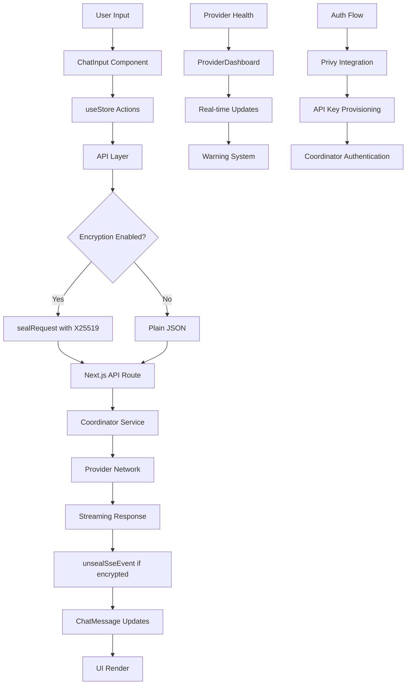

# Web Component Analysis

## Architecture

The web component is a Next.js 16-based React TypeScript frontend application built for Darkbloom, a decentralized AI inference platform. It follows a modern React architecture with server-side rendering, API routes, and client-side state management. The application implements a clean layered architecture with clear separation between presentation components, business logic, and data access layers.

The frontend serves as both a consumer-facing chat interface and a provider management dashboard, supporting end-to-end encrypted AI inference requests through hardware-attested Apple Silicon providers. It uses Next.js App Router for file-based routing and implements a comprehensive design system with dark/light theme support.

## Key Components

### Core Application Structure
- **`src/app/layout.tsx`**: Root layout component that orchestrates providers (Privy auth, theme, verification mode) and analytics integrations (Google Analytics, Datadog RUM, Telemetry)
- **`src/components/AppShell.tsx`**: Main application shell providing sidebar navigation and loading states, with special handling for device linking flow
- **`src/app/page.tsx`**: Primary chat interface implementing streaming AI conversations with system prompts, suggested prompts, and comprehensive error handling
- **`src/components/Sidebar.tsx`**: Navigation component with chat history management, model selection, and account controls

### State Management & Data Flow
- **`src/lib/store.ts`**: Zustand-based global state store managing chat sessions, messages, model selection, and UI state with persistent storage
- **`src/lib/api.ts`**: Comprehensive API client handling model fetching, chat streaming, payments, authentication, and coordinator communication
- **`src/hooks/useAuth.ts`**: Authentication hook managing Privy integration, API key provisioning, session lifecycle, and automatic re-authentication

### Encryption & Security
- **`src/lib/encryption.ts`**: Client-side encryption system implementing X25519 NaCl Box encryption for sender-to-coordinator request encryption with ephemeral keypairs for forward secrecy
- **`src/lib/cert-verify.ts`**: Certificate verification utilities for validating provider hardware attestation chains using ASN.1 parsing and PKI validation

### AI Chat Interface
- **`src/components/ChatMessage.tsx`**: Rich message rendering component supporting markdown, code blocks with syntax highlighting, thinking processes, trust metadata display, and streaming metrics
- **`src/components/ChatInput.tsx`**: Input component with model selection, send controls, authentication prompts, and streaming state management

### Provider Management
- **`src/app/providers/ProviderDashboardContent.tsx`**: Provider dashboard showing linked machines, health warnings, earnings tracking, and routing status with real-time updates
- **`src/app/providers/warnings.ts`**: Warning system analyzing provider health metrics and generating actionable alerts for attestation, connectivity, and performance issues

### Payment & Billing
- **`src/app/billing/BillingContent.tsx`**: Billing interface supporting Stripe integration for credit purchases and usage tracking with real-time balance updates
- **`src/lib/stripe-countries.ts`**: Stripe country support configuration for international payment processing

## Data Flows

## External Dependencies

### Production Dependencies

- **@datadog/browser-rum** (^6.32.0) [monitoring]: Real User Monitoring for frontend performance tracking and error reporting. Integrated in DatadogRUM component for production telemetry.

- **@privy-io/react-auth** (^3.18.0) [authentication]: Client-side authentication SDK providing email-based login flows. Used in PrivyClientProvider for user authentication and session management.

- **@privy-io/server-auth** (^1.32.5) [authentication]: Server-side authentication validation for API routes. Used in Next.js API routes to validate Privy tokens and provision coordinator API keys.

- **asn1js** (^3.0.7) [crypto]: ASN.1 parsing library for certificate verification. Used in cert-verify.ts for parsing Apple device attestation certificates and validation chains.

- **lucide-react** (^1.0.1) [ui]: Icon library providing consistent SVG icons throughout the interface. Used across all components for navigation, status indicators, and interactive elements.

- **next** (^16.2.2) [web-framework]: React framework providing SSR, API routes, and file-based routing. Core framework powering the entire application with App Router architecture.

- **pkijs** (^3.4.0) [crypto]: PKI library for X.509 certificate operations. Used alongside asn1js in cert-verify.ts for validating provider hardware attestation chains.

- **react** (^19.2.4) [web-framework]: Core React library for component-based UI development. Foundation for all frontend components and hooks.

- **react-dom** (^19.2.4) [web-framework]: React DOM rendering library. Required for Next.js server and client-side rendering.

- **react-markdown** (^10.1.0) [ui]: Markdown rendering component for chat messages. Used in ChatMessage component to render assistant responses with formatting support.

- **rehype-highlight** (^7.0.2) [ui]: Syntax highlighting plugin for code blocks in markdown. Integrated with react-markdown for code syntax highlighting in chat messages.

- **remark-gfm** (^4.0.1) [ui]: GitHub Flavored Markdown plugin adding table, task list, and strikethrough support. Used with react-markdown for enhanced message formatting.

- **tweetnacl** (^1.0.3) [crypto]: NaCl cryptography library providing X25519 key exchange and Box encryption. Used in encryption.ts for end-to-end encryption of requests to coordinator.

- **zustand** (^5.0.12) [state-management]: Lightweight state management library for React. Used in store.ts for global application state including chats, messages, and UI settings with persistence.

### Development Dependencies

- **@eslint/eslintrc** (^3) [build-tool]: ESLint configuration compatibility layer. Used in eslint.config.mjs for maintaining legacy configuration support.

- **@tailwindcss/postcss** (^4) [build-tool]: PostCSS plugin for Tailwind CSS processing. Integrated in postcss.config.mjs for styling build pipeline.

- **@testing-library/dom** (^10.4.1) [testing]: DOM testing utilities for component testing. Used in test files for DOM query and interaction utilities.

- **@testing-library/jest-dom** (^6.9.1) [testing]: Custom Jest matchers for DOM assertions. Provides expect extensions for DOM element testing in component tests.

- **@testing-library/react** (^16.3.2) [testing]: React component testing utilities. Used throughout __tests__ directory for component rendering and interaction testing.

- **@types/node** (^20) [build-tool]: TypeScript definitions for Node.js APIs. Required for Next.js API routes and server-side code.

- **@types/react** (^19) [build-tool]: TypeScript definitions for React. Provides type safety for all React components and hooks.

- **@types/react-dom** (^19) [build-tool]: TypeScript definitions for React DOM. Required for React DOM rendering type safety.

- **eslint** (^9) [build-tool]: JavaScript/TypeScript linter for code quality enforcement. Configured with Next.js, security, and SonarJS rules.

- **eslint-config-next** (^16.2.2) [build-tool]: Next.js ESLint configuration preset. Provides Next.js-specific linting rules and optimizations.

- **eslint-plugin-promise** (^7.2.1) [build-tool]: ESLint plugin for Promise best practices. Enforces proper async/await and Promise handling patterns.

- **eslint-plugin-security** (^4.0.0) [build-tool]: ESLint plugin for security vulnerability detection. Identifies potential security issues in JavaScript code.

- **eslint-plugin-sonarjs** (^4.0.2) [build-tool]: ESLint plugin for code quality rules from SonarJS. Enforces code complexity and maintainability standards.

- **jsdom** (^29.0.1) [testing]: DOM implementation for Node.js testing environment. Used by Vitest for component testing in headless environment.

- **tailwindcss** (^4) [build-tool]: Utility-first CSS framework. Provides the styling system with custom design tokens and component styles.

- **typescript** (^5) [build-tool]: TypeScript compiler and language server. Provides static type checking and IntelliSense for the entire codebase.

- **vitest** (^4.1.2) [testing]: Fast unit test framework. Used for all component and utility function testing with jsdom environment support.

## API Surface

### Chat & AI Inference
- **GET /api/models**: Fetches available AI models from coordinator with provider counts and attestation status
- **POST /api/chat**: Streams AI chat completions with optional end-to-end encryption and hardware attestation metadata
- **GET /api/health**: Health check endpoint returning coordinator status and provider availability

### Authentication & Keys
- **POST /api/auth/keys**: Provisions coordinator API keys using Privy authentication tokens
- **GET /api/encryption-key**: Fetches coordinator's X25519 public key for request encryption with key rotation support

### Payments & Billing
- **GET /api/payments/balance**: Retrieves user account balance in micro-USD with withdrawable amounts
- **GET /api/payments/usage**: Returns detailed usage history with per-request costs and token counts
- **POST /api/payments/stripe/checkout**: Creates Stripe checkout sessions for credit purchases
- **GET /api/payments/stripe/status**: Returns Stripe Connect account status and payout configuration
- **POST /api/payments/stripe/onboard**: Initiates Stripe Express onboarding for providers
- **POST /api/payments/withdraw/stripe**: Processes withdrawals to connected Stripe accounts

### Provider Management
- **GET /api/me/providers**: Lists user's registered provider machines with health and earnings data
- **GET /api/me/summary**: Provider earnings summary with performance metrics
- **POST /api/invite/redeem**: Redeems invite codes for account credits

### Telemetry & Analytics
- **POST /api/telemetry**: Accepts client-side telemetry events for usage analytics and performance monitoring

## External Systems

The web component integrates with several external services and systems:

### Core Infrastructure
- **Darkbloom Coordinator**: Primary backend service at `api.darkbloom.dev` handling AI inference routing, authentication, billing, and provider management
- **Next.js API Routes**: Server-side proxy layer preventing CORS issues and handling authentication token forwarding to coordinator

### Authentication & Identity
- **Privy**: Third-party authentication service providing email-based login, session management, and JWT token generation for secure API access

### Payment Processing  
- **Stripe**: Payment processor for credit purchases and provider payouts via Stripe Connect Express accounts with international support

### Analytics & Monitoring
- **Google Analytics**: User behavior tracking and conversion analytics for chat usage, login flows, and feature adoption
- **Datadog RUM**: Real User Monitoring for frontend performance metrics, error tracking, and user session replay
- **Custom Telemetry**: Internal analytics system tracking chat completions, model usage, trust levels, and provider performance

### Hardware Attestation
- **Apple Certificate Authority**: Validates hardware attestation certificates from provider devices using Secure Enclave and MDM verification chains

## Component Interactions

The web component primarily operates as a frontend client with minimal internal component dependencies:

### API Gateway Pattern
- All coordinator communication flows through Next.js API routes (`/api/*`) which act as a proxy layer, forwarding requests with authentication headers while preventing CORS issues
- API routes handle Privy token validation and coordinator API key provisioning automatically

### Authentication Flow
- Integrates with Privy for user authentication, then provisions coordinator API keys server-side
- Maintains session state client-side with automatic re-authentication on token expiry

### Real-time Updates  
- Provider dashboard polls coordinator endpoints every 15 seconds for live status updates
- Chat interface uses server-sent events for streaming AI responses with optional encryption

### State Synchronization
- Uses Zustand for client-side state management with localStorage persistence
- Chat history and user preferences sync across browser sessions

The component operates independently without direct calls to other d-inference components, communicating exclusively through the coordinator service API.
