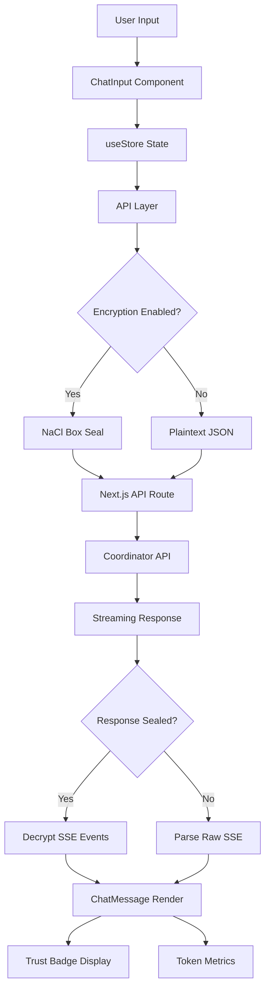
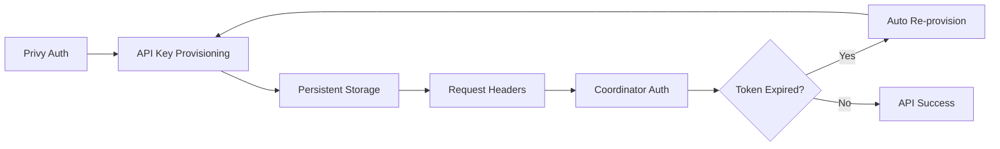

Based on my thorough exploration of the codebase, I now have a comprehensive understanding of the web component. Let me write the analysis.

# Web Component Analysis

## Architecture

The web component is a comprehensive **Next.js 16** frontend application that implements Darkbloom's console UI for private AI inference on verified hardware. It follows a **modern React architecture** with server-side rendering capabilities and client-side interactivity for real-time features like chat streaming.

The application uses a **layered architecture** with clear separation of concerns:
- **Presentation Layer**: React components with Tailwind CSS styling
- **State Management Layer**: Zustand stores with persistence
- **API Layer**: Custom API client with Next.js route handlers as proxies
- **Security Layer**: End-to-end encryption, certificate verification, and authentication

## Key Components

### Core UI Components
- **AppShell**: Main application layout with conditional sidebar and authentication state management
- **ChatMessage**: Rich markdown renderer with trust badges, verification panels, and streaming indicators  
- **ChatInput**: Multi-model chat interface with streaming capabilities and real-time metrics
- **Sidebar**: Navigation hub with chat history, model selection, and provider dashboard access
- **VerificationPanel**: Hardware attestation certificate verification using WebCrypto APIs

### State Management
- **useStore** (Zustand): Persistent chat state, model selection, and UI preferences with localStorage integration
- **useAuth**: Privy-based authentication with automatic API key provisioning and refresh handling
- **useToast**: Global notification system for user feedback

### API Infrastructure  
- **api.ts**: Comprehensive API client with streaming chat, model fetching, payment processing, and encrypted request handling
- **encryption.ts**: Client-side NaCl Box encryption for sender→coordinator privacy with X25519 key exchange
- **cert-verify.ts**: Browser-based X.509 certificate chain verification against Apple's Enterprise Attestation Root CA

### Next.js API Routes
- **Chat Route** (`/api/chat`): Streaming proxy to coordinator with sealed request/response support
- **Auth Routes** (`/api/auth/keys`): API key provisioning via Privy tokens
- **Payment Routes** (`/api/payments/*`): Stripe integration for billing and provider payouts
- **Model Route** (`/api/models`): Model metadata and availability proxy

## Data Flows

## External Dependencies

### Runtime Dependencies

- **next** (^16.2.2) [web-framework]: React-based full-stack framework providing SSR, API routes, and build system. Core framework powering the entire application with app router architecture.
  Imported in: `next.config.ts`, all page components, API routes.

- **react** (^19.2.4) [web-framework]: UI library for component-based interfaces. Provides hooks, JSX, and component lifecycle management for all interactive elements.
  Imported in: All `.tsx` component files, custom hooks.

- **react-dom** (^19.2.4) [web-framework]: DOM bindings for React enabling browser rendering and hydration.
  Imported in: Next.js internals, component rendering pipeline.

- **@privy-io/react-auth** (^3.18.0) [authentication]: Wallet-first authentication provider supporting email/social login. Handles user sessions, JWT tokens, and auth state management.
  Imported in: `src/components/providers/PrivyClientProvider.tsx`, `src/hooks/useAuth.ts`.

- **@privy-io/server-auth** (^1.32.5) [authentication]: Server-side Privy token verification for API routes. Validates JWT tokens and extracts user identity.
  Imported in: API route handlers for authenticated endpoints.

- **zustand** (^5.0.12) [state-management]: Lightweight state management with persistence middleware. Manages chat history, model selection, and UI state across page reloads.
  Imported in: `src/lib/store.ts`, components accessing global state.

- **tweetnacl** (^1.0.3) [crypto]: Pure JavaScript NaCl implementation for X25519 key exchange and box encryption. Enables end-to-end encryption of chat requests to coordinator.
  Imported in: `src/lib/encryption.ts` for request/response sealing.

- **pkijs** (^3.4.0) [crypto]: WebCrypto-based X.509 certificate verification library. Validates Apple MDA certificate chains in-browser for hardware attestation.
  Imported in: `src/lib/cert-verify.ts` for provider certificate validation.

- **asn1js** (^3.0.7) [crypto]: ASN.1 parsing library required by pkijs for certificate structure parsing. Handles DER/PEM certificate format decoding.
  Imported in: `src/lib/cert-verify.ts` alongside pkijs.

- **react-markdown** (^10.1.0) [content]: Markdown-to-React renderer for chat messages. Supports GitHub Flavored Markdown with syntax highlighting.
  Imported in: `src/components/ChatMessage.tsx` for message content rendering.

- **rehype-highlight** (^7.0.2) [content]: Syntax highlighting plugin for react-markdown code blocks. Provides theme-aware code highlighting.
  Imported in: Markdown rendering pipeline in chat components.

- **remark-gfm** (^4.0.1) [content]: GitHub Flavored Markdown support for tables, strikethrough, task lists in chat messages.
  Imported in: `src/components/ChatMessage.tsx` markdown processing.

- **lucide-react** (^1.0.1) [ui]: Feather-inspired icon library with React components. Provides consistent iconography across the interface.
  Imported in: All UI components for icons (settings, chat, models, etc.).

- **@datadog/browser-rum** (^6.32.0) [monitoring]: Real User Monitoring for performance tracking and error reporting in production.
  Imported in: `src/components/DatadogRUM.tsx` for telemetry initialization.

### Development Dependencies

- **typescript** (^5) [build-tool]: Type system providing compile-time safety and IDE support. Configured with strict mode and path aliases.
  Configuration in: `tsconfig.json`.

- **tailwindcss** (^4) [styling]: Utility-first CSS framework for responsive design system. Configured with custom color palette and component styles.
  Configuration in: Imported via `@tailwindcss/postcss` plugin.

- **vitest** (^4.1.2) [testing]: Fast test runner with TypeScript support and jsdom environment for component testing.
  Configuration in: `vitest.config.ts` with jsdom environment.

- **@testing-library/react** (^16.3.2) [testing]: React testing utilities focusing on user behavior rather than implementation details.
  Imported in: Test files for component interaction testing.

- **eslint** (^9) [build-tool]: Linting with Next.js config plus security and code quality plugins (sonarjs, security, promise).
  Configuration includes strict rules for security and maintainability.

- **jsdom** (^29.0.1) [testing]: DOM environment for Node.js enabling browser API simulation in tests.
  Used by: Vitest for component testing environment.

## API Surface

### Public HTTP Endpoints
- **GET /**: Main chat interface with authentication and model selection
- **GET /providers**: Provider dashboard for hardware attestation and earnings
- **GET /billing**: Payment management and usage tracking  
- **GET /api-console**: Developer tools for API integration
- **GET /stats**: Network statistics and model availability

### API Routes (Internal)
- **POST /api/chat**: Streaming chat proxy with optional encryption
- **POST /api/auth/keys**: API key provisioning via Privy tokens
- **GET /api/models**: Available models with attestation metadata
- **POST /api/payments/stripe/checkout**: Stripe payment session creation
- **GET /api/health**: Coordinator health check and provider count

### State Management API
- **Chat Management**: Create, delete, switch between conversations
- **Model Selection**: Available models with trust level indicators
- **Authentication State**: Session management with automatic key refresh
- **Encryption Toggle**: Client-side encryption preference with key caching

## External Systems

The web component integrates with several external services:

### Darkbloom Coordinator API
- **Primary Integration**: All AI inference, model listing, and provider management
- **Authentication**: JWT token exchange and API key provisioning
- **Encryption**: Optional NaCl Box encryption for request privacy

### Privy Authentication Service  
- **User Management**: Email/wallet-based authentication with social login
- **Token Management**: JWT provisioning and refresh for coordinator access
- **Session Persistence**: Secure token storage and automatic renewal

### Stripe Payment Processing
- **Billing**: Credit purchases and usage tracking
- **Provider Payouts**: Connect Express for provider earnings withdrawal
- **Webhooks**: Payment confirmation and account status updates

### Analytics and Monitoring
- **Google Analytics**: User interaction tracking with privacy-focused events
- **Datadog RUM**: Performance monitoring and error tracking
- **Custom Telemetry**: Internal event tracking via coordinator API

### Apple Certificate Infrastructure
- **Hardware Attestation**: X.509 certificate chain verification against Apple Enterprise Root CA
- **Device Identity**: MDA certificate parsing for secure enclave verification
- **Trust Validation**: Runtime integrity checks for provider machines

## Component Interactions

The web component primarily acts as a frontend interface with no direct calls to other components in the codebase. All backend communication flows through:

1. **Coordinator API**: HTTP/HTTPS requests for all AI inference and management operations
2. **Next.js API Routes**: Internal proxy layer providing CORS handling and request transformation
3. **Client-Side State**: Zustand stores maintaining UI state and chat history persistence

The component is designed as a standalone frontend that could theoretically connect to any compatible coordinator API, with configuration managed through environment variables and user preferences.
