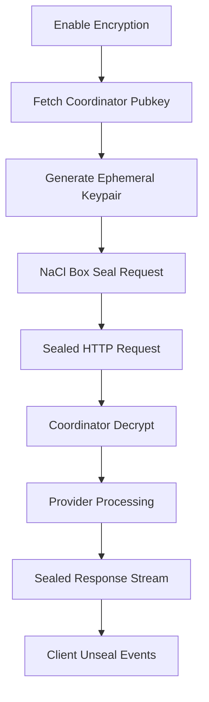

# Web Component Analysis

The web component is a Next.js-based React frontend application that provides a comprehensive console interface for the Darkbloom decentralized AI inference platform. It implements end-to-end encrypted chat functionality, provider management, billing, and advanced hardware verification features.

## Architecture

The application follows a **Next.js App Router architecture** with a clear separation between client and server components:

- **Frontend Layer**: React components with TypeScript using the App Router pattern
- **API Layer**: Next.js API routes that proxy requests to the Darkbloom coordinator
- **State Management**: Zustand for client-side state with persistence
- **Authentication**: Privy-based email authentication with API key provisioning
- **Encryption**: Optional end-to-end encryption using X25519/NaCl box cryptography

The architecture implements a security-focused design where all backend communication is proxied through Next.js API routes to avoid CORS issues and maintain consistent authentication headers.

## Key Components

### Core Application Structure
- **AppShell**: Main application layout with sidebar navigation and toast notifications
- **Layout**: Root layout with provider wrappers for theme, authentication, and telemetry
- **Sidebar**: Navigation component with chat history and model selection
- **TopBar**: Header component with user controls and model selector

### Chat System
- **ChatMessage**: Renders individual messages with trust badges and performance metrics
- **ChatInput**: Input component with streaming controls and authentication prompts
- **VerificationPanel**: Advanced hardware verification UI with normal/technical modes
- **TrustBadge**: Visual indicators for hardware attestation levels

### Provider Dashboard
- **ProviderDashboardContent**: Main dashboard for linked provider devices
- **EarningsContent**: Provider earnings and payout management interface
- **Billing System**: Credit purchasing, usage tracking, and Stripe integration

### Authentication & Security
- **useAuth**: Custom hook managing Privy authentication and API key lifecycle
- **PrivyClientProvider**: Authentication context provider with email-based login
- **E2ELockIndicator**: Visual indicator for end-to-end encryption status

### Utility Libraries
- **api.ts**: Core API client with streaming chat and encryption support
- **encryption.ts**: X25519/NaCl box implementation for request/response encryption
- **store.ts**: Zustand-based state management with chat persistence
- **telemetry.ts**: Event tracking and error reporting system

## Data Flows

### Chat Flow
```mermaid
graph TD
    A[User Input] --> B[ChatInput Component]
    B --> C[streamChat API Call]
    C --> D[/api/chat Next.js Route]
    D --> E[Coordinator /v1/chat/completions]
    E --> F[Provider Hardware]
    F --> G[Encrypted Response Stream]
    G --> H[Trust Metadata Headers]
    H --> I[ChatMessage Display]
    I --> J[VerificationPanel]
```

### Authentication Flow
```mermaid
graph TD
    A[User Login] --> B[Privy Email Auth]
    B --> C[getAccessToken]
    C --> D[/api/auth/keys Route]
    D --> E[Coordinator Key Provisioning]
    E --> F[localStorage API Key]
    F --> G[Authenticated Requests]
```

### Encryption Flow


## External Dependencies

### Runtime Dependencies

- **next** (^16.2.2) [web-framework]: Core React framework with App Router for server-side rendering and API routes. Used throughout the application for routing, server components, and build optimization. Imported in: all component files, next.config.ts.

- **react** (^19.2.4) [web-framework]: UI library for building component-based interfaces. Powers all frontend components and hooks. Imported in: all component files under src/.

- **react-dom** (^19.2.4) [web-framework]: React renderer for browser DOM. Handles component mounting and hydration in Next.js. Used automatically by Next.js runtime.

- **@privy-io/react-auth** (^3.18.0) [auth]: Authentication provider for web3-native email authentication. Manages user login/logout, session tokens, and identity verification. Imported in: src/components/providers/PrivyClientProvider.tsx, src/hooks/useAuth.ts.

- **zustand** (^5.0.12) [state]: Lightweight state management library with persistence middleware. Manages chat history, user preferences, and UI state across page reloads. Imported in: src/lib/store.ts, src/hooks/useToast.ts.

- **lucide-react** (^1.0.1) [ui]: Icon component library providing consistent SVG icons. Used throughout the UI for buttons, status indicators, and navigation. Imported in: most component files for icons.

- **tweetnacl** (^1.0.3) [crypto]: NaCl cryptography library for X25519 key exchange and XSalsa20-Poly1305 encryption. Implements end-to-end encryption for sensitive requests. Imported in: src/lib/encryption.ts.

- **react-markdown** (^10.1.0) [content]: Markdown rendering component for displaying formatted messages. Used in chat messages to render markdown content from AI responses. Imported in: src/components/ChatMessage.tsx.

- **remark-gfm** (^4.0.1) [content]: GitHub Flavored Markdown plugin for react-markdown. Adds support for tables, strikethrough, and other GitHub markdown extensions. Imported in: src/components/ChatMessage.tsx.

- **asn1js** (^3.0.7) [crypto]: ASN.1 parser for X.509 certificate verification. Used in hardware attestation verification to parse Apple certificate chains. Imported in: src/lib/cert-verify.ts.

- **pkijs** (^3.4.0) [crypto]: PKI library for X.509 certificate chain validation. Implements Apple device attestation verification against Apple Root CA. Imported in: src/lib/cert-verify.ts.

- **@datadog/browser-rum** (^6.32.0) [monitoring]: Real User Monitoring for performance tracking and error reporting. Provides detailed frontend analytics and error capture. Imported in: src/components/DatadogRUM.tsx.

### Development Dependencies

- **typescript** (^5) [build-tool]: Type checking and compilation for TypeScript source files. Provides static type safety across the entire codebase. Used by: Next.js build system and IDE.

- **@types/node** (^20) [build-tool]: Node.js type definitions for server-side code. Required for Next.js API routes and server components. Used by: TypeScript compiler.

- **@types/react** (^19) [build-tool]: React type definitions for component props and hooks. Ensures type safety in React components. Used by: TypeScript compiler.

- **eslint** (^9) [build-tool]: JavaScript/TypeScript linter with security and code quality rules. Enforces consistent code style and catches potential issues. Used by: next lint command.

- **eslint-config-next** (^16.2.2) [build-tool]: Next.js-specific ESLint configuration with React and accessibility rules. Provides framework-specific linting rules. Used by: ESLint configuration.

- **eslint-plugin-security** (^4.0.0) [build-tool]: Security-focused ESLint rules to prevent common vulnerabilities. Catches potential security issues in code. Used by: ESLint configuration.

- **eslint-plugin-sonarjs** (^4.0.2) [build-tool]: Code quality rules from SonarJS for bug detection and maintainability. Enforces code complexity and quality standards. Used by: ESLint configuration.

- **vitest** (^4.1.2) [testing]: Fast unit testing framework with TypeScript support. Runs component and utility function tests. Used by: test files in __tests__ directory.

- **@testing-library/react** (^16.3.2) [testing]: React testing utilities for component testing with user interaction simulation. Provides testing utilities for React components. Used by: component test files.

- **@testing-library/jest-dom** (^6.9.1) [testing]: Custom Jest matchers for DOM assertions in tests. Extends expect with DOM-specific matchers. Used by: test setup and assertions.

- **jsdom** (^29.0.1) [testing]: JavaScript DOM implementation for Node.js testing environment. Provides browser-like environment for component tests. Used by: Vitest configuration.

- **@tailwindcss/postcss** (^4) [build-tool]: Tailwind CSS PostCSS integration for utility-first styling. Processes CSS with Tailwind utilities and custom properties. Used by: PostCSS configuration.

## API Surface

### Public Routes
- **/** - Main chat interface with authentication
- **/billing** - Credits, usage tracking, and Stripe payments
- **/providers** - Provider dashboard and earnings management
- **/settings** - User preferences and encryption settings
- **/api-console** - API documentation and testing interface
- **/earn** - Provider earnings and payout details

### API Endpoints
- **POST /api/chat** - Streaming chat completions with encryption support
- **POST /api/auth/keys** - API key provisioning with Privy authentication
- **GET /api/models** - Available model listing with attestation metadata
- **GET /api/health** - System health check with provider count
- **POST /api/payments/stripe/checkout** - Stripe payment session creation
- **GET /api/payments/balance** - User credit balance and usage limits
- **POST /api/invite/redeem** - Invite code redemption for credits

### Component Props Interface
- **ChatMessage**: `{ message: Message, onRetry?: () => void }`
- **TrustBadge**: `{ trust: TrustMetadata, compact?: boolean }`
- **VerificationPanel**: `{ trust: TrustMetadata }`
- **UsageChart**: `{ usage: UsageEntry[], className?: string }`

## External Systems

The frontend integrates with several external services at runtime:

- **Darkbloom Coordinator** (api.darkbloom.dev): Primary backend API for chat completions, model listing, authentication, and billing. All requests proxied through Next.js API routes.
- **Stripe Payments**: Credit card processing for credit purchases and provider payouts. Handles checkout sessions and Connect Express accounts.
- **Apple Certificate Authority**: Hardware attestation verification using Apple's Root CA and MDA certificates for device trust verification.
- **Privy Authentication**: Email-based authentication service providing user identity and session management.
- **Datadog RUM**: Real user monitoring for performance tracking, error reporting, and user analytics.
- **Google Analytics**: User behavior tracking and conversion funnel analysis for product insights.

## Component Interactions

The web component serves as the primary user interface and does not directly call other components in the d-inference codebase. Instead, it communicates with:

- **Coordinator Service**: HTTP API calls for all backend functionality including chat, billing, and provider management
- **Provider Network**: Indirect interaction through the coordinator for AI inference requests
- **Authentication Service**: Integration with Privy for user identity and the coordinator for API key management

The component implements a proxy architecture where all external API calls go through Next.js API routes to maintain security boundaries and consistent authentication headers.
