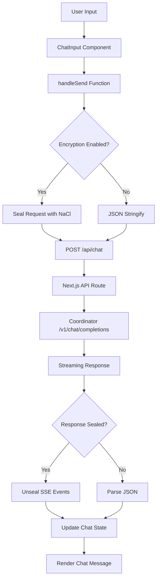
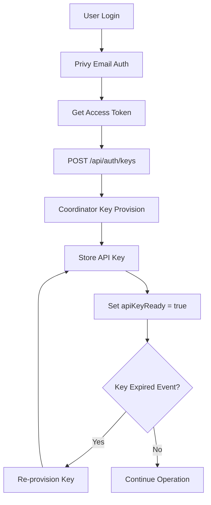
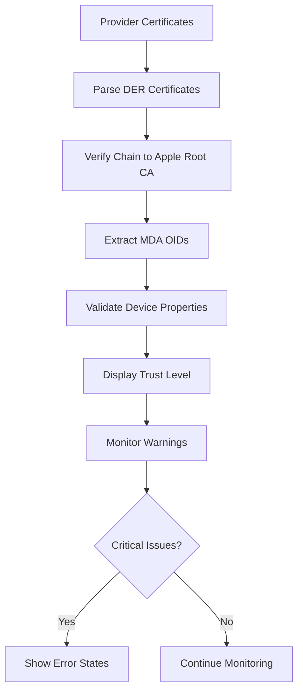

# web

| Property | Value |
|----------|-------|
| Kind | frontend |
| Language | typescript-package |
| Root Path | `console-ui` |
| Manifest | `console-ui/package.json` |
| External Apps | stripe, datadog, privy, apple-ca |

> Next.js web frontend providing chat interface and provider dashboard with E2E encryption

---

# Web Component Analysis

## Overview

The web component is a Next.js frontend application that provides the user interface for Darkbloom's decentralized AI inference platform. Built with TypeScript and React, it serves as both a consumer interface for AI chat interactions and a provider dashboard for hardware attestation management.

## Architecture

The application follows a **layered architecture** with clear separation of concerns:

- **Presentation Layer**: React components with Tailwind CSS styling
- **State Management Layer**: Zustand for client-side state, localStorage for persistence  
- **API Layer**: Custom abstraction over HTTP requests with encryption support
- **Authentication Layer**: Privy-based email authentication with API key provisioning
- **Security Layer**: End-to-end encryption using NaCl Box for coordinator communication

The app uses Next.js App Router with both client-side and server-side rendering, implementing a hybrid approach where sensitive operations happen client-side while static content is server-rendered.

## Key Components

### 1. **Chat Interface (`src/app/page.tsx`)**
- **Description**: Main chat interface for AI conversations
- **Key Features**: Real-time streaming, trust verification badges, model selection
- **Data Flow**: User input → encryption → coordinator API → streaming response → UI update
- **Trust Integration**: Displays hardware attestation status and Secure Enclave verification

### 2. **Provider Dashboard (`src/app/providers/`)**
- **Description**: Interface for hardware providers to monitor their nodes
- **Key Features**: Real-time device status, earnings tracking, attestation warnings
- **Security Focus**: Verifies Apple MDA certificates, monitors hardware integrity
- **Metrics**: Token throughput, earnings, device health alerts

### 3. **Authentication System (`src/hooks/useAuth.ts`, `src/components/providers/PrivyClientProvider.tsx`)**
- **Description**: Privy-based email authentication with API key management
- **Key Features**: Automatic key provisioning, session management, logout cleanup
- **Security**: Clears sensitive data on logout, handles key expiration events

### 4. **API Abstraction (`src/lib/api.ts`)**
- **Description**: Centralized HTTP client with encryption and streaming support
- **Key Features**: Model management, chat streaming, payment processing, provider metrics
- **Encryption**: Optional NaCl Box encryption to coordinator with forward secrecy

### 5. **Certificate Verification (`src/lib/cert-verify.ts`)**
- **Description**: Client-side X.509 certificate chain verification for Apple MDA
- **Key Features**: WebCrypto-based signature verification, OID extraction
- **Trust Chain**: Validates against Apple Enterprise Attestation Root CA

### 6. **State Management (`src/lib/store.ts`)**
- **Description**: Zustand-based global state with persistence
- **Key Features**: Chat history, model selection, UI preferences
- **Persistence**: localStorage with streaming state cleanup on reload

### 7. **Encryption Layer (`src/lib/encryption.ts`)**
- **Description**: End-to-end encryption for requests to coordinator
- **Key Features**: X25519 ephemeral keys, NaCl Box sealing, SSE event decryption
- **Security**: Forward secrecy, key rotation handling, tampering detection

### 8. **App Shell (`src/components/AppShell.tsx`)**
- **Description**: Layout wrapper with navigation and loading states
- **Key Features**: Responsive sidebar, authentication routing, toast notifications
- **Structure**: Conditional rendering based on auth state and current route

### 9. **Billing Interface (`src/app/billing/`)**
- **Description**: Stripe-integrated payment and withdrawal system
- **Key Features**: Credit purchases, provider payouts, usage tracking
- **Compliance**: Country restrictions, KYC requirements, fee calculations

### 10. **API Routes (`src/app/api/`)**
- **Description**: Next.js API routes that proxy requests to coordinator
- **Key Features**: CORS handling, streaming passthrough, header forwarding
- **Security**: API key validation, sealed request handling, error response sealing

### 11. **Telemetry System (`src/components/TelemetryInitializer.tsx`, `src/lib/google-analytics.ts`)**
- **Description**: Privacy-conscious analytics with user consent
- **Key Features**: Consent management, sanitized event tracking, attribution parameters
- **Privacy**: Opt-in basis, localStorage consent, cookie synchronization

### 12. **Trust Badge (`src/components/TrustBadge.tsx`)**
- **Description**: Visual indicator of hardware attestation status
- **Key Features**: Multi-level trust display, Apple verification status
- **Modes**: Normal and paranoid verification modes for different security requirements

## Data Flows

### Primary Chat Flow

### Authentication Flow

### Provider Attestation Verification

## External Dependencies

### Runtime Dependencies

- **next** (^16.2.2) [web-framework]: React-based full-stack framework providing server-side rendering, API routes, and static generation. Used throughout the application for routing, API proxy endpoints, and build optimization. Main entry point in `src/app/layout.tsx`.

- **react** (^19.2.4) [web-framework]: Core UI library for component-based user interface. Used across all components for state management, effects, and rendering. Primary usage in chat interface, provider dashboard, and authentication flows.

- **react-dom** (^19.2.4) [web-framework]: DOM-specific methods for React. Enables client-side hydration and DOM manipulation. Used by Next.js for rendering React components to the browser.

- **@privy-io/react-auth** (^3.18.0) [authentication]: Email-based authentication provider with Web3 wallet support. Handles user login, session management, and access token generation. Integrated in `src/components/providers/PrivyClientProvider.tsx`.

- **@privy-io/server-auth** (^1.32.5) [authentication]: Server-side authentication utilities for validating Privy tokens in API routes. Used in Next.js API endpoints like `src/app/api/auth/keys/route.ts` for secure token verification.

- **zustand** (^5.0.12) [state-management]: Lightweight state management library for React. Manages global application state including chat history, model selection, and UI preferences. Core implementation in `src/lib/store.ts`.

- **tweetnacl** (^1.0.3) [crypto]: Pure JavaScript NaCl cryptography library for end-to-end encryption. Implements X25519 key exchange and Box encryption for secure coordinator communication. Primary usage in `src/lib/encryption.ts`.

- **pkijs** (^3.4.0) [crypto]: JavaScript X.509 certificate manipulation library built on WebCrypto API. Used for client-side verification of Apple MDA certificates. Core implementation in `src/lib/cert-verify.ts`.

- **asn1js** (^3.0.7) [crypto]: ASN.1 decoder/encoder for parsing X.509 certificate structures. Works with pkijs for certificate verification. Used in `src/lib/cert-verify.ts` for DER parsing.

- **lucide-react** (^1.0.1) [ui]: React icon library providing consistent SVG icons throughout the interface. Used across all components for buttons, status indicators, and navigation elements.

- **react-markdown** (^10.1.0) [ui]: Markdown-to-React converter for rendering formatted text in chat messages. Supports syntax highlighting through rehype plugins. Used in `src/components/ChatMessage.tsx`.

- **rehype-highlight** (^7.0.2) [ui]: Syntax highlighting plugin for react-markdown. Adds code block highlighting to chat responses. Integrated through markdown rendering pipeline.

- **remark-gfm** (^4.0.1) [ui]: GitHub Flavored Markdown plugin adding tables, strikethrough, and task lists to markdown rendering. Enhances chat message formatting capabilities.

- **@datadog/browser-rum** (^6.32.0) [monitoring]: Real User Monitoring for performance and error tracking. Provides client-side observability and debugging capabilities. Initialized in `src/components/DatadogRUM.tsx`.

### Development Dependencies

- **typescript** (^5) [build-tool]: Static type checking for enhanced developer experience and runtime safety. Configured in `tsconfig.json` with strict mode enabled.

- **eslint** (^9) [build-tool]: JavaScript/TypeScript linter with security and code quality rules. Configured with Next.js, security, and promise plugins in `eslint.config.mjs`.

- **tailwindcss** (^4) [build-tool]: Utility-first CSS framework for rapid UI development. Provides responsive design system and theming support.

- **vitest** (^4.1.2) [testing]: Fast unit test runner with Vite integration. Configured for component testing with jsdom environment in `vitest.config.ts`.

- **@testing-library/react** (^16.3.2) [testing]: React component testing utilities with user interaction simulation. Used across test files in `__tests__/` directory.

- **@testing-library/jest-dom** (^6.9.1) [testing]: Custom Jest matchers for DOM elements. Provides semantic assertions for component testing.

- **jsdom** (^29.0.1) [testing]: Pure JavaScript DOM implementation for Node.js testing environments. Enables browser-like testing without a real browser.

## API Surface

### HTTP API Endpoints (Next.js API Routes)

- **GET /api/health**: Health check endpoint returning coordinator status and provider count
- **POST /api/chat**: Streaming chat completions proxy to coordinator with encryption support  
- **GET /api/models**: Available AI models listing from coordinator
- **GET /api/encryption-key**: Coordinator's public key for end-to-end encryption
- **POST /api/auth/keys**: API key provisioning using Privy authentication tokens
- **GET /api/payments/balance**: User account balance and withdrawable amounts
- **GET /api/payments/usage**: Detailed usage history with costs and token counts
- **POST /api/payments/stripe/checkout**: Stripe payment session creation for credit purchases
- **GET /api/payments/stripe/status**: Provider payout configuration status  
- **POST /api/payments/stripe/onboard**: Stripe Connect Express onboarding for providers
- **POST /api/payments/withdraw/stripe**: Provider withdrawal requests to Stripe
- **GET /api/payments/stripe/withdrawals**: Provider withdrawal history
- **POST /api/invite/redeem**: Invite code redemption for account credits
- **GET /api/me/providers**: Provider device status and attestation information
- **GET /api/me/summary**: User account summary with provider and consumer activity
- **POST /api/telemetry**: Privacy-conscious analytics event tracking
- **GET /api/pricing**: Model pricing information in USD per token

### Client-Side Library Functions

- **`streamChat(messages, model, callbacks, signal)`**: Core streaming chat function with encryption
- **`fetchModels()`**: Retrieve available AI models with attestation status
- **`fetchBalance()`**: Get current account balance and withdrawable amounts  
- **`fetchUsage()`**: Retrieve detailed usage history
- **`redeemInviteCode(code)`**: Redeem invite codes for account credits
- **`isEncryptionEnabled()`**: Check if end-to-end encryption is enabled
- **`verifyCertificateChain(certificates)`**: Client-side Apple MDA certificate verification

## External Systems

The web component integrates with several external services and infrastructure:

### Identity and Authentication
- **Privy**: Email-based authentication service providing user identity verification and session management through OAuth-like flows

### Payment Processing  
- **Stripe**: Credit card processing for consumer credits and provider payouts through Stripe Connect Express accounts with international support

### Analytics and Monitoring
- **Google Analytics 4**: Privacy-conscious usage analytics with user consent management and sanitized event tracking
- **Datadog RUM**: Real user monitoring for performance tracking, error reporting, and user experience insights

### Content Delivery
- **Vercel/CDN**: Static asset hosting and global distribution for fonts, images, and compiled JavaScript bundles

## Component Interactions

The web component communicates with other system components through several mechanisms:

### HTTP API Calls
- **Coordinator Service**: Primary backend integration for AI inference, model management, authentication, and payment processing through REST APIs and Server-Sent Events
- **Provider Nodes**: Indirect interaction through coordinator for hardware attestation verification and trust level determination

### Shared Infrastructure  
- **PostgreSQL Database**: Shared with coordinator for user accounts, payment records, and provider attestation data (accessed via coordinator APIs)

### External Service Integration
- **Apple Certificate Authority**: Certificate chain verification against Apple Enterprise Attestation Root CA for provider hardware validation
- **Blockchain Networks**: Future integration points for decentralized attestation and payment settlement (infrastructure prepared)

The component operates as a client-side heavy application with server-side API proxying, maintaining security boundaries while providing rich interactive experiences for both AI consumers and hardware providers.

---

## Dependency Connections

- → **coordinator** (API call) — Proxied API requests for AI inference, model management, and billing
- → **stripe** (API call) — Stripe Checkout session creation and payment flows
- → **datadog** (telemetry) — Real user monitoring and frontend error tracking
- → **privy** (OAuth) — User authentication and API key provisioning
