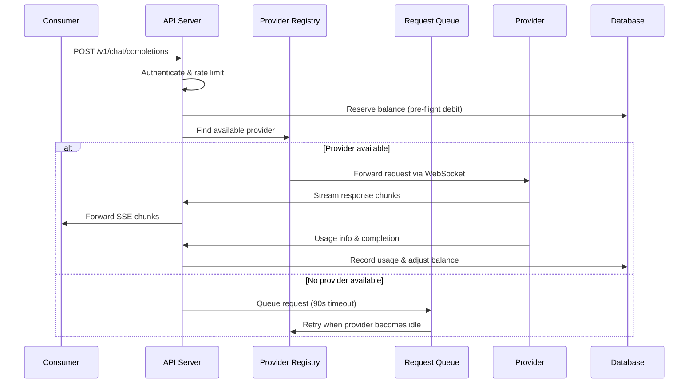
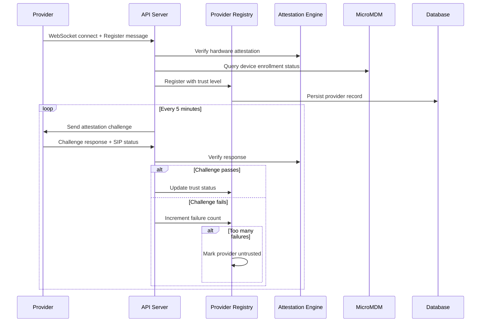
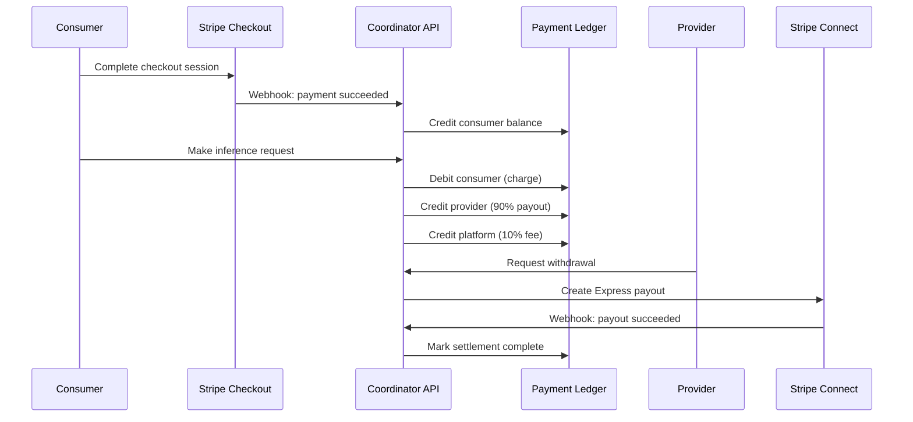

# coordinator

| Property | Value |
|----------|-------|
| Kind | library |
| Language | go-module |
| Root Path | `coordinator` |
| Manifest | `coordinator/go.mod` |
| External Apps | postgresql, stripe, datadog, privy, apple-secure-enclave |

> Core coordination library with provider registry, attestation, and payment systems

---

# Coordinator Component Analysis

## Overview

The coordinator is the central control plane and trust layer for the Darkbloom (EigenInference) network. It acts as a secure routing hub that connects AI model consumers to provider nodes, handling authentication, trust verification, payment processing, and request routing. The coordinator runs in a GCP Confidential VM (AMD SEV-SNP) with hardware-encrypted memory to provide a trusted execution environment.

## Architecture

The coordinator follows a **hexagonal architecture** pattern with clear separation between:
- **External interfaces**: HTTP REST API for consumers, WebSocket connections for providers
- **Core business logic**: Provider registry, attestation verification, payment ledger, request routing
- **Storage adapters**: PostgreSQL for production persistence, in-memory store for development
- **External integrations**: Stripe for payments, Datadog for observability, MicroMDM for device management

The architecture emphasizes trust verification through multiple layers: hardware attestation, Secure Enclave verification, runtime integrity checks, and Apple Business Manager integration.

## Key Components

### 1. **API Server** (`internal/api/server.go`)
- Central HTTP/WebSocket server managing all external communications
- Implements OpenAI-compatible REST endpoints for consumers
- Handles provider WebSocket connections with binary protocol
- Provides admin management interface with Privy authentication
- Supports request-response encryption with X25519 key exchange

### 2. **Provider Registry** (`internal/registry/registry.go`)
- In-memory registry managing connected provider fleet (1,000+ concurrent providers)
- Provider lifecycle: registration → attestation → heartbeat monitoring → eviction
- Trust levels: none, self_signed, hardware (MDA + SecureBoot verified)
- Intelligent request routing with scoring algorithm based on hardware specs, trust level, model cache state
- Background eviction loop removes stale providers every 30 seconds

### 3. **Request Queue** (`internal/registry/queue.go`)
- Multi-tier priority queue for handling provider capacity overflow
- Per-model queuing with FIFO semantics and configurable timeouts
- Automatic request distribution when providers become available
- Queue depth monitoring for capacity planning

### 4. **Attestation Engine** (`internal/attestation/`)
- Hardware trust verification using Apple's MDA (Mobile Device Attestation)
- SecureBoot and SIP (System Integrity Protection) verification
- Challenge-response protocol for periodic provider re-verification
- ACME device-attest-01 integration for SE key binding

### 5. **Payment Ledger** (`internal/payments/payments.go`)
- Double-entry accounting system tracking consumer balances and provider earnings
- Micro-USD precision (6 decimal places) matching on-chain pathUSD representation
- Atomic balance operations with PostgreSQL transaction isolation
- Multi-payment method support: Stripe, Ethereum, Solana, Tempo blockchain

### 6. **Billing Service** (`internal/billing/`)
- Stripe Checkout integration for consumer deposits
- Stripe Connect Express for provider bank/card withdrawals
- Dynamic pricing with per-model custom rates
- Referral system with configurable reward percentages

### 7. **Store Interface** (`internal/store/interface.go`)
- Abstracted persistence layer supporting PostgreSQL and in-memory backends
- API keys, usage records, balance ledger, provider fleet state
- Multi-instance coordinator support through shared PostgreSQL state
- Automatic data pruning for memory-bound deployments

### 8. **Rate Limiting** (`internal/ratelimit/ratelimit.go`)
- Per-account token bucket rate limiting on consumer endpoints
- Separate financial-tier limits for balance-mutating operations
- Configurable burst allowances and replenishment rates
- Graceful degradation with Retry-After headers

### 9. **Telemetry Emitter** (`internal/telemetry/`)
- Structured event forwarding to Datadog Logs API
- Internal metrics collection for fleet monitoring
- Request tracing with correlation IDs
- Panic recovery with stack trace capture

### 10. **MDM Integration** (`internal/mdm/mdm.go`)
- MicroMDM client for independent provider security verification
- Apple Business Manager enrollment status checking
- Device certificate chain validation
- Late-arriving MDA certificate handling

### 11. **End-to-End Encryption** (`internal/e2e/`)
- X25519 key derivation from BIP39 mnemonic seed
- Request encryption: sender → coordinator → provider
- Response encryption: provider → coordinator → sender
- Hardware-bound session keys for provider communications

### 12. **Protocol Definitions** (`internal/protocol/`)
- WebSocket message protocol for provider communication
- OpenAI-compatible JSON schemas for consumer API
- Usage reporting and capacity monitoring messages
- Attestation challenge-response message formats

## Data Flows

### Consumer Request Flow

### Provider Registration & Attestation Flow

### Payment Settlement Flow

## External Dependencies

### Runtime Dependencies

- **nhooyr.io/websocket** (1.8.17) [networking]: WebSocket library for provider connections. Handles binary message framing, connection lifecycle, and graceful shutdowns. Integrated throughout provider communication layer.

- **jackc/pgx/v5** (5.8.0) [database]: PostgreSQL driver for production data persistence. Provides connection pooling, prepared statement caching, and transaction isolation. Used in `internal/store/postgres.go` for all database operations.

- **golang-jwt/jwt/v5** (5.3.1) [auth]: JWT token validation for Privy authentication. Validates consumer session tokens, extracts user claims, and enforces expiration policies. Integrated in `internal/auth/privy.go`.

- **google/uuid** (1.6.0) [utility]: UUID generation for request correlation IDs, billing session tracking, and provider identification. Used across API handlers for request tracing.

- **golang.org/x/crypto** (0.49.0) [crypto]: X25519 key exchange implementation for end-to-end encryption. Provides sender-to-coordinator and coordinator-to-provider encryption capabilities in `internal/e2e/`.

- **golang.org/x/time** (0.15.0) [rate-limiting]: Token bucket rate limiter implementation. Provides per-account request throttling on consumer endpoints and financial operations in `internal/ratelimit/`.

### Observability Dependencies

- **DataDog/datadog-go/v5** (5.8.3) [monitoring]: DogStatsD metrics client for operational telemetry. Emits request counters, latency histograms, and fleet size gauges. Used in `internal/datadog/`.

- **gopkg.in/DataDog/dd-trace-go.v1** (1.74.8) [tracing]: Datadog APM tracer for distributed request tracing. Automatically correlates logs with traces and provides performance insights across the stack.

### Development Dependencies (go.mod `require` block includes test dependencies)

- **stretchr/testify** (1.11.1) [testing]: Assertion library for unit and integration tests. Provides structured test assertions across all test files (`*_test.go`).

All dependencies use specific version constraints to ensure reproducible builds and security. The coordinator prioritizes stability over cutting-edge features.

## External Systems

### Infrastructure Services

- **PostgreSQL**: Primary data store for production deployments. Stores API keys, usage records, balance ledger, provider fleet state, and user accounts. Requires concurrent connection handling for multi-instance coordinator deployments.

- **GCP Confidential VM (AMD SEV-SNP)**: Hardware-encrypted execution environment providing memory encryption and integrity protection. The coordinator's trust model depends on this hardware isolation.

- **Stripe**: Payment processing infrastructure including Checkout for consumer deposits and Connect Express for provider withdrawals. Handles PCI compliance and international banking regulations.

- **Datadog**: Observability platform receiving metrics via DogStatsD, logs via Logs API, and traces via APM agent. Provides alerting and dashboard capabilities for production monitoring.

### Device Management Integration

- **MicroMDM**: Mobile Device Management server for independent provider verification. Validates Apple Business Manager enrollment and device security policies outside of provider self-attestation.

- **step-ca**: Certificate Authority for ACME device-attest-01 protocol. Issues client certificates bound to provider Secure Enclave keys, enabling hardware-verified authentication.

### Blockchain Networks

- **Tempo**: Primary blockchain for pathUSD payments and provider wallet settlements. Supports 6-decimal precision micro-USD transactions with low fees.

- **Ethereum**: Alternative payment rail for EVM-compatible wallet deposits. Provides broader ecosystem compatibility for crypto-native users.

- **Solana**: High-throughput blockchain option for rapid settlement and lower transaction costs. Used for provider payouts in high-frequency scenarios.

## Component Interactions

### HTTP API Consumers
- **Console UI** (`console-ui/`): React frontend consuming coordinator REST API for user dashboard, provider management, and billing interfaces.
- **Provider CLI** (`provider/`): Go binary that connects via WebSocket to register as inference provider and receive work assignments.
- **SDK Clients**: Third-party applications using OpenAI-compatible endpoints for inference requests and balance management.

### Shared Database Access
- **Analytics Service** (`analytics/`): Read-only access to coordinator PostgreSQL for business intelligence and usage analytics without impacting coordinator performance.

### External API Calls
- **Privy Authentication API**: Real-time JWT token validation for user session management and email verification flows.
- **Apple Business Manager API**: Device enrollment verification for provider trust levels (via MicroMDM proxy).
- **Blockchain RPC Nodes**: Transaction broadcasting and confirmation monitoring for multi-chain payment settlement.

## API Surface

### Consumer Endpoints (OpenAI-compatible)

**Inference Endpoints:**
- `POST /v1/chat/completions` - OpenAI chat completions with streaming support
- `POST /v1/completions` - Legacy completions endpoint for older clients  
- `POST /v1/messages` - Anthropic-compatible messages endpoint
- `POST /v1/responses` - Responses API for SDK clients
- `GET /v1/models` - List available models with provider counts and attestation status

**Payment & Account Management:**
- `GET /v1/payments/balance` - Get current account balance in micro-USD
- `GET /v1/payments/usage` - Historical usage records with token counts and costs
- `POST /v1/billing/stripe/create-session` - Initiate Stripe Checkout deposit flow
- `GET /v1/billing/wallet/balance` - Multi-chain wallet balance aggregation

**Authentication:**
- `POST /v1/auth/keys` - Create new API key (Privy session required)
- `DELETE /v1/auth/keys` - Revoke API key
- `GET /v1/encryption-key` - Get coordinator's X25519 public key for E2E encryption

### Provider Endpoints

**WebSocket Connection:**
- `GET /ws/provider` - Persistent WebSocket for provider communication
- Binary protocol with Register, Heartbeat, InferenceRequest, Usage messages
- Challenge-response attestation verification every 5 minutes

**Device Authorization (RFC 8628-style):**
- `POST /v1/device/code` - Generate device code for provider → account linking
- `POST /v1/device/token` - Poll for user approval
- `POST /v1/device/approve` - Approve device code (Privy session required)

**Provider Analytics:**
- `GET /v1/provider/earnings` - Per-node earnings by provider public key
- `GET /v1/provider/node-earnings` - Public earnings for specific provider
- `GET /v1/provider/account-earnings` - Account-aggregated provider earnings

### Administrative Endpoints

**Model Catalog Management:**
- `GET /v1/admin/models` - List supported models
- `POST /v1/admin/models` - Add/update supported model
- `DELETE /v1/admin/models` - Remove model from catalog

**Release Management:**
- `POST /v1/releases` - Register new provider binary release (scoped key)
- `GET /v1/releases/latest` - Get latest provider version for install.sh
- `GET /v1/admin/releases` - List all releases (admin)
- `DELETE /v1/admin/releases` - Deactivate release version

**Platform Operations:**
- `GET /v1/admin/metrics` - Internal metrics snapshot (JSON/Prometheus)
- `POST /v1/admin/credit` - Grant non-withdrawable account credit
- `POST /v1/admin/reward` - Grant withdrawable account reward
- `GET /v1/stats` - Public platform statistics

### Public Endpoints

**Network Information:**
- `GET /v1/leaderboard` - Pseudonymized provider earnings rankings
- `GET /v1/network/totals` - Aggregate network metrics (tokens, jobs, earnings)
- `GET /v1/runtime/manifest` - Expected runtime component hashes
- `GET /v1/providers/attestation` - Provider attestation verification data

**Installation & Setup:**
- `GET /install.sh` - Provider installation script with environment-specific URLs
- `GET /health` - Health check endpoint for load balancers
- `GET /api/version` - Latest provider version check

All endpoints support CORS for console UI integration and return structured JSON responses with consistent error formats. Rate limiting is applied per-account with separate tiers for inference vs. financial operations.

---

## Dependency Connections

- → **coordinator** (depends on)
- ← **verify-attestation** (depends on)
- ← **web** (API call) — Proxied API requests for AI inference, model management, and billing
- ← **darkbloom** (WebSocket) — Provider registration, inference request handling, and attestation challenges
- → **postgresql** (DB connection) — Primary data persistence for accounts, balances, and provider state
- → **stripe** (API call) — Payment processing for deposits and Connect Express payouts
- → **datadog** (telemetry) — APM traces, DogStatsD metrics, and structured logs
