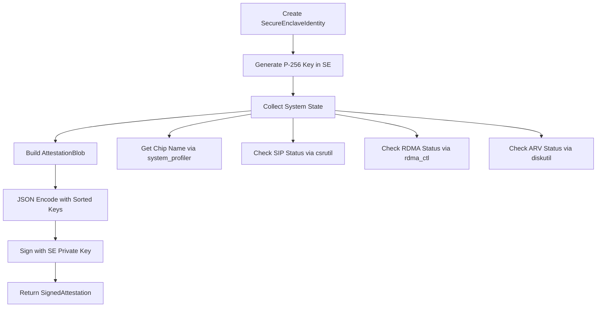
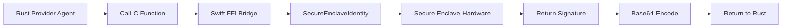
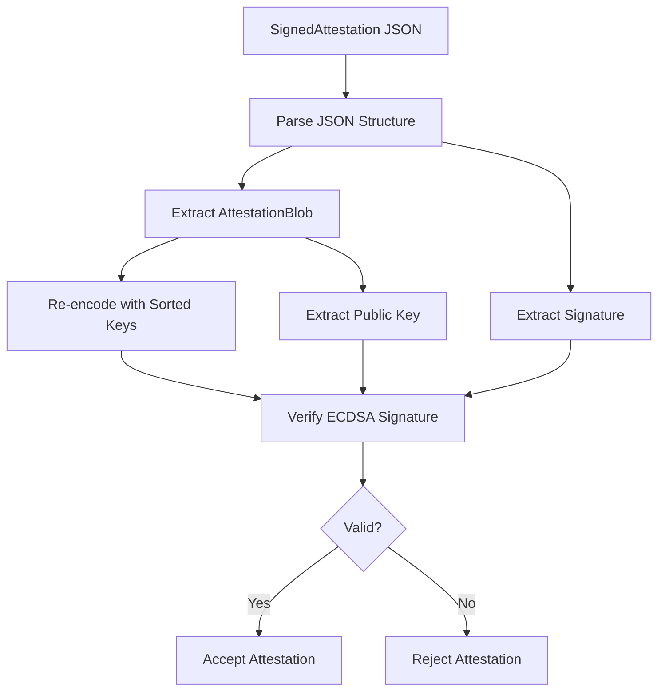

# EigenInferenceEnclave

| Property | Value |
|----------|-------|
| Kind | library |
| Language | swift-package |
| Root Path | `enclave/Sources/EigenInferenceEnclave` |
| Manifest | `enclave/Package.swift` |
| External Apps | apple-secure-enclave, macos-system-tools |

> Swift package providing Secure Enclave attestation and signing capabilities

---

# EigenInferenceEnclave Analysis

## Overview

EigenInferenceEnclave is a Swift package that provides hardware-backed cryptographic attestation capabilities using Apple's Secure Enclave. This component serves as the foundation for hardware identity and security verification in the EigenInference provider ecosystem. It creates tamper-resistant device identities and generates cryptographically signed attestation blobs that prove hardware and software security posture.

## Architecture

The component follows a **layered architecture pattern** with three distinct layers:

1. **Core Cryptographic Layer**: `SecureEnclaveIdentity` manages P-256 ECDSA keys stored in the Secure Enclave hardware
2. **Attestation Service Layer**: `AttestationService` builds and signs attestation blobs containing system security state
3. **Foreign Function Interface (FFI) Layer**: `Bridge.swift` provides C-callable functions for Rust integration

The architecture emphasizes security boundaries - private keys never leave the Secure Enclave hardware, and all cryptographic operations are hardware-isolated.

## Key Components

### 1. SecureEnclaveIdentity (Core Identity Management)
- **Location**: `Sources/EigenInferenceEnclave/SecureEnclaveIdentity.swift`
- **Purpose**: Manages hardware-bound P-256 ECDSA signing keys in Apple's Secure Enclave
- **Key Features**:
  - Creates ephemeral or persistent device identities
  - Provides multiple public key formats (base64, hex, raw bytes)
  - Hardware-isolated signing operations using `CryptoKit.SecureEnclave`
  - Static verification methods for signature validation

### 2. AttestationService (Security State Attestation)
- **Location**: `Sources/EigenInferenceEnclave/Attestation.swift`
- **Purpose**: Builds signed attestation blobs containing hardware/software security state
- **Key Features**:
  - Collects system security information (SIP, Secure Boot, ARV, RDMA status)
  - Creates deterministic JSON attestation blobs with sorted keys
  - Signs attestations with Secure Enclave keys
  - Provides local verification capabilities

### 3. AttestationBlob (Data Structure)
- **Location**: `Sources/EigenInferenceEnclave/Attestation.swift` (lines 44-59)
- **Purpose**: Structured representation of hardware and software security state
- **Key Fields**:
  - Hardware identity: `chipName`, `hardwareModel`, `serialNumber`
  - Security state: `sipEnabled`, `secureBootEnabled`, `authenticatedRootEnabled`
  - Cryptographic binding: `publicKey`, `encryptionPublicKey` (optional)
  - Freshness: `timestamp` in ISO 8601 format

### 4. FFI Bridge (C Interoperability)
- **Location**: `Sources/EigenInferenceEnclave/Bridge.swift`
- **Purpose**: Provides C-callable functions for integration with Rust provider agents
- **Key Features**:
  - Memory-safe FFI with proper ownership semantics
  - Opaque handle management for Swift objects
  - String memory management with `strdup`/`free` convention

### 5. CLI Tool (Development Interface)
- **Location**: `Sources/EigenInferenceEnclaveCLI/main.swift`
- **Purpose**: Command-line interface for attestation generation and diagnostics
- **Commands**:
  - `attest`: Generate signed attestation blobs (ephemeral keys)
  - `info`: Display Secure Enclave availability and system information

### 6. System Information Collectors
- **Location**: `Sources/EigenInferenceEnclave/Attestation.swift` (lines 163-344)
- **Purpose**: Gather hardware and software security state from macOS
- **Functions**: `getChipName()`, `checkSIPEnabled()`, `checkRDMADisabled()`, etc.

## Data Flows

### Attestation Generation Flow



### FFI Integration Flow



### Verification Flow



## External Dependencies

### Core Swift Frameworks

- **CryptoKit** (System): Apple's cryptographic framework providing Secure Enclave access
  - **Category**: crypto
  - **Purpose**: Provides `SecureEnclave.P256.Signing.PrivateKey` for hardware-isolated key operations and `P256.Signing.PublicKey` for verification. Essential for all cryptographic operations.
  - **Integration points**: Used throughout `SecureEnclaveIdentity.swift` and `Bridge.swift` for key generation, signing, and verification.

- **Foundation** (System): Apple's fundamental framework
  - **Category**: other
  - **Purpose**: Provides core data types (`Data`, `Date`, `String`), JSON encoding/decoding (`JSONEncoder`, `JSONDecoder`), and process execution (`Process`, `Pipe`) for system information gathering.
  - **Integration points**: Used in all Swift files for data handling, JSON serialization, and system command execution.

### Testing Framework

- **XCTest** (System): Apple's unit testing framework
  - **Category**: testing
  - **Purpose**: Provides test infrastructure for validating Secure Enclave operations, attestation generation, and FFI bridge functionality.
  - **Integration points**: Used in `Tests/EigenInferenceEnclaveTests/` for comprehensive test coverage.

### System Tools (Runtime Dependencies)

- **system_profiler** (macOS): System information utility
  - **Purpose**: Used to extract hardware information like chip name and serial number for attestation blobs
  - **Integration**: Called via `Process` in `getChipName()` and `getSerialNumber()` functions

- **csrutil** (macOS): System Integrity Protection utility
  - **Purpose**: Used to check SIP status for security attestation
  - **Integration**: Called in `checkSIPEnabled()` function

- **diskutil** (macOS): Disk utility for volume information
  - **Purpose**: Used to verify Authenticated Root Volume status
  - **Integration**: Called in `checkAuthenticatedRootEnabled()` and `getSystemVolumeHash()` functions

- **rdma_ctl** (macOS): Remote Direct Memory Access control utility
  - **Purpose**: Used to verify RDMA is disabled (security requirement)
  - **Integration**: Called in `checkRDMADisabled()` function

## Internal Dependencies

This component has no direct internal dependencies within the d-inference codebase. However, it serves as a foundational library consumed by:

- **Rust Provider Agent**: Consumes the FFI interface to integrate Secure Enclave attestation capabilities
- **Go Coordinator**: Verifies attestation signatures using the embedded public keys

## API Surface

### Swift Library API

**SecureEnclaveIdentity Class**
```swift
public init() throws                                    // Create new identity
public init(dataRepresentation: Data) throws          // Load existing identity
public var publicKeyBase64: String                     // Base64-encoded public key
public var publicKeyHex: String                        // Hex-encoded public key  
public var publicKeyRaw: Data                          // Raw 64-byte public key
public func sign(_ data: Data) throws -> Data          // Sign with SE private key
public func verify(signature: Data, for: Data) -> Bool // Verify signature
public static var isAvailable: Bool                    // Check SE availability
```

**AttestationService Class**
```swift
public init(identity: SecureEnclaveIdentity)
public func createAttestation(encryptionPublicKey: String?, binaryHash: String?) throws -> SignedAttestation
public static func verify(_ signed: SignedAttestation) -> Bool
```

### C FFI API

**Core Functions**
```c
int32_t eigeninference_enclave_is_available(void);
EigenInferenceEnclaveIdentity eigeninference_enclave_create(void);
void eigeninference_enclave_free(EigenInferenceEnclaveIdentity identity);
char* eigeninference_enclave_public_key_base64(EigenInferenceEnclaveIdentity identity);
char* eigeninference_enclave_sign(EigenInferenceEnclaveIdentity identity, const uint8_t* data, int data_len);
int32_t eigeninference_enclave_verify(const char* pub_key_base64, const uint8_t* data, int data_len, const char* sig_base64);
```

**Attestation Functions**
```c
char* eigeninference_enclave_create_attestation(EigenInferenceEnclaveIdentity identity);
char* eigeninference_enclave_create_attestation_full(EigenInferenceEnclaveIdentity identity, const char* encryptionKeyBase64, const char* binaryHashHex);
void eigeninference_enclave_free_string(char* str);
```

### CLI Interface

**Commands**
- `eigeninference-enclave attest [--encryption-key <base64>] [--binary-hash <hex>]`: Generate signed attestation
- `eigeninference-enclave info`: Display Secure Enclave availability and generate ephemeral public key

## Security Model

### Hardware Security Guarantees

1. **Private Key Isolation**: P-256 private keys are generated and stored exclusively in the Secure Enclave hardware - they cannot be extracted or cloned
2. **Tamper Resistance**: Secure Enclave provides hardware-level protection against physical and software attacks
3. **Device Binding**: Keys are bound to the specific device's Secure Enclave and cannot be transferred

### Software Security Considerations

1. **Attestation Integrity**: All system security checks are software-based and can be spoofed by a compromised system. Production deployments should use Managed Device Attestation (MDA) for hardware-attested security state.
2. **JSON Determinism**: Attestation blobs use sorted JSON keys to ensure identical serialization between Swift and Go implementations for signature verification.
3. **Memory Safety**: FFI bridge uses proper memory management with `Unmanaged` references and explicit cleanup functions.

### Attack Surface Analysis

- **Secure Enclave Bypass**: Not possible - private keys are hardware-isolated
- **Attestation Spoofing**: Possible for software-checked fields (SIP, Secure Boot) - mitigated by MDA in production
- **Signature Replay**: Mitigated by timestamp freshness checking in coordinator
- **FFI Memory Corruption**: Mitigated by careful memory management and Swift's type safety


---

## Dependency Connections

- → **EigenInferenceEnclave** (depends on)
- → **EigenInferenceEnclaveCLI** (depends on)
- ← **EigenInferenceEnclaveCLI** (depends on)
- ← **darkbloom** (FFI call) — Secure Enclave attestation and challenge-response signing via FFI bridge
- → **apple-secure-enclave** (hardware call) — P-256 ECDSA key operations and cryptographic signing
