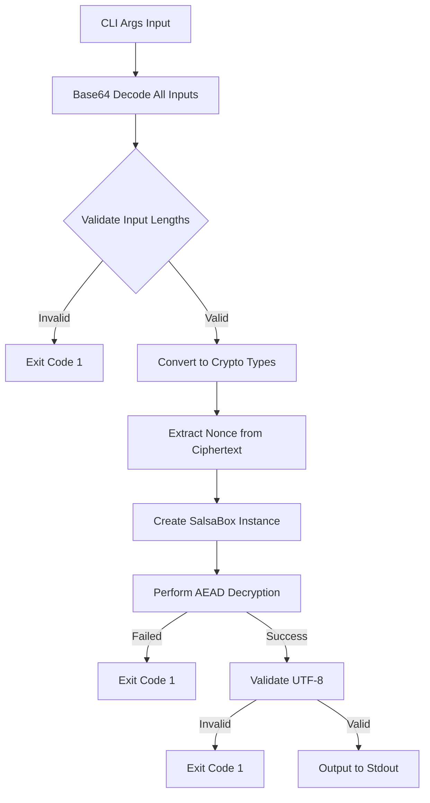

# decrypt-test

| Property | Value |
|----------|-------|
| Kind | service |
| Language | rust-crate |
| Root Path | `coordinator/internal/e2e/testdata/decrypt` |
| Manifest | `coordinator/internal/e2e/testdata/decrypt/Cargo.toml` |

> Test utility for E2E encryption validation

---

# decrypt-test Component Analysis

## Overview

The `decrypt-test` component is a minimal Rust CLI service designed for cross-language cryptographic compatibility testing between the Go coordinator and Rust provider components in the d-inference system. It serves as a verification tool to ensure that encrypted payloads created by the Go e2e encryption package can be correctly decrypted by the Rust crypto_box crate, validating the cryptographic interoperability of the system.

## Architecture

The component follows a **simple command-line utility pattern** with:
- Single-purpose binary design focused on cryptographic verification
- Direct CLI argument processing without complex parsing frameworks  
- Minimal error handling with immediate exit on failures
- Stateless execution model (no persistent state or configuration)

The architecture is deliberately minimal to reduce complexity and focus purely on the cryptographic operation validation.

## Key Components

### 1. **Main Entry Point** (`src/main.rs:15-81`)
- **Purpose**: CLI argument parsing, validation, and orchestration of the decryption process
- **Key Features**: 
  - Three-argument validation (ephemeral public key, ciphertext, provider private key)
  - Base64 decoding of all input parameters
  - Comprehensive input validation with descriptive error messages
  - Process exit codes for automation compatibility

### 2. **Cryptographic Input Validation** (`src/main.rs:38-58`)
- **Purpose**: Ensures all cryptographic inputs meet NaCl Box specifications
- **Validations**:
  - Ephemeral public key must be exactly 32 bytes (X25519 standard)
  - Provider private key must be exactly 32 bytes (X25519 standard)
  - Ciphertext must be at least 24 bytes (minimum: nonce + encrypted data)

### 3. **Key Material Processing** (`src/main.rs:60-65`)
- **Purpose**: Converts byte arrays to crypto_box types for NaCl operations
- **Operations**:
  - Converts byte arrays to fixed-size arrays using `try_into()`
  - Creates `PublicKey` and `SecretKey` instances from raw bytes
  - Establishes `SalsaBox` for the decryption operation

### 4. **Decryption Engine** (`src/main.rs:67-76`)
- **Purpose**: Performs NaCl Box decryption using XSalsa20-Poly1305
- **Process**:
  - Extracts 24-byte nonce from ciphertext prefix
  - Uses remaining bytes as authenticated ciphertext
  - Performs AEAD decryption with the derived shared secret

### 5. **Output Handler** (`src/main.rs:77-81`)
- **Purpose**: Converts decrypted bytes to UTF-8 and outputs to stdout
- **Features**:
  - UTF-8 validation with error reporting
  - Direct stdout output without buffering
  - Clean output format for test automation

## Data Flows

### Primary Decryption Flow



### Error Handling Flow

```mermaid
graph TD
    A[Any Error Condition] --> B[Print Error to Stderr]
    B --> C[Call std::process::exit(1)]
    C --> D[Process Terminates]
    
    E[Success Path] --> F[Print Result to Stdout]
    F --> G[Implicit Exit Code 0]
```

## External Dependencies

### External Libraries

- **crypto_box** (0.9) [crypto]: Provides NaCl Box (X25519 + XSalsa20-Poly1305) encryption/decryption primitives. Used for the core cryptographic operations including key types (`PublicKey`, `SecretKey`), the encryption box (`SalsaBox`), and AEAD trait implementations. Imported and used throughout `src/main.rs:12-13, 63-75`.

- **base64** (0.22) [serialization]: Provides base64 encoding/decoding functionality using the standard alphabet. Used to decode all CLI arguments from base64 format as required by the cross-language testing protocol. Imported and used in `src/main.rs:10-11, 25-36`.

### Standard Library Dependencies
- **std::env**: For command-line argument access
- **std::process**: For controlled process termination with exit codes

## API Surface

### Command-Line Interface

```bash
decrypt-test <ephemeral_public_key_b64> <ciphertext_b64> <provider_private_key_b64>
```

**Parameters:**
- `ephemeral_public_key_b64`: Base64-encoded 32-byte X25519 public key from coordinator's ephemeral session
- `ciphertext_b64`: Base64-encoded encrypted payload (24-byte nonce || encrypted data)  
- `provider_private_key_b64`: Base64-encoded 32-byte X25519 private key

**Output:**
- **Success**: Decrypted plaintext written to stdout
- **Failure**: Error message to stderr, process exits with code 1

**Exit Codes:**
- `0`: Successful decryption and output
- `1`: Any error (invalid arguments, decode failure, decryption failure, UTF-8 error)

## External Systems

This component operates as a standalone utility with no external system dependencies:
- **No network communication**
- **No database connections** 
- **No file system persistence**
- **No cloud service integrations**

It operates purely on command-line inputs and produces command-line outputs.

## Component Interactions

### Test Integration
- **Target**: Go test suite (`coordinator/internal/e2e/cross_compat_test.go`)
- **Type**: Process execution 
- **Protocol**: Command-line interface with arguments
- **Description**: The Go test harness builds this Rust binary, encrypts test payloads using the Go e2e package, then shells out to this utility to verify cross-language cryptographic compatibility.

### Build Dependencies
- **Target**: Cargo build system
- **Type**: Compilation dependency
- **Description**: Built as a release binary during Go tests using `cargo build --release` for performance optimization in the test suite.

## Cross-Language Compatibility Testing

This component is specifically designed to validate the cryptographic interoperability between:

1. **Go Encryption** (`coordinator/internal/e2e/e2e.go`): Uses `golang.org/x/crypto/nacl/box` 
2. **Rust Decryption** (this component): Uses `crypto_box` crate

The test scenarios include:
- JSON payloads (typical inference requests)
- Empty payloads (edge case handling)
- Unicode content (character encoding compatibility)  
- Large payloads (64KB+ for chunked encryption verification)
- Multiple round trips (nonce uniqueness and determinism checks)

## Security Considerations

- **Input Validation**: Comprehensive validation of all cryptographic inputs
- **Memory Safety**: Rust's memory safety prevents buffer overflows
- **No Key Persistence**: Private keys are only held in memory during execution
- **Constant-Time Operations**: Uses established crypto_box library with timing attack mitigations
- **Forward Secrecy**: Supports ephemeral key usage patterns

