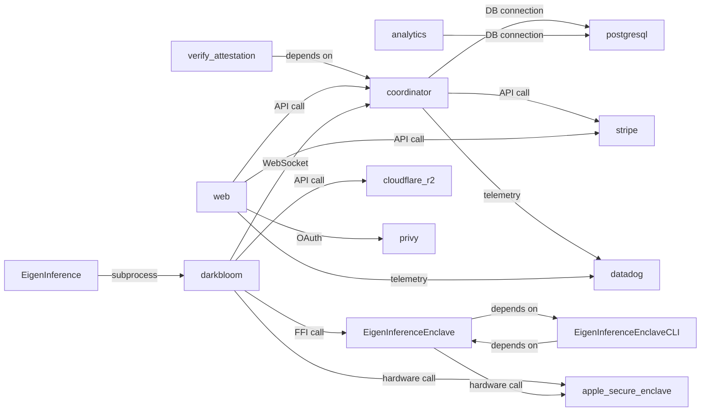

# Dependency Graph

## Component Dependency Diagram

## Edge Details

| Source | Target | Type | Protocol | Description |
|--------|--------|------|----------|-------------|
| verify-attestation | coordinator | depends_on | — | — |
| EigenInferenceEnclave | EigenInferenceEnclaveCLI | depends_on | — | — |
| EigenInferenceEnclaveCLI | EigenInferenceEnclave | depends_on | — | — |
| web | coordinator | api_calls | https | Proxied API requests for AI inference, model management, and billing |
| darkbloom | coordinator | websocket_connection | websocket | Provider registration, inference request handling, and attestation challenges |
| EigenInference | darkbloom | subprocess_management | local | Manages darkbloom binary lifecycle through subprocess spawning and monitoring |
| darkbloom | EigenInferenceEnclave | ffi_calls | ffi | Secure Enclave attestation and challenge-response signing via FFI bridge |
| coordinator | postgresql | database_connection | tcp | Primary data persistence for accounts, balances, and provider state |
| analytics | postgresql | database_connection | tcp | Read-only access to provider and earnings data |
| coordinator | stripe | api_calls | https | Payment processing for deposits and Connect Express payouts |
| web | stripe | api_calls | https | Stripe Checkout session creation and payment flows |
| coordinator | datadog | telemetry_reporting | udp/https | APM traces, DogStatsD metrics, and structured logs |
| web | datadog | telemetry_reporting | https | Real user monitoring and frontend error tracking |
| darkbloom | cloudflare-r2 | api_calls | https | Model and runtime package downloads |
| web | privy | oauth_integration | https | User authentication and API key provisioning |
| darkbloom | apple-secure-enclave | hardware_calls | system | Hardware attestation blob generation and challenge signing |
| EigenInferenceEnclave | apple-secure-enclave | hardware_calls | system | P-256 ECDSA key operations and cryptographic signing |

## Edge Types

### api_calls (4)

- **web** → **coordinator** — Proxied API requests for AI inference, model management, and billing
- **coordinator** → **stripe** — Payment processing for deposits and Connect Express payouts
- **web** → **stripe** — Stripe Checkout session creation and payment flows
- **darkbloom** → **cloudflare-r2** — Model and runtime package downloads

### database_connection (2)

- **coordinator** → **postgresql** — Primary data persistence for accounts, balances, and provider state
- **analytics** → **postgresql** — Read-only access to provider and earnings data

### depends_on (6)

- **analytics** → **analytics**
- **coordinator** → **coordinator**
- **verify-attestation** → **coordinator**
- **EigenInferenceEnclave** → **EigenInferenceEnclave**
- **EigenInferenceEnclave** → **EigenInferenceEnclaveCLI**
- **EigenInferenceEnclaveCLI** → **EigenInferenceEnclave**

### ffi_calls (1)

- **darkbloom** → **EigenInferenceEnclave** — Secure Enclave attestation and challenge-response signing via FFI bridge

### hardware_calls (2)

- **darkbloom** → **apple-secure-enclave** — Hardware attestation blob generation and challenge signing
- **EigenInferenceEnclave** → **apple-secure-enclave** — P-256 ECDSA key operations and cryptographic signing

### oauth_integration (1)

- **web** → **privy** — User authentication and API key provisioning

### subprocess_management (1)

- **EigenInference** → **darkbloom** — Manages darkbloom binary lifecycle through subprocess spawning and monitoring

### telemetry_reporting (2)

- **coordinator** → **datadog** — APM traces, DogStatsD metrics, and structured logs
- **web** → **datadog** — Real user monitoring and frontend error tracking

### websocket_connection (1)

- **darkbloom** → **coordinator** — Provider registration, inference request handling, and attestation challenges

