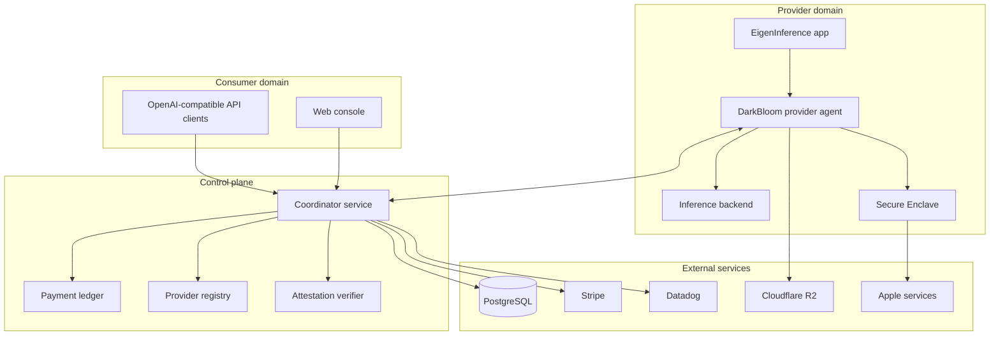

# Architecture

This section specifies the major runtime domains and the way work moves through them.

## Runtime domains

## Architectural requirements

- <!-- req: system.role.coordinator; source: artifacts/d-inference/service_discovery/components.json#L30-L87 --> The coordinator MUST maintain enough provider state to route inference requests to eligible providers.
- <!-- req: system.role.provider; source: artifacts/d-inference/service_discovery/components.json#L193-L315 --> The provider runtime MUST manage local model/backend lifecycle before it can service assigned inference work.
- <!-- req: system.role.analytics; source: artifacts/d-inference/service_discovery/components.json#L4-L27 --> Analytics components SHOULD consume read-only or derived operational state rather than acting as request-routing authorities.
- <!-- req: system.role.web; source: artifacts/d-inference/service_discovery/components.json#L103-L169 --> The web console MAY expose both consumer and provider-facing views, but it is not the provider runtime.

## Separation of concerns

- The coordinator owns global routing, provider registry, payment/accounting, and policy checks.
- Providers own local hardware detection, model discovery, inference backend lifecycle, and response streaming.
- Secure Enclave components own hardware-backed key and attestation operations.
- Analytics is observational and should not be on the critical inference routing path.
