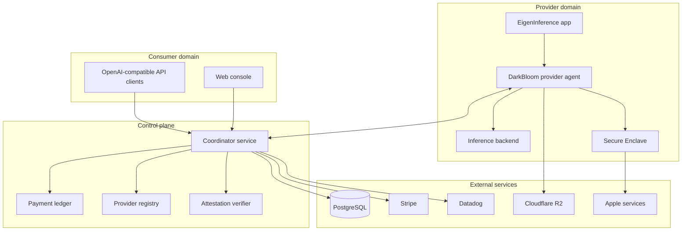
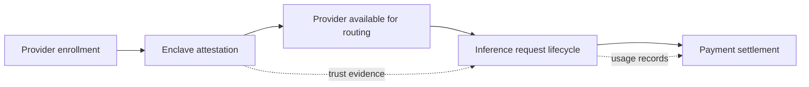
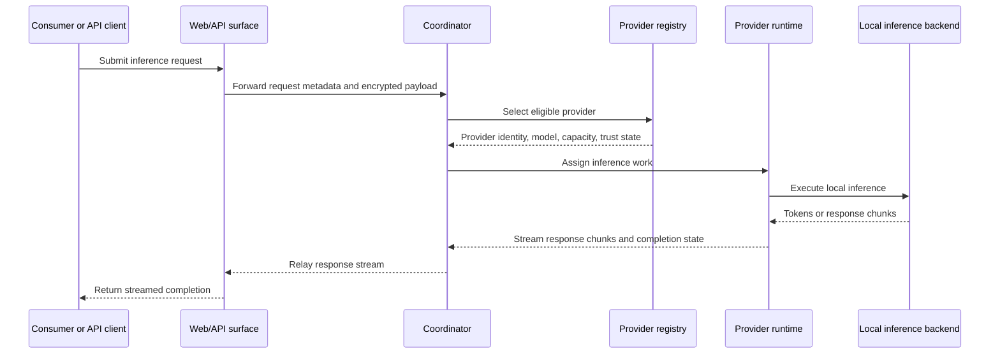
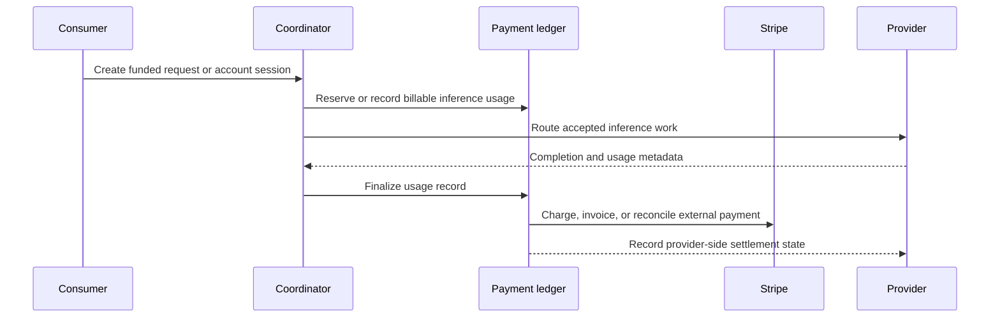
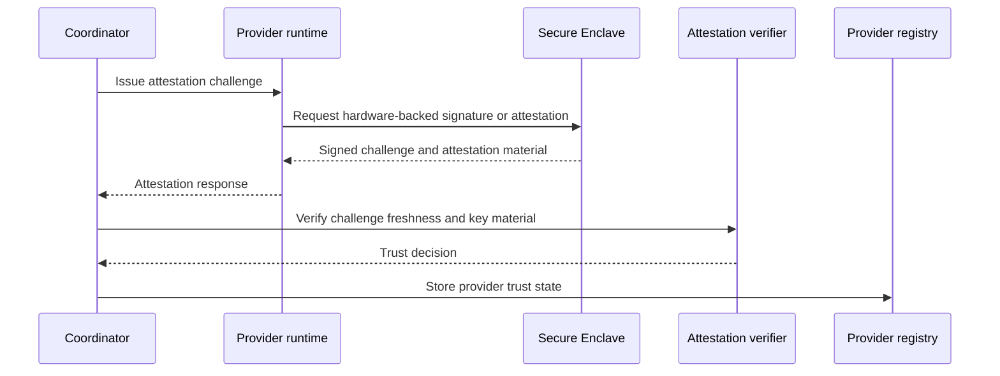
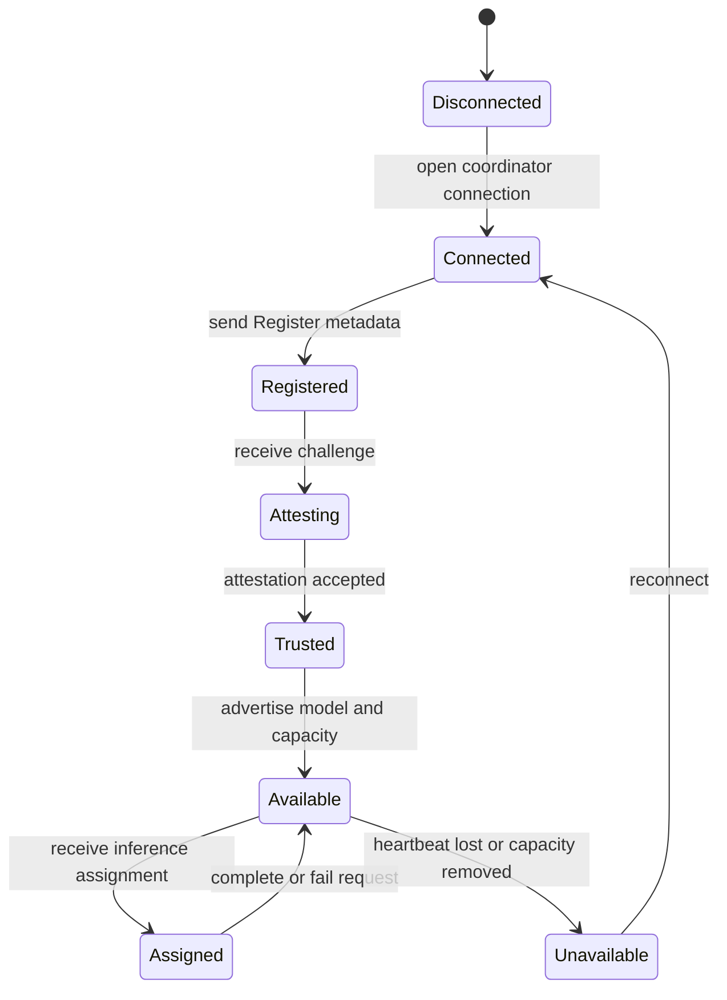

# Architecture

This section specifies the DarkBloom runtime architecture and the four system flows that define the protocol boundary:
provider enrollment, enclave attestation, request execution, and payment settlement.

## Runtime domains

## Core system flows

DarkBloom separates user-facing inference traffic from provider trust establishment and settlement. A provider first enrolls
with the coordinator, proves hardware-backed identity through enclave attestation, advertises capacity, receives routed
requests, streams results, and is later accounted for through the payment ledger.

## Request lifecycle

The request lifecycle begins when a consumer submits an OpenAI-compatible inference request. The coordinator validates the
request, selects an eligible attested provider, forwards the assignment, and relays streamed provider output back to the
consumer-facing API surface.

- <!-- req: protocol.consumer-flow; source: artifacts/d-inference/architecture_docs/architecture.md#L251-L276 --> The coordinator MUST route inference work only to providers that are eligible for the requested model and current trust policy.
- <!-- req: system.role.provider; source: artifacts/d-inference/service_discovery/components.json#L193-L315 --> A provider MUST manage local backend execution and stream response state back through the coordinator path.

## Payment flow

Payments are a settlement concern rather than an inference critical-path decision. The coordinator records request usage,
associates the usage with a consumer and provider, and coordinates external payment rails and internal ledger state.

- <!-- req: protocol.payment-settlement; source: artifacts/d-inference/architecture_docs/architecture.md#L314-L338 --> The coordinator MUST produce enough usage/accounting state to reconcile consumer charges and provider settlement.
- <!-- req: protocol.payment-settlement; source: artifacts/d-inference/architecture_docs/architecture.md#L314-L338 --> Payment settlement SHOULD be derived from completed or explicitly failed inference work rather than from unverified provider availability alone.

## Enclave attestation flow

Enclave attestation binds provider identity to hardware-backed key material. The coordinator issues a freshness challenge,
the provider signs or proves challenge material through Secure Enclave backed operations, and the coordinator records the
result as provider trust state before routing sensitive work.

- <!-- req: security.trust-model; source: artifacts/d-inference/architecture_docs/architecture.md#L340-L376 --> The coordinator MUST verify provider attestation evidence before treating a provider as trusted for routed inference work.
- <!-- req: security.trust-model; source: artifacts/d-inference/architecture_docs/architecture.md#L340-L376 --> Attestation responses MUST be bound to coordinator challenge freshness to prevent replay of stale trust evidence.

## Provider enrollment flow

Enrollment is the transition from an independently operated machine to an addressable provider in the coordinator registry.
The provider connects, registers identity and capability metadata, completes trust establishment, starts heartbeating, and
only then becomes eligible for request assignment.

- <!-- req: protocol.provider-registration; source: artifacts/d-inference/architecture_docs/architecture.md#L278-L312 --> A provider MUST register with the coordinator before it is eligible to receive inference assignments.
- <!-- req: protocol.provider-registration; source: artifacts/d-inference/architecture_docs/architecture.md#L278-L312 --> A provider MUST advertise model and capacity metadata before the coordinator can route compatible work to it.

## Architectural requirements

- <!-- req: system.role.coordinator; source: artifacts/d-inference/service_discovery/components.json#L30-L87 --> The coordinator MUST maintain enough provider state to route inference requests to eligible providers.
- <!-- req: system.role.provider; source: artifacts/d-inference/service_discovery/components.json#L193-L315 --> The provider runtime MUST manage local model/backend lifecycle before it can service assigned inference work.
- <!-- req: system.role.analytics; source: artifacts/d-inference/service_discovery/components.json#L4-L27 --> Analytics components SHOULD consume read-only or derived operational state rather than acting as request-routing authorities.
- <!-- req: system.role.web; source: artifacts/d-inference/service_discovery/components.json#L103-L169 --> The web console MAY expose both consumer and provider-facing views, but it is not the provider runtime.

## Separation of concerns

- The coordinator owns global routing, provider registry, payment/accounting, and policy checks.
- Providers own local hardware detection, model discovery, inference backend lifecycle, and response streaming.
- Secure Enclave components own hardware-backed key and attestation operations.
- Analytics is observational and should not be on the critical inference routing path.
