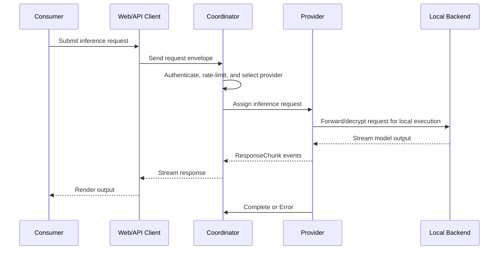

# Inference Lifecycle

The inference lifecycle specifies the route from consumer request to provider execution and streamed completion.

## Flow

## Requirements

- <!-- req: protocol.consumer-flow; source: artifacts/d-inference/architecture_docs/architecture.md#L251-L276 --> The coordinator MUST select an eligible provider before forwarding an inference request to provider runtime execution.
- <!-- req: runtime.provider; source: artifacts/d-inference/service_analyses/darkbloom.md#L210-L274 --> The provider runtime MUST bridge assigned inference work to a local inference backend and stream lifecycle results back to the coordinator.
- <!-- req: security.crypto; source: artifacts/d-inference/service_analyses/darkbloom.md#L48-L52 --> Encrypted inference requests MUST be decrypted only within the provider-side cryptographic/runtime boundary described by the provider artifacts.
- <!-- req: protocol.payment-settlement; source: artifacts/d-inference/architecture_docs/architecture.md#L314-L338 --> Usage accounting SHOULD occur after completion/error reporting so settlement reflects executed work.

## Completion states

An assigned inference request should terminate in exactly one externally visible terminal state:

- `Complete`: the provider finished streaming output.
- `Error`: the provider failed the request.
- `Cancel`: the request was canceled before normal completion.

The artifacts do not yet define a complete state machine for retries or reassignment after provider failure.
