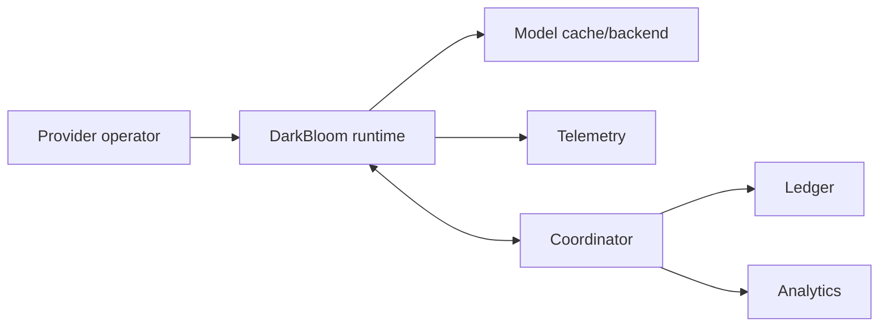

# Operations

Operational behavior covers provider installation, model/backend management, telemetry, accounting, and service health.

## Provider operations

- <!-- req: runtime.provider; source: artifacts/d-inference/service_analyses/darkbloom.md#L210-L274 --> Provider operators SHOULD use the DarkBloom runtime to initialize hardware detection, configure model backends, manage lifecycle, inspect status, and report errors.
- <!-- req: system.role.provider; source: artifacts/d-inference/service_discovery/components.json#L193-L315 --> Provider runtimes MAY integrate with macOS launchd, Cloudflare R2, Hugging Face model storage, and local MLX backends as operational dependencies.

## Coordinator operations

- <!-- req: system.role.coordinator; source: artifacts/d-inference/service_discovery/components.json#L30-L87 --> Coordinator operators MUST maintain backing state for provider registry, attestation status, request routing, and payment/accounting records.
- <!-- req: protocol.payment-settlement; source: artifacts/d-inference/architecture_docs/architecture.md#L314-L338 --> Settlement operations SHOULD preserve a traceable relationship between consumer billing events, inference completion, provider credit, and withdrawal state.

## Observability

- <!-- req: system.role.analytics; source: artifacts/d-inference/service_discovery/components.json#L4-L27 --> Analytics services SHOULD use read-only or pseudonymized data paths for network statistics and leaderboards.

## Operational diagram

