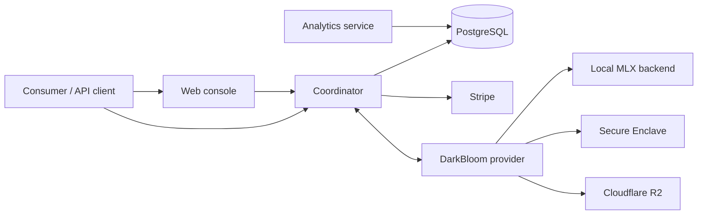

# System Overview

DarkBloom is a distributed inference system that routes AI inference work from consumers to Apple Silicon provider
machines. The system combines a coordinator control plane, provider runtimes, a web console, and Secure Enclave based
attestation components. Its central design objective is to let consumers use remote provider capacity while preserving
privacy and making provider trust auditable.

## Goals

- <!-- req: system.role.coordinator; source: artifacts/d-inference/service_discovery/components.json#L30-L87 --> The coordinator is the control-plane service responsible for provider registry, request routing, attestation integration, and payment/accounting coordination.
- <!-- req: system.role.provider; source: artifacts/d-inference/service_discovery/components.json#L193-L315 --> The DarkBloom provider runtime runs on Apple Silicon Macs and exposes local model capacity to the coordinator.
- <!-- req: system.role.web; source: artifacts/d-inference/service_discovery/components.json#L103-L169 --> The web console provides consumer chat and provider dashboard surfaces and participates in end-to-end encryption and trust display.
- <!-- req: system.role.enclave; source: artifacts/d-inference/service_discovery/components.json#L330-L339 --> Secure Enclave components provide hardware-backed signing and attestation support for provider identity and trust decisions.

## High-level architecture

## Trust boundaries

- Consumer-facing clients interact with the coordinator and web console over network APIs.
- Provider nodes are independently operated Apple Silicon machines and are treated as untrusted until registered and attested.
- The coordinator routes and accounts for work but the architecture is designed around encrypted inference payloads.
- Secure Enclave keys and attestation material are part of the provider trust boundary, not a general-purpose application secret store.

## Specification status

This book currently specifies the implementation-derived protocol at the level supported by available flashlight evidence.
Open questions are called out explicitly where artifacts do not contain enough detail to make a normative statement.
